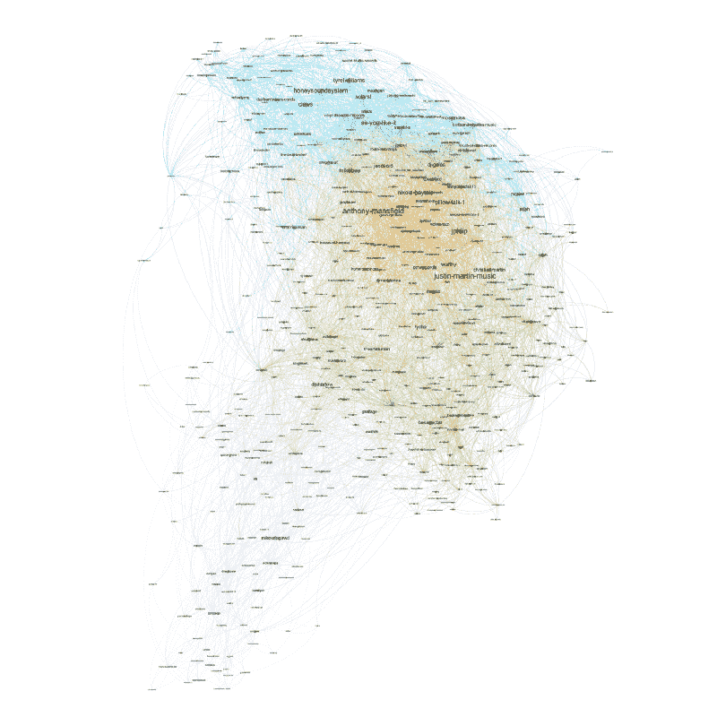
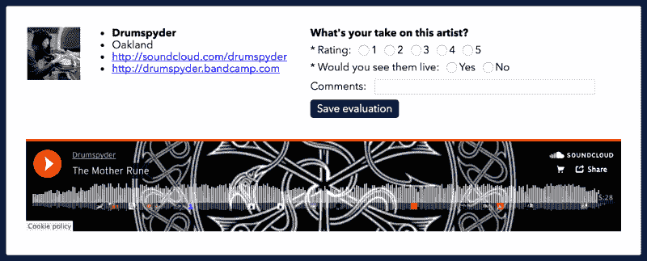
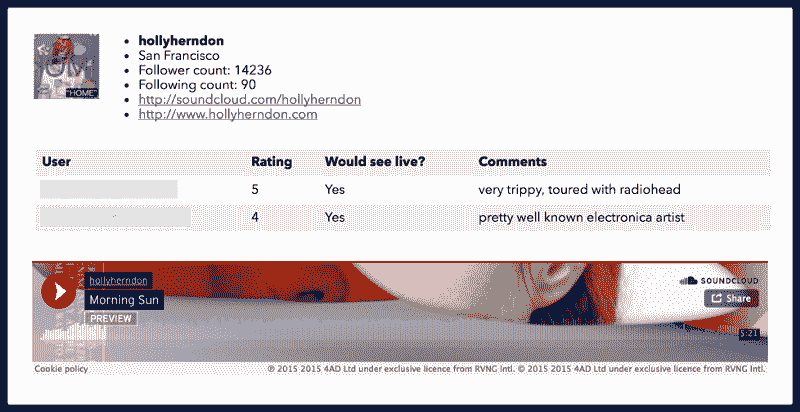
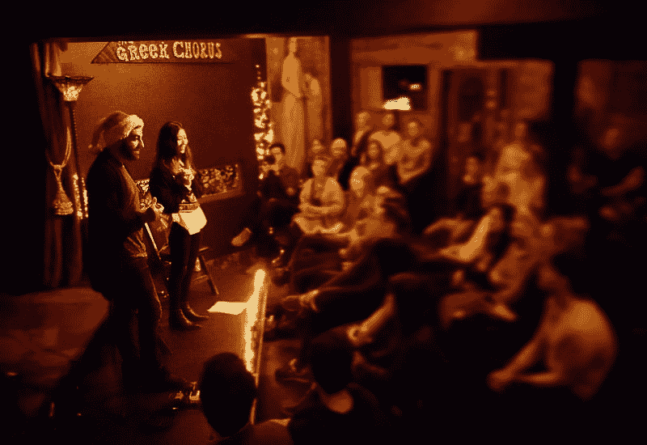
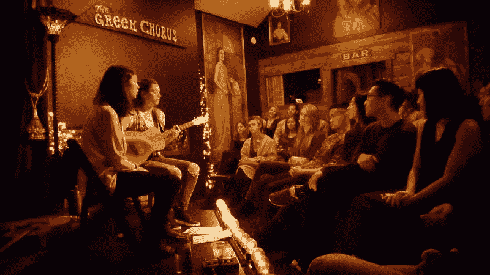
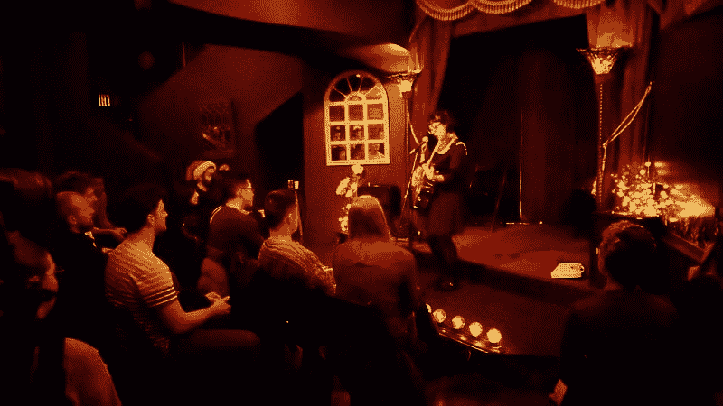

# 预订音乐会的程序员指南

> 原文：<https://www.freecodecamp.org/news/the-programmers-guide-to-booking-a-concert-e048a580735f/>

由新浪哈比边

# 预订音乐会的程序员指南

大约两个月前，我和一个朋友决定在旧金山组织一场音乐会。我们之前没有推广演出的经验，但我们都喜欢现场音乐，并觉得有能力迎接挑战。此外，2016 年是糟糕的一年，看起来这将是一个团结社区的好方法，并以积极的方式结束这一年。

我们开始联系我们熟悉的当地艺人，希望为他们预订 12 月份的演唱会。一个星期后，我们已经用尽了我们的联系名单，仍然没有成功。我开始思考我们是否可以分析社交媒体来寻找当地的音乐家。

我决定去看看 Soundcloud，这是一个事实上的音乐人在线聚集地。通过另一个项目认识了一些音乐人，我知道他们经常使用这个平台来传播音乐和与粉丝联系。无论某人是谁或在哪里，他们都在 Soundcloud 上发布音乐，不管他是索玛的卧室 DJ，山景城的车库乐队，还是奥克兰的创作歌手。只要他们发布了一条单曲，我知道我就能找到他们。

### 抓取声音云图

快速浏览一下 Soundcloud 的搜索 API，就会发现它还不够。简单的关键字搜索不允许我编写类似“返回任何在旧金山或奥克兰的用户，他的追随者少于 10k，并且至少发布了一首歌曲”的查询。

在寻找解决方案时，我意识到爬取社交图可能是一种有效的方法。我可以写一个算法，当播种了一个 Soundcloud 用户时，它将提取他们所有的关注者和追随者，然后依次提取这些用户的所有关注者和追随者。这个简单的递归算法在几次迭代后将扩展到覆盖成千上万的用户。然后，我就可以用任何方式分析社交关系了，最简单的方法就是编写一个 SQL 查询。

我选择了 Afrolicious、Mark Slee、EARMILK 和其他几个人作为种子客户。这些用户深深融入了旧金山的嘻哈、电子和独立场景。我相信他们合并后的社交图谱将提供一个多样化的、完整的湾区音乐展示。

当我开始试验这种算法时，我意识到吸引用户的追随者是不切实际的。音乐人通常拥有数万或数十万粉丝(最极端的加尔文·哈里斯有 708 万粉丝)。为所有用户吸引所有关注者显然是一种次优的方法。我也不打算每月支付 1000 美元的数据库费用。

解决方案是只抓取*的跟随者*，而不抓取跟随者*。*音乐家跟随其他音乐家。有趣的是，甚至有论文分析了这种行为和出现的“虚拟场景”([阿林顿等人，2015](http://dx.doi.org/10.1080/09548963.2015.1066073) )。通过抓取下面的图表，我可以有效地绘制出当地的音乐场景。此外，通过跟踪谁关注谁，我以后可以使用类似 PageRank 的算法来找到那些没有太多追随者但却拥有社区信任票的后起之秀。

我构建了一个 Sinatra 应用程序来抓取 Soundcloud 社交图，并将所有用户及其关系保存到 Postgres 数据库中。经过几次迭代，用户超过 20 万，关系超过 50 万。是时候理解这些数据了。

### 分析网络

我编写了一个 Python 脚本，在数据库中查询任何至少有 500 名粉丝、至少有一首歌曲、位于旧金山或奥克兰的 Soundcloud 用户。然后我将这些用户和他们的关系映射到一个 [Networkx](https://networkx.github.io/) 有向图上。然后很容易导出一个. gexf 图形文件，供 [Gephi](https://gephi.org/) 进行可视化分析。

Gephi 被证明是一个不可思议的可视化社交网络的工具，给了我足够的时间去玩。

The Soundcloud Network in San Francisco and Oakland. Size corresponds to PageRank and color corresponds to community.

以上是 Soundcloud 网络的力有向图。我首先使用 PageRank 来利用现有的 follower-following 关系，并确定哪些是最重要的节点。这表示为节点的大小。然后，我在一个内置的模块化优化算法的基础上检测社区。社区用节点的颜色表示。

这张图表提供了一个了解旧金山音乐界的有趣视角。最大的节点，安东尼曼斯菲尔德，是一个经验丰富的湾区房子 DJ 谁也深深地参与了迪斯科骑士燃烧人营地。另一个大节点是 Honey Sound System，一个以旧金山为家的 DJ 集体。图的左下方是一个 Hip Hop 集群，包括像 Telli Prego 和 Show Banga 这样的旧金山艺术家。

我们的目标是为即将到来的音乐会寻找音乐家。具有讽刺意味的是，考虑到可用选项的数量，这一点现在很难做到。我们已经确认了一千多个 Soundcloud 账户是海湾地区的音乐家。除了将每个 Soundcloud 的 URL 复制到浏览器中，我们没有好的方法来听这么多音乐。此外，我们希望从我们的朋友和社区中了解他们喜欢谁现场直播。

### 发掘人才

为了解决这些问题，我在 Sinatra 应用程序中添加了一个 UI 层，这样我们就可以简化我们的搜索工作。它显示了根据早期网络分析结果排名的音乐家名单。有一个嵌入的 Soundcloud 小工具，这样我们就可以不用离开页面就可以听一个艺术家的音乐。我还添加了一个评级系统，这样我们可以评估每个艺术家，并评论我们是否想看他们的现场表演。

Interface for evaluating an artist.

然后我在用户认证方案上加了层，这样多人可以同时使用这个系统。我们得到了住在这个城市的几个也喜欢音乐的朋友的帮助。在他们的帮助下，加上我们新建立的人才选拔系统，我们集体听取了 400 位艺术家的意见，并进行了投票。然后我建立了一个管理页面，这样我就可以看到平台上评价最好的音乐家。

Admin UI with aggregated scout ratings.

我们已经众包了我们的球探工作，并开始发现一些宝石。更重要的是，我们已经确认了我们的朋友和社区想要观看现场表演的需求。

### 预订演出

随着事情的进展，我们给自己起了个名字:小鬼。小妖精很可爱，很淘气，而且总是乱搞和破坏东西。鉴于我们目前的进展，这似乎是合适的。

我们联系了几个我们最喜欢的新艺术家，并预定了两个时髦而有才华的本地节目:狐尾旅和婴儿日。我们正在平行地讨论场地，并在失落的教堂住了一晚，这是教会里一个舒适的剧院，可容纳 75 人。木质内饰和散落各处的折衷艺术品与我们试图营造的氛围相吻合。

### 在场的小鬼们

一个月后，我们在演唱会当晚走进了失落的教堂。当我们欢迎朋友和未来的朋友进入剧院时，我有一种成就感。演出票已经卖完了。

来自狐狸尾巴旅的劳拉和来自婴儿日的梅格和梅尔与现场观众分享了他们的音乐。我们跟随他们经历了欢乐和悲伤的时刻。那是一个难忘的夜晚。

The Gremlins!

The Gremlins present: Baby’s Day Out!

The Gremlins present: Laura Weinbach!

在协调这场音乐会的过程中，我经历了两种看待“音乐家”的不同视角。首先，作为一个节点，它的相对重要性和连接度可以在连接的网络中计算。第二，作为一个深情而有才华的人，他能通过艺术的表达感动观众。

这种二分法是当今世界的现实。我们每个人都在脸书、Instagram 和 Twitter 的社交网络中紧密相连。从这个角度来看，把我们自己想象成节点是很有趣的。我想知道这些公司的修补匠们对我们的内心生活有什么样的见解。

[*订阅*](https://sinahab.com/subscribe/) *关注我的写作，或者在 [Twitter](https://twitter.com/sinahab) 上 ping 我。*