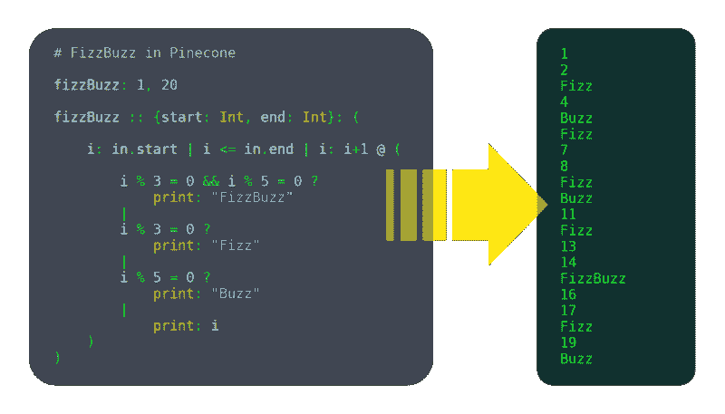
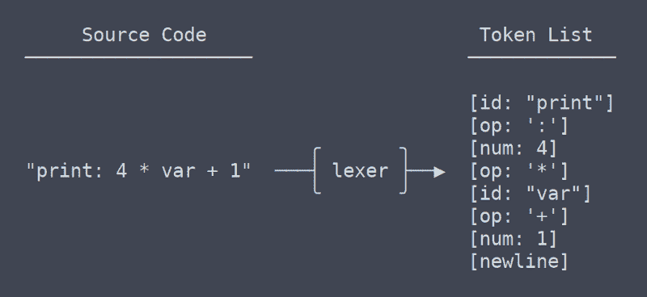
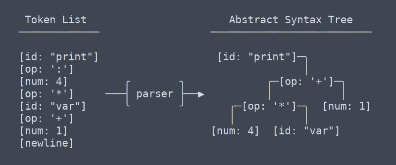
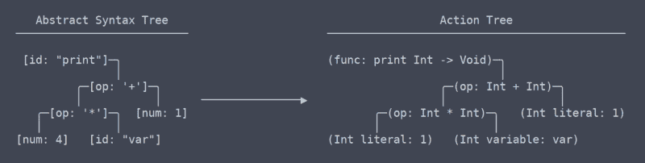

# 我写了一个编程语言。你也可以这样做。

> 原文：<https://www.freecodecamp.org/news/the-programming-language-pipeline-91d3f449c919/>

作者威廉·w·word

# 我写了一种编程语言。你也可以这样做。

在过去的 6 个月里，我一直在开发一种叫做松果的编程语言。我认为它还不成熟，但它已经有足够的功能可供使用，例如:

*   变量
*   功能
*   用户定义的结构

如果你对此感兴趣，可以查看松果的[登陆页面](https://pinecone-lang.herokuapp.com/index.html)或其 [GitHub 回购](https://github.com/william01110111/Pinecone)。

我不是专家。当我开始这个项目时，我不知道自己在做什么，现在也不知道。我没有上过关于语言创造的课，只在网上看过一点，也没有采纳我得到的很多建议。

然而，我仍然创造了一种全新的语言。这很有效。所以我一定做对了什么。

在这篇文章中，我将深入其中，向您展示 pipeline Pinecone(和其他编程语言)如何将源代码变成魔法。

我还会谈到我所做的一些权衡，以及我做出这些决定的原因。

这绝不是编写编程语言的完整教程，但如果您对语言开发感兴趣，这是一个很好的起点。

### 入门指南

当我告诉其他开发人员我正在编写一门语言时，“我甚至完全不知道从哪里开始”是我经常听到的话。如果这是你的反应，我现在将通过一些最初的决定，并采取步骤时，开始任何新的语言。

#### 编译与解释

有两种主要类型的语言:编译语言和解释语言:

*   编译器计算出程序要做的每一件事，把它转化成“机器代码”(一种计算机能运行得非常快的格式)，然后保存下来供以后执行。
*   解释器一行一行地遍历源代码，一边走一边弄清楚它在做什么。

从技术上讲，任何语言都可以被编译或解释，但是对于特定的语言来说，这两种语言中的一种更有意义。一般来说，口译往往更灵活，而编译往往有更高的性能。但这只是触及了一个非常复杂的话题的表面。

我高度重视性能，并且我发现缺乏既高性能又面向简单的编程语言，所以我选择了为松果编译。

这是在早期做出的一个重要决定，因为许多语言设计决策都受到它的影响(例如，静态类型对编译语言来说是一个很大的好处，但对解释语言来说就没那么大了)。

尽管松果在设计时就考虑了编译，但它确实有一个全功能的解释器，这是暂时运行它的唯一方法。这有许多原因，我将在后面解释。

#### 选择语言

我知道这有点抽象，但是编程语言本身就是一个程序，因此你需要用一种语言来编写它。我选择 C++是因为它的性能和大量的特性。此外，我真的很喜欢用 C++工作。

如果你正在编写一种解释型语言，用编译型语言(如 C、C++或 Swift)来编写是很有意义的，因为你的解释器和解释你的解释器的解释器的语言的性能损失将会复合。

如果你打算编译，更慢的语言(比如 Python 或者 JavaScript)更容易被接受。编译时间可能很糟糕，但在我看来，这远没有运行时间糟糕那么严重。

#### 高级设计

编程语言通常被构造成流水线。也就是它有几个阶段。每个阶段都有以特定的、明确定义的方式格式化的数据。它还具有将数据从一个阶段转换到下一个阶段的功能。

第一阶段是包含整个输入源文件的字符串。最后阶段是可以运行的。随着我们一步一步地通过松果管道，这一切都会变得清晰。

### 乐星

大多数编程语言的第一步是词法分析，或者说是标记化。“Lex”是词法分析的缩写，这是一个非常有趣的词，用于将一堆文本拆分成标记。单词“tokenizer”更有意义，但“lexer”说起来很有趣，所以我还是用了它。

#### 代币

记号是语言的一个小单位。令牌可以是变量或函数名(也称为标识符)、运算符或数字。

#### Lexer 的任务

lexer 应该接受一个包含整个文件的源代码的字符串，并给出一个包含每个令牌的列表。

管道的未来阶段将不会引用原始源代码，因此 lexer 必须生成它们所需的所有信息。这种相对严格的管道格式的原因是 lexer 可能会执行一些任务，例如删除注释或检测某个内容是否是数字或标识符。您希望将该逻辑锁定在 lexer 中，这样在编写语言的其余部分时就不必考虑这些规则，并且可以在一个地方更改这种类型的语法。

#### 弯曲

我开始学习这门语言的那天，我写的第一件事就是一个简单的 lexer。不久之后，我开始学习可以使 lexing 更简单、更少错误的工具。

最主要的工具是 Flex，一个生成词法分析器的程序。你给它一个文件，它有一个特殊的语法来描述语言的语法。由此它生成一个 C 程序，该程序提取一个字符串并产生所需的输出。

#### 我的决定

我选择暂时保留我写的 lexer。最后，我看不出使用 Flex 有什么显著的好处，至少不足以证明增加依赖和使构建过程复杂化是正确的。

我的 lexer 只有几百行，很少给我添麻烦。滚动我自己的 lexer 也给了我更多的灵活性，比如能够在不编辑多个文件的情况下向语言添加一个操作符。

### 从语法上分析

管道的第二阶段是解析器。解析器将标记列表转换成节点树。用于存储这种类型数据的树被称为抽象语法树，或 AST。至少在 Pinecone 中，ast 没有任何关于类型或标识符的信息。它是简单的结构化令牌。

#### 解析器职责

解析器将结构添加到词法分析器生成的有序标记列表中。为了消除歧义，解析器必须考虑括号和操作顺序。简单地解析操作符并不十分困难，但是随着更多语言结构的加入，解析会变得非常复杂。

#### 野牛

同样，需要做出一个涉及第三方库的决定。主要的解析库是 Bison。Bison 的工作方式很像 Flex。您编写一个存储语法信息的自定义格式的文件，然后 Bison 使用它来生成一个 C 程序来完成您的解析。我没有选择用野牛。

#### 为什么习惯更好

对于 lexer，使用我自己的代码的决定是相当明显的。lexer 是一个如此琐碎的程序，以至于不编写自己的程序就像不编写自己的“左键盘”一样愚蠢。

对于解析器，情况就不同了。我的松果解析器目前有 750 行，我已经写了其中的三行，因为前两行是垃圾。

我最初做出这个决定有很多原因，虽然并不完全顺利，但大部分都是正确的。主要的如下:

*   尽量减少工作流中的上下文切换:不考虑 Bison 的语法，C++和松果之间的上下文切换已经够糟糕的了
*   保持构建简单:每次语法改变时，Bison 必须在构建前运行。这是可以自动化的，但是当在构建系统之间切换时，这就变得很麻烦了。
*   我喜欢建造很酷的东西:我没有做松果，因为我认为这很容易，所以当我自己可以做的时候，我为什么要委派一个中心角色呢？定制的解析器可能并不简单，但它是完全可行的。

一开始我并不完全确定我是否在走一条可行的道路，但是 Walter Bright(c++早期版本的开发人员，D 语言的创始人)[对主题](http://www.drdobbs.com/architecture-and-design/so-you-want-to-write-your-own-language/240165488)的评论给了我信心:

> 更有争议的是，我不会在 lexer 或解析器生成器和其他所谓的“编译器”上浪费时间。“他们在浪费时间。编写词法分析器和语法分析器只是编写编译器工作的一小部分。使用生成器花费的时间和手工编写一样多，而且它会把你和生成器结合起来(这在把编译器移植到新平台时很重要)。而且生成器也有发出糟糕的错误消息的不幸名声。”

### 动作树

我们现在已经离开了通用术语的领域，或者至少我已经不知道术语是什么了。根据我的理解，我所说的“动作树”最类似于 LLVM 的 IR(中间表示)。

动作树和抽象语法树之间有一个微妙但非常重要的区别。我花了很长时间才弄明白它们之间应该有区别(这导致了对解析器重写的需求)。

#### 行动树与 AST

简单地说，动作树是带有上下文的 AST。上下文是这样的信息，比如函数返回什么类型，或者使用变量的两个地方实际上使用的是同一个变量。因为它需要找出并记住所有这些上下文，所以生成动作树的代码需要大量的名称空间查找表和其他东西。

#### 运行动作树

一旦我们有了动作树，运行代码就很容易了。每个动作节点都有一个函数“execute ”,它接受一些输入，做动作应该做的任何事情(可能包括调用子动作),并返回动作的输出。这是运行中的解释器。

### 编译选项

“但是等等！”我听到你说，“松果不是应该被编译吗？”是的，它是。但是编译比翻译难。有几种可能的方法。

#### 构建我自己的编译器

起初我觉得这是个好主意。我确实喜欢自己做东西，我一直渴望找到一个擅长组装的借口。

不幸的是，编写一个可移植的编译器并不像为每个语言元素编写一些机器码那样容易。由于体系结构和操作系统的数量，任何个人编写一个跨平台的编译器后端都是不切实际的。

即使是 Swift，Rust 和 Clang 背后的团队也不想独自解决这些问题，所以他们都使用…

#### LLVM

LLVM 是编译器工具的集合。它基本上是一个库，将把你的语言转换成编译后的可执行二进制文件。这看起来是个完美的选择，所以我马上就加入了。可悲的是，我没有检查水有多深，我马上就淹死了。

LLVM 虽然不是汇编语言硬，但却是庞大复杂的库硬。这不是不可能使用，他们有很好的教程，但我意识到在我准备好用它完全实现松果编译器之前，我必须进行一些实践。

#### 运输文件

我想要某种编译过的松果，而且我想要它很快，所以我转向了一个我知道可以实现的方法:transpiling。

我给 C++ transpiler 写了一个松果，增加了用 GCC 自动编译输出源码的能力。这目前适用于几乎所有的松果程序(尽管有一些边缘情况会破坏它)。这不是一个特别可移植或可伸缩的解决方案，但它暂时还能工作。

#### 将来的

假设我继续开发松果，它迟早会得到 LLVM 编译支持。我怀疑不管我做了多少工作，transpiler 都不会完全稳定，LLVM 的好处是很多的。只是我什么时候有时间在 LLVM 中做一些样例项目并掌握它的窍门的问题。

在那之前，解释器对于琐碎的程序来说是很棒的，而 c++ trans pilling 对于大多数需要更高性能的东西来说是有用的。

### 结论

我希望我已经让编程语言对你来说不那么神秘了。如果你确实想自己做一个，我强烈推荐。有大量的实现细节需要解决，但这里的概述应该足以让您开始。

以下是我对入门的高层次建议(记住，我真的不知道我在做什么，所以要有所保留):

*   如果有疑问，去翻译。解释语言通常更容易设计、构建和学习。如果你知道那是你想要做的，我不会阻止你写一个编译的，但是如果你犹豫不决，我会去解释。
*   说到词法分析器和语法分析器，你想做什么就做什么。有正当的理由支持和反对写你自己的。最后，如果你想出了你的设计，并以一种明智的方式实现了所有的东西，这真的不重要。
*   从我结束的管道中学习。在设计我现在的管道时，进行了大量的试验和错误。我尝试过消除成功经验，成功经验转化为行动，以及其他糟糕的想法。这个管道是有效的，所以除非你有一个非常好的想法，否则不要改变它。
*   如果你没有时间或动力去实现一个复杂的通用语言，试着实现一个深奥的语言，比如 [Brainfuck](https://esolangs.org/wiki/Brainfuck) 。这些解释器可能只有几百行。

说到松果的发育，我很少有遗憾。在这个过程中，我做了许多错误的选择，但是我已经重写了受这些错误影响的大部分代码。

现在，松果处于足够好的状态，它的功能很好，可以很容易地得到改善。写松果对我来说是一次非常有教育意义和愉快的经历，这才刚刚开始。