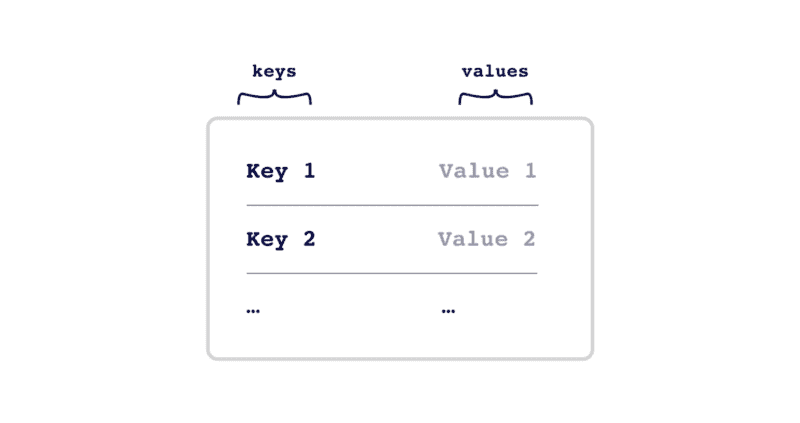
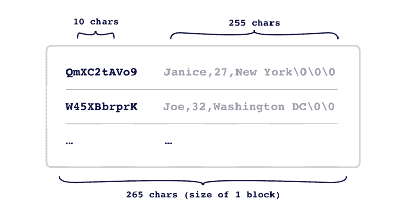
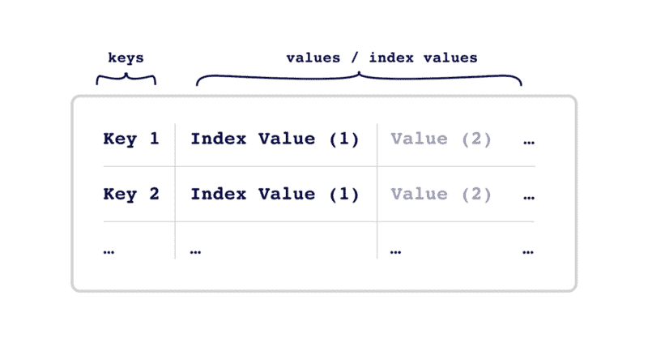
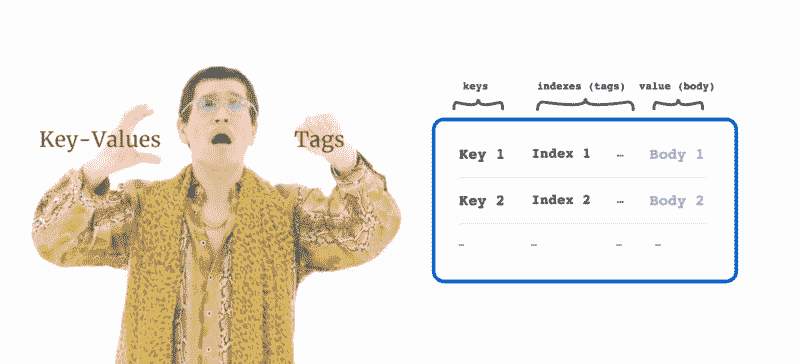
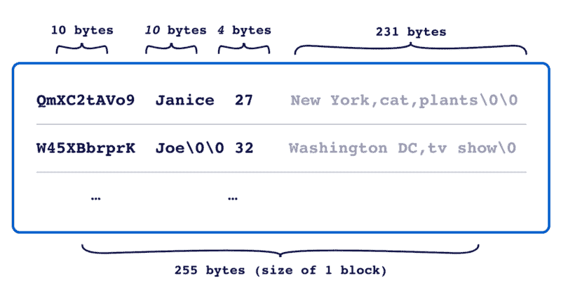
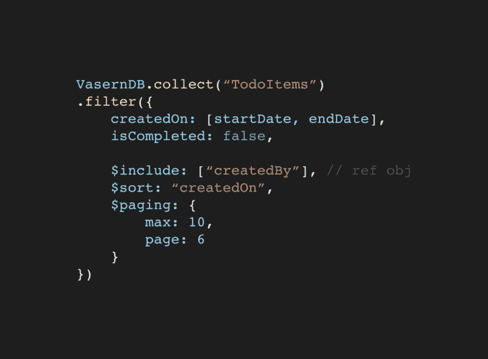

# 不同数据格式的优缺点:键值对元组

> 原文：<https://www.freecodecamp.org/news/the-pros-and-cons-of-different-data-formats-key-values-vs-tuples-f526ad3fa964/>

作者:阮孝(杰克)

# 不同数据格式的优缺点:键值对元组

#### 数据是如何在幕后格式化的

Photo by [Franki Chamaki](https://unsplash.com/photos/1K6IQsQbizI?utm_source=unsplash&utm_medium=referral&utm_content=creditCopyText) on [Unsplash](https://unsplash.com/search/photos/data?utm_source=unsplash&utm_medium=referral&utm_content=creditCopyText)

在[Vasern](http://github.com/vasern/vasern)(React Native 的客户端数据库)上工作给了我一个尝试和测试不同数据格式的机会，包括键值、面向列、文档和元组。每种格式都是为适应不同的场景而设计的。

这些测试的标准侧重于性能、查找值的能力和空间效率。此外，不要求在磁盘上有排序的键和索引。它们将被加载到内存中以便快速查找。

在这篇文章中，我将总结两种常见格式的优缺点:**键值**和**元组格式。**此外，我将介绍**标记的键值**，这是索引查找键值的扩展，受益于元组格式。

### 键值存储

A collection of the key-value store

键值存储了一组键-值对，有时值代表多个值，用分隔符(如逗号)分隔。这些对被组织成固定长度的块(用于记录之间的快速遍历)。

Example of single-block key-value store layout (“\0” represents null/empty value)

**键值存储的优势:**

*   简单的数据格式使读写操作更快
*   值可以是任何东西，包括 JSON、灵活模式

**缺点:**

*   仅对具有单个键和值的数据进行优化。需要一个解析器来存储多个值。
*   未针对查找进行优化。查找需要扫描整个集合或创建单独的索引值

### 元组数据存储(RDBMS)

元组数据格式已经存在了几十年。它用于关系数据库，如 MySQL、Postgres 等。

An example of the tuples data format in Relational Database

与键值格式不同，它依赖于预定义的模式将记录组织成行，并将值组织在固定长度的列中。每个值只/通常代表一条信息。

**元组数据存储的优势:**

*   结构化数据格式有助于快速遍历记录值
*   针对查找进行了优化(通常使用 SQL 来查询记录)

**缺点:**

*   受模式结构的约束
*   模式的改变通常需要重写整个数据库

### 标记键值存储

Uhmm, TKVF (tagged-key-value format)

标记键值是键值存储的扩展版本——一个值有多个键。换句话说，对于每条记录，它都有一个键、索引(或标签)和一个主体值。其中:

*   **键**和**索引**将在启动时加载到内存中
*   **主体值**可以是普通字符串、BSON/JSON 或逗号分隔值中的任何值。

**标记键值存储的优势:**

*   半结构化，有助于快速遍历记录和索引
*   针对查找进行了优化(通过键和索引)
*   记录体可以是任何东西，非常适合灵活的模式
*   空间效率(关键索引组织在紧密的列中)

**缺点:**

*   包含**索引**的模式更改可能需要数据迁移

A format example of the tagged-key-value

#### 带有标记键值存储的容器

Vasern 是 React Native 的客户端数据库。最新版本是测试版，使用的是键值存储。

在即将发布的 [**0.3.0-RC 版本**](https://github.com/vasern/vasern/tree/0.3.0-rc)**中，Vasern 正在切换到标签化的键值商店布局。重点是它强大的查找功能和空间效率。**

**下面是一个示例查询。很漂亮，不是吗？**

**

A demo of Vasern query** 

### **结论**

**有许多不同数据格式的数据库可供应用程序选择。两种常见的格式是:**

*   ****键值对** —快速读写，但未针对查找进行优化。它经常被用作简单的数据存储，NoSQL。**
*   ****元组** —支持多类型值、索引，为查找而优化，但缺乏模式灵活性。通常用于关系数据库。**

**通过结合上面提到的优点，**标记键值**格式对于数据模式是灵活的，并且能够通过键和索引来查找记录。这通常更适合客户端的数据库。**

****如果您觉得这篇文章有用，请点击**？**按钮几下，让别人找到文章，表示你的支持！？****

****感谢阅读！****