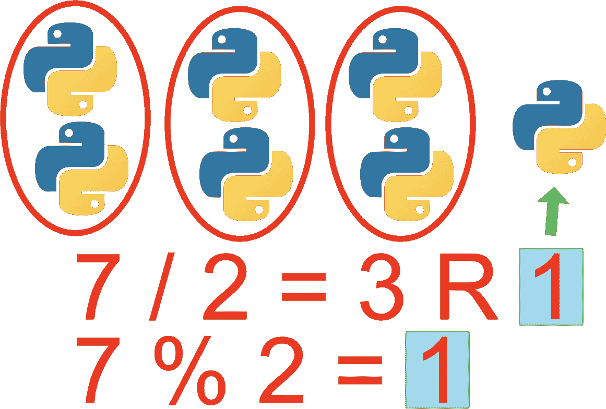
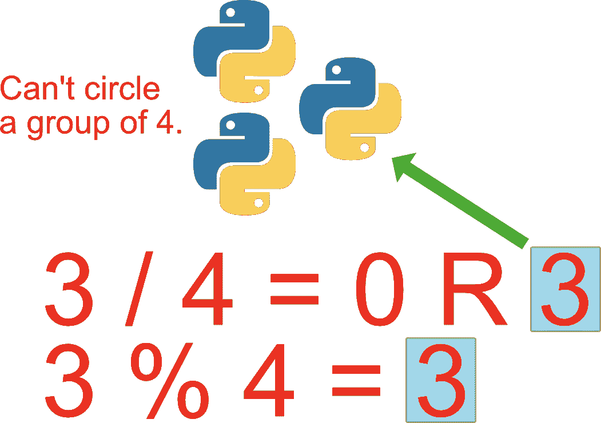

# Python 模运算符——Python 中的%符号是什么意思？(已解决)

> 原文：<https://www.freecodecamp.org/news/the-python-modulo-operator-what-does-the-symbol-mean-in-python-solved/>

当你看到%符号时，你可能会想到“百分比”。但是在 Python 以及大多数其他编程语言中，它的含义有所不同。

Python 中的`%`符号被称为模运算符。它返回左操作数除以右操作数的余数。它用来得到除法问题的余数。

模运算符与`+`、`-`、`/`、`*`、`**`、`//`一起被认为是算术运算。

基本语法是:

```
a % b
```

在前面的例子中，`a`除以`b`，余数被返回。让我们看一个数字的例子。

```
7 % 2
```

上例的结果是**一个**。二除以七等于三，还剩**一**。

下图显示了`7 / 2`和`7 % 2`的直观表示(“R”代表“余数”)。右侧的单个徽标(带有指向它的绿色箭头)是除法问题的余数。这也是对`7 % 2`的回答。



这是另一个例子:

```
3 % 4
```

这样就会产生**三个**。四不去三*的任何*倍，所以原来的**三**仍然剩余。下图显示了正在发生的情况。记住，模运算符在执行除法后返回余数。余数是三。



### 使用模运算符的示例

模运算符的一个常见用途是查找偶数或奇数。下面的代码使用模运算符打印 0 到 10 之间的所有奇数。

```
for number in range(1, 10):
    if(number % 2 != 0):
        print(number)
```

结果:

```
1
3
5
7
9
```