# Python 排序列表数组方法——升序和降序举例说明

> 原文：<https://www.freecodecamp.org/news/the-python-sort-list-array-method-ascending-and-descending-explained-with-examples/>

如果您想学习如何在 Python 项目中使用`sort()`方法，那么这篇文章就是为您准备的。这个方法非常强大，您可以定制它来满足您的需求，所以让我们来详细看看它是如何工作的。

**您将了解到:**

*   如何使用此方法并自定义其功能。
*   什么时候用，什么时候不用。
*   如何称之为传递不同的参数组合。
*   如何对列表进行升序和降序排序？
*   如何根据中间值比较列表中的元素？
*   如何将 lambda 函数传递给这个方法？
*   该方法与`sorted()`函数相比如何。
*   为什么`sort()`方法执行稳定排序。
*   变异的过程是如何在幕后进行的。

你准备好了吗？我们开始吧！⭐

## 🔹目的和使用案例

使用`sort()`方法，您可以按照以下任一方式对列表进行排序:

*   升序
*   降序

这个方法用于就地排序一个列表，这意味着它**改变**它或者直接修改它而不创建额外的副本，所以记住:

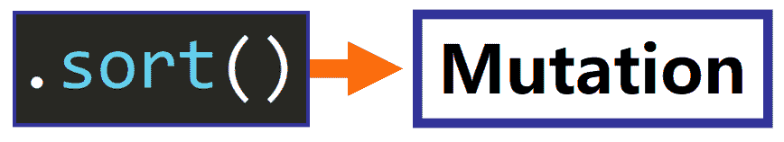

在这篇文章中你会学到更多关于突变的知识(我保证！)，但是现在很重要的一点是，`sort()`方法修改了列表，所以它的原始版本丢失了。

因此，只有在以下情况下才应使用此方法:

*   您想要永久修改(排序)列表。
*   你不需要保留列表的原始版本。

如果这符合您的需求，那么`.sort()`方法正是您正在寻找的。

## 🔸语法和参数

让我们看看如何调用`.sort()`来利用它的全部功能。

这是最基本的调用(没有参数):

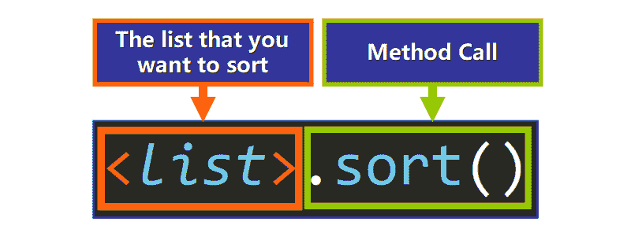

如果不传递任何参数，默认情况下:

*   列表将按升序排序。
*   列表中的元素将通过`<`操作符直接使用它们的值进行比较。

例如:

```
>>> b = [6, 3, 8, 2, 7, 3, 9]
>>> b.sort()
>>> b
[2, 3, 3, 6, 7, 8, 9] # Sorted!
```

### 自定义参数

为了定制`sort()`方法的工作方式，您可以传递两个可选参数:

*   钥匙
*   反面的

让我们看看他们如何改变这个方法的行为。这里我们有一个带有这两个参数的方法调用:

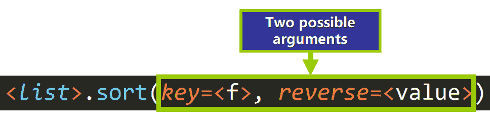

在解释它们是如何工作的之前，我想解释一下您可能在上图中注意到的一些东西——在方法调用中，参数的名称必须包含在它们对应的值之前，就像这样:

*   `key=<f>`
*   `reverse=<value>`

这是因为它们是 [**唯关键字参数**](https://docs.python.org/3/glossary.html#keyword-only-parameter) 。如果您正在为它们传递一个自定义值，它们的**名称**必须在方法调用中指定，后跟一个等号`=`和它们对应的值，如下所示:

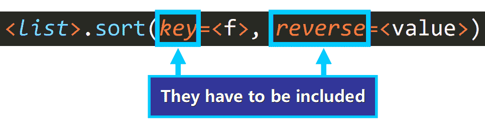

否则，如果您尝试像我们通常对位置参数所做的那样直接传递参数，您将会看到此错误，因为函数不知道哪个参数对应于哪个参数:

```
TypeError: sort() takes no positional arguments
```

### 反面的

现在你知道什么是仅关键字的参数，让我们从`reverse`开始。

`reverse`的值可以是`True`或`False`:

*   `False`表示列表将按升序排序。
*   `True`表示列表将按降序(反向)排序。

**💡提示:**默认情况下，它的值是`False`——如果您没有为这个参数传递任何参数，列表将按升序排序。

这里我们有几个例子:

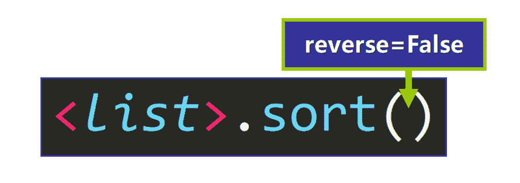

By default, reverse is False

```
# List of Integers
>>> b = [6, 3, 8, 2, 7, 3, 9]
>>> b.sort()
>>> b
[2, 3, 3, 6, 7, 8, 9]

# List of Strings
>>> c = ["A", "Z", "D", "T", "U"]
>>> c.sort()
>>> c
['A', 'D', 'T', 'U', 'Z'] 
```

💡**提示:**如果列表的元素是字符串，则按字母顺序排序。

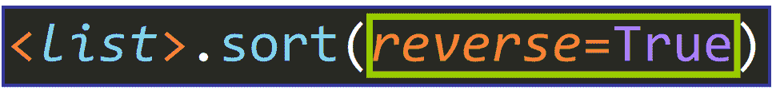

To specify that reverse is True, so the list has to be sorted in descending (reverse) order.

```
# List of Integers
>>> b = [6, 3, 8, 2, 7, 3, 9]
>>> b.sort(reverse=True)
>>> b
[9, 8, 7, 6, 3, 3, 2]

# List of Strings
>>> c = ["A", "Z", "D", "T", "U"]
>>> c.sort(reverse=True)
>>> c
['Z', 'U', 'T', 'D', 'A']
```

💡**提示:**注意如果`reverse`是`True`，列表是如何降序排列的。

### 钥匙

现在您已经知道如何使用`reverse`参数，让我们看看`key`参数。

这个参数稍微详细一点，因为它决定了在排序过程中如何比较列表中的元素。

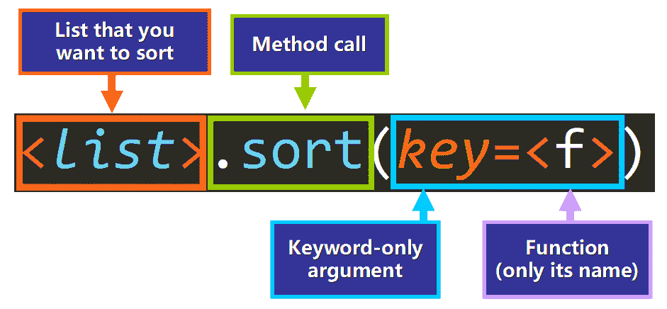

Basic Syntax

`key`的值是:

*   `None`，表示将直接比较列表的元素。例如，在整数列表中，整数本身可以用于比较。
*   **单参数的** **函数**，为每个元素生成中间值。这个中间值只计算一次，在整个排序过程中用于比较。当我们不想直接比较元素时，例如，当我们想根据字符串的长度(中间值)来比较字符串时，我们使用这种方法。

💡**提示:**默认情况下`key`的值为`None`，所以直接比较元素。

**例如:**

假设我们要根据字符串的长度对字符串列表进行排序，从最短的字符串到最长的字符串。我们可以传递函数`len`作为`key`的值，就像这样:

```
>>> d = ["aaa", "bb", "c"]
>>> d.sort(key=len)
>>> d
['c', 'bb', 'aaa']
```

💡**提示:**注意，我们只传递了不带括号的函数名(`len`)，因为我们没有调用函数。这一点非常重要。

注意直接比较元素和比较它们的长度之间的区别(见下文)。使用默认值`key` ( `None`)将按字母顺序对字符串进行排序(左)，但现在我们根据它们的长度对它们进行排序(右):

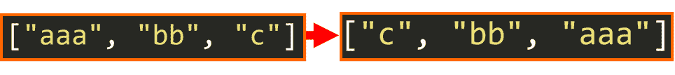

幕后发生了什么？每个元素都作为参数传递给`len()`函数，该函数调用返回的值用于在排序过程中执行比较:

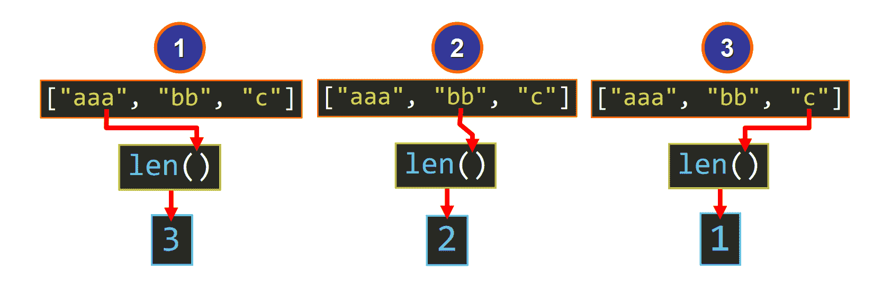

这会产生一个具有不同排序标准的列表:长度。

这里我们有另一个例子:

另一个有趣的例子是对字符串列表进行排序，就好像它们都是用小写字母写的一样(例如，使“aa”等价于“Aa”)。

按照字典的顺序，大写字母在小写字母之前:

```
>>> "E" < "e"
True
```

因此，在排序列表中，字符串`"Emma"`将出现在`"emily"`之前，即使它们的小写版本顺序相反:

```
>>> "Emma" < "emily"
True
>>> "emma" < "emily"
False
```

为了避免区分大写和小写字母，我们可以将函数`str.lower`作为`key`传递。这将生成用于比较的字符串的小写版本:

```
>>> e = ["Emma", "emily", "Amy", "Jason"]
>>> e.sort(key=str.lower)
>>> e
['Amy', 'emily', 'Emma', 'Jason']
```

注意，现在，`"emily"`出现在排序列表中的`"Emma"`之前，这正是我们想要的。

💡**提示:**如果我们使用默认的排序过程，所有以大写字母开头的字符串都会排在所有以小写字母开头的字符串之前:

```
>>> e = ["Emma", "emily", "Amy", "Jason"]
>>> e.sort()
>>> e
['Amy', 'Emma', 'Jason', 'emily']
```

这里有一个使用面向对象编程的例子

如果我们有这个非常简单的 Python 类:

```
>>> class Client:
	def __init__(self, age):
		self.age = age
```

我们创建了四个实例:

```
>>> client1 = Client(67)
>>> client2 = Client(23)
>>> client3 = Client(13)
>>> client4 = Client(35)
```

我们可以列出一个参考它们的列表:

```
>>> clients = [client1, client2, client3, client4]
```

然后，如果我们定义一个函数来获得这些实例的`age`:

```
>>> def get_age(client):
	return client.age
```

我们可以通过将`get_age`函数传递给一个参数来根据年龄对列表进行排序:

```
>>> clients.sort(key=get_age)
```

这是列表的最终排序版本。我们使用 for 循环按照实例在列表中出现的顺序打印实例的年龄:

```
>>> for client in clients:
	print(client.age)

13
23
35
67
```

这正是我们想要的——现在列表根据实例的年龄以升序排序。

💡**提示:**我们可以使用 lambda 函数来获取每个实例的年龄，而不是定义一个`get_age`函数，如下所示:

```
>>> clients.sort(key=lambda x: x.age)
```

**Lambda 函数**是小而简单的匿名函数，也就是说它们没有名字。当我们只想在很短的时间内在特定的地方使用它们时，它们对这些场景非常有帮助。

这是我们用来排序列表的 lambda 函数的基本结构:

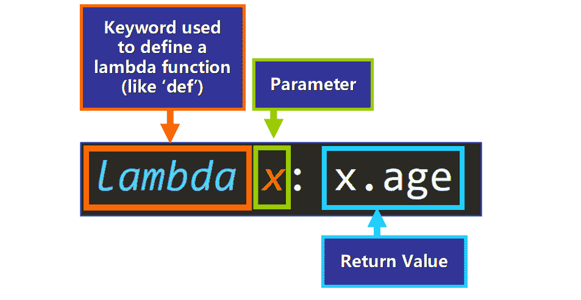

Basic Structure of a Lambda Function

### 传递两个参数

厉害！现在您知道了如何定制`sort()`方法的功能。但是，通过在同一个方法调用中结合`key`和`reverse`的效果，您可以将您的技能提升到一个全新的水平:

```
>>> f = ["A", "a", "B", "b", "C", "c"]
>>> f.sort(key=str.lower, reverse=True)
>>> f
['C', 'c', 'B', 'b', 'A', 'a']
```

Sort the list in reverse order as if the strings were in all lowercase.

这些是参数及其效果的不同组合:

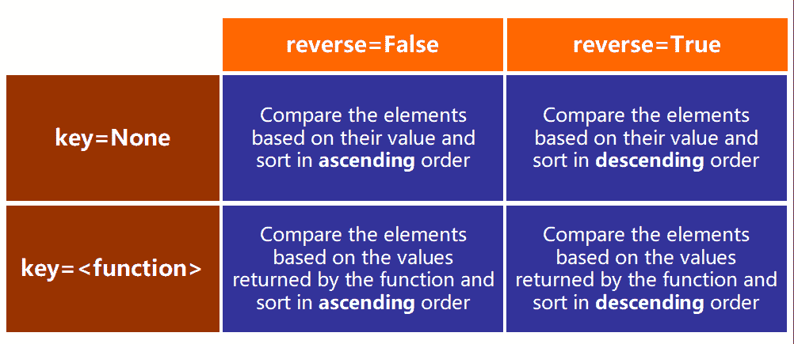

### 仅关键字参数的顺序无关紧要

因为我们指定了参数的名称，我们已经知道哪个值对应于哪个参数，所以我们可以在列表中首先包含`key`或`reverse`，效果将完全相同。

所以这个方法调用:

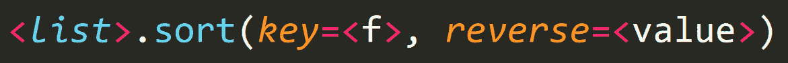

相当于:

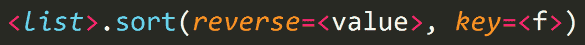

这是一个例子:

```
>>> a = ["Zz", "c", "y", "o", "F"]
>>> a.sort(key=str.lower, reverse=True)
>>> a
['Zz', 'y', 'o', 'F', 'c']
```

如果我们改变参数的顺序，我们会得到完全相同的结果:

```
>>> a = ["Zz", "c", "y", "o", "F"]
>>> a.sort(reverse=True, key=str.lower)
>>> a
['Zz', 'y', 'o', 'F', 'c']
```

## 🔹返回值

现在我们来讲一点这个方法的返回值。`sort()`方法返回`None`——它确实**而不是**返回列表的排序版本，就像我们直觉上所期望的那样。

根据 [Python 文档](https://docs.python.org/3/library/stdtypes.html#list.sort):

> 为了提醒用户它是靠副作用运行的，它不返回排序后的序列。

基本上，这是用来提醒我们正在修改内存中的原始列表，而不是生成列表的新副本。

这是一个`sort()`返回值的例子:

```
>>> nums = [6.5, 2.4, 7.3, 3.5, 2.6, 7.4]

# Assign the return value to this variable:
>>> val = nums.sort()

# Check the return value:
>>> print(val)
None
```

看到了吗？方法调用返回了`None`。

**💡提示:**非常重要的一点是不要把`sort()`方法和`sorted()`函数混淆，这是一个工作非常相似的函数，但是**并不**修改原始列表。相反,`sorted()`生成并返回一个新的已经排序过的列表副本。

这是一个我们可以用来比较它们的例子:

```
# The sort() method returns None
>>> nums = [6.5, 2.4, 7.3, 3.5, 2.6, 7.4]
>>> val = nums.sort()
>>> print(val)
None
```

Example of .sort()

```
# sorted() returns a new sorted copy of the original list
>>> nums = [6.5, 2.4, 7.3, 3.5, 2.6, 7.4]
>>> val = sorted(nums)
>>> val
[2.4, 2.6, 3.5, 6.5, 7.3, 7.4]

# But it doesn't modify the original list
>>> nums
[6.5, 2.4, 7.3, 3.5, 2.6, 7.4]
```

Example of sorted()

这是非常重要的，因为它们的效果是非常不同的。当你打算使用`sorted()`时使用`sort()`方法会给你的程序带来严重的错误，因为你可能没有意识到列表正在被改变。

## 🔸sort()方法执行稳定的排序

现在来稍微说一下`sort()`使用的排序算法的特点。

这个方法执行稳定的排序，因为它与一个非常有效和稳定的排序算法 [TimSort](https://en.wikipedia.org/wiki/Timsort) 的实现一起工作。

根据 [Python 文档](https://docs.python.org/3/library/stdtypes.html#list.sort):

> 如果排序保证**不会改变比较等于**的元素的相对顺序，那么它就是稳定的——这有助于多次排序(例如，先按部门排序，再按工资级别排序)。

这意味着，如果两个元素具有相同的值或中间值(键)，它们保证保持相对于彼此的相同顺序。

让我们看看我的意思是什么。请看一下这个例子:

```
>>> d = ["BB", "AA", "CC", "A", "B", "AAA", "BBB"]
>>> d.sort(key=len)
>>> d
['A', 'B', 'BB', 'AA', 'CC', 'AAA', 'BBB']
```

我们基于元素的**长度**来比较元素，因为我们将`len`函数作为`key`的参数进行了传递。

我们可以看到有三个长度为 2 的元素:依次是`"BB"`、`"AA"`和`"CC"`。

现在，请注意，这三个元素在最终的排序列表中处于相同的相对顺序:

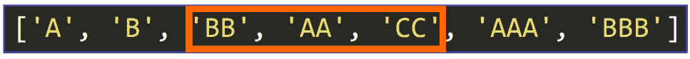

这是因为算法被保证是稳定的，并且它们三个在排序过程中具有相同的中间值(键)(它们的长度是 2，所以它们的键是 2)。

💡**提示:**同样的情况发生在`"A"`和`"B"`(长度 1)`"AAA"`和`"BBB"`(长度 3)上，它们相对于彼此的原始顺序被保留。

现在你知道了`sort()`方法是如何工作的，所以让我们深入研究一下突变以及它如何影响你的程序。

## 🔹突变和风险

正如承诺的那样，让我们看看突变的过程是如何在幕后进行的:

在 Python 中定义列表时，如下所示:

```
a = [1, 2, 3, 4]
```

你在特定的内存位置创建一个对象。这个位置被称为对象的“内存地址”，由一个名为 **id** 的唯一整数表示。

您可以将 id 视为用于标识内存中特定位置的“标签”:

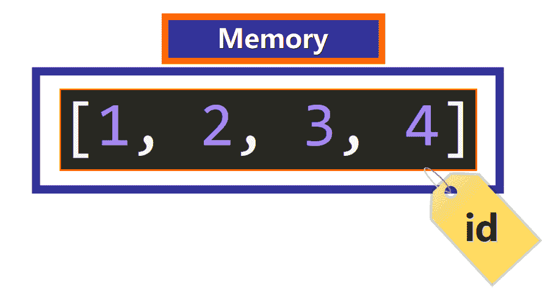

您可以使用`id()`函数访问列表的 id，将列表作为参数传递:

```
>>> a = [1, 2, 3, 4]
>>> id(a)
60501512
```

当你**改变**列表时，你直接在内存中改变它。你可能会问，为什么这么冒险？

这是有风险的，因为它会影响变异后使用该列表的每一行代码，所以您可能会编写代码来处理一个与变异后内存中存在的实际列表完全不同的列表。

这就是为什么你需要非常小心导致变异的方法。

特别是，`sort()`方法**改变了**列表。这是其效果的一个例子:

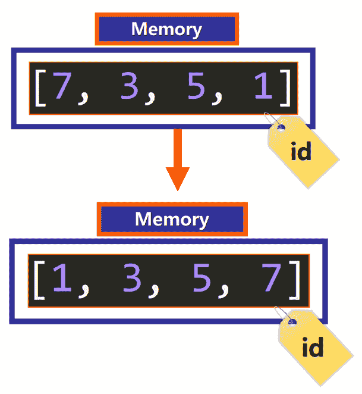

这里有一个例子:

```
# Define a list
>>> a = [7, 3, 5, 1]

# Check its id
>>> id(a)
67091624

# Sort the list using .sort()
>>> a.sort()

# Check its id (it's the same, so the list is the same object in memory)
>>> id(a)
67091624

# Now the list is sorted. It has been mutated!
>>> a
[1, 3, 5, 7]
```

名单在调用`.sort()`后变异。

在突变发生后，使用 list `a`的每一行代码都将使用新的、已排序的列表版本。如果这不是您想要的，您可能没有意识到程序的其他部分正在使用新版本的列表。

下面是函数内变异风险的另一个例子:

```
# List 
>>> a = [7, 3, 5, 1]

# Function that prints the elements of the list in ascending order.
>>> def print_sorted(x):
	x.sort()
	for elem in x:
		print(elem)

# Call the function passing 'a' as argument	
>>> print_sorted(a)
1
3
5
7

# Oops! The original list was mutated.
>>> a
[1, 3, 5, 7]
```

作为参数传递的列表`a`发生了变异，即使这不是您最初编写函数时的意图。

**💡提示:**如果一个函数变异了一个参数，应该明确的声明，以避免将 bug 引入到你程序的其他部分。

## 🔸sort()方法的概要

*   方法让你以升序或降序排列一个列表。
*   它只接受两个关键字参数:`key`和`reverse`。
*   `reverse`确定列表是按升序还是降序排序。
*   `key`是一个为每个元素生成中间值的函数，该值用于在排序过程中进行比较。
*   `sort()`方法改变了列表，导致了永久的改变。您需要非常小心，只有在不需要列表的原始版本时才使用它。

****我真的希望你喜欢我的文章，并发现它很有帮助。**** 现在你可以在你的 Python 项目中使用`sort()`方法了。[查看我的在线课程](https://www.udemy.com/user/estefania-cn/)。在推特上关注我。⭐️