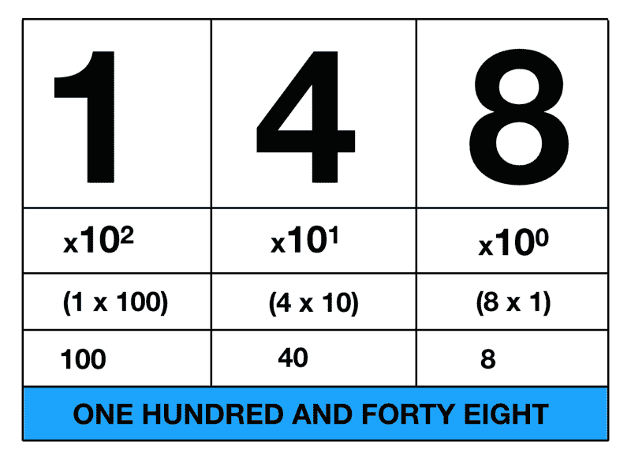
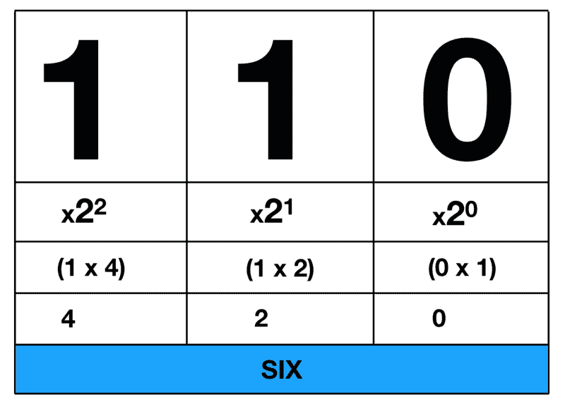
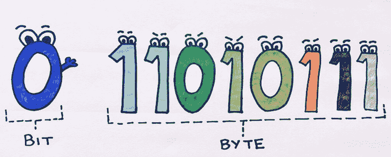
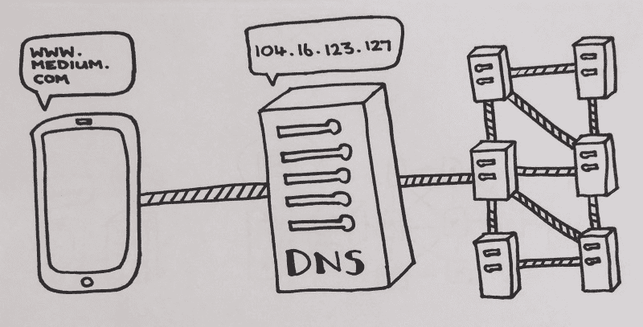
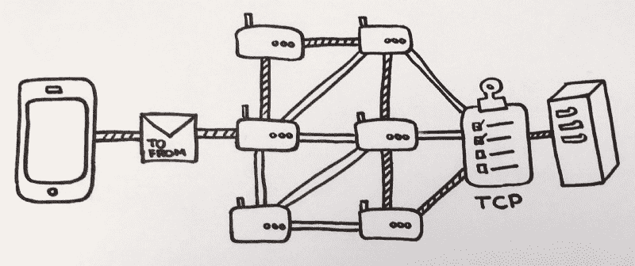

# 为绝望的新程序员提供的计算机工作方式快速指南

> 原文：<https://www.freecodecamp.org/news/the-quick-guide-to-the-way-computers-work-for-desperate-new-coders-fcdb34cbe8a9/>

丹妮尔·奥姆肖

# 为绝望的新程序员提供的计算机工作方式快速指南

Photo courtesy of [Pexels](https://www.pexels.com/photo/adult-black-and-white-break-chairs-440581/).

你的计算机的唯一目的是发送和接收数字形式的信息——1 和 0。

当我第一次明白这个概念的重要性时，我惊呆了。我们如何从一系列的 1 和 0 中创造出如此复杂的相互作用呢？

我翻阅了计算机科学书籍，搜索了互联网。我很难理解这一切是如何联系在一起的。这是我希望几个月前就能找到的指南，那时我刚开始这段旅程。

#### 人类使用十进制进行交流

当人类想用数字交流时，他们使用十进制。十进制系统有十个数字(0-9)，人们根据这些数字出现的列来解释它。考虑十进制数 148。当你读到这个例子时，你会下意识地遵循下面的步骤:

Image courtesy of [Danielle Ormshaw](https://twitter.com/SchnucklePi).

1.  将最右边的数字乘以 10^0.
2.  将中间的数字乘以 10^1.
3.  将最左边的数字乘以 10^2.
4.  添加步骤 1–3 的输出。

使用这个系统，你能够推断出正确的意思——148。

在十进制中，我们总是将数字乘以 10 的幂。每当我们在表格的左侧添加一个新列，该幂就必须增加 1。这样，我们说十进制的基数是 10。够简单吗？

#### 计算机使用二进制系统进行通信

当计算机想要通信时，它们使用类似的系统。二进制有两位数(0，1)，我们可以用和十进制一样的方式分解它。这一次，我们不是以 10 为基数，而是以 2 为基数。

考虑二进制数 110。当计算机解释这个二进制代码时，它将遵循以下步骤:

Image courtesy of [Danielle Ormshaw](https://twitter.com/SchnucklePi).

1.  将最右边的数字乘以 2^0.
2.  将中间的数字乘以 2^1.
3.  将最左边的数字乘以 2^2.
4.  添加步骤 1–3 的输出。

同样，每当我们在表格的左侧添加一个新列时，我们都需要将乘方增加 1。

#### 互联网是一个物理系统，旨在传输信息

我们已经学会了如何使用二进制代码来存储信息，但这在实践中是如何工作的呢？

互联网就像亚马逊的快递员。它不是来回运送包裹，而是运送小块。不管你发送的是照片还是文件，互联网上的每一条信息都是以比特表示的。每一位都有一个二进制值(0 或 1)，八位组合在一起形成一个字节。

Illustration courtesy of [Danielle Ormshaw](https://twitter.com/SchnucklePi) on [Twitter](https://twitter.com/SchnucklePi/status/971362650918670337).

当您将文件下载到您的计算机时，您可能会看到文件大小在千字节或兆字节范围内。千字节是一千字节，兆字节是一百万字节。

二进制信息的传输有三种方式:

1.  电力传输。
2.  光纤传输。
3.  无线传输。

互联网服务提供商(ISP)提供支持这些系统的物理基础设施。

#### 每台连接到互联网的设备都有一个唯一的地址

当你从亚马逊订购包裹时，快递员会使用你的地址送到正确的地方。互联网的工作方式完全相同。

当我们搜索某样东西时，我们会向一个独特的数字串发送请求，这个数字串被称为 IP 地址。这些请求将包括许多位和原始设备的 IP 地址。这就像一个“回邮地址”，收件人现在可以理解请求来自哪里。

也就是说，当我们想访问谷歌时，我们不会在浏览器中输入一串数字。那么，我们的计算机如何知道将每个请求发送到哪里呢？

#### 互联网通过一系列协议和检查点工作

域名系统(DNS)将人类可读的网址转换成数字 IP 地址。在 DNS 不知道地址的情况下，它将使用一个连接服务器的网络来寻找答案。

Illustration courtesy of [Danielle Ormshaw](https://twitter.com/SchnucklePi) on [Twitter](https://twitter.com/SchnucklePi/status/971746123298889729).

当两台设备通信时，它们以数据包的形式发送信息。我们经常需要将信息分成多个数据包。每个都包含信息的字节以及发送和接收 IP 地址。

数据包通过使用流量管理系统在设备网络中移动。路由器跟踪数据包可能经过的路径，并识别“最便宜”的路由。最便宜的路由通常被定义为拥塞最少的路径。路由器在管理数据包时，也可能会考虑非技术因素，比如国际政治。

数据包在网络中可能采用不同的路由，并且通常会无序到达目的地。网络是如何处理的？

传输控制协议(TCP)充当库存检查。如果所有数据包都存在，TCP 会向发送设备发送收到确认。否则，TCP 将“拒绝签署”该传输，并将请求所有丢失的数据包。

Illustration courtesy of [Danielle Ormshaw](https://twitter.com/SchnucklePi).

总之，域名服务器(DNS)将人类可读的网址翻译成 IP 地址。信息以包的形式被分解、传输和接受。数据包包含二进制位形式的信息，电缆、光纤和无线网络在 IP 地址之间发送这些位。

#### 下一步是什么？

如果这篇文章帮助你理解了基本知识，请用掌声或在 Twitter 上关注我来表达你的感激之情。编码快乐！