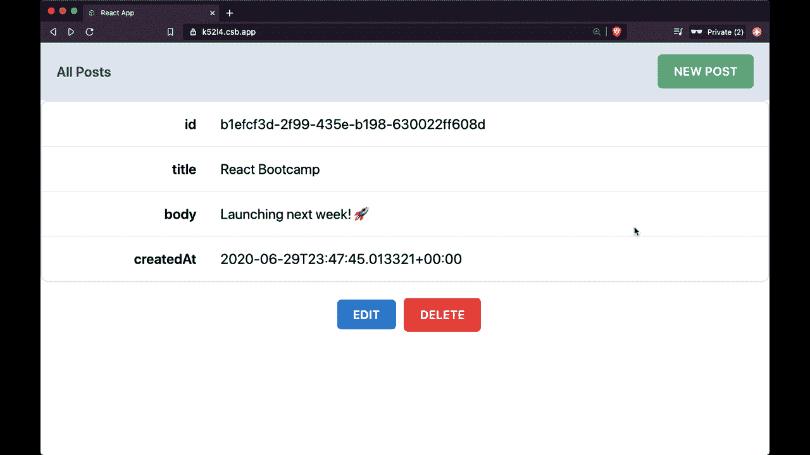
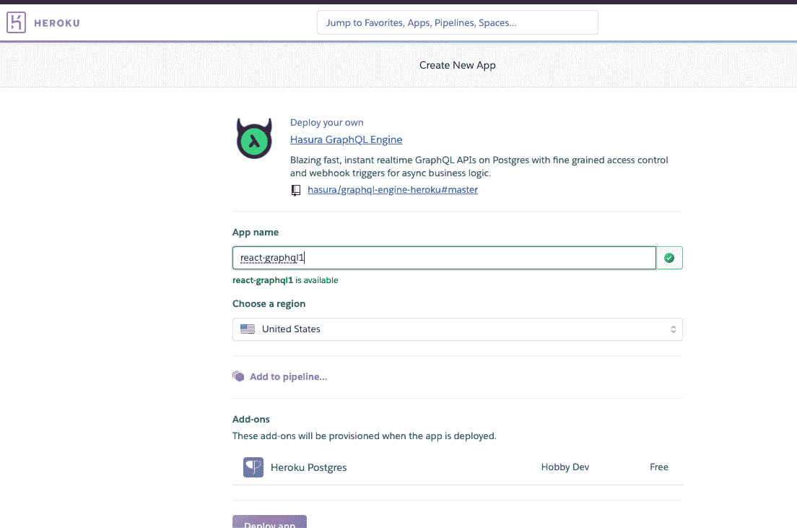
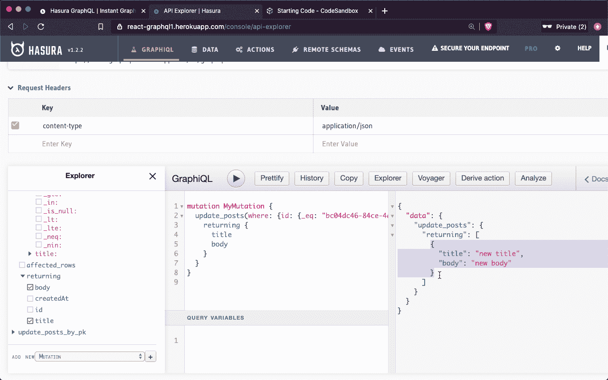
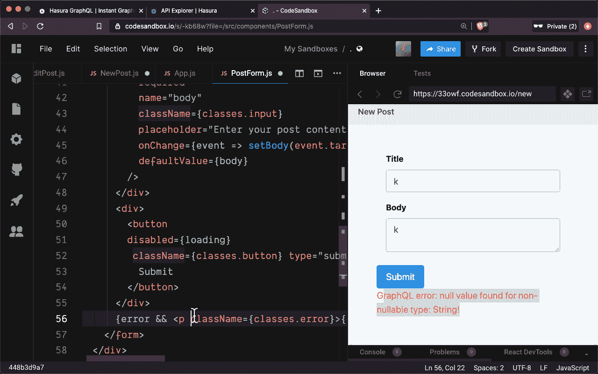
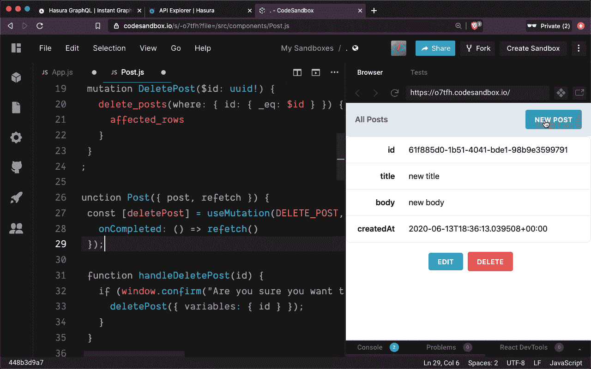

# React + GraphQL 2020 速成班

> 原文：<https://www.freecodecamp.org/news/the-react-graphql-2020-crash-course/>

你是否听说过很多将 React 与 GraphQL 结合使用，但不知道如何将它们结合起来构建令人惊叹的应用程序？在这个速成课程中，你将通过构建一个完整的社交博客应用来学习如何做到这一点。

在一个下午内，您将获得构建自己的 React 和 GraphQL 项目的核心技能。

*想现在就开始吗？*您可以在这里 访问整个课程 **[。](https://courses.reedbarger.com/p/2020-react-graphql)**

## 为什么您应该学习使用 GraphQL？

React 是用 JavaScript 构建令人惊叹的应用程序体验的首选库。另一方面，GraphQL 是一种工具，它为我们提供了一种更好、更直接的获取和更改数据的方式。

这些数据可以来自标准数据库(我们将在应用程序中使用)，也可以来自 Gatsby 等 React 框架，甚至可以来自 markdown 文件等静态文件。不管它是如何存储的，GraphQL 都可以更好地处理我们应用程序中的数据。

我们将看到如何通过从头到尾创建一个社交博客应用来利用 React 和 GraphQL 的强大功能，在这个应用中，您可以创建、阅读、编辑和删除帖子。

[](https://bit.ly/2020-react-graphql)

您可以[点击此处](https://courses.reedbarger.com/p/2020-react-graphql)进入课程。

## 我们将使用什么工具？️

速成班是为那些稍微熟悉 React(包括核心 React 挂钩，如`useState`和`useEffect`)但还不熟悉 GraphQL 的开发人员准备的。

假设有基本的 React 知识，但不需要 GraphQL 知识。我们将涵盖您需要的所有核心 GraphQL 概念。

在整个课程中，我们将利用以下技术来创建我们的应用程序:

*   **反应**(构建我们的用户界面)
*   **GraphQL** (以声明的方式获取和更改数据)
*   **Apollo 客户端**(允许我们一起使用 React 和 GraphQL)
*   Hasura(创建和管理我们的 GraphQL API +数据库)

最重要的是，我们将使用在线 IDE 代码沙箱。这将允许我们在浏览器中实时编码我们的整个应用程序，而不需要我们自己创建任何文件、文件夹或安装依赖项。

## 从头开始创建 GraphQL API

为了开始使用 GraphQL，我们将看到如何从头开始创建一个完整的 GraphQL API 来与我们的数据库进行通信。

幸运的是，使用(免费)服务 **Hasura** ，这个过程非常简单明了。几秒钟之内，我们将看到如何创建一个完整的 GraphQL API 并将其部署到 web 上，它连接到一个 Postgres 数据库，该数据库将负责存储我们的应用程序数据。

[ ](https://learn.codeartistry.io/courses/2020-react-graphql/lectures/19445637) *点击观看本次讲座*

## 熟悉 GraphQL

在第二次讲座中，我们将讲述如何使用我们的 API 的内置控制台**GraphQL**用 graph QL 语言编写。

首先，我们将在数据库中为我们所有的帖子数据创建一个表。之后，Hasura 将自动创建我们需要的**查询**和**突变**，它们是 GraphQL 操作的名称，允许我们获取和更改数据库中的数据。

在本课中，我们将非常熟悉在 GraphiQL 中执行查询和变化，这将使我们能够获得完整的帖子集和单个帖子，以及创建、更新和删除我们的单个帖子数据。

[ ](https://learn.codeartistry.io/courses/2020-react-graphql/lectures/19445640) *点击观看本次讲座*

## 使用 Apollo 客户端连接 React 和我们的 GraphQL API

既然我们已经习惯了使用 GraphQL 并理解了它的核心特性，我们将看看如何将它与我们的 React 客户机连接起来。

我们通过名为 **Apollo** 的库将 React 应用程序与我们创建的 GraphQL API 连接起来。我们将看到如何通过提供指向我们的 API 的 GraphQL 端点来设置 Apollo 客户端，如下所示:

```
import ApolloClient from "apollo-boost";

const client = new ApolloClient({
  uri: "https://react-graphql.herokuapp.com/v1/graphql"
}); 
```

使用我们新创建的客户端，我们能够通过 React 执行任何 GraphQL 操作。然而，要做到这一点，我们需要将我们的客户端传递给我们所有的 React 组件。我们在 Apollo 提供商的帮助下完成这项工作，如下所示:

[ ](https://learn.codeartistry.io/courses/2020-react-graphql/lectures/19445642) *点击观看本次讲座*

### 使用 useQuery 获取帖子

在设置好我们的客户端之后，我们将看到如何用它们执行不同的 GraphQL 操作，使用包`@apollo/react-hooks`附带的一些特殊的 React 钩子。

允许我们用 GraphQL 查询数据的钩子叫做`useQuery`。有了它，我们将首先看到如何获取并在我们的主页上显示我们所有的文章数据。

此外，我们将学习如何借助一个名为`gql`的特殊函数，直接在 JavaScript 文件中编写 GraphQL 查询。

```
import React from "react";
import { useQuery } from "@apollo/react-hooks";
import { gql } from "apollo-boost";

export const GET_POSTS = gql`
  query getPosts {
    posts {
      id
      title
      body
      createdAt
    }
  }
`;

function App() {
  const { data, loading } = useQuery(GET_POSTS);

  if (loading) return <div>Loading...</div>;
  if (data.posts.length === 0) return <Empty />;

  return (
    <>
      <header className={classes.header}>
        <h2 className={classes.h2}>All Posts</h2>
        <Link to="/new" className={classes.newPost}>
          New Post
        </Link>
      </header>
      {data.posts.map(post => (
        <Post key={post.id} post={post} />
      ))}
    </>
  );
} 
```

## 使用 useMutation 创建和编辑新帖子

之后，我们将看到如何用`useMutation`钩子创建新帖子。为了做到这一点，我们将看看如何使用 GraphQL 变量来传递我们的突变动态值，这些值将随着每次执行而改变。

接下来，我们将看看如何编辑我们的文章。为此，我们需要获取一个单独的帖子并在表单中显示它，这样我们的用户就可以对数据进行修改。然后，我们需要执行一个变异，根据帖子 id 执行更新。

[ ](https://learn.codeartistry.io/courses/2020-react-graphql/lectures/19445643) *点击观看本次讲座*

## 处理加载和错误

在接下来的讲座中，我们将介绍一些处理数据加载过程的基本模式。

当我们执行一个变异时，这样做是很重要的，以确保我们不会在执行变异时多次提交表单。我们还将看看如何在我们的变异没有正确执行的情况下处理错误。

[ ](https://learn.codeartistry.io/courses/2020-react-graphql/lectures/19445638) *点击观看本次讲座*

## 删除帖子

最后，我们将介绍如何从我们的应用程序中删除帖子。首先，我们将确认用户确实想要删除他们发布的帖子，然后执行变异。

此外，我们将看看如何使用 Apollo 提供的有用的`refetch`函数来更新我们的 UI 以响应突变。它将使我们能够按需重新执行查询。在这种情况下，我们将在删除突变成功执行之后进行。

[ ](https://learn.codeartistry.io/courses/2020-react-graphql/lectures/19445639) *点击观看本次讲座*

## 现在看课程？

React 和 GraphQL 是大量强大的网络和移动应用的核心，现在是学习这两个应用的最佳时机。

参加本课程，在一个小时内，您将学习到核心概念，这些概念将有意义地提高您的开发人员技能，并为您提供创建自己的 React 和 GraphQL 项目的关键见解！

[ ](https://bit.ly/2020-react-graphql) *点击观看课程*