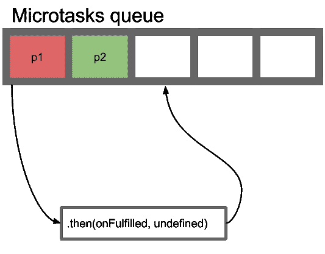
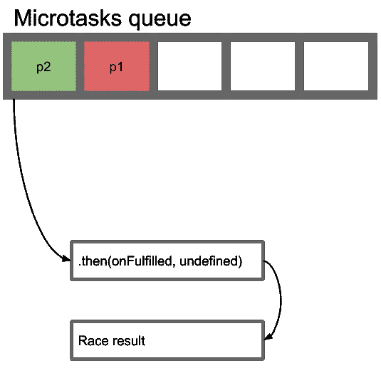

# 捕捉和驱逐的真正区别

> 原文：<https://www.freecodecamp.org/news/the-real-difference-between-catch-vs-onrejected-15cab8978e92/>

马克斯·贝尔斯基

# 捕捉和驱逐的真正区别

大多数受欢迎的文章在如下代码片段中描述了 catch 和 onRejected 之间的区别:

```
const getPromise = () => new Promise((resolve, reject) => {  Math.round(Math.random()) ?     resolve('resolve #1') :     reject('reject #1')})
```

```
getPromise().then(result => {  throw new Error('reject #2')}, error => {  // Handles only 'reject #1'})
```

```
getPromise().then(result => {  throw new Error('reject #2')})  .catch(error => {    // Handles both 'reject #1',     // and 'reject #2'  }))
```

onRejected 从不处理来自同一个`.then(onFulfilled)`回调的被拒绝的承诺，而`.catch`接受两者。然而，除了行为差异之外，还有一个细微差别。这是关于这些路将如何被翻译成[微任务](https://jakearchibald.com/2015/tasks-microtasks-queues-and-schedules/)以及它们将如何被排队。
让我们来看一个区别的例子。

#### 承诺.比赛

有一个任务——写`Promise.race` polyfill。我们在两个函数中使用一个公共模式来处理`resolved`承诺，并使用不同的工具来处理`rejected`承诺。

```
const promiseRaceOnRejected = (promises = []) => {  return new Promise((resolve, reject) => {    promises.forEach(promise => {      promise.then(        result => resolve(result),        error => reject(error)      )    })  })}
```

```
const promiseRaceCatch = (promises = []) => {  return new Promise((resolve, reject) => {    promises.forEach(promise => {      promise.then(result => resolve(result))        .catch(error => reject(error))    })  })}
```

尝试一些测试，以确保两种解决方案都能正常工作:

```
// A helper function to create a delayed promiseconst getPromise = (resolveMs, rejectMs) => {  return new Promise((resolve, reject) => {    if ('number' === typeof rejectMs) {      setTimeout(() => reject(rejectMs), rejectMs)    }
```

```
 if ('number' === typeof resolveMs) {      setTimeout(() => resolve(resolveMs), resolveMs)    }  })}
```

```
const testRaces = async () => {  const r1 = await promiseRaceOnRejected([    getPromise(0),     getPromise(5)  ])  // 0
```

```
const r2 = await promiseRaceCatch([    getPromise(0),     getPromise(5)  ])  // 0
```

```
const r3 = await promiseRaceOnRejected([    getPromise(5),     getPromise(null, 2)  ])    .catch(e => e)  // 2
```

```
const r4 = await promiseRaceCatch([    getPromise(5),     getPromise(null, 2)  ])    .catch(e => e)  // 2}
```

```
testRaces()
```

如您所见，两种聚合填充都按预期工作。参数顺序和`rejected`承诺处理程序变化无关紧要。直到我们在下一组测试中尝试它:

```
const r5 = await promiseRaceOnRejected([    Promise.resolve('Resolve'),     Promise.reject('Reject')  ])  // Resolve
```

```
const r6 = await promiseRaceCatch([    Promise.resolve('Resolve'),     Promise.reject('Reject')  ])  // Resolve
```

```
const r7 = await promiseRaceOnRejected([    Promise.reject('Reject'),     Promise.resolve('Resolve')  ])    .catch(e => e)  // Reject
```

```
const r8 = await promiseRaceCatch([    Promise.reject('Reject'),     Promise.resolve('Resolve')  ])    .catch(e => e)  // ???
```

第五次、第六次和第七次比赛返回预期值。第八个呢？它返回的不是`Reject`，而是`Resolve`，这不是一个 bug。

#### 微任务队列

根据作业的结果，未完成的承诺会将其状态更改为`resolved`或`rejected`。JS environment 将这一承诺放在微任务队列中。就像 ECMA 2015 [规格](http://www.ecma-international.org/ecma-262/6.0/#sec-jobs-and-job-queues)中描述的那样，这个队列按照[先进先出](https://en.wikipedia.org/wiki/FIFO_(computing_and_electronics))原则工作——先进先出。基于此，让我们回顾一下第八场比赛的情况。



Queue’s first tick

在比赛开始时，我们已经有两个排队的承诺，被拒绝的是第一个。没有第二个参数无法处理被拒绝的承诺，所以它将承诺放回队列中。JS 环境没有用`.catch`处理这个承诺，而是切换到`p2`，因为它在队列中有更高的优先级。



Queue’s second tick

在下一个滴答`.then`处理`p2`，比赛以`Resolve`的结果结束。

下次当您在 catch 和 onRejected 处理程序之间进行选择时，不仅要记住它们捕获了哪些被拒绝的承诺，还要记住排队的不同之处！