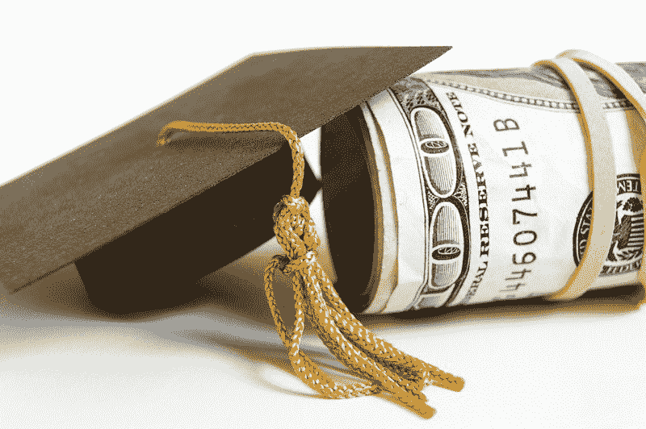

# 我是如何逃脱学生债务陷阱的，以及为什么其他美国人没有这么幸运

> 原文：<https://www.freecodecamp.org/news/the-real-life-secret-to-paying-off-student-loans-early-2728b8815f1d/>

作者艾米莉·克里斯蒂尼·费伊

A graduation cap leaning against a roll of bills that isn’t nearly thick enough to pay for college. Maybe it could pay for the cap?

# 我是如何逃脱学生债务陷阱的，以及为什么其他美国人没有这么幸运

本周，我还清了最后一笔学生贷款。这对我来说是一件大事，也是我多年来一直期待的事情。现在我想做一些我通常避免在网上做的事情:谈论政治。因为如果说我的学生贷款购买了一个教训，那就是大学应该是免费的，对所有人开放。

我花了六年的时间积累了数万美元的债务，才获得了普渡大学的两个学位，普渡大学是一所公立赠地大学。我于 2011 年毕业，在接下来的六年里，我偿还了所有的钱和更多的利息。18 岁时，我开始在堆积如山的债务上签字。我是第一代大学生，毫无头绪。

但是艾米丽，你可能会说，你很快就还清了！*只有* 6 年，*只有*你整个 20 多岁，为世界一流的教育买单！听起来一切都很顺利！

事情是这样的…你是对的。在我的具体情况下，在我的生活中，我能够以不同寻常的速度还清债务。你认为这是为什么？嗯，我一毕业就找到了一份工作，我努力工作以获得晋升。有时我会做家教来赚外快。我按时支付我的帐单。我避免在大型旅行或奢侈品上挥霍，这样我就可以把更多的钱用于偿还债务。所有那些你应该做的善良、正直、负责任的中产阶级的事情。

但如果你和我是脸书的朋友，那么你已经知道我还清学生贷款的真正秘密了。我嫁给了一个软件工程师。

我嫁给他是因为我爱他。我喜欢他的一些方面有助于财务健康——冷静的头脑、长远的思考、正直、责任心、智慧等等。但是，他的智力天赋有助于他热爱的职业和报酬丰厚的职业，这并没有什么坏处。我也追随了我的智力天赋，直接获得了债务缠身但充实的英国文学学位，并在大学学生服务机构找到了一份意外令人满意但毫不意外的低收入职业。让我非常清楚:我的努力工作并不是按时提前支付学生贷款账单的原因。我的贷款在几年前就还清了，这是因为我在正确的时间出现在正确的地点，爱上了一位未来的软件工程师。作为一个对文科有着执迷不悟的爱好的女人，我不得不去追求一个完全不同的职业，以这样的速度独自还清我的债务。

我不仅嫁给了一个工程师，还嫁给了一个幸运的工程师，事实证明我也相当幸运。我们从未患过慢性身体或精神疾病。我有一个非常顺利和有计划的怀孕，一个非常健康的宝宝，还有保险来支付这两者。我们的汽车从未意外抛锚，我们从未因“重组”而丢掉工作，我们的身份或财产从未被盗，除了有一次有人用我们的信用卡号码在纽约买了一辆 400 美元的优步汽车，这只需一个电话就能解决。我们有非常支持我们的大家庭，他们在我们刚刚起步的时候给了我们经济上的帮助。更不用说我们是白人、异性、异性恋、身体健全、在美国出生、在基督教家庭长大的人。如果上面列表中的任何一件事情有所不同，它都会影响我们的财务生活，可能会非常严重。

我的观点是我很幸运。如果宇宙在我生命中的任何一点以稍微不同的角度倾斜，我可能还会再还 5 年、10 年或 40 年的贷款。我非常非常感谢我的好运，我痛苦地认识到，如果上天没有给我量身定制的液压靴，我不可能摆脱这个债务。

好吧，好吧，但这都是我在说我，我，我。为什么我认为大学应该对所有人免费？因为大学仍然是社会流动最可靠的途径。教育，尤其是高等教育(大学、社区学院、职业学校等)仍然是我们帮助人们摆脱贫困、获得经济生产力和安全的最佳工具。当然，个人经历可能会有所不同，但不需要图书馆学学位就能找到支持这一观点的几十个可靠的社会科学研究来源。([来，我给你谷歌一个](http://www.pewtrusts.org/…/01/01/pursuing-the-american-dream)。)

教育是改善个人生活和我们国家整体社会经济健康的重要工具，但当你与沉重的债务相匹配时，这个工具就变得迟钝了。我知道很多聪明、勤奋的人正在努力支付账单，更不用说买房子了，因为他们的学生贷款让他们失去了很大一部分薪水。(你真的认为是鳄梨吐司阻止了千禧一代买车买房吗？求你了。)这些人中的许多人都在从事极其重要的社会工作，比如教学、咨询和护理——这些工作传统上属于女性，而且报酬长期偏低。我知道其他聪明、勤奋的人在大学中途发现自己不适合他们，至少在他们青春期后期不适合，现在他们正在努力谋生，同时背负数千美元的债务，没有学位。你不可能摆脱这笔债务。无论你是学生还是签了贷款的父母，无论你是否完成了学业，没有大到足以抓住那些贷款的破产。只有两条路可走:要么付钱，要么去死。

我从根本上认为，学生应该有机会上大学，而不必背负限制生命的债务。我认为，学校应该能够提供严谨的教育，培养批判性思想家、创造性领袖和积极参与的公民，而不必担心学生的起薪是否足够高，以至于学位对新一批 18 岁的顾客具有吸引力。我认为，来自非富裕家庭的毕业生应该能够和父母富裕的同龄人一样开始工作生活。因为，哦对了，富家子弟不用担心这些东西。

但是艾米丽，你可能会说，即使破产的学生和他们的父母不应该支付大学费用，为什么这意味着我这个高贵的纳税人应该支付这笔费用呢？首先，我认为公立大学和社区大学的学费应该由最富有的美国人的税收来支付，而不是中产阶级。我的意思是，说真的，对于大多数美国中产阶级家庭来说，大学是一笔惊人的费用——这不仅仅是穷人的问题。向巨富征税以支持美国穷人、工人阶级和中产阶级子女的教育是打击收入不平等的组合拳。

我认为让人们负担得起大学是值得的，我们的税收和我们的公民精力也是值得的。我希望公立学校对来自该州的所有学生真正公开和免费。我们至少可以完全补贴利息，这样学生实际上只需支付他们的教育费用，而不是在几十年内增加两倍或三倍。我认为这是一个半吊子的妥协，但为一代学生每人节省数万美元是我可以开始的一个半吊子的妥协。无论如何，我们必须做点什么，因为这是一场危机，而那些有着中产阶级野心的非富裕家庭的孩子只能靠一些兔子脚，四叶草，流星，闪闪发光的运气来避免。

现在，我自己惊人的运气让我获得了这一刻的自由，我觉得我终于可以说出我的想法，而不需要个人伸出援手，这安抚了我中西部的灵魂。我的贷款已经还清了，我再也不想看到那笔钱了。我不后悔接受贷款，也不后悔他们购买的优秀文学教育。作为“好人”中的一员，作为一个做每件事都做得恰到好处并付清每一分钱的贷款接受者，我要第一个说，学生贷款行业是对我们国家平等机会价值观的破坏。从什么时候开始我们不得不花钱追求幸福了？