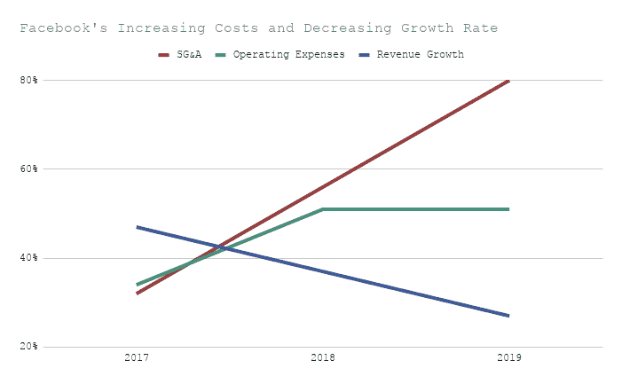

# 真正在家工作的赢家是股东

> 原文：<https://www.freecodecamp.org/news/the-real-work-from-home-winner-is-the-shareholder/>

今天，大约有 800 万美国人全职远程工作。最常见的工作包括许多利用在 freeCodeCamp 磨练的技能的工作。这些工作包括网页设计、软件工程、产品管理和写作。

出于多种原因，公司正在接受雇用和授权远程员工的转变。经常提到的一些原因包括提高劳动生产率和获得新的人才库。

一个不太经常被提及的原因(但似乎同样重要)是转移到偏远地区的劳动力将显著降低公司的成本。最终，这些成本节约将惠及股东。

我想解释一下公司，尤其是科技公司必须管理的成本结构。我通过研究一些公司的财务文件和年度报告吸取了这些教训，这些公司或许是你渴望为之工作的公司，或者是你可能会使用和喜欢其产品的公司。

我想和你们分享这些教训。

首先，一些相关的金融背景。所有公司都必须管理三大成本:不动产、厂房和设备(PP&E)、运营费用、销售费用、一般费用和管理费用(SG&A)。

当一家公司拥有一个办公室(或者谷歌、脸书和苹果公司著名的大型总部)时，它显然必须支付家具、土地、建筑和机器的费用，以支持其业务。这些固定资产预计至少使用一年，在公司的资产负债表上被归类为 PP&E。

运营费用是公司必须管理的第二类成本。这些成本包括公用事业、保险、税收和公司为保持营业而支付的工资。

最后，公司需要为 SG&A 费用做预算，它是公司发生的所有直接或间接销售费用和一般管理费用的总和。

在这种背景下，我们可以通过新的财务视角来看待远程工作以及 CEO 们对远程工作的支持。

通过将员工安置在家庭办公室(或远程协同工作空间),公司可以一步到位地实现两件事:公司可以降低固定成本和可变成本，并将部分成本结构从资产负债表转移到员工身上。

简而言之，公司不需要在建筑和设备上投资太多(即更低的资本支出)，这将直接导致更高的现金流。随着时间的推移，这将导致更高的预期增长和更高的股价。

此外，公司可以降低工资和公司管理成本(即降低 SG&A)，这将导致股东的净收入增加。

脸书为这一趋势提供了证据。

最近，脸书创始人兼首席执行官马克·扎克伯格表示，在未来五到十年内，多达 50%的脸书员工将远程工作。

有什么数据支持这个政策？

首先，看看过去三年脸书 SG & A 成本的爆炸式增长。

*   2019 年，脸书的年度 SG&A 比 2018 年增长了 80%。
*   2018 年，脸书的年度 SG&A 比 2017 年增长了 56%。
*   2017 年，脸书的年度 SG&A 比 2016 年增长了 32%。

接下来，看看脸书运营费用的增长。

*   脸书 2019 年的年度运营费用比 2018 年增长了 51.05%。
*   脸书 2018 年的年度运营费用比 2017 年增长了 51.22%。
*   脸书 2017 年的年度运营费用比 2016 年增长了 34%。

最后，请注意，尽管脸书的收入增加了，但增长率正在放缓。

*   脸书 2019 年的年收入比 2018 年增长了 27%。
*   脸书 2018 年的年收入比 2017 年增长了 37%。
*   脸书 2017 年的年收入比 2016 年增长了 47%。

脸书的 SG&A 和运营费用的增长速度超过了脸书的收入增长率。

为了提高盈利能力，脸书需要找到降低成本的方法。它有几个明显的目标，扩展其远程工作人员可以一举降低 PP&E、SG&A 和其他运营成本。

让我来解释一下。

远程工作人员将减少脸书对家具、土地和建筑的依赖。这些固定资产利用率的降低会降低脸书的 PP&E

其次，远程工作人员将减少脸书的工资。为什么？因为脸书可以向人口稠密地区以外的工人支付更低的工资，而这些地区是当今大多数工人的聚居地。从大都市以外雇佣人才将使脸书能够支付与当地成本挂钩的工资。

在新罕布什尔州或蒙大拿州雇用一名软件工程师比在纽约市或海湾地区雇用同一名工程师花费更少。扎克伯格解释说，脸书“会根据你所在的地区调整薪资...这意味着，如果你生活在一个生活成本非常低的地方，或者劳动力成本更低的地方，那么这些地方的工资确实会有所下降。”

成本的降低可以延伸到 SG&A。租金、公用事业和办公用品是脸书可以将成本从资产负债表转移到员工成本的三个例子，除其他事项外，员工可能需要自费加热和冷却他们的家庭工作环境，自己制作咖啡和食物，或清洁他们的家庭工作区。

这种成本结构的转变可能会给股东带来不成比例的利益，因为在其他条件不变的情况下，成本下降时，公司的收益会增加。

这些变化对你来说意味着什么？我有一些想法。

远程员工应该明智地要求并协商新的福利待遇。如果你不再有办公室可以工作，补贴 wifi 或公用设施似乎是合理的要求。加入远程角色时，打折的家庭办公产品-椅子、桌子、灯、键盘、显示器-应包括在免税项目中。可以要求获得虚拟指导或心理健康工具作为核心津贴，以确保您在执行远程工作时健康成长。

随着远程工作变得越来越普遍——对于全职远程工作者和在工作场所之间混时间的员工来说——新的工作模式将会出现。随着劳动力市场的这一根本性转变，企业将有一个独特的机会来降低成本。如何以及在哪里削减开支将决定收入增长的速度。

似乎有理由认为，股东将从这些变化带来的盈利能力增强中受益。但是远程工程师、设计师、产品经理和销售人员也能从中受益。通过要求新的和特定的津贴来支持远程工作，这些员工可能会从劳动力市场的这种转变中看到更多的好处。