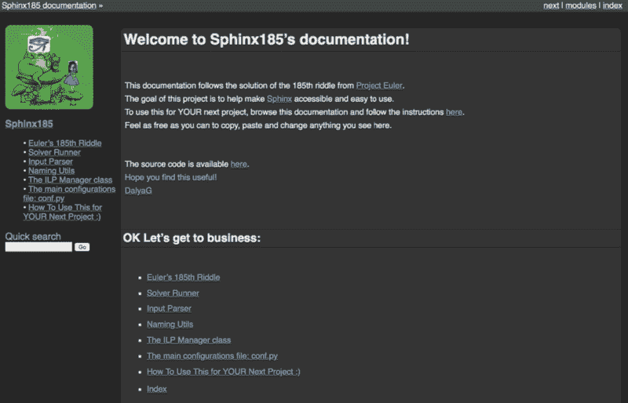
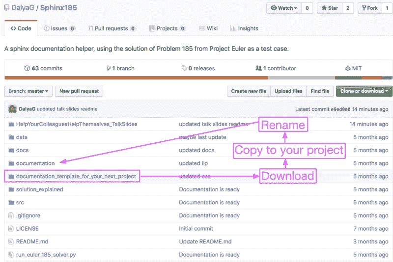
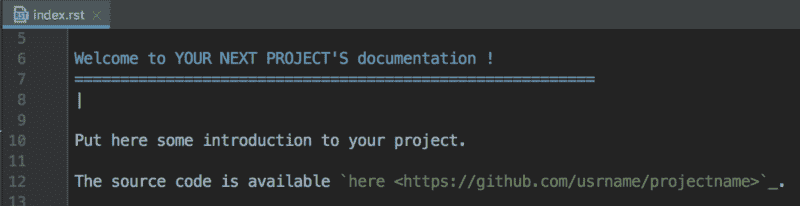
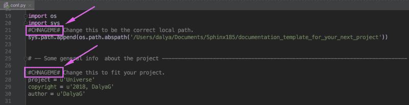
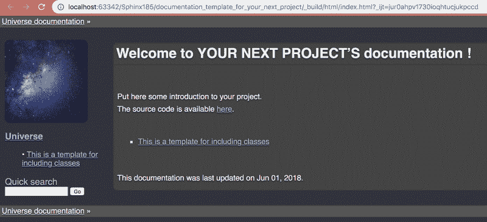
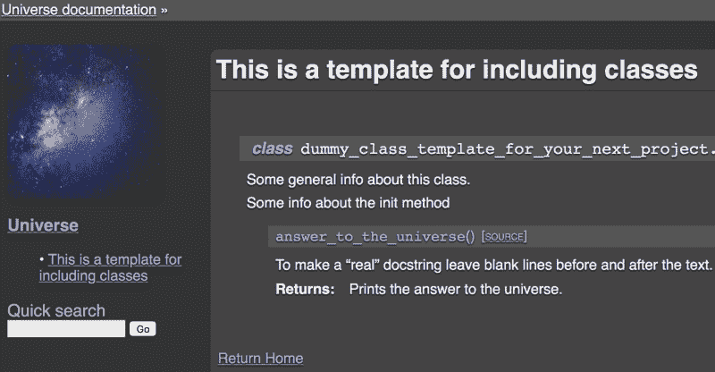
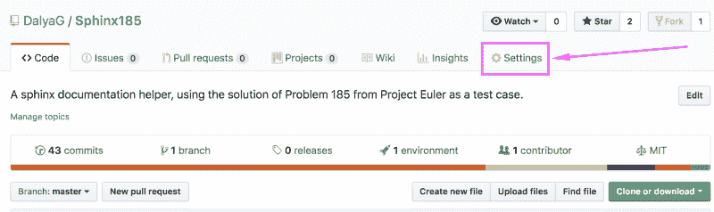
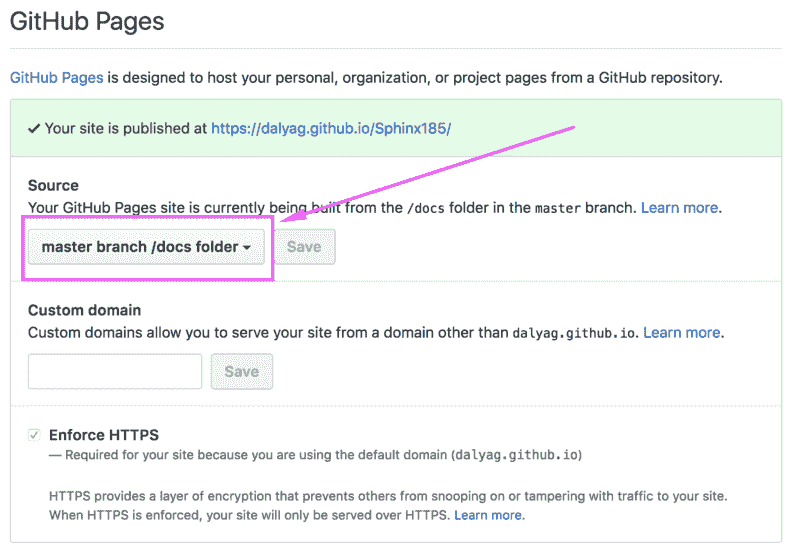

# 斯芬克斯之谜:如何轻松地记录您的代码

> 原文：<https://www.freecodecamp.org/news/the-riddle-of-sphinx-how-to-document-your-code-easily-bf09a9a1804c/>

### 为什么我会在这里？

你，读者，在这里是因为你用 Python 写了一些很棒的工具，你想让它变得易于访问和使用。

我，这个作家，在这里是因为几个月前我就在你们这里。我想使用 [Sphinx](http://www.sphinx-doc.org/en/master/) 包为我的项目制作 ReadTheDocs 风格的文档。

我发现 Sphinx 的加入并不简单，这就是为什么我制作了这个 GitHub repo(T1)作为你的项目(T3)的模板(T2)。

**在我们开始之前，一些基本的假设，以确保我们在同一页:**

*   你是用 Python 写的。
*   您为想要记录的代码编写了[docstring](https://en.wikipedia.org/wiki/Docstring#Python)。
*   你的目标是制作一个 [ReadTheDocs](https://docs.readthedocs.io/en/latest/) 风格的文档，至少部分是自动生成的。
*   你知道在 **10 分钟内你可以发布你的文档的第一个版本**，看起来会像[这个](https://dalyag.github.io/Sphinx185/index.html):



### 第 1 部分-搭建舞台

*   安装斯芬克斯:`pip install sphinx`
*   前往[github.com/DalyaG/Sphinx185](https://github.com/DalyaG/Sphinx185):
*   下载文件夹`documentation_template_for_your_next_project`
*   复制到您的项目
*   重命名文件夹`documentation`



### 第 2 部分-个性化

*   在您喜欢的编辑器中打开文件`<your_project>/documentation/c` onf.py。搜索 pa `ttern #CHN` AGEME#并按照说明进行操作。
*   类似地，编辑文件`<your_project>/documentation/ind` ex.rst 并遵循内联指令。



### 第 3 部分-添加您希望记录的内容

*   假设您有一个名为`my_amazing_class.py`的 python 文件，其中包含您希望记录的类。
*   **在与`conf.py`和`index.rst`文件相同的文件夹**中，创建一个名为`my_amazing_class.rst`的新文件，并复制-粘贴-个性化该模板:

```
This is a template for including classes========================================|.. autoclass:: my_amazing_class.MyAmazingClass|:ref:`Return Home <mastertoc>`
```

> 提示:确保包含您的神奇类的文件夹在您的`PYTHONPATH`中，并且它包含一个 init 文件`__init__.py`

*   在`index.rst`文件中，编辑目录以包含`.rst`文件的名称:

```
.. toctree::   :maxdepth: 1   :name: mastertoc
```

```
 my_amazing_class
```

### 第 4 部分-“编译”

*   在终端的`documentation`文件夹中，运行`make clean html`。
*   **就是这样！**您已经准备好查看您的文档的第一个版本！
*   在浏览器中打开文件`documentation/_build/html/index.html`，亲自查看:)



### 第 5 部分 GitHub 页面上的主机

*   在项目的根目录下，打开一个名为`docs`的新文件夹，并将`<your_project>/documentation/_build` /html/的内容复制到其中
*   在这个新的`docs`文件夹中，创建一个名为`.nojekyll`
    的空文件(这告诉 GitHub Pages 绕过默认的`Jekyll`主题，在你的项目中使用`HTML`和`CSS`
*   将您的更改推送到`master`分支。
*   在 GitHub 的存储库中，转到`Settings->GitHub Pages->`源
    和 s `elect master branch/docs` 文件夹



### 第六部分-分享！

没错。就是这样。等待几分钟，让 GitHub 更新。分享您美丽的文档网站

`https://<your_git_usrname>.github.io/<proje`联系类型名称> /

> 提示:更新文档时，需要删除`docs`文件夹并重新创建。点击查看更多详情[。](https://dalyag.github.io/Sphinx185/how_to_use_this_for_your_next_project.html)

### 收场白

在这一部分，我说了一些关于在世界上创造新内容是多么美好的想法。你选择让你的原创内容变得可用、可访问和易于使用，真是一个了不起的人。

但是，嘿，你一路走到这里，所以你已经知道这些东西了。

所以如果还有什么你觉得不知道的，我邀请你去探索我为这个教程制作的[文档网站](https://dalyag.github.io/Sphinx185/index.html)。你可以观看我给的关于狮身人面像的[演讲。希望这些能解答你留下的关于狮身人面像的一些谜题。](https://www.youtube.com/watch?v=3OAAL78PES8)