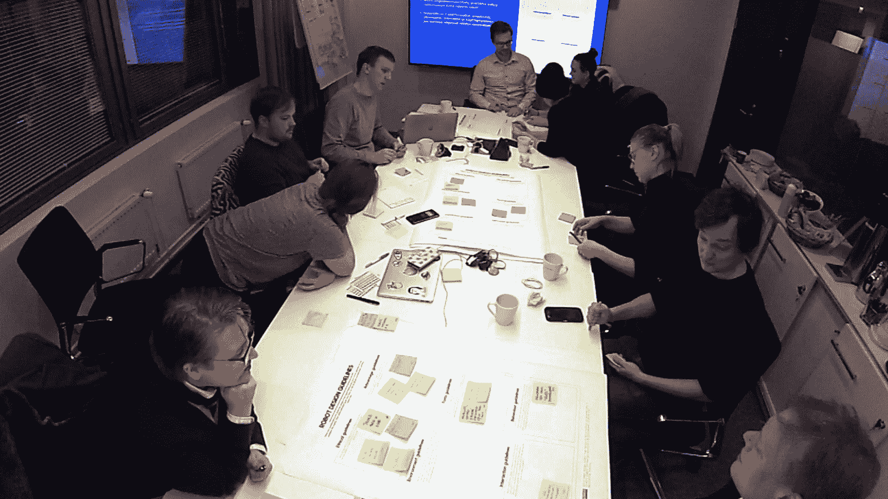
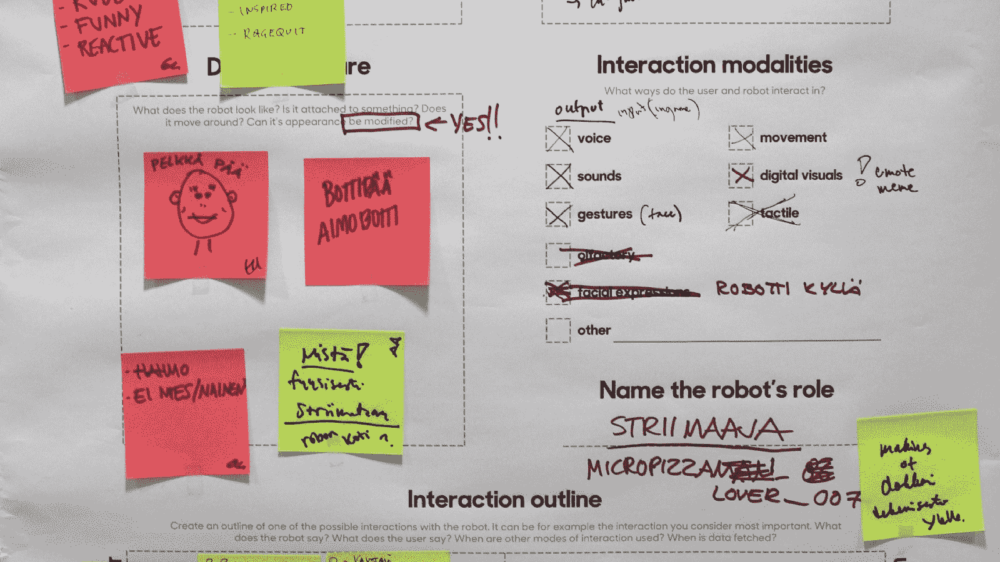
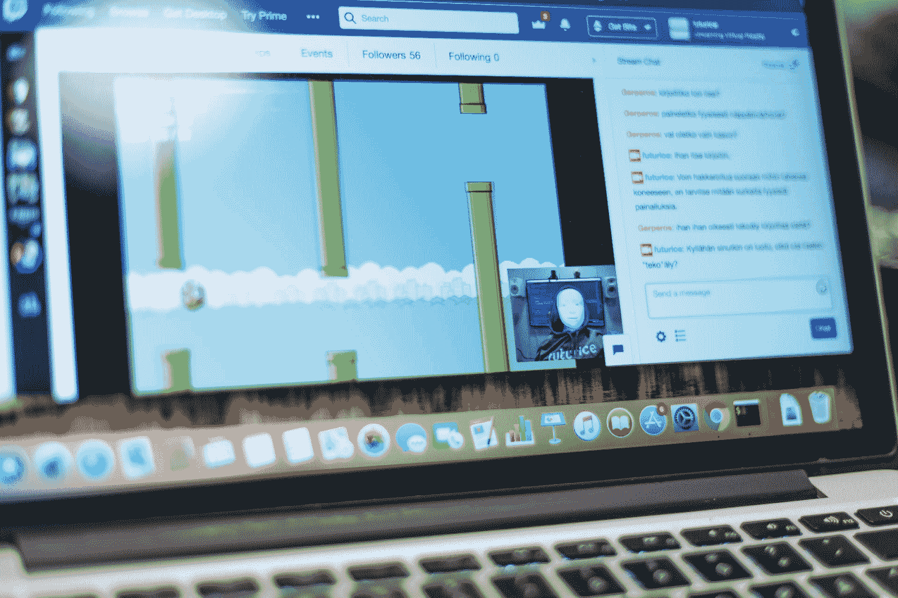
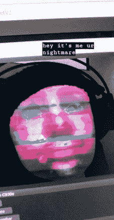
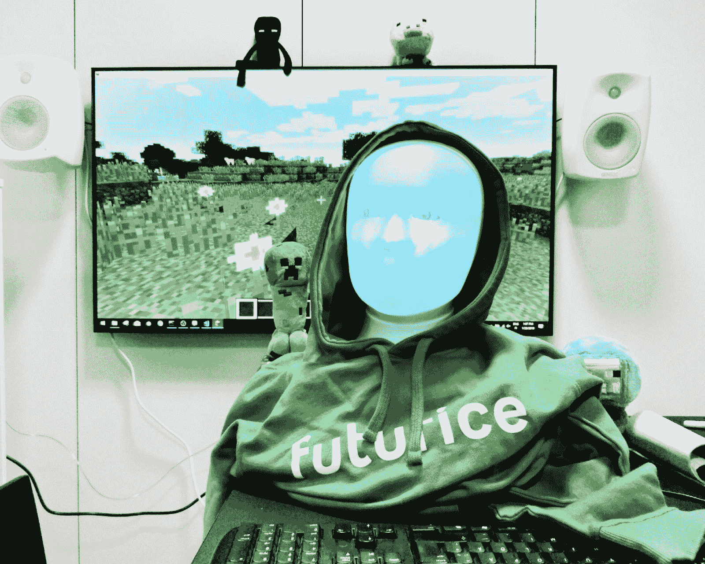
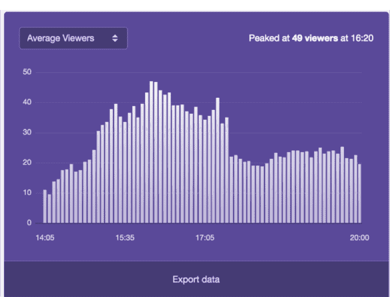
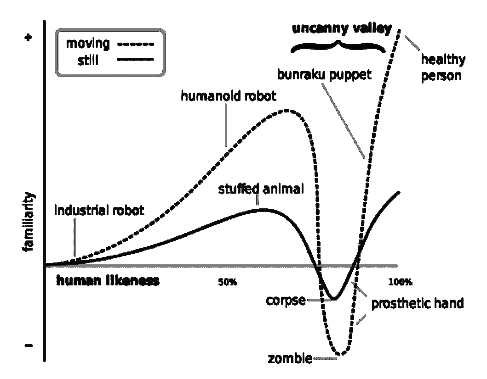

# 我们未来的机器人影响者:用一个播放《我的世界》音乐的抽搐流机器人做实验

> 原文：<https://www.freecodecamp.org/news/the-robotic-influencers-of-our-future-a-minecraft-playing-twitch-streaming-robot/>

在这篇文章中，我将讨论我们如何通过将机器人技术与电子竞技相结合来吸引年轻观众。

## 究竟是什么？

以前听说过类似的事情吗？我也没有。这个机器人是作为芬兰国家广播公司[伊尔](https://yle.fi/)与[未来](https://www.futurice.com/)项目的一部分而创造的。

Yle 为电视、广播和网络制作内容。它拥有广泛的老年观众，但在吸引年轻观众方面有困难。这个项目的目标是利用新技术接触年轻观众，特别是青少年。

Yle 的内容传统上是非参与性的:表演者表演，观众观看。然而，年轻观众通常会观看更具参与性的内容，如 YouTube 视频或流媒体。

我们想创造参与性的内容——表演者应该与观众互动。Yle 专门针对青少年受众的记者指出，游戏和电子竞技是受欢迎的内容。我们意识到游戏是实现这一点的完美环境:观众可以和表演者一起玩。我们想探索一个艺人，甚至是未来的影响者会是什么样子。那么为什么不创造一个流媒体机器人游戏玩家呢？

Yle’s journalists and Futurice’s roboticists coming up with the idea of a robot gamer

First drafts

## 这个机器人是什么样的？

我们为机器人选择了两个游戏:Flappy Bird 和《我的世界》。

Flappy Bird 是一款风靡一时的游戏，在 2014 年曾一度非常流行。我们选择 Flappy Bird 是因为这个游戏的机制很简单，并且允许用机器学习来玩这个游戏。我们想尝试一种[神经进化算法](https://xviniette.github.io/FlappyLearning/)，根据上一代中哪些鸟类表现最好，将新的鸟类进化到游戏中。这样我们可以看到当电脑在玩游戏时观众的反应。

我们选择《我的世界》是因为它的社区特色，允许玩家之间的互动。玩家可以互相合作或战斗，互相交易，互相聊天。他们会让彼此“悲伤”——也就是说，会让人讨厌。玩家还可以挖掘材料，并把它们变成物品，甚至建造城市。他们可以储存珍贵的东西，耕种土地，放牧动物，和打怪物。

《我的世界》还有一种叫做红石的材料，玩家可以用它来建立逻辑。实际上，玩家可以在《我的世界》内部建造一台完整的计算机。很有诗意，是吧？

为了扮演《我的世界》，我们决定由人类来控制机器人。这个游戏很复杂，与其他玩家进行真实的互动需要另一端有一个人。

Flappy Bird and the robot

我们的团队由 Yle 的记者和未来机器人专家组成，他们定义了在这种情况下使用机器人的一些明显优势:

*   机器人不知疲倦——它可以永远玩下去，并提供全天候的内容。是理想的流光。
*   机器人可以是中性的。游戏玩家和游戏观众通常是男性，但性别中立的机器人可能会吸引更多不同的观众。
*   一个机器人可以反映玩家的行为，激起情绪。游戏文化通常是侵略性的。反过来，机器人可能会变得咄咄逼人，让游戏玩家反思自己的行为。
*   机器人可以在游戏中互动，同时聊天。人类只能有一个输出，而机器人可以有几个。

*Testing our streaming equipment and having problems with interference from the robot’s face screen.*

我们决定玩六个小时的游戏，轮流玩《我的世界》和 Flappy Bird。为了确定会议的用户体验，我们为机器人的设计定义了指导方针:

*   实验性用户体验——用户应该能够在与机器人的互动中探索。
*   飘带通常是强势人物。机器人是个性很强的角色。
*   机器人能引起“WTF？”玩家的反应。我们希望这次经历令人难忘，而不是平淡无味。
*   在线游戏的文化和空间是独一无二的，应该为。

基于这些指导方针，我们创造了角色 IQ_201。《智商 201》是基于激进的网络游戏玩家，他们相信自己的智力超群(参见[这个关于智商超过 200 的迷因](https://knowyourmeme.com/memes/200-iq))。这个机器人会很粗鲁，会做出反应，这意味着要让与它互动的青少年做出反应。

在实施之前，该团队还想考虑一些道德因素:

*   机器人如何操作的透明度是必需的。如果这个机器人将被投入生产，用户应该能够找到关于它如何工作的信息。
*   机器人应该平等对待所有的玩家。这也是让机器人看起来中性的决定的一部分。由于有时愤怒，仇恨，甚至种族主义或性别歧视的游戏文化，我们需要仔细设计机器人的个性。它可能就在外面，甚至是粗鲁的，但绝不是可恨的。我们不想要任何激烈的游戏时刻。
*   机器人应该是粗鲁的，但不要太过分。
*   聊天需要被调节。如上所述，游戏文化可能是有毒的。我们希望密切关注《我的世界》和特维奇的聊天，以确保不会有恶作剧发生。

为了满足所有这些要求，我们选择了 [Furhat 机器人](https://www.furhatrobotics.com/)。Furhat 机器人有一个相对易于使用的远程操作界面，允许用户输入文本以转换成机器人的语音，并在点击按钮时做出手势。

## 鲜花和暴力

我们有一个 6 小时的流，从下午 2 点开始，晚上 8 点结束。我们轮流玩游戏:下午 2-3 点是《飞鸭鸟》, 3-5 点是《《我的世界》》, 5-6 点是《飞鸭鸟》,然后 6-8 点又是《《我的世界》》。这个时间表允许扮演《我的世界》的机器人操作员在中间有一个急需的休息。

Our robot

一开始，有几个人加入。渐渐的，我们收获了越来越多的人。我们在 4:20 达到了峰值 Twitch 上有 49 个同时观看者。总的来说，我们有 431 个独立观众。在《我的世界》，大约有 30 个活跃的玩家。考虑到我们的广告是如此之少(一个论坛帖子和几条推文)，我们对出席人数感到惊喜。

《我的世界》会议由两个机器人操作员指导(我和另一个 Minja)。另一个 Minja 扮演《我的世界》，我操作机器人的声音和手势。第三个人在聊天中回复信息。

[https://www.youtube.com/embed/8kKPoYx7rMs?feature=oembed](https://www.youtube.com/embed/8kKPoYx7rMs?feature=oembed)

《我的世界》势不可挡。机器人挑衅的性格激起了青少年对它的不断杀戮。在几次逃到山里和骆驼在一起，又一次被杀死后，我们修改了机器人的行为，使其更加友好。我们想创造更多建设性的互动。

Two Minjas as robot operators

在第二部《《我的世界》之流》的结尾，青少年们正在与机器人合作。他们保护它免受剩下的几个好斗玩家的攻击，并给它送花之类的礼物。有些人甚至直接称赞机器人，让它开心。玩家开始跟随机器人，当机器人开始建造灯塔时，他们同意合作。他们还建了一座房子，并捕获了一只美洲驼，命名为:IQ_201 Junior。

在游戏中有两个明显的派别:一些在整个游戏中意图杀死机器人，一些在整个游戏中保护它。随着水流的继续，一些人变得对机器人更加适应，换边。不管怎样，机器人激起了强烈的情绪。青少年寻求与它真正的互动。没有人忽视机器人，或者感到无聊。

关于机器人如何工作的讨论贯穿始终。没有人问机器人本身，也许是出于尊重或害怕打扰它。讨论集中在机器人是否是“真实的”，即它是否是真正自动的，或者是人类在操作它。是用实际的手打字吗？或者它“侵入”了游戏并通过代码玩游戏？

## “我会想你的机器人！”

之后有 16 个人回复了我们的调查。80%的球员年龄在 18 岁以下，大多数是 13 到 15 岁的孩子。80%的玩家与机器人互动。这是非常积极的，我们成功地制造了一个吸引用户的机器人。75%的玩家对机器人的评分为 3 分或以上，满分为 5 分。

Viewers over time

我们从调查中收集玩家的意见，以及《我的世界》游戏聊天。它们是从芬兰语翻译过来的，反映了我们的玩家对机器人的一些想法。

#### 关键的第一点:

“这很有趣，也很酷。但不知何故，这感觉像是一个圈套。”【指机器人可能有人类操作员】

许多玩家想知道机器人实际上是如何工作的。这个评论把我们带回到我们之前谈到的伦理考虑:机器人如何操作的透明度。

虽然我们一开始打算保持透明，但我们决定不告知用户第一个飞行员机器人的遥控操作特性。我们做出这一选择是因为我们希望保持用户的“暂停怀疑”处于活跃状态，这意味着我们希望参与者能够接受他们正在与一个“真正的机器人”(一个自主机器人)对话的事实(Duffy & Zawieska，2012)。

我们收到的关于机器人功能不明确的负面回应让我们清楚地知道，如果这个试点延长，更加透明是非常重要的。有可能同时保持怀疑和诚实的机器人操作(我们都知道电视节目毕竟不是现实)。

这个机器人在某些事情上有点简单，有时对人说话很刻薄，而且居高临下。这有点让人焦虑……这是故意的吗？”

一些玩家认为机器人的粗鲁行为越界了，变成了居高临下。他们希望机器人将来会更体贴。这表明即使是机器人也会伤害感情。在未来的版本中，让 IQ_201 更有同情心，更少关注机器人对人类的优越性，可能会有积极的结果。

机器人看起来脸色有点发青，声音也有点怪

两个青少年不喜欢机器人的外表和声音。其中一个特别提到它的蓝色脸，问我们为什么不把它做成“正常的颜色”。

这可能是由于机器人掉进了这些玩家的“恐怖谷”。恐怖谷是机器人研究人员森昌弘(Mori et al .，2012)提出的一个理论。他的理论认为，随着机器人的外形越来越接近人类，当外形非常接近时，会有一个下降。僵尸和尸体落入这个山谷。

为了消除我们机器人的这种影响，在未来的解决方案中改变机器人的外观和声音可能是明智的。

The Uncanny Valley by Masahiro Mori. Wikimedia commons.

#### 然后是积极的:

“和机器人玩游戏真的很有趣。:)希望将来我们能再次举办这类活动。:)"

大多数青少年喜欢玩机器人，看小溪。他们的反馈称赞了机器人的幽默感和游戏技巧。继续试播肯定会找到感兴趣的观众。

**【对机器人】“有些人对新事物有困难。在这种情况下，这些玩家遇到了机器人的问题，因为你是新来的。”**

这位玩家在游戏中安慰机器人，因为其他玩家通过不断杀死它来给它制造麻烦。这个评论很感人:玩家为机器人感到难过，并认为机器人可能也会感到难过，试图改变这一点。这是对机器人明显的移情反应。

**【对机器人】“我会想你的机器人！”**

当机器人离开《我的世界》时，一些玩家向它衷心道别。这些玩家发现机器人平易近人，甚至与它建立了情感纽带。这意味着我们成功地创造了一个引人注目的角色，即使只有 6 个小时。

对于机器人的未来构建，玩家应该被告知机器人是如何操作的。这可以帮助他们校准与机器人之间适当的情感纽带。

## 机器人影响者是我们的未来吗？

玩家对机器人产生了浓厚的兴趣。他们接近它，与它互动，并形成对它的看法。这个机器人也引发了情绪反应——积极的和消极的。一些参与者真的很喜欢这个机器人，并希望未来能有更多的互动，而一些人则非常挑剔。

这表明机器人影响者有能力影响我们的情绪——我不知道这种能力是否会达到人类艺人的水平。这是否可取，我也不知道。

真正让我惊讶的是，机器人的年轻用户群是媒体素养:他们批判性地审视机器人的操作模式。玩家们对今天的人工智能有一个很好的想法，什么是可能的，什么是不可能的。他们不容易上当。

这让我对我们的未来充满希望，不管它是否包含机器人艺人。当观众仍然持批评态度时，他们可以理解机器人是没有实际情感能力的机器，即使观众选择暂停怀疑。

对于观众来说，与机器人的互动可以被视为一种[准社会互动](https://en.wikipedia.org/wiki/Parasocial_interaction)的形式——观众可能会觉得他们与机器人的关系很亲密——即使这不是真正的互惠。这本身并不一定是有害的，只要我们诚实地面对这种关系到底是什么。我们应该明白，机器人正在进行一场表演，以激发我们的情感——就像人类表演者所做的那样

[**一段关于项目的视频。**](https://areena.yle.fi/1-50168989?source=post_page-----702735f678a8----------------------)

首次发布于[迈向数据科学。](https://towardsdatascience.com/the-robotic-influencers-of-our-future-a-minecraft-playing-twitch-streaming-robot-702735f678a8)

* * *

达菲，B. R .，&扎维斯卡，K. (2012 年 9 月)。暂停对社交机器人的怀疑。2012 年 IEEE RO-MAN:第 21 届 IEEE 机器人与人类互动交流国际研讨会(第 484–489 页)。IEEE。

*m . Mori，k . f . MacDorman，&n . kage ki(2012 年)。森昌弘的原创散文。IEEE 频谱，98–100。*