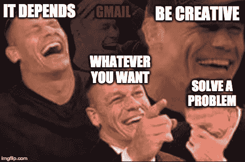
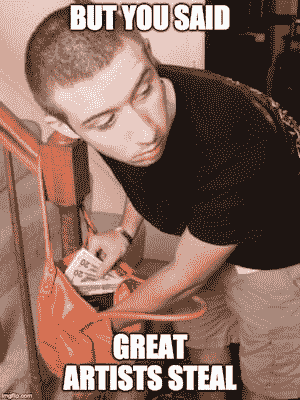
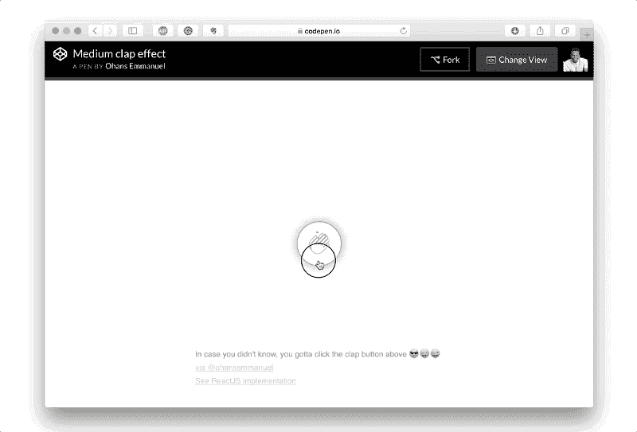
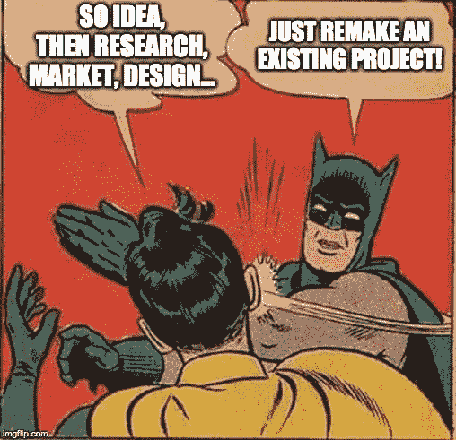
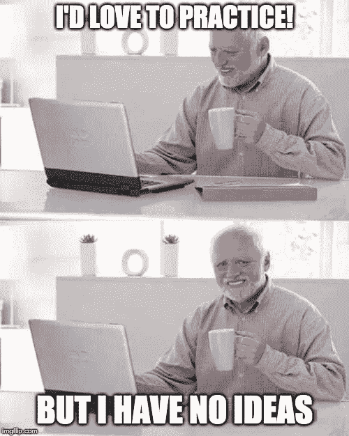

# 编码项目无限创意的秘密

> 原文：<https://www.freecodecamp.org/news/the-secret-to-unlimited-project-ideas/>

作为一名开发人员，实践对您持续的专业成功至关重要。

网络发展很快。仅仅一两年的满足感就会让你吃 JavaScript 的灰尘。

然而，许多开发人员不顾经验，疯狂地问:“我应该做哪个项目？”

...却收到了这些神秘的答案。

为了防止这种情况发生，我想分享一些对我非常有益的建议。

## 复制——直到你可以创建

考虑下面的引用...

> 好的艺术家临摹；伟大的艺术家偷窃。-巴勃罗·毕加索

这并不意味着抢劫你的父母。

意思是，*当你在练习*的时候，不要被原创的想法所困扰。只是复制一些东西，专注于完善你的技术！

您可以逐行重写源代码，完全独立地完成，或者介于两者之间。

## 每个人都在做

有抱负的艺术家和作家一直在抄袭。无论是重画还是改写，模仿一个著名的作品都是一个打开思维的练习。你可以让自己沉浸在这门手艺中，而不用担心如何构思一个好主意。所有的注意力都集中在提高你的技能上。

这也适用于编程！我和许多其他开发人员复制开源回购协议只是为了了解它们是如何工作的。你会发现以前从未遇到过的技术。

Emmanuel Ohans 在其鼓舞人心的 Medium Clap 文章中将这一原则发挥到了极致。他在复制了无数 Codrops repos 之后，想出了如何设计自己的项目。

这不是剽窃原创作品，而是提高你的技术，从别人那里汲取灵感。

## 你如何能做它

找到您想要复制的项目，然后选择一个选项...

1.  逐行复制它的源代码
2.  只有在遇到困难的时候才看源代码
3.  100%由你自己重新创造
4.  做点什么吧！

所有的选择都是有效和有益的。当你完成这个项目时，研究任何你觉得令人困惑的语法/模式。

## 原始=最后编码

如果你只是通过原始想法来练习，这将是你的工作流程。

1.  想起了什么
2.  研究
3.  规划
4.  营销
5.  设计
6.  开发(**最后一步**)

在我看来，这相当浪费，除非你在经营一家初创公司。

## 复制=先编码

对于那些*只想编码*的人来说，可以考虑这个过程。

1.  编写一个你感兴趣的现有应用程序

就是这样！该流程现在与我们的目标相一致。我们现在一直在发展，而不是在最后发展。

想法、研究、规划和设计都得到了考虑。我们可以关注好的方面，不像可怜的哈罗德。

他永远不会进步，因为他停留在想法阶段。不要犯他的错误！把你的资源花在实践上，而不是产生想法。

如果那是你的目标，至少。？

## 想要免费辅导？

如果你想安排一个**免费的** 15-30 分钟的电话，讨论关于代码、面试、职业或任何其他方面的前端开发问题[请在 Twitter 上关注我，并给我发短信](https://twitter.com/yazeedBee)。

之后，如果你喜欢我们的第一次会议，我们可以讨论一个持续的教练关系，这将有助于你达到你的前端发展目标！

## 感谢阅读

更多类似的内容，请查看[https://yazeedb.com！](https://yazeedb.com)

下次见！