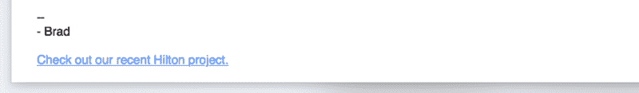
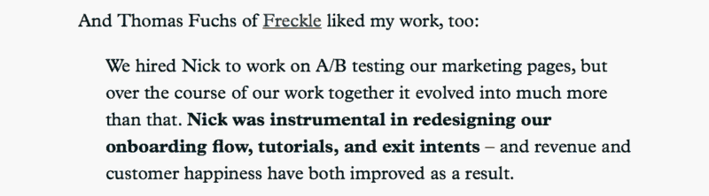
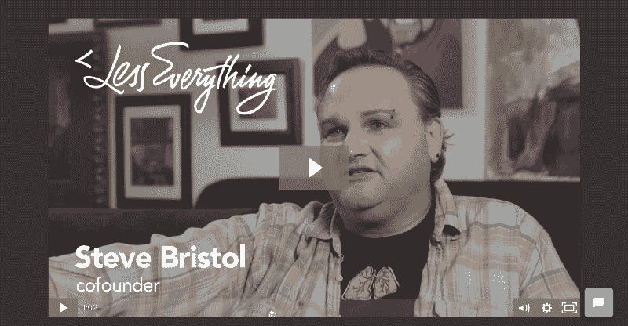

# 被聘为自由职业者归结为一点:信任。

> 原文：<https://www.freecodecamp.org/news/the-single-biggest-factor-in-a-clients-decision-to-give-you-a-project-3a9b3defac15/>

到 2005 年，我退出了媒体

# 被聘为自由职业者归结为一点:信任。

当我问自由职业者，他们认为获得客户项目最重要的因素是什么时，他们通常会回答:

*   经验丰富
*   拥有优秀的投资组合
*   熟悉最新的工具

但是这些考虑是次要的。归根结底就是一件事:信任。

当客户决定雇佣你时，信任是最重要的。你能被信任交付高质量的工作，满足最后期限，最重要的是，不拿走他们的钱吗？

这是他们每次问你问题时真正在问自己的问题。

回想一下你最后一次用辛苦赚来的钱买一双鞋、在餐馆点餐或做任何决定的时候。

你在寻找最佳选择。你寻找线索来帮助你对你的决定感觉良好。

#### 要建立信任，你必须深刻理解客户的恐惧。

就像你买了最后一双耐克一样，你的客户也想知道他们做出了正确的决定。

你的工作就是帮助他们相信他们做到了。

客户害怕他们会选择一个不称职的自由职业者。他们雇佣的人不适合这份工作。或者见鬼，他们会彻底被骗。

让这些恐惧完全消失，你会让自己更容易得到这份工作。

一旦有了信任，剩下的就自然而然了。

你提交的第一个模型突然有了潜力。你的过程突然展现出一种专业的气息。即使你错过了最后期限，事情也会顺利得多，因为他们会相信你知道自己在做什么，并且会尽可能快地工作。

#### 尽可能多地展示你的可信度，就像你展示你的技能和过去的工作一样。

当我查看自由职业者的投资组合时，他们中很少有人被优化成表现出*可信度*。

据我所知，每个设计师和开发人员都沉迷于他们的设计和代码——但他们中不到十分之一的人花时间考虑他们的投资组合在客户面前有多可信。

如果你花更多的时间思考如何最好地向客户展示他们可以信任你，你会得到更多潜在客户的回电，最终会有更多的推荐。

那么如何沟通信任呢？以下是一些关键方法。

#### 突出最容易辨认的过去客户的名字，这是你能处理重要项目的最好信号。

你的工作本身就是证明你可以被信任的第一步。这表明其他公司过去信任过你，他们这样做是正确的。

不要犯按工作类型组织作品集的错误。取而代之的是，按客户组织，并突出公司名称。

**举例:**

Brad Smith of [Codeless Interactive](http://codelessinteractive.com) highlights a recent Hilton project at the bottom of his emails. This makes clients think, “Wow, Brad’s working with Hilton? I’m sure he can handle my project.”

#### 使用过去客户的真实证明，而不是容易忘记的标语。

当我浏览自由职业者的作品集时，我只找到了几个他们选择突出客户报价的作品。这是一个错误。

如果你过去的客户对你的工作很满意，确保你在你的网站上强调他们这样说。

不要害怕要求证明。没有客户会说你给他们做了一个蹩脚的商标，因为这意味着承认他们的商标是蹩脚的。大多数客户会很乐意提供热情洋溢的证明。

不要使用模糊的通用标语，如*“我制作了漂亮和可用的网站，诸如此类的东西，”*展示一个满意的客户的真实报价要有力得多。

**举例:**

[Nick Disabato’s Draft Revise](https://draft.nu/revise/) is a great example of using text and testimonials of satisfied customers to build trust.

#### 创建教育指南，让自己成为专家。

除了你提供的代码或设计工作，客户还会为你的想法买单。

通过教育内容与客户分享这些想法，客户可以在自己的时间内使用这些内容。如果他们实现了你的一些东西，并且提供了真实的结果，这只会让你的服务更值得信赖。这也表明你是这个行业的积极分子。

**举例:**

[Eric Davis of LittleStreamSoftware](http://www.littlestreamsoftware.com/guides/) uses educational content to make you come back to his site and recognize him as an expert.

#### 最后但同样重要的是，附上一张你值得信任的脸的照片或视频。

让客户相信你值得信赖的最好方法是亲自与他们见面。但是，如果你是远程工作，不能证明旅行费用(或获得签证)。

您可以通过向客户提供通过 Skype、Hangouts 或其他视频聊天平台与您见面的机会来克服这一限制。给他们一个微笑！

不过，在你们的关系发展到这一步之前，你会希望附上你的照片和一份简短的简历——或者更好的是一段视频——让你的客户觉得他们得到了很好的照顾。

**举例:**

[Steve Bristol of LessEverything](http://lesseverything.com) uses a casual, yet informative video to “meet” potential clients virtually.

#### 建立信任的自由职业者网站的更多例子。

我整理了一份我在网上找到的 20 多个建立信任的自由职业者网站的清单。

好奇想看看他们长什么样？

点击此处，我将免费向您发送整个列表。

你还会定期收到像这篇文章一样的关于改善你的业务的文章。

*感谢[萨夏·格雷夫](https://www.freecodecamp.org/news/the-single-biggest-factor-in-a-clients-decision-to-give-you-a-project-3a9b3defac15/undefined)帮我写这篇文章。*