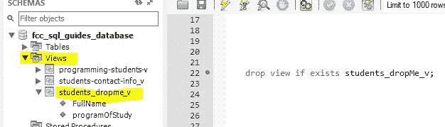

# 用于从表中删除数据的 SQL Drop View 语句

> 原文：<https://www.freecodecamp.org/news/the-sql-drop-view-statement/>

### 介绍

本指南介绍了用于删除一个或多个视图对象的 SQL 语句。

视图是表示一个或多个表中的数据的对象。

注意:在删除或更改数据或对象之前，请记得进行全新备份。

我们将涵盖:

*   使用 SQL 删除表
*   使用工作台删除视图

我们将使用 MySQL 进行演示。在其他数据库管理器中查看该功能的手册。

我们将删除名为`students_dropMe_v`的视图，它就是为此目的而创建的。

### 基本语法

```
DROP VIEW [IF EXISTS]
    view_name [, view_name] ... 
```

### 删除视图 SQL

如果视图不存在，if exists 部分将“捕获”错误。

```
drop view if exists students_dropMe_v; 
```

创建后的视图:



### 使用工作台

从工作台中:

1.  右键单击要删除的视图
2.  从菜单中选择“删除视图”
3.  选择 a)运行 SQL 以查看要执行的 SQL 语句，或者 b)删除新语句

*与所有这些 SQL 内容一样，它们比本入门指南中的内容要多得多。我希望这至少能给你足够的时间开始。

请参阅数据库管理器的手册，并亲自尝试不同的选项。*

### 额外的

下面是我用来创建我们刚刚删除的表的 SQL:

```
create view `students_dropMe_v` as
select FullName, programOfStudy 
from student 
where programOfStudy = 'Programming'; 
```