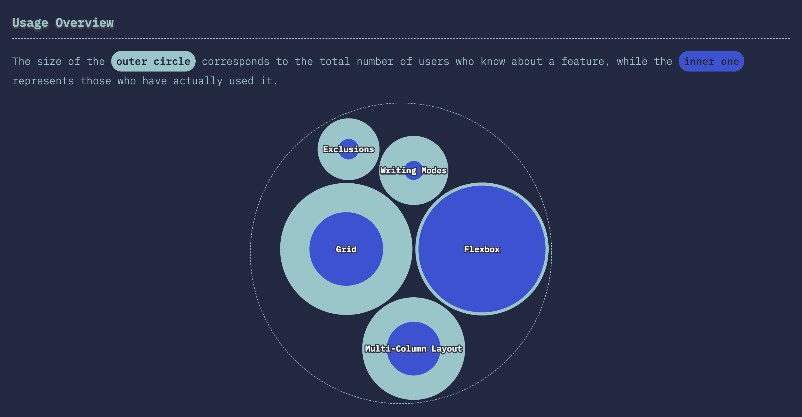
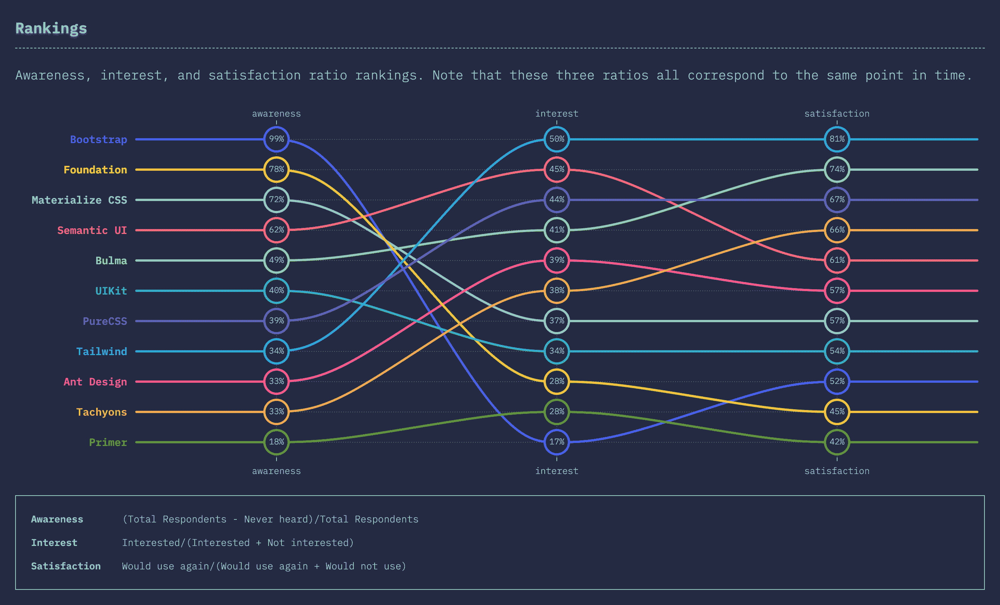
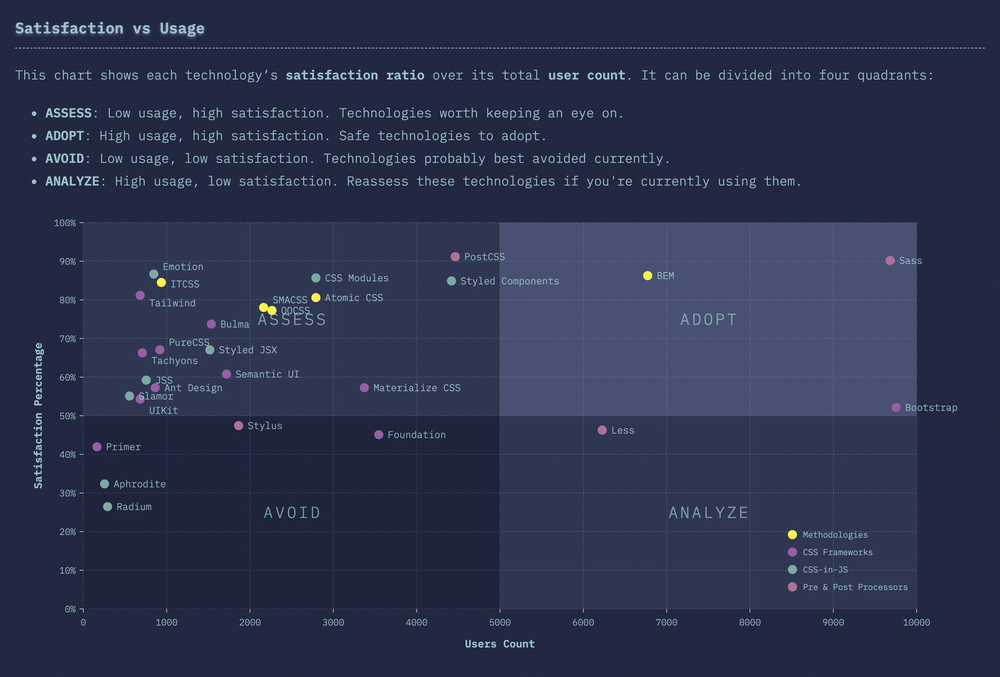
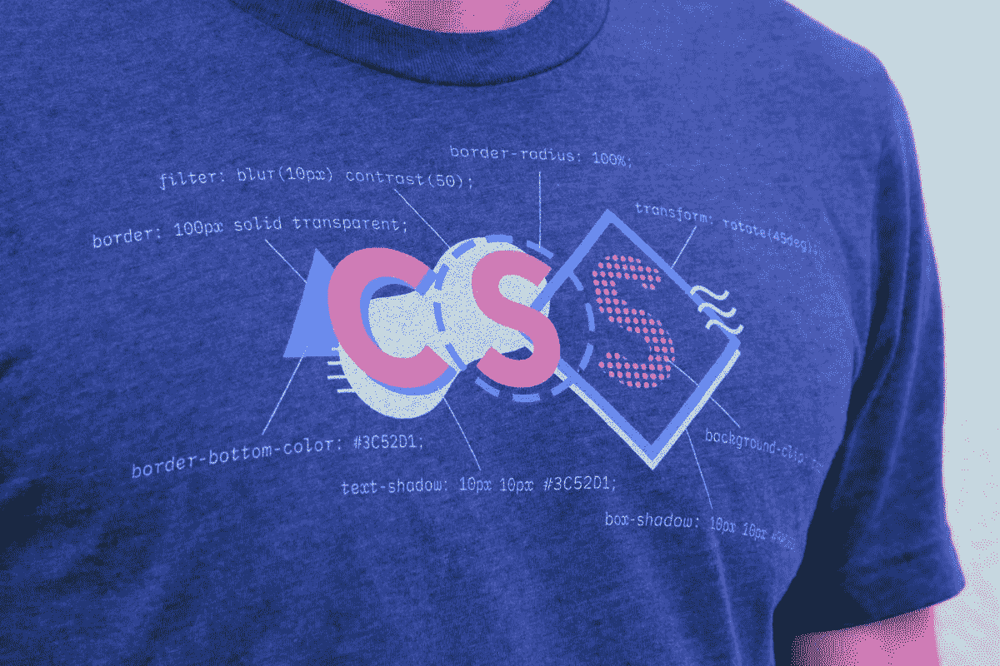
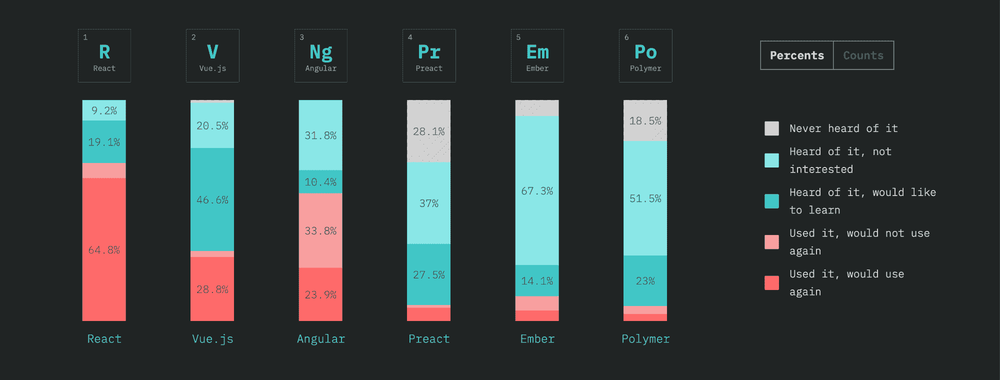

# CSS 2019 的状态

> 原文：<https://www.freecodecamp.org/news/the-state-of-css-2019-survey-results-are-live/>

### 我们调查了超过 11，000 名 CSS 开发人员。这是我们学到的。

* * *

### ？➡️ [查看调查结果](http://2019.stateofcss.com)

* * *

## 故事

这一切都始于三年前，当时我面临一个艰难的选择:决定下一步学习哪个 JavaScript 库。选择错误的选项可能意味着在一个注定失败的技术上投入数百个小时，所以我想在承诺一个新的框架之前我应该四处问问。

询问变成了发起一个小的开发者调查，这反过来引起了社区惊人的兴趣。一晃三年过去了，我们现在进入了第三次 JavaScript 状态调查，调查对象超过 20，000 名开发人员！

但是随着调查深度和长度的增加，我们也意识到网络生态系统的复杂性。虽然 JavaScript 是其中很大的一部分，但绝不是唯一的一部分。

这就是为什么横向扩展到新领域才有意义，首先是 CSS，也就是 JavaScript 的死敌和/或最好的朋友，这取决于你问谁。

经过几个月的数据处理和可视化，我很高兴终于能够与你分享有史以来第一次 CSS 调查结果的状态！

## 趋势

我当然鼓励你查看完整的结果，但与此同时，这里有一些我们在查看数据时注意到的趋势。

### Flexbox“赢了”…但是能持续多久呢？

Layout Features Overview

虽然 Flexbox 和 CSS Grid 都有接近完全的知名度(换句话说，每个人都知道它们是什么)，但有趣的是，只有大约 55%的开发人员真正使用过网格。

这可能有几个原因。Flexbox 已经存在很长时间了，它出现在我们迫切需要浮动布局的时候。此外，网格不可否认稍微复杂一点(但也更强大！).

事实是，Grid 和 Flexbox 各有利弊，它们都应该是开发人员工具箱的一部分。因此，如果这两个圈在未来几年变得更加相似，我们也不会感到惊讶！

### 实用至上的 CSS 正在兴起；Bootstrap 不景气

Ranking CSS frameworks for awareness, interest, and satisfaction

多年来 [Bootstrap](https://getbootstrap.com/) 是 UI 框架中无可争议的王者。这清楚地显示在我们的数据中，高达 99%的**受访者意识到了这一点。在认知度方面，没有其他竞争对手与之接近，第二好的[基金会](https://foundation.zurb.com/)排名第一 **79%** 。**

**这种高认知度与低兴趣率相对应并不奇怪，因为出于某种原因尚未使用 Bootstrap 的开发人员可能并不热衷于现在开始。更令人担忧的是相对较低的满意度，仅为 52%。**

**与[顺风](https://tailwindcss.com/)相比，顺风**的满意度高达 81%** ！它的认知度分数可能很低(只有 **34%** 的受访者知道它)，但它让用户非常开心，这是最重要的因素。紧随其后的是 **74%** 的[布尔玛](https://bulma.io/)，它与顺风有很多相同的“实用优先”理念。**

**我们是否正在从像 Bootstrap 这样的庞大、单一的框架转向像 Tailwind 这样更加灵活、随心所欲的库？无论如何，在接下来的几年里关注这一趋势肯定会很有趣。**

### **CSS 领域仍然有很多不确定性**

**

Plotting satisfaction percentages vs user counts** 

**上面的 CSS 技术图表分为四个象限，正如您所看到的,“评估”象限(对应于用户数量少但满意度高的新兴技术)是目前最繁忙的。**

**事实上，在“采用”象限中只有三种“成熟的”技术(高使用率、高满意度):BEM、Sass 和 Bootstrap。Bootstrap 正危险地接近脱落…**

**这表明 CSS 世界中的事情仍然在不断变化，对于一个已经存在了这么长时间的生态系统来说，这可能是令人惊讶的。但这毕竟是 web 开发的世界:当你认为你终于弄明白了的时候，一些新的东西出现了，让你质疑你认为你知道的一切！**

## **还有一件事…**

**今年我们正在尝试一些新的东西:我们将推出一款官方的 CSS t 恤！**

**

Learn CSS and look good in the process!** 

**t 恤上有我们的 CSS 标志，以及一些用来制作它的实际代码。你还能在哪里找到一件看起来很酷的衬衫，同时还能教你(和周围的任何人！)关于 CSS 的奇妙之处？**

**你现在就可以用 24 美元以上的运费买到这件衬衫，这将有助于我们为这项调查和其他调查的未来工作提供资金。**

## **了解 JavaScript 的现状**

**说到其他调查，如果你还没有的话，你应该看看我们的 [2018 年 JavaScript 状态](http://2018.stateofjs.com)调查结果。我们保证你会学到一两件事！**

**

The State of JavaScript 2018** 

## **更改日志中 CSS 的状态**

**如果你是一名播客听众，请留意我在[Changelog](https://changelog.com/)上的出现，在那里我会更多地谈论数据，解决一些关于我们数据收集过程的争议，并让你了解我们技术栈的幕后情况。**

## **敬请关注**

**最后，如果你想确保你不会错过参加即将到来的调查的机会(或者知道我们何时发布额外的数据)，一定要注册我们的(非常罕见的)[邮件列表](https://stateofcss.com)。毕竟，我们的受访者越多，我们的数据就越有用！**