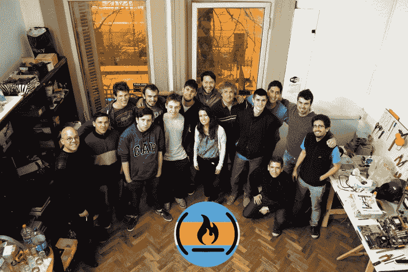

# GraphQL 的稳步上升

> 原文：<https://www.freecodecamp.org/news/the-steady-rise-of-graphql-27b14e938164/>

今天 GitHub 宣布他们 API 的下一个版本将使用脸书开发的新技术 GraphQL。

GraphQL 最终可能会取代当今最常见的 API 类型 REST API。

在他们的 API 新版本的文档中，GitHub 解释道:

> “GitHub 正在将我们的 API 迁移到 graph QL v4，因为它为我们的集成商提供了更大的灵活性。与 REST API v3 端点相比，精确定义您想要的数据的能力——并且仅*定义*您想要的数据——是一个强大的优势。

> “GraphQL 是一种思考构建和查询 API 的新方法。与其构造几个 REST 请求来获取您感兴趣的数据，您通常可以通过一个调用来获取您需要的信息。

我们已经写了很多关于 GraphQL 的文章，并计划在不久的将来创建一些 GraphQL 课程。

同时，如果您想了解更多关于 GraphQL 的知识:

*   阅读 GitHub 开发者 David Celis 的“休息一下:为你的 API 使用 graph QL”([5 分钟阅读](https://fcc.im/2rMtF22))
*   阅读 JavaScript extra ordinaire Sacha Greif 的“那么我一直听到的 GraphQL 是什么？”( [12 分钟读数](http://bit.ly/2pqamdH))

### 这里有三个值得你花时间的链接:

1.  如何从业余爱好者变成专业开发人员( [14 分钟阅读](https://fcc.im/2r03UPp))
2.  连线之间:采访数据可视化科学家艾琳·罗斯( [15 分钟阅读](https://fcc.im/2q4pemM)
3.  用 JavaScript 解析数学表达式( [11 分钟读取](https://fcc.im/2qaDIh4)

### 想到这一天:

> "布尔运算最大的好处是，即使你错了，你也只错了一点点."—匿名

### 今日趣事:

[网络漫画 by 乱七八糟的偶然](https://fcc.im/2qISwpO)

### 今日学习小组:

布宜诺斯艾利斯自由代码营

编码快乐！

–昆西·拉森，自由代码营的老师

如果你从这些邮件中获得了价值，请考虑[支持我们的非营利组织](http://bit.ly/donate-to-fcc)。