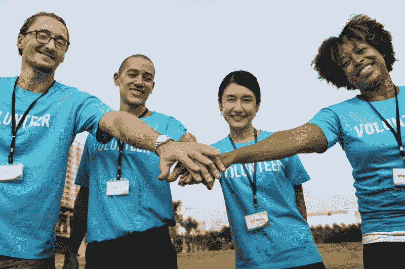

# 我如何在自学后的 11 个月内获得第一份带薪软件开发工作

> 原文：<https://www.freecodecamp.org/news/the-story-behind-how-i-got-my-first-paid-software-developer-job-within-11-months-of-self-learning-d11cf171532c/>

作者:Akogwu Uche

# 我如何在自学后的 11 个月内获得第一份带薪软件开发工作

by [Trust "Tru" Katsande](https://unsplash.com/@iamtru?utm_source=medium&utm_medium=referral) on [Unsplash](https://unsplash.com?utm_source=medium&utm_medium=referral)

从大学时代起，我就一直想学习如何编程，但我没有足够的财力来实现这个梦想(或者我是这么认为的)。每次我去信息技术学院询问编程课程时，我都会被贴上天价标签，这将使我失去兴趣，并使我怀疑学习如何编程的可能性。

但是，在我大学毕业后不久，我有 8 个月的时间在我的国家尼日利亚开始强制性的国家青年服务。所以我决定利用空闲时间学习软件开发。我终于设法筹集到了我所在地区一家教授 web 开发的机构所需的确切费用。但是，我有另一个问题。我没有个人电脑。？

#### **信仰的飞跃**

我看着几个月过去了，一年义务国民青年服务的时间到了。我知道我必须想出另一个计划，再次尝试在软件开发领域发展事业。所以，我决定找一家软件开发公司，让我在服务期内实习。

幸运的是，我在 HotNigerianJobs.com 上找到了一份招聘广告，招聘一名愿意学习软件开发的实习生。我知道这是我一直在等待的机会，所以我立即申请了。经过几次测试后，我被邀请参加面试，我未来的雇主在对我进行评估后，决定当场给我一份工作。只有一个条件。

我在服役期间不会得到任何报酬。但是，在年底，他们会决定留住我，如果我证明了自己，会给我一份合同。在告诉自己我能做到之后，我点头表示同意。？

#### 自学之路

我开始实习，在我的第一天，我看到了我应该遵循的学习计划。原来堆栈是 ASP.NET(用 VB。但在此之前，我必须从学习 HTML 和 CSS 的基础开始。

当我听说在整个学习过程中没有人用勺子喂我时，我也很震惊。？

我期望有一个课堂环境，我得到了一个 W3Schools 的链接来阅读、练习，并在我发现模糊之处提出问题。

我被要求建立一个关于我自己的简单网站，作为我第一周学习 HTML 和 CSS 的成果。我几乎放弃了，因为我不明白一些概念，每个人似乎都很忙。

第一天之后，我知道我需要额外的帮助。所以我和三个最年轻的程序员交了朋友，我可以毫不费力地与之相处。这些人帮我解释了一些概念，我学到了足够的知识来建立我的个人网站。

这是我在软件开发旅程中的第一次胜利。我为自己建造的一切感到骄傲。我向所有关心我的人展示了我的第一个网站。我的老板看到了这一点，并决定我应该更快地进入后端。我的辅导员提供了一些关于 SQL 和 VB.NET 的资源供我使用。

SQL 更容易，因为它基本上像英语。这种语言、它的语法和它的概念对我来说更容易掌握。开始熟悉微软 SQL Server 和微软 Visual Studio(微软的集成开发环境)。

我开始做一些后端的工作。我从创建几个页面开始。我的辅导员会构建一个具有特定功能的页面，并向我解释代码在做什么。然后，他会给我类似的事情做。

我意识到我可以复制和粘贴代码，并在这里和那里做一些操作来实现结果。很明显，这是我一直以来的计划，这样我就可以为项目做好准备。幸运的是，我非常了解这门手艺，这让我的老板很高兴。但事实证明我错了！

#### 错误的方式

我似乎很快就适应了，成为了下载现成网站模板并进行编辑的专家。但是，我不停地告诉自己，有些东西没有加起来，因为我不明白一些概念。

by [NeONBRAND](https://unsplash.com/@neonbrand?utm_source=medium&utm_medium=referral) on [Unsplash](https://unsplash.com?utm_source=medium&utm_medium=referral)

我的朋友来帮忙了。他们告诉我，VB.NET 是一种过时的语言和开发者堆栈。我需要一个合适的学习途径。他们鼓励我制定计划，在服务一年后离开公司，如果我想成为世界级的开发人员，就专注于学习 web 开发的基础知识。他们说的很有道理，因此我被介绍给了 freeCodeCamp.org 和 CodeCademy。

#### 范式转变

在我接触了 freeCodeCamp 上的 HTML、CSS 和 Bootstrap 课程后，我意识到我一直在浪费大量时间寻找一个机构或某人来教我 web 开发。我立刻有了一个想法的转变，我断定任何人都可以学习 web 开发。

让我一直惊叹的是，freeCodeCamp 的资源是绝对免费的。通过适当的研究，你会在网上找到更多惊人的网络开发资源。

我很快参与了 freeCodeCamp 的建立一个致敬页面的挑战，我自己也很惊讶。我在社交媒体上与所有人分享了这个网页，我得到了好评，这提升了我的自尊，激励我做更多的事情。

#### 开发者社区的重要性

在我的软件开发旅程中，一个重大的游戏改变是当我办公室的一个朋友向我介绍了[安德拉学习社区](https://andela.com/alc/) (ALC)并敦促我申请“ALCwithMicrosoft”前端 web 开发课程。

by [rawpixel](https://unsplash.com/@rawpixel?utm_source=medium&utm_medium=referral) on [Unsplash](https://unsplash.com?utm_source=medium&utm_medium=referral)

他说，如果我被选中，我将获得奖学金，学习三个月的前端 web 开发。

所以，我申请了，写了一个测试，并被选中参加这个课程。？

因为我已经学习了 HTML、CSS 和 Bootstrap 的课程，所以对我来说，继续学习这个领域的新知识很容易。挑战在于 JavaScript、JQuery 和 NodeJS 的介绍。我又麻木了，开始怀疑自己，我想他们称之为“冒名顶替综合症”。在老板的压力下，我努力完成了课程，以达到预期的工作效果。

### 真正的游戏规则改变者

但是真正改变游戏规则的是那个把我介绍到安德拉学习社区的朋友告诉我关于安德拉奖学金的事情。我了解到他们如何招募潜在的软件开发人员，并在六个月内将他们变成世界级的开发人员，同时付钱让他们学习和磨练技能。

by [Octavian Rosca](https://unsplash.com/@tavi004?utm_source=medium&utm_medium=referral) on [Unsplash](https://unsplash.com?utm_source=medium&utm_medium=referral)

我记得安德拉的工作环境有多美，他们组织的 ALCwithMicrosoft 课程有多美。所以，我决定我需要成为一名安德兰人，这样我就可以成为一名世界级的开发人员。这句话成了我的目标和动力。

我发现安德拉奖学金项目的申请正在进行中，所以我申请了。

安德拉允许潜在的申请人访问他们的家庭研究课程，教授软件开发的基础知识。

对于像我这样没有计算机科学学位的人来说，这门课程特别有用。

我很快就接触到了它，并被引导到 CodeCademy 的 JavaScript 入门课程。在我被介绍给[Maximilian Schwarzüller 的 2016 年 Javascript Bootcamp](https://www.udemy.com/javascript-bootcamp-2016/) 课程之前，这门课程在教我 Javascript 的基础知识方面真的很有帮助，它帮助我揭开了 JavaScript 的神秘面纱。我还继续在 freeCodeCamp 上学习 Javascript，并阅读像[雄辩的 JavaScript](https://eloquentjavascript.net/) 和[你不知道的 JavaScript](https://github.com/getify/You-Dont-Know-JS) 这样的书来加深我的理解。

### 牺牲

在我服务年结束的前几周，我收到了老板的合同文件，提供给我一份公司的全职工作。但我真的不喜欢合同条款，而且，我已经在安德拉的招聘周期中陷得太深了。

所以我很有礼貌地拒绝了他的邀请并递交了辞呈，这样我就可以专心学习并利用安德拉的招聘周期。

我的朋友和亲戚对我拒绝永久工作邀请感到震惊，因为我工作非常努力。他们不明白为什么我需要经历另一系列密集的面试，而且不能保证之后能找到工作。

但是，我已经下定决心了。所以我尽可能地向他们解释了我做出这个决定的原因。在经历了安德拉招募周期的各个阶段后，我进入了最后一个阶段，那就是为期两周的训练营。

#### 一个全新的世界

安德拉预计，候选人应该能够在四周内构建一个完整的 JavaScript 应用程序:两周不在现场，剩下的两周在客户那里。

在 Bootcamp 之前，我没有用 JavaScript 在后端做过任何事情，也从未想过我能够在四周内构建一个完整的堆栈应用程序，并遵守他们的所有要求:ESlint、Airbnb 风格指南、JavaScript ES6 语法(现代 JavaScript)、TravisCI、代码覆盖、测试驱动开发和 GitHub 工作流。

冒名顶替综合症又回来了，并战胜了我。一切发生得太快了。我经历了一段艰难的提升期，所以我没有入选训练营的最后一周。

#### 成功或失败季节

没有时间感到悲伤或失望。我问我的学习辅导员助理(LFA)Temmy Ogunbo，为什么我没有被选中。他告诉我，唯一的问题是我无法解释我的代码，因为我的理解不够深入。

我意识到他说的是实话，因为我刚刚学到了足够的知识来构建这个项目，而且我没有费心去理解这些概念。他指导我在 Coursera 上学习了一门课程，名为 NodeJS、Express 和 MongoDB 的服务器端开发。

我发现这门课程只有七天是免费的，所以我必须确保在这七天里我学到了足够的东西。该课程加深了我对 NodeJS、Express、HTTP Web 服务、API 和数据库的理解。

我还得知了一个移动网络专家课程的 ALCwithGoogle 非洲挑战奖学金。我立即申请，并在筛选后被选中。课程内容正是我当时需要的:渐进式 web 应用、现代 JavaScript、ES6 JavaScript 入门。

安德拉总是在招聘，这让我在再次申请之前集中精力提升自己。我最终申请了他们的第 35 期奖学金，并再次进入了训练营。这一次，在我的两个学习辅导员助理 Rachel 和 Temidayo 的正确指导下，我为所有的障碍和挑战做了更好的准备。

我被选中并收到了“欢迎来到安德拉电子邮件”。从那以后，我的快乐因为完成了生活和事业中的一个主要目标而变得无止境。

在开始学习软件开发的 11 个月内，我得到了梦想中的软件开发员工作。我希望这能激励任何想开始自己的软件开发之旅或转行的人。如果你愿意为此付出代价，一切皆有可能。

### 在我的自学旅程中学到的东西

如果我不概述一下我在过去 11 个月自学软件开发时学到的一些经验，我不认为我的故事会激励一些人。所以他们在这里:

1.  网上有免费的资源来帮助学习网络开发。从在谷歌上键入“2018 年如何学习 web 开发”开始，明智地选择你的资源。你可以谷歌一下，找到任何东西。
2.  **选择一条你觉得舒服的学习路线**。我更好地理解了实践学习，同时学习和构建，这就是 freeCodeCamp、CodeCademy 和 W3Schools 能给你的。始终阅读文档并理解概念，因为这将有助于加深您的理解，从而帮助您向他人解释您的代码。
3.  **学习一项技术时，永远从基础开始。**学习 web 开发，先从 HTML，CSS，JavaScript 开始。你不是从屋顶开始盖房子，而是从地基开始。
4.  没有导师和榜样，你不会在软件开发中走得很远。导师是一个愿意一步一步指导你的人，而且是你可以接触到的人。另一方面，榜样是这样一种人，他的生活、故事、推文和帖子将激励你成为一名更好的软件开发人员——但他们不需要亲自了解你。从有一个导师开始(我有三个)，因为你会站在他们的肩膀上看得更远，得到更快的解决方案。
5.  你需要一个开发者社区。许多信息在开发者社区中传播。技术人员很棒，很棒，非常支持。这个社区可以让你接触到其他技术人员，并对他们的软件开发之旅有一个初步的了解，从而让你有机会获得潜在的指导。
6.  有一个目标或愿景。我很早就知道，如果你不把你的学习和一个目标联系起来，那么你会耗尽精力并放弃。学习软件开发最简单的目标是“在 6、7 个月内找到一份初级软件开发员的工作”，一旦你能用 HTML、CSS 和 JavaScript 创建一个网页，就开始申请工作。不要等到你成为职业选手，因为我知道没有人在他们的职业生涯中是真正的职业选手。我们只是有更多经验丰富的开发人员，而你只能在从事现实生活中的项目时获得经验。最好的学习方式是，当你被付费学习时，你可以接触到一个技术团队，他们可以回答你的问题，澄清不明确的地方。
7.  你需要坚持不懈，不断超越错误和冒名顶替综合症。当然，错误和冒名顶替综合症是开发人员生活的一部分。每个软件开发人员都会经历这些。最简单的方法是永远记住你的小胜利——你过去解决的问题和错误，以及你建立的项目。作为开发人员，他们有办法激励我们做得更多，付出更多。学习 Git 和 GitHub，这样你就可以一直托管你的代码和项目，它会帮助你更快地访问它。
8.  在安德拉，“问问题”和“寻求反馈”是成为伙伴关系所需的两项技能。所以我在这里再次重申。**当你遇到阻碍、错误或挑战时，只需提问**。这就是导师制度派上用场的地方。很有可能你的导师以前遇到过这种阻碍，你将利用他们丰富的知识，在几分钟内清除你的阻碍。

最后，要知道会有拒绝和失败，但都没有你的目标重要。目标应该是学习并成为世界级的软件开发人员。每一次拒绝或失败都应该教会你一些积极的东西。当你被拒绝时，寻求反馈并根据反馈采取行动。永远记住，他们拥有他们的工作，但你拥有你的学习。在安德拉，我们称之为 YOYO(你拥有你自己的)。

#### 赞赏和致谢

Photo by [Unsplash](https://unsplash.com?utm_source=medium&utm_medium=referral)

感谢 freeCodeCamp。我打算在拿到薪水后捐出一部分薪水？这样别人就可以利用你惊人的免费资源。

我要感谢我的妈妈和姐姐，他们一直为我提供经济来源，让我坚持学习，我还要感谢我的朋友和同事，他们支持我，给我正确的方向:Ibrahim、Sidiq、Dika 和我在 Softbase Technologies 的老板，非常感谢。没有你的帮助，这是不可能的。

在结束这篇文章之前，我必须感谢 Andela 提供了一个精彩的学习社区，以及他们为非洲人成为世界级软件开发人员提供的机会。才华是平均分配的，但机会却不是。立即寻找机会成为 Andela 的世界级软件开发人员。他们总是在招人。