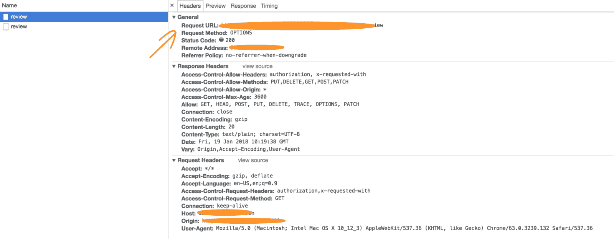
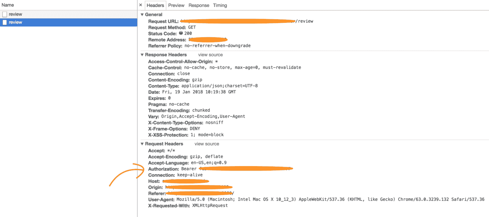
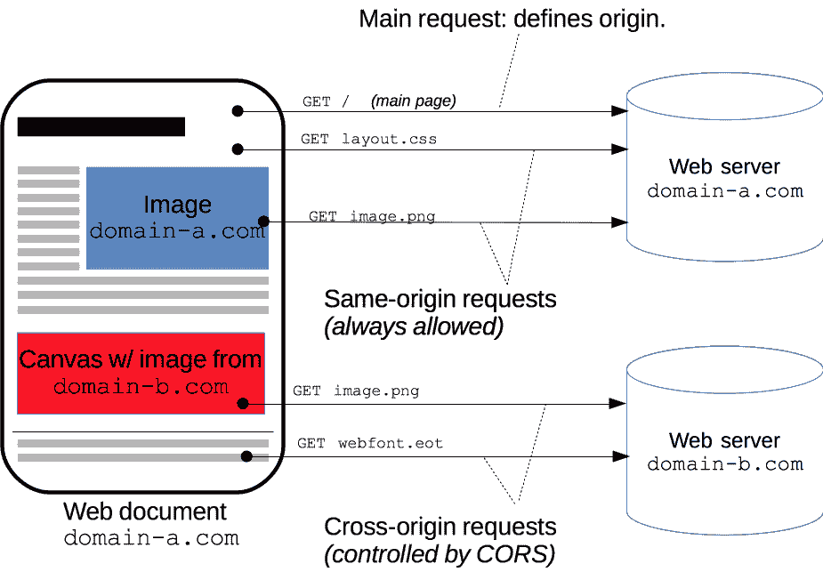

# 两次请求的故事 Story

> 原文：<https://www.freecodecamp.org/news/the-story-of-requesting-twice-cors/>

两次请求的故事，请允许我解释这一切是如何开始的。

在处理一个特性时，我决定查看 network 选项卡，并注意到第一个请求是用方法选项发送的，随后的请求是用正确的方法(如 GET、POST 等)发送的，这将返回预期的有效负载。基本上是同一个请求的两个调用。

请看下面的屏幕截图

Request with OPTIONS method

Request with GET method

在查阅了一些文献后，我意识到这是一种意料之中的行为。它与 HTTP 访问控制(CORS)的概念相关。

为了更好地理解它，让我解释一下 CORS 和请求。

### HTTP 访问控制(CORS)

跨源资源共享( [CORS](https://developer.mozilla.org/en-US/docs/Glossary/CORS) )是一种机制，它使用额外的 [HTTP](https://developer.mozilla.org/en-US/docs/Glossary/HTTP) 报头，让[用户代理](https://developer.mozilla.org/en-US/docs/Glossary/user_agent)获得从不同源(域)的服务器访问选定资源的许可，而不是当前使用的站点。

Cross-Origin Resource Sharing ([CORS](https://developer.mozilla.org/en-US/docs/Glossary/CORS "CORS: CORS (Cross-Origin Resource Sharing) is a system, consisting of transmitting HTTP headers, that determines whether to block or fulfill requests for restricted resources on a web page from another domain outside the domain from which the resource originated."))

让我们通过上面的图片来更好地了解 CORS。

1.  ****同源请求:**** 我们已经打开了**，在这里我们请求一个 ****蓝色图片**** 托管在****domain-a.com 的 web 服务器上。**** 由于我们是在同一个域中执行我们的请求，所以称之为同源请求。**
2.  ******跨原点请求:**** 我们已经打开了**，在这里我们请求一个**的红色图片托管在****domain-b.com 的 web 服务器上。**** 由于我们是在不同的域中执行我们的请求，这被称为跨源请求。******

### ****简单的请求****

**这些请求不会将它的第一个请求作为方法选项发送。它只发射一次。**

**当然它回避了这个问题，为什么第一个请求会有方法选项，如果我们不发送它，请耐心等待。这将在☺飞行前部分解释**

**但在此之前，让我们了解是什么使请求变得简单。**

1.  **简单请求中唯一允许的方法是:**

*   **[获取](https://developer.mozilla.org/en-US/docs/Web/HTTP/Methods/GET)**
*   **[头](https://developer.mozilla.org/en-US/docs/Web/HTTP/Methods/HEAD)**
*   **[发帖](https://developer.mozilla.org/en-US/docs/Web/HTTP/Methods/POST)**

**2.除了由用户代理自动设置的报头(例如，连接、[用户代理](https://developer.mozilla.org/en-US/docs/Web/HTTP/Headers/User-Agent)，或任何其他在获取规范中定义为“禁止报头名称”的报头)，唯一允许手动设置的报头是[那些被获取规范定义为“CORS 安全列表请求报头”](https://fetch.spec.whatwg.org/#cors-safelisted-request-header)的报头，它们是:**

*   **接受**
*   **接受语言**
*   **内容语言**
*   **内容类型**
*   **DPR**
*   **下行线**
*   **保存数据**
*   **Viewport-Width**
*   **宽度**

**3.内容类型头的唯一允许值是:**

*   **application/x-www-form-urlencoded**
*   **多部分/表单数据**
*   **文本/纯文本**

**4.请求中使用的任何 XMLHttpRequestUpload 对象上都没有注册事件侦听器。**

**5.请求中未使用 ReadableStream 对象。**

### **预检请求**

**预触发请求是一种请求类型，它通过 OPTIONS 方法向另一个域上的资源发送 HTTP 请求，以确定发送实际请求是否安全。跨站点请求像这样被预先检查，因为它们可能对用户数据有影响。从上面的截图可以明显看出。**

**对于上传、删除、修补等请求，会发送预检请求。**

**下面的流程图很好地总结了它是如何工作的。**

**

Image Courtesy html5rocks** 

**这个流程图打开了一扇通往全新知识的大门。忍不住欣赏它有多好！**

> *****奇怪的是，即使 GET 请求也被观察到有预检，这对于我来说是由于存在自定义标题授权，这可以从下面的截图*** 中看到**

********

#### **飞行前请求不好吗？**

**这是一个小小的要求，没有具体的内容，但我总觉得很麻烦。它仍然是一个请求，每个请求都是一个成本，不管那个请求有多小，所以我肯定建议尝试并避免出现这种情况。**

#### **我们如何避免它？**

**最简单的解决方案是避免 CORS，尽量把我们的资源和 API 放在同一个域中。真的就这么简单。**

#### **结论**

**了解请求是如何工作的总是好的。即使成本很低，但仍然很重要。从长远来看，保存小的请求可以使我们的应用程序非常快。我相信未来，它是快速而激烈的。**

> ****关注我的**[****Twitter****](https://twitter.com/daslusan)获取更多关于新文章的更新，并了解最新的前端开发动态。还 ****在 twitter 上分享**** 这篇文章，帮助其他人了解它。分享是关爱****^_^**********

### **一些有用的资源**

**以下是激发本文灵感的一些链接**

1.  **[https://developer.mozilla.org/en-US/docs/Web/HTTP/CORS](https://developer.mozilla.org/en-US/docs/Web/HTTP/CORS)**
2.  **[https://stack overflow . com/questions/24704638/options-request-makes-application-2x-slower](https://stackoverflow.com/questions/24704638/options-request-makes-application-2x-slower)**
3.  **[https://stack overflow . com/questions/29954037/why-is-a-options-request-send-and-can-I-disable-it/29954326](https://stackoverflow.com/questions/29954037/why-is-an-options-request-sent-and-can-i-disable-it/29954326)**
4.  **[https://www.html5rocks.com/en/tutorials/cors/](https://www.html5rocks.com/en/tutorials/cors/)**