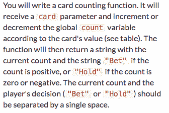
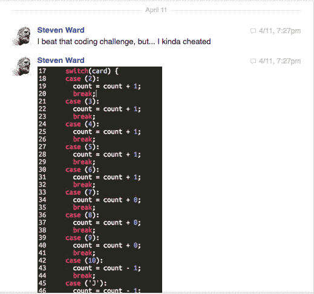
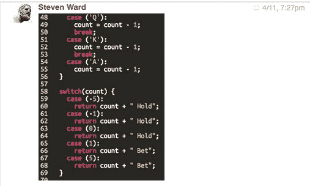
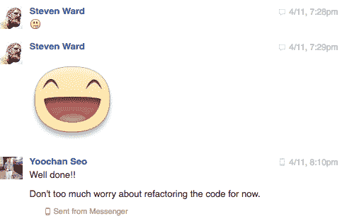

# 成为老师的学生

> 原文：<https://www.freecodecamp.org/news/the-student-who-became-the-teacher-5d0fe62112b4/>

史蒂文·沃德

# 成为老师的学生

几个月前，我参加了我的第一次结对编程会议。我已经被困在自由代码营的[算牌 JavaScript 挑战](https://www.freecodecamp.com/challenges/counting-cards)好几天了，现在我要请一位经验丰富的程序员来看看。

那是一个午夜，我三岁的女儿在同一个房间里睡着了，但是我不敢走到另一个房间去冒险吵醒我六个月大的女儿和妻子。我对这个事实感到紧张，但对于第一次有机会让专家来看我的代码感到兴奋。

#### 我是如何遇见我的“老师”的

当我第一次遇见悠禅的时候，*他*是*我的*学生*。*

Yoochan 甚至知道他想做什么。我对他的第一印象是他在课间在笔记本上涂鸦，画出一个网站的线框概念。我问他在做什么，他不好意思地说是 Wordpress 主题，不指望我知道他在说什么。但我做到了。

Yoochan 对他的学习很认真，他全身心地投入到他的普通教育课程中，同时继续自学编程。其他同学花在聚会上的时间比学习的时间还多，但 Yoochan 正忙于销售定制的 Wordpress 主题，并贪婪地学习新的编程语言。他想创造下一个脸书，并且非常清楚他的梦想需要多少努力和研究。

在他调到美国，我调到另一个城镇的另一份工作后，我们偶尔通过脸书保持联系。他关于科技世界的帖子近乎痴迷，但偶尔也会抱怨期末考试和春假自拍。我们聊了几次生活，以及一年后他成功转到一所更好的学校，这也让他更接近硅谷，那里是他的心在指引他。

#### 合作教学

我们的目标很简单:

A description of the Counting Cards challenge from Free Code Camp.

Yoochan 耐心地解释如何设置 ScreenHero，因为我用打字的方式回复他，而不是说话，以免吵醒我的女儿。我向他展示了本课的目标和我已经写好的代码。

我们转移到 CodePen 来测试一些变化。一路上，他都在教我 JavaScript 中的高级概念，以及一些让使用更容易的 CodePen 快捷方式。

我们一起一行一行地检查我的代码。他不是指出每一个错误，而是告诉我给定命令的目的是什么，并问我是否认为有更好的方法。他作为老师的天赋给我留下了深刻的印象。但是有趣的事情发生了。

在我们检查了每一行代码，清理了代码并使之成形之后，我们点击了“运行”

没用。

我们重新检查了一遍，发现了一些需要改进的地方，并再次运行了一遍。

还是不行。

然后，我恍然大悟:他不知道答案。

#### 情节曲折

好吧，所以，有一件大事我没有提到:当我在一个充满新生命的房子里聊天时，这个 20 多岁的年轻人在医院的房间里无法入睡，因为混合药物在他的体内打转。他死于癌症。但他不想谈这个。他想谈谈硅谷的收购、激动人心的新公司，当然还有代码。

在新学校第一个学期的某个时候，他开始出现胃病。情况变得很糟，他去了学生健康服务中心。他们给了他一些抗酸剂让他回家。问题变得更糟了。他又回去了，仍然没有得到答案。最后，他回到了韩国，在那里他的胃癌几乎立即被诊断出来。

他辍学留在韩国接受治疗，尽管你不会通过他的社交媒体帖子知道这一点。我和他聊了几次他发现的一些很酷的新应用或者他的一个想法。谈话很少，如果有的话，转向癌症或他的条件。在某一点上，他已经完全好了，在首尔安排了实习机会，并准备好要席卷全世界。

后来他不在了。几乎是刚开始实习，他就不得不辞职，重新住进医院。

看着他在脸书的博客，总是很难说出他到底过得怎么样，因为大部分都是他关于学习新编程语言的博客帖子，或者他对某个应用、网站或电子商务网站的一些新想法。

去年冬天，我设法去医院看望了他，在那里，他向我讲述了他偶尔做的模糊预约背后的许多背景故事。这是一个令人心碎的故事，但是 Yoochan 的声音里只有乐观。他谈到了这整个经历是多么幸福，以及它将如何推动他的职业生涯。

现在，他内心有一股帮助癌症患者的热情，尤其是像他这样的年轻患者。他还不太确定那会以什么形式出现，但他确信它会发生。自然，它会是一个应用程序。或者一个论坛网站。或者只是一个博客开始。

我见到了他的妈妈，作为一名家长，我对她充满了敬畏。她站在他身边，听他用外语讲述他的故事，他现在几乎掌握了外语——这是为她成就非凡的儿子感到骄傲的另一个理由。

他说，他们终于来对了医院。他们终于找到了正确的治疗方法。他微笑着看着他的妈妈，拍着她的手，因为她忍住了眼泪。

#### 教训

我完全知道作为一个话题的所谓“专家”站在人们面前，却被抛给一个我没有想到也不知道如何回答的难题是什么感觉。这并不意味着我是个糟糕的老师。有时这个问题只是用一种尴尬的方式表达，导致我误解了它。也可能是我不在状态，忘记了答案。

当它发生在 Yoochan 身上的时候，我立刻意识到了这一点。我记得当时在想，“好吧，这很尴尬，我怎么才能优雅地让他知道这很酷，而且我已经从他身上学到了很多东西？”

事实证明我不需要这么做，因为 Yoochan 已经知道了一些我教了几年书才明白的事情:教学不仅仅是将数字事实从一个大脑转移到另一个大脑。

真正的教学是牵着某人的手一起探索一个话题的模拟行为。成为一名好老师的要素并不是某个主题的广博知识。运用足够的知识让一起的旅程变得有趣，这是一种智慧。

最终，学生和老师之间并没有太大的区别。两人都将从相处中获得有价值的东西。

Yoochan 没有感到尴尬。他坦白了。我征求了他的一些意见。我们试了几个，也没用。Yoochan 建议离开一段时间，第二天再回来看看。我就是这么做的，而且我几乎马上就想明白了。我并不为我的解决方案感到自豪，但它确实有效。

Confession: I still don’t know what he meant by “refactoring the code.”

#### 我的老师，我的英雄

几小时前我收到确认，约昌已经死了。这并不出人意料。最近几周，他在脸书的帖子越来越少。他宣布停止所有的开发活动。几天后，他向朋友道歉，因为他的病情比他说的要严重得多。

他去了“大山深处”的一家新医院，在那里他不能正常上网。我怀疑这是不是临终关怀。他最近的几次更新放弃了他通常的做法，除了韩文外，还提供英文翻译。他的最后一个简短扼要。“这个星期。上面见。”

有些人可能认为用“终身学习者”这个词来形容 Yoochan 是残忍的，但我认为他是这个词的顶点。你知道有多少大学生在接受了像他这样的诊断后，会继续学习心理学、代数或化学？

我并不是说把你生命中的每一个空闲时间都用来学习本身就是目的。我的意思是，找到你喜欢并能首先进入头脑的主题会让你在这个星球上有更多高质量的时间，不管你还有多少时间。是的，研究表明继续学习新事物是延缓痴呆症和阿尔茨海默氏症的关键，但 50 年后的痴呆症并不是 Yoochan 所关心的。

就我个人而言，我认为在过去的六个月左右的时间里，他非常清楚自己的未来，他所说的被治愈是他照顾我们其余人的方式。与此同时，他可以通过阅读最新的埃隆马斯克项目或编写一个突然出现在他脑海中的 iPhone 应用程序，从那些痛苦的不眠之夜中获得一点乐趣。尽管在人生的这个阶段，他似乎对如何利用自己的社交媒体存在感到矛盾(例如，他偶尔会在没有通知的情况下停用他的脸书个人资料)，但从某种意义上来说，他的 GitHub 账户过去是，现在仍然是不朽的。

能够在孤独和痛苦的时候做他喜欢的事情，让生命变得有价值。

#### 最后一句话

我很抱歉，Yoochan，让这最后的部分都是关于我的，但我是写这个纪念的人，我有一些事情要说。

我很抱歉没有更频繁地和你联系。

我很抱歉，这个成年的世界——你在里面呆的时间太少了——没有治愈你的方法。

很抱歉我没能让你的技术英雄去医院看你。要是你像爱代码一样爱棒球就好了...

很抱歉我没有带我女儿去医院接你。我想让她见到你并记住你，然后在以后的生活中问我关于你和你的故事，那时她可能会完全理解。我担心这会给你带来麻烦或沮丧。我很确定我错了。

很多事我都很抱歉，但我永远不会忘记你。

我知道你对死后会发生什么有着深刻的宗教信仰。我不认同你的信念，但有一点我可以肯定的是，你的生活已经影响了我教育学生的方式，以及我将如何抚养我的女儿们。

因此，我可以用一个快乐的承诺而不是悲伤的遗憾来结束这个纪念:我将尽我所能，通过按照你们的榜样生活，把你们生活中的这些教训灌输给我所接触的所有年轻的生命。然后，他们会通过以身作则，将这些价值观传递给自己的同事、学生和孩子。

后代可能不知道你的名字或你的故事，但他们会受益于你在这个星球上的时间。以那种微小但切实的方式，你会活下去。

我想你会喜欢的。