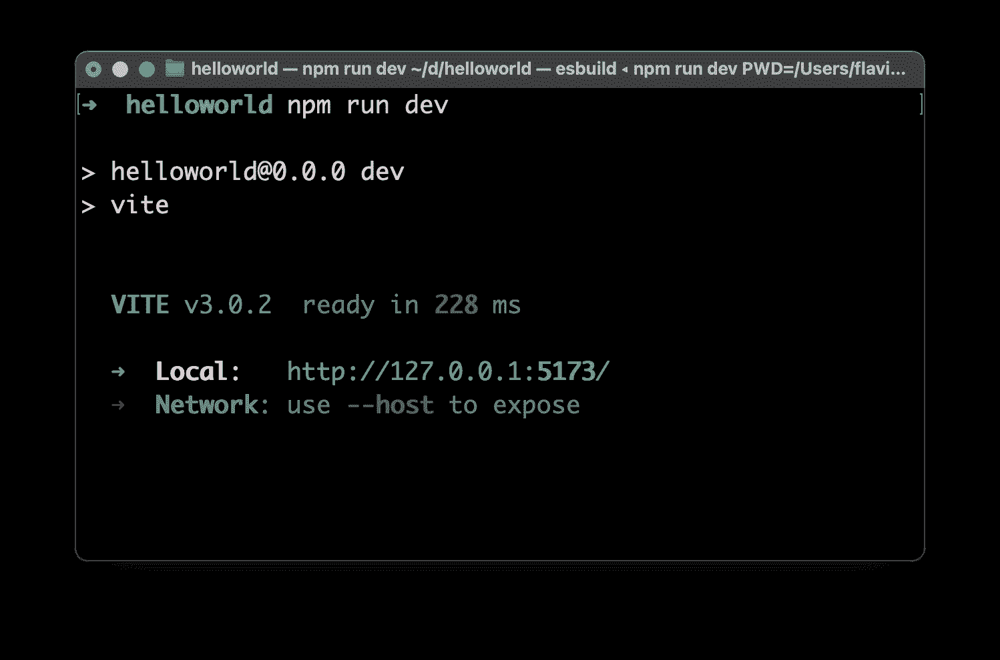
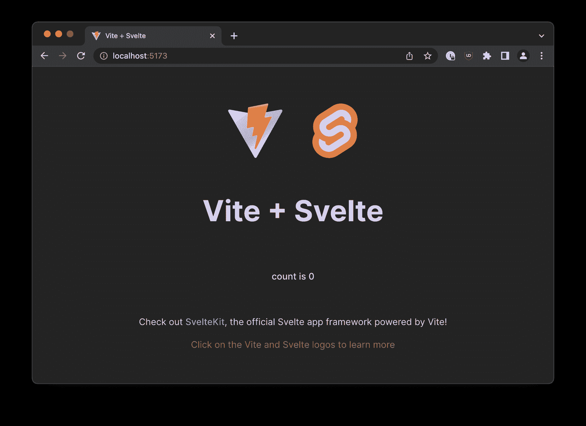
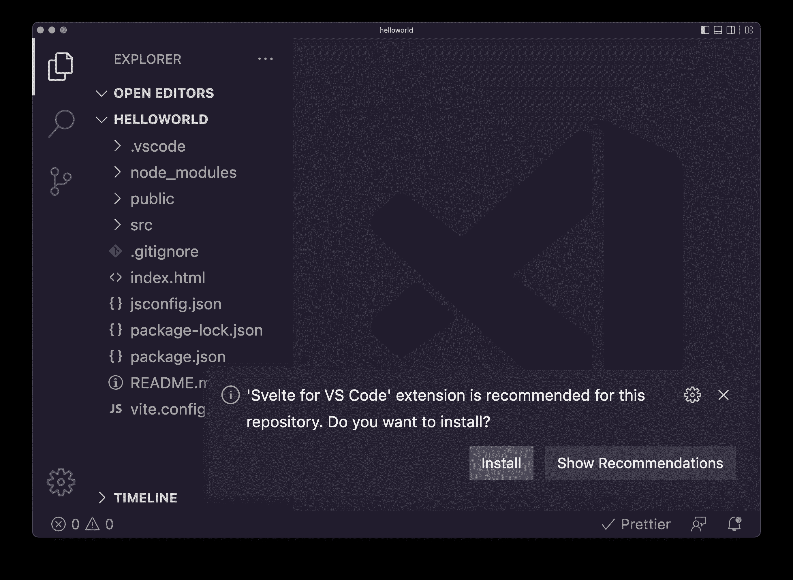
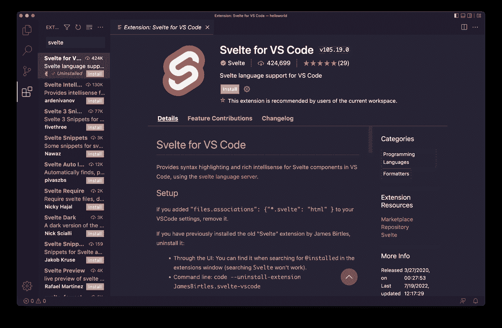

# 苗条手册——初学者学习苗条

> 原文：<https://www.freecodecamp.org/news/the-svelte-handbook/>

我写这本书是为了帮助你快速学习 Svelte，熟悉它的工作原理。

这本书的理想读者对苗条一无所知，可能用过 Vue 或 React，但正在寻找*某物* *更多*，或一种新的方法。

Svelte 非常值得研究，因为它为 Web 提供了一个令人耳目一新的观点和几个独特的功能。

感谢你得到这本电子书。希望对你了解苗条身材有所帮助！

你可以在推特上找到我。我的网站是 flaviocopes.com 的。

## 目录

*   [苗条简介](#introduction-to-svelte)
*   [纤细的部件](#svelte-components)
*   [苗条的处理状态](#handling-state-in-svelte)
*   [纤细的反应性](#svelte-reactivity)
*   [苗条道具](#svelte-props)
*   [跨组件状态管理](#cross-component-state-management-in-svelte)
*   [插槽](#slots)
*   [苗条生命周期事件](#svelte-lifecycle-events)
*   [纤细的捆绑](#svelte-bindings)
*   [模板中的条件逻辑](#conditional-logic-in-templates)
*   [在细长模板中循环](#looping-in-svelte-templates)
*   [苗条模板中的承诺](#promises-in-svelte-templates)
*   [以纤巧的方式处理事件](#working-with-events-in-svelte)
*   [何去何从](#where-to-go-from-here)

## 苗条简介

Svelte 是一个令人兴奋的 web 前端框架，可以用来构建 web 应用程序。

如果你刚刚开始，Svelte 是你的第一个前端框架的一个很好的选择。

如果你已经在 React、Vue.js、Angular 或其他前端框架方面有经验，你会对 Svelte 感到惊喜。

与 React、Vue、Angular 和其他框架相比，使用 Svelte 构建的应用程序是预先编译好的，所以你不必将整个框架提供给网站的每个访问者。

因此，体验的成果更流畅，消耗更少的带宽，一切都感觉更快，更轻便。

在部署时，苗条消失，你得到的是平原(和快速！)JavaScript。

这只是冰山一角。让我们开始吧！

你可以得到这本苗条手册的 PDF 和 ePub 版本

### 如何开始苗条身材

要使用 Svelte，您需要安装 Node.js，因为我们要使用的所有工具都基于 Node。

> 确保你也看了我的 [Node.js 手册](https://thevalleyofcode.com/node/)

我有一个小建议，苗条网站提供了一个非常酷的“游乐场”，让你在 https://svelte.dev/repl 测试苗条身材。

测试小的苗条的应用程序和用东西做实验是非常酷的。

使用终端，进入您通常保存代码的文件夹，例如您家中的`dev`文件夹。

在您的计算机上运行此命令:

```
npm create vite@latest helloworld -- --template svelte 
```

这为你开始你的第一个苗条应用程序设置了一切。我把它命名为`helloworld`，所以你会看到一个同名的文件夹。

用`cd helloworld`进入那个文件夹，然后运行

```
npm install 
```

当这一切结束时:

```
npm run dev 
```

这将在开发模式下运行我们新的苗条站点，在本地主机的端口 5173 上启动应用程序:



如果您将浏览器指向那里，您将看到示例项目出现:



现在您已经准备好在您最喜欢的编辑器中打开代码，例如 **VS 代码**。

如果你已经安装了[Visual Studio 代码命令行界面](https://code.visualstudio.com/docs/editor/command-line)，你可以在文件夹中运行`code .`来完成这个任务。

一旦您在编辑器中打开项目，VS Code 将提示您安装 VS Code 扩展的 [Svelte(如果没有，转到 extensions 面板并搜索它):](https://marketplace.visualstudio.com/items?itemName=svelte.svelte-vscode)



安装它，因为它提供了代码高亮显示和其他功能:



现在回到项目上来！

打开`src`文件夹，你会看到里面有几个文件。一语双关，主要的一个是`main.js`，在这里设置了苗条的应用程序:

该文件是入口点，并初始化主应用程序组件，该组件在`App.svelte`中定义:

```
<script>
  import svelteLogo from './assets/svelte.svg'
  import Counter from './lib/Counter.svelte'
</script>

<main>
  <div>
    <a href="https://vitejs.dev" target="_blank">
      
    </a>
    <a href="https://svelte.dev" target="_blank">
      
    </a>
  </div>
  <h1>Vite + Svelte</h1>

  <div class="card">
    <Counter />
  </div>

  <p>
    Check out
    <a href="https://github.com/sveltejs/kit#readme" target="_blank"
      >SvelteKit</a
    >, the official Svelte app framework powered by Vite!
  </p>

  <p class="read-the-docs">Click on the Vite and Svelte logos to learn more</p>
</main>

<style>
  .logo {
    height: 6em;
    padding: 1.5em;
    will-change: filter;
  }
  .logo:hover {
    filter: drop-shadow(0 0 2em #646cffaa);
  }
  .logo.svelte:hover {
    filter: drop-shadow(0 0 2em #ff3e00aa);
  }
  .read-the-docs {
    color: #888;
  }
</style> 
```

看，我们有三个主要部分:

```
<script></script>

<main></main>

<style></style> 
```

这就是我们所说的**单个文件组件**，一个决定我们组件所有信息的单个文件:

*   标记(HTML)
*   行为(JavaScript)
*   样式(CSS)

这个结构将是你所有苗条部分的基础。

## 纤细的部件

现代 Web 开发非常关注组件，Svelte 也不例外。

什么是组件？组件是应用程序的原子部分，它是自包含的，并且可以选择引用其他组件来组成其输出。

换句话说，它是应用程序的一个原子部分。

表单可以是组件。

输入元素可以是组件。

整个应用程序是一个组件。

苗条的组件包含了渲染一个 UI 所需的所有东西。

每个细长的组件都在一个`.svelte`文件中声明，在那里你可以找到内容(标记)、行为(JavaScript)和表示(CSS ),而不必定义单独的文件。

这是定义 UI 的一个好方法，因为您不需要搜索影响不同文件中相同元素的项目。

这里有一个示例组件，我们将它存储在一个名为`Dog.svelte`的文件中:

```
<script>
  export let name
</script>

<style>
  h1 {
    color: purple;
  }
</style>

<h1>The dog name is {name}!</h1> 
```

JavaScript 代码必须放在`script`标签中。

你在`style`标签中的 CSS 是**作用域的**组件，不会“泄漏”到外面。

如果另一个组件有一个`h1`标签，这种风格不会影响它。

例如，当重用您已经为其他应用程序编写的组件时，或者当您包含其他人发布的开源库时，这是非常方便的。

例如，您可以包含一个由其他人构建的日期选择器组件，并且该组件的任何样式都不会影响应用程序的其余部分。

同样，您编写的任何 CSS 都不会修改日期选择器的外观。

### 在其他组件中导入组件

一个组件可以被其他组件使用。

其他组件现在可以导入我们在他们的代码中编写的`Dog`组件。

例如，这里有一个`House`组件:

```
<script>
  import Dog from './Dog.svelte'
</script> 
```

现在，您可以导入并使用 Dog 组件，就像它是一个 HTML 标记一样:

```
<script>
  import Dog from './Dog.svelte'
</script>

<Dog /> 
```

### 从组件导出特定函数

正如您在上面看到的，为了导出组件，我们不需要做任何事情，因为组件本身是默认的导出。

如果您想导出组件标记及其相关的内置功能之外的内容，该怎么办呢？

您必须编写所有想要从带有`context="module"`属性的特殊`script`标签中导出的函数。

这里有一个例子。假设您在`Button.svelte`中有一个按钮组件:

```
<button>A button</button> 
```

并且您希望为其他组件提供更改按钮颜色的能力。

> 对于这个用例，更好的解决方案是使用 props，这是我们将在下一章讨论的内容。但是请继续关注这个例子

你可以提供一个函数，叫做`changeColor`。

您在这个特殊的`script`标签中编写并导出它:

```
<script context="module">
  export function changeColor() {
    //...logic to change color..
  }
</script>

<button>A button</button> 
```

请注意，您可以在组件中拥有另一个“普通”脚本标记。

现在其他组件可以导入按钮，这是默认的导出，并且`changeColor`功能也是:

```
<script>
  import Button, { changeColor } from './Button.svelte'
</script> 
```

这可能是一个愚蠢的例子，但是知道你可以使用这个功能是很有帮助的。

## 苗条的处理状态

除了定义标记、CSS 和 JavaScript 逻辑之外，每个组件都可以拥有自己的**状态**。

什么是状态？状态是使组件呈现它正在呈现的内容所需的任何数据。

例如，如果一个表单输入字段中写入了字符串“test ”,那么在某个地方会有一个变量保存这个值。这就是输入字段的状态。

字段被选中？某处的变量将记录这一事实。诸如此类。

状态在组件的`script`部分定义:

```
<script>
  let count = 0
</script> 
```

要更新一个状态变量的值，你所需要的只是一个赋值。一个简单的 JavaScript 赋值，例如使用`=`操作符。

假设你有一个`count`变量。你可以简单地使用`count = count + 1`，甚至`count++`来增加这个值:

```
<script>
  let count = 0

  const incrementCount = () => {
    count++
  }
</script>

{count} <button on:click="{incrementCount}">+1</button> 
```

我发现这是 Svelte 的一个令人耳目一新的部分，例如在 React 中，你必须使用`useState()`钩子，并且在任何你想要更新状态变量的值的时候使用 setter 函数。

这是更直观和更“类似 JavaScript”的语法。

我们需要意识到一件事，这很快就能学会:当改变值时，我们也必须赋值。

Svelte 总是想要一个任务，否则它可能不会意识到状态改变了。

对于像字符串和数字这样的简单值，这基本上是已知的，因为 String 上的所有方法都返回新的字符串，对于数字也是一样——它们是不可变的。

但是对于数组呢？我们不能使用改变数组的方法。比如`push()`、`pop()`、`shift()`、`splice()`...因为没有任务。它们改变了内部数据结构，但 Svelte 无法检测到这一点。

好吧，你*仍然可以*使用它们，但是在你完成你的操作之后，你可以使用一个“技巧”并且重新分配变量给它自己，就像这样:

```
let list = [1, 2, 3]
list.push(4)
list = list 
```

与我之前所说的相比，这有点违背直觉，但是你会记得这是一个有经验的怪癖。

当然，您可以使用替代方法来避免这种情况，例如，您可以使用 spread 运算符来添加一个项目，而不是使用`Array.push()`:

```
let list = [1, 2, 3]
list = [...list, 4] 
```

## 微弱的反应

在 Svelte 中，您可以监听组件状态的变化，并更新其他变量。

例如，如果您有一个`count`变量:

```
<script>
  let count = 0
</script> 
```

你可以通过点击一个按钮来更新它:

```
<script>
  let count = 0

  const incrementCount = () => {
    count = count + 1
  }
</script>

{count} <button on:click="{incrementCount}">+1</button> 
```

您可以使用特殊的语法`$:`来监听`count`上的变化，该语法定义了一个新的块，当引用到其中的任何变量发生变化时，Svelte 将重新运行该块。

这里有一个例子:

```
<script>
  let count = 0

  const incrementCount = () => {
    count = count + 1
  }

  $: console.log(`${count}`)
</script>

{count} <button on:click="{incrementCount}">+1</button> 
```

我用了积木:

```
$: console.log(`${count}`) 
```

你可以写不止一个:

```
<script>
  $: console.log(`the count is ${count}`)
  $: console.log(`double the count is ${count * 2}`)
</script> 
```

您还可以添加一个**块**(左花括号和右花括号`{}`)来组合多个语句:

```
<script>
  $: {
    console.log(`the count is ${count}`)
    console.log(`double the count is ${count * 2}`)
  }
</script> 
```

我在那里使用了一个`console.log()`调用，但是您也可以更新其他变量:

```
<script>
  let count = 0
  let double = 0

  $: {
    console.log(`the count is ${count}`)
    double = count * 2
    console.log(`double the count is ${double}`)
  }
</script> 
```

## 细长的道具

您可以使用语法`import name from 'path'`将一个瘦组件导入到任何其他组件中，如下所示:

```
<script>
  import SignupForm from './SignupForm.svelte'
</script> 
```

> 该路径相对于当前组件路径。`./`表示“同一个文件夹”。您可以使用`../`返回一个文件夹，依此类推。

一旦这样做了，就可以在标记中使用新导入的组件，比如 HTML 标记:

```
<SignupForm /> 
```

这样，您就在两个组件之间形成了父/子关系:导入的组件和被导入的组件。

通常，您希望父组件将数据传递给子组件。

你可以使用**道具**来完成。道具的行为类似于普通 HTML 中的属性，它们是一种单向的交流形式。

在本例中，我们传递了`disabled`属性，并将 JavaScript 值`true`传递给它:

```
<SignupForm disabled="{true}" /> 
```

在 SignupForm 组件中，需要**导出`disabled`道具**，这样:

```
<script>
  export let disabled
</script> 
```

这是您表达道具向父组件公开这一事实的方式。

使用组件时，您可以传递一个变量而不是一个值，以便动态地更改它:

```
<script>
  import SignupForm from './SignupForm.svelte'
  let disabled = true
</script>

<SignupForm {disabled} /> 
```

> 注意，我使用了`{disabled}`作为`disabled={disabled}`的一种便捷的简写形式

当`disabled`变量值改变时，子组件将用新的属性值更新。示例:

```
<script>
  import SignupForm from './SignupForm.svelte'
  let disabled = true
  setTimeout(() => {
    disabled = false
  }, 2000)
</script>

<SignupForm {disabled} /> 
```

## Svelte 中的跨组件状态管理

我们已经看到了 Svelte 如何使处理单个组件的状态变得非常容易。

但是我们如何在组件之间传递状态呢？

### 使用道具传递状态

第一种策略是其他 UI 框架通用的，它使用 props 传递状态，**提升状态**。

当一个组件需要与另一个组件共享数据时，状态可以在组件树中上移，直到这些组件有一个公共父组件。

状态需要被传递下去，直到它到达所有需要这个状态信息的组件。

这是使用**道具**完成的，我认为这是最好的技巧，因为它很简单。

### 上下文 API

但是也有道具不实用的情况。也许两个组件在组件树中相距太远，我们必须将状态移到顶层组件。

在这种情况下，可以使用另一种技术，它被称为**上下文 API** ，当您想让多个组件与后代通信，但不想传递道具时，它是理想的。

上下文 API 由`svelte`包提供的两个函数提供:`getContext`和`setContext`。

您在上下文中设置一个对象，将其与一个键相关联:

```
<script>
  import { setContext } from 'svelte'

  const someObject = {}

  setContext('someKey', someObject)
</script> 
```

在另一个组件中，您可以使用`getContext`来检索分配给一个键的对象:

```
<script>
  import { getContext } from 'svelte'

  const someObject = getContext('someKey')
</script> 
```

您只能使用`getContext`在使用`setContext`的组件或其后代中检索一个键。

如果你想让生活在两个不同组件树中的两个组件进行通信，我们还有另一个工具: **stores** 。

### 使用苗条的商店

当组件需要相互交流而不需要传递太多的道具时，苗条商店是处理你的应用程序状态的一个很好的工具。

您必须首先从`svelte/store`导入`writable`:

```
import { writable } from 'svelte/store' 
```

并使用`writable()`函数创建一个存储变量，将默认值作为第一个参数传递:

```
const username = writable('Guest') 
```

这可以放在一个单独的文件中，你可以把它导入到多个组件中，例如，叫做`store.js`(它不是一个组件，所以它可以在一个`.js`文件中，而不是`.svelte`):

```
import { writable } from 'svelte/store'
export const username = writable('Guest') 
```

现在加载该文件的任何其他组件都可以访问该存储:

```
<script>
  import { username } from './store.js'
</script> 
```

现在可以使用`set()`将这个变量的值设置为一个新值，并将这个新值作为第一个参数传递:

```
username.set('new username') 
```

它可以使用`update()`函数进行更新，这与`set()`不同，因为您不只是将新值传递给它，而是运行一个回调函数，将当前值作为参数传递给它:

```
const newUsername = 'new username!'
username.update((existing) => newUsername) 
```

您可以在这里添加更多逻辑:

```
username.update((existing) => {
  console.log(`Updating username from ${existing} to ${newUsername}`)
  return newUsername
}) 
```

要一次性获取存储变量*的值*，可以使用由`svelte/store`导出的`get()`函数:

```
import { writable, get } from 'svelte/store'
export const username = writable('Guest')
get(username) //'Guest' 
```

要创建一个每当存储值改变时就更新的反应变量，您可以使用`$`(在本例中为`$username`)前置存储变量。使用它将使组件在存储值改变时重新呈现。

> Svelte 认为`$`是一个保留值，会阻止你将它用于与存储值无关的事情(这可能会导致混乱)，所以如果你习惯于使用`$`来预先添加 DOM 引用，不要在 Svelte 中这样做。

> 另一个选择是使用`username`的`subscribe()`方法，如果您需要在变量改变时执行一些逻辑，这是最合适的:

```
username.subscribe((newValue) => {
  console.log(newValue)
}) 
```

除了可写存储，Svelte 还提供了 2 种特殊的存储:**可读存储**和**派生存储**。

### 纤细可读的商店

可读存储是特殊的，因为它们不能从外部更新——没有`set()`或`update()`方法。相反，一旦你设置了初始状态，就不能从外部修改它们。

官方的瘦文档显示了一个有趣的例子，使用计时器来更新日期。我可以考虑设置一个定时器来从网络获取资源、执行 API 调用、从文件系统获取数据(使用本地 Node.js 服务器)或者其他可以自动设置的东西。

在这种情况下，我们不使用`writable()`来初始化存储变量，而是使用`readable()`:

```
import { readable } from 'svelte/store'
export const count = readable(0) 
```

您可以在默认值之后提供一个函数，它将负责更新默认值。该函数接收`set`函数来修改值:

```
<script>
  import { readable } from 'svelte/store'
  export const count = readable(0, (set) => {
    setTimeout(() => {
      set(1)
    }, 1000)
  })
</script> 
```

在这种情况下，我们在 1 秒钟后将值从 0 更新为 1。

您也可以在此功能中设置时间间隔:

```
import { readable, get } from 'svelte/store'
export const count = readable(0, (set) => {
  setInterval(() => {
    set(get(count) + 1)
  }, 1000)
}) 
```

您可以在另一个组件中使用它，如下所示:

```
<script>
  import { count } from './store.js'
</script>

{$count} 
```

### 苗条衍生商店

派生存储允许您根据现有存储的值创建新的存储值。

您可以使用由`svelte/store`导出的`derived()`函数来实现这一点，该函数将现有的存储值作为其第一个参数，并将接收该存储值作为其第一个参数的函数作为其第二个参数:

```
import { writable, derived } from 'svelte/store'

export const username = writable('Guest')

export const welcomeMessage = derived(username, ($username) => {
  return `Welcome ${$username}`
}) 
```

```
<script>
  import { username, welcomeMessage } from './store.js'
</script>

{$username} {$welcomeMessage} 
```

## 时间

插槽是一种方便的方式，让您定义可以组合在一起的组件。

反之亦然，根据您的观点，插槽是配置您正在导入的组件的一种便捷方式。

他们是这样工作的。

在一个组件中，你可以使用`<slot />`(或`<slot></slot>`)语法定义一个插槽。

这里有一个`Button.svelte`组件，它只是打印一个`<button>` HTML 标签:

```
<button><slot /></button> 
```

> 对于 React 开发者来说，这和`<button>{props.children}</button>`基本相同

任何导入它的组件都可以通过将内容添加到组件的开始和结束标记中来定义将要放入槽中的内容:

```
<script>
  import Button from './Button.svelte'
</script>

<button>Insert this into the slot</button> 
```

您可以定义一个默认值，在插槽未填满时使用:

```
<button>
  <slot> Default text for the button </slot>
</button> 
```

一个组件中可以有多个插槽，并且可以使用命名插槽来区分它们。单个未命名的插槽将是默认插槽:

```
<slot name="before" />
<button>
  <slot />
</button>
<slot name="after" /> 
```

你可以这样使用它:

```
<script>
  import Button from './Button.svelte'
</script>

<button>
  Insert this into the slot
  <p slot="before">Add this before</p>
  <p slot="after">Add this after</p>
</button> 
```

这将向 DOM 呈现以下内容:

```
<p slot="before">Add this before</p>
<button>Insert this into the slot</button>
<p slot="after">Add this after</p> 
```

## 苗条的生命周期事件

Svelte 中的每个组件都会触发几个我们可以挂钩的生命周期事件，来帮助我们实现我们想要的功能。

特别是，我们有

*   `onMount`组件渲染后触发
*   `onDestroy`在组件被破坏后被激发
*   `beforeUpdate`在 DOM 更新前触发
*   `afterUpdate`DOM 更新后触发

我们可以安排函数在 Svelte 触发这些事件时发生。

默认情况下，我们不能访问这些方法中的任何一个，但是我们需要从`svelte`包中导入它们:

```
<script>
  import { onMount, onDestroy, beforeUpdate, afterUpdate } from 'svelte'
</script> 
```

`onMount`的一个常见场景是从其他来源获取数据。

下面是一个`onMount`的用法示例:

```
<script>
  import { onMount } from 'svelte'

  onMount(async () => {
    //do something on mount
  })
</script> 
```

`onDestroy`允许我们清除数据或停止在组件初始化时可能已经开始的任何操作，如使用`setInterval`的定时器或预定周期功能。

需要特别注意的一点是，如果我们从`onMount`返回一个函数，它提供与`onDestroy`相同的功能——当组件被销毁时它运行:

```
<script>
  import { onMount } from 'svelte'

  onMount(async () => {
    //do something on mount

    return () => {
      //do something on destroy
    }
  })
</script> 
```

下面是一个实际示例，它设置了一个在装载时运行的周期函数，并在销毁时删除它:

```
<script>
  import { onMount } from 'svelte'

  onMount(async () => {
    const interval = setInterval(() => {
      console.log('hey, just checking!')
    }, 1000)

    return () => {
      clearInterval(interval)
    }
  })
</script> 
```

## 纤细的捆绑

使用 Svelte，您可以在数据和 UI 之间创建双向绑定。

许多其他 Web 框架可以提供双向绑定，这是一种非常常见的 UI 设计模式。

它们对表单特别有用。

### 绑定:值

让我们从您经常使用的最常见的绑定形式开始，您可以使用`bind:value`来应用它。从组件状态中取出一个变量，并将其绑定到一个表单字段:

```
<script>
  let name = ''
</script>

<input bind:value="{name}" /> 
```

现在，如果`name`改变，输入字段将更新其值。反之亦然:如果用户更新了表单，`name`变量值也会改变。

> 只是要注意，变量必须使用`let/var`而不是`const`来定义，否则它不能被 Svelte 更新，因为`const`用一个不能被重新赋值的值定义了一个变量。

`bind:value`适用于所有类型的输入字段(`type="number"`、`type="email"`等)，但也适用于其他类型的字段，如`textarea`和`select`(稍后将详细介绍`select`)。

### 复选框和单选按钮

复选框和单选输入(`input`元素带`type="checkbox"`或`type="radio"`)允许这三种绑定:

*   `bind:checked`
*   `bind:group`
*   `bind:indeterminate`

`bind:checked`允许我们将一个值绑定到元素的选中状态:

```
<script>
  let isChecked
</script>

<input type="checkbox" bind:checked="{isChecked}" /> 
```

使用复选框和单选按钮很方便，因为它们经常在群体中使用。使用`bind:group`,您可以将一个 JavaScript 数组关联到一个复选框列表，并根据用户的选择填充它。

这里有一个例子。`goodDogs`数组根据我选中的复选框填充:

```
<script>
  let goodDogs = []
  let dogs = ['Roger', 'Syd']
</script>

<h2>Who's a good dog?</h2>

<ul>
  {#each dogs as dog}
  <li>{dog} <input type="checkbox" bind:group="{goodDogs}" value="{dog}" /></li>
  {/each}
</ul>

<h2>Good dogs according to me:</h2>

<ul>
  {#each goodDogs as dog}
  <li>{dog}</li>
  {/each}
</ul> 
```

[参见示例](https://svelte.dev/repl/059c1b5edffc4b058ad36301dd7a1a58)

`bind:indeterminate`允许我们绑定到一个元素的`indeterminate`状态(如果你想了解更多 https://css-tricks.com/indeterminate-checkboxes/的[头到](https://css-tricks.com/indeterminate-checkboxes/)

### 选择字段

`bind:value`也适用于`select`表单字段，将所选值自动赋给变量值:

```
<script>
  let selected
</script>

<select bind:value="{selected}">
  <option value="1">1</option>
  <option value="2">2</option>
  <option value="3">3</option>
</select>

{selected} 
```

最酷的是，如果您从一组对象中动态生成选项，那么所选选项现在是一个对象，而不是一个字符串:

```
<script>
  let selected

  const dogs = [{ name: 'Roger' }, { name: 'Syd' }]
</script>

<h2>List of possible good dogs:</h2>
<select bind:value="{selected}">
  {#each dogs as dog}
  <option value="{dog}">{dog.name}</option>
  {/each}
</select>

{#if selected}
<h2>Dog selected: {selected.name}</h2>
{/if} 
```

[见本例](https://svelte.dev/repl/7e06f9b7becd4c57880db5ed184ea0f3)

`select`也允许`multiple`属性:

```
<script>
  let selected = []

  const goodDogs = [{ name: 'Roger' }, { name: 'Syd' }]
</script>

<h2>List of possible good dogs:</h2>
<select multiple bind:value="{selected}">
  {#each goodDogs as goodDog}
  <option value="{goodDog}">{goodDog.name}</option>
  {/each}
</select>

{#if selected.length}
<h2>Good dog selected:</h2>
<ul>
  {#each selected as dog}
  <li>{dog.name}</li>
  {/each}
</ul>
{/if} 
```

[见本例](https://svelte.dev/repl/b003248e87f04919a2f9fed63dbdab8c)

### 其他绑定

根据您正在处理的 HTML 标签，您可以应用不同种类的绑定。

`bind:files`是对`type="file"`输入元素有效的绑定，用于绑定所选文件的列表。

HTML 元素允许使用 T1 来绑定它的打开/关闭值。

`audio`和`video`媒体 HTML 标签允许绑定它们的几个属性:`currentTime`、`duration`、`paused`、`buffered`、`seekable`、`played`、`volume`、`playbackRate`。

`textContent`和`innerHTML`可以绑定在`contenteditable`字段上。

所有的东西对那些特定的 HTML 元素都非常有用。

### 只读绑定

`offsetWidth`、`offsetHeight`、`clientWidth`、`clientHeight`可以在任何块级 HTML 元素上绑定，只读，不包括 void 标签(如`br`)和设置为内联的元素(`display: inline`)。

### 获取 JavaScript 中 HTML 元素的引用

`bind:this`是一种特殊的绑定，允许您获取对 HTML 元素的引用，并将其绑定到 JavaScript 变量:

```
<script>
  let myInputField
</script>

<input bind:this="{myInputField}" /> 
```

当您需要在挂载元素后将逻辑应用于元素时，这是很方便的，例如，使用`onMount()`生命周期事件回调。

### 绑定组件道具

使用`bind:`您可以将一个值绑定到组件公开的任何属性。

假设您有一个`Car.svelte`组件:

```
<script>
export let inMovement = false
</script>

<button on:click={() => inMovement = true }>Start car</button> 
```

您可以导入组件并绑定`inMovement`属性:

```
<script>
  import Car from './Car.svelte'

  let carInMovement
</script>

<Car bind:inMovement="{carInMovement}" />

{carInMovement} 
```

这可以允许有趣的场景。

## 模板中的条件逻辑

在一个苗条的组件中，当涉及到呈现 HTML 时，你可以使用一些特定的语法来制作你在应用程序生命周期的每个阶段都需要的 UI。

特别是，我们现在将探索条件结构。

问题是这样的:你希望能够查看一个值/表达式，如果它指向一个真值，就做一些事情，如果它指向一个假值，就做一些其他的事情。

苗条为我们提供了一套非常强大的控制结构。

第一个是**如果**:

```
{#if isRed}
<p>Red</p>
{/if} 
```

有开头`{#if}`和结尾`{/if}`。开始标记检查值或语句是否真实。在这种情况下，`isRed`可以是一个值为`true`的布尔值:

```
<script>
  let isRed = true
</script> 
```

空字符串是虚假的，但有内容的字符串是真实的。

0 是假的，但大于 0 的数是真的。

布尔值`true`当然是真，而`false`是假。

如果不满足开始标记(提供了一个 falsy 值)，那么什么都不会发生。

如果不满意，我们可以使用适当的`else`语句:

```
{#if isRed}
<p>Red</p>
{:else}
<p>Not red</p>
{/if} 
```

第一个块或者在模板中呈现，或者在第二个中呈现。没有其他选择。

您可以在`if`块条件中使用任何 JavaScript 表达式，因此您可以使用`!`操作符否定一个选项:

```
{#if !isRed}
<p>Not red</p>
{:else}
<p>Red</p>
{/if} 
```

现在，在`else`中，您可能想要检查一个附加条件。这就是`{:else if somethingElse}`语法的由来:

```
{#if isRed}
<p>Red</p>
{:else if isGreen}
<p>Green</p>
{:else}
<p>Not red nor green</p>
{/if} 
```

你可以有很多这样的块，而不是只有一个，你可以嵌套它们。这里有一个更复杂的例子:

```
{#if isRed}
<p>Red</p>
{:else if isGreen}
<p>Green</p>
{:else if isBlue}
<p>It is blue</p>
{:else} {#if isDog}
<p>It is a dog</p>
{/if} {/if} 
```

## 在纤细的模板中循环

在瘦模板中，你可以使用`{#each}{/each}`语法创建一个循环:

```
<script>
  let dogs = ['Roger', 'Syd']
</script>

{#each dogs as dog}
<li>{dog}</li>
{/each} 
```

如果您熟悉使用模板的其他框架，这是一个非常相似的语法。

您可以使用以下方法获得迭代的索引:

```
<script>
  let dogs = ['Roger', 'Syd']
</script>

{#each dogs as dog, index}
<li>{index}: {dog}</li>
{/each} 
```

(索引从 0 开始)

当动态编辑列表删除和添加元素时，应该总是在列表中传递标识符，以防止出现问题。

使用以下语法可以做到这一点:

```
<script>
  let dogs = ['Roger', 'Syd']
</script>

{#each dogs as dog (dog)}
<li>{dog}</li>
{/each}

<!-- with the index -->
{#each dogs as dog, index (dog)}
<li>{dog}</li>
{/each} 
```

您也可以传递一个对象，但是如果您的列表对每个元素都有一个唯一的标识符，那么最好使用它:

```
<script>
  let dogs = [
    { id: 1, name: 'Roger' },
    { id: 2, name: 'Syd' },
  ]
</script>

{#each dogs as dog (dog.id)}
<li>{dog.name}</li>
{/each}

<!-- with the index -->
{#each dogs as dog, index (dog.id)}
<li>{dog.name}</li>
{/each} 
```

## 苗条模板中的承诺

承诺是我们在 JavaScript 中处理异步事件的一个很棒的工具。

ES2017 中相对较新引入的`await`语法使得使用承诺更加简单。

Svelte 为我们提供了模板中的`{#await}`语法，以便在模板级别直接处理承诺。

我们可以等待承诺解决，并为承诺的各种状态定义不同的 UI:未解决、已解决和已拒绝。

它是这样工作的。我们定义一个承诺，并使用`{#await}`块等待它解决。

一旦承诺完成，结果将被传递到`{:then}`块:

```
<script>
  const fetchImage = (async () => {
    const response = await fetch('https://dog.ceo/api/breeds/image/random')
    return await response.json()
  })()
</script>

{#await fetchImage}
<p>...waiting</p>
{:then data}

{/await} 
```

您可以通过添加一个`{:catch}`块来检测承诺拒绝:

```
{#await fetchImage}
<p>...waiting</p>
{:then data}

{:catch error}
<p>An error occurred!</p>
{/await} 
```

[运行示例](https://svelte.dev/repl/70e61d6cc91345cdaca2db9b7077a941)

## 以苗条的方式处理事件

### 侦听 DOM 事件

在 Svelte 中，可以使用`on:<event>`语法直接在模板中定义 DOM 事件的监听器。

例如，为了监听`click`事件，您将向`on:click`属性传递一个函数。

为了监听`onmousemove`事件，您将向`on:mousemove`属性传递一个函数。

下面是一个内嵌定义处理函数的例子:

```
<button
  on:click={() => {
    alert('clicked')
  }}
>
  Click me
</button> 
```

这是另一个在组件的`script`部分定义的处理函数的例子:

```
<script>
const doSomething = () => {
  alert('clicked')
}
</script>

<button on:click={doSomething}>Click me</button> 
```

当代码不太冗长时，我更喜欢内联。如果只有 2-3 行，我会把它放到脚本部分。

Svelte 将事件处理程序作为函数的参数传递，这在您需要停止传播或引用[事件对象](https://flaviocopes.com/javascript-events/#the-event-object)中的内容时非常方便:

```
<script>
const doSomething = event => {
  console.log(event)
  alert('clicked')
}
</script>

<button on:click={doSomething}>Click me</button> 
```

现在，我提到了“停止传播”。这是一件很常见的事情，例如停止表单提交事件。Svelte 为我们提供了**修改器**，一种无需手动直接应用的方法。我认为
`stopPropagation`和`preventDefault`是你用得最多的两个修饰语。

你像这样应用一个修饰语:`<button on:click|stopPropagation|preventDefault={doSomething}>Click me</button>`

还有其他修饰词，比较小众。`capture`启用[捕获事件，而不是冒泡](https://flaviocopes.com/javascript-events/#event-bubbling-and-event-capturing)，`once`仅触发事件一次，`self`仅在事件的目标是该对象时触发事件(将其从冒泡/捕获层级中移除)。

### 在组件中创建事件

有趣的是，我们可以在组件中创建自定义事件，并使用内置 DOM 事件的相同语法。

为此，我们必须从`svelte`包中导入`createEventDispatcher`函数，并调用它来获得一个事件分派器:

```
<script>
  import { createEventDispatcher } from 'svelte'
  const dispatch = createEventDispatcher()
</script> 
```

一旦我们这样做了，我们就可以调用`dispatch()`函数，传递一个标识事件的字符串(我们将在使用它的其他组件中用于`on:`语法):

```
<script>
  import { createEventDispatcher } from 'svelte'
  const dispatch = createEventDispatcher()

  //when it's time to trigger the event
  dispatch('eventName')
</script> 
```

现在其他组件可以使用我们的

```
<ComponentName on:eventName={event => { //do something }} /> 
```

您还可以将一个对象传递给事件，将第二个参数传递给`dispatch()`:

```
<script>
  import { createEventDispatcher } from 'svelte'
  const dispatch = createEventDispatcher()
  const value = 'something'

  //when it's time to trigger the event
  dispatch('eventName', value)

  //or

  dispatch('eventName', {
    someProperty: value,
  })
</script> 
```

由`dispatch()`传递的对象在`event`对象上可用。

## 从这里去哪里

我希望这本小手册对阐明 Svelte 能为你做什么有用，我希望你现在有兴趣了解更多！

我现在可以向您介绍两个地方来了解更多信息:

*   [官方苗条网站](https://svelte.dev/)
*   SvelteKit ，一个建立在 Svelte 之上的令人敬畏的框架，让你用 Node.js 和 Svelte 构建服务器端渲染应用

你可以得到这本苗条手册的 PDF 和 ePub 版本