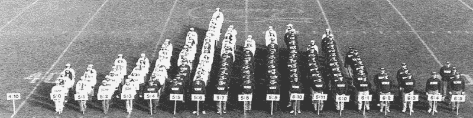
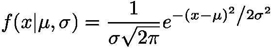
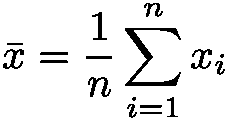
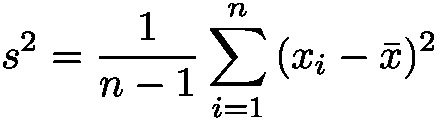
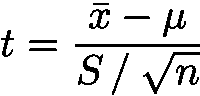
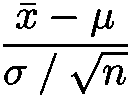

# t 分布:一个啤酒厂发现的关键统计概念

> 原文：<https://www.freecodecamp.org/news/the-t-distribution-a-key-statistical-concept-discovered-by-a-beer-brewery-dbfdc693184/>

作者:基里尔·杜波维科夫

# t 分布:一个啤酒厂发现的关键统计概念

What does Guinness beer have to do with probability distributions? You’ll know by the end of this article.

在本帖中，我们将看看两种概率分布，你几乎每次做数据科学、统计学或机器学习都会遇到。

### 正态分布

想象一下，我们在做一个城市各种人身高的研究。我们走在街上，随机测量一群人。(其中一些人认为这很奇怪，想报警，但拜托，这是为了科学！)

现在我们决定，一些探索性的数据分析不会有坏处。但是像 R 这样的统计软件目前还不可用，所以我们只是把人做成直方图。

When you have no statistical software at hand…

我们在这里看到了什么？啊，著名的钟形曲线。这可能是你会遇到的最重要的概率分布。由于[中心极限定理](https://en.wikipedia.org/wiki/Central_limit_theorem)，高斯分布出现在许多现实世界现象中。它是如此普遍，以至于人们称它为**正态分布**。

中心极限定理表明，足够多的独立随机变量的算术平均值将呈正态分布。这些随机变量最初可以有任何分布。但是当我们测量由它们的和所代表的东西时，我们最终会(随着样本数趋向于 *∞* )以正态分布过程结束。

高斯分布的概率密度函数写在下面:

这个公式可能看起来有点吓人，但是在数学上很方便。如果你对它是如何产生的感兴趣，你可以[阅读这里的](http://courses.ncssm.edu/math/Talks/PDFS/normal.pdf)。如您所见，这个分布有两个参数:

*   (平均值)
*   σ(标准偏差)。

均值控制正态分布随机变量的[期望值](https://en.wikipedia.org/wiki/Expected_value)(最大值将出现的地方)。方差σ控制分布下可能值的分布或变化。

正态分布的概念在机器学习中有巨大的价值。各种各样的机器学习算法广泛使用它:

*   线性模型假设误差是正态分布的
*   高斯过程假设模型下的所有函数值都是正态分布的
*   高斯混合让您可以对复杂的分布进行建模，并在混合模型的基础上构建分类器
*   正态分布是变分自动编码器的主要组成部分之一

这是高斯分布的交互式演示。

### 学生的 t 分布

如果我们想用高斯分布来模拟我们的数据，但是方差σ is 是未知的，该怎么办？当样本量很小时，标准偏差(σ)无法准确估计时，就会出现这个问题。

威廉·戈塞特在吉尼斯啤酒厂工作时解决了这个问题。他凭经验找到了一个 **t 分布**随机变量的公式。

首先，假设我们有从某个正态分布 *N(，σ )* 中采样的值 *x，…，xn* 。

我们不知道真实的方差，但我们可以通过计算样本均值和方差来估计它:

然后随机变量

将具有自由度为 *n-1* 的 t 分布，其中 *n* 是样本数。

此公式可能类似于从正态到标准正态的转换(具有零均值和单位方差的正态分布的简写):

我们不知道真实的总体方差，所以我们必须用样本标准差估计来代替真实的方差。

这种分布是被称为 **t 检验**的科学方法的基础。这是吉尼斯用来衡量他们的啤酒质量。

威廉·戈塞特用笔名学生发表了这个结果。吉尼斯公司担心它的竞争对手会发现 t 检验被用来控制他们产品的质量。

戈塞特的发现后来被著名统计学家罗纳德·费雪正式确认。费希尔被认为是统计学的频率主义方法的作者。

现在有趣的部分来了！你可以玩下面的 t 分布:

如您所见，当自由度较大时，t 分布接近标准正态分布。这是因为随着大量样本趋近于无穷大，样本均值趋近于真实均值。当我们处理小样本时，t 分布的“胖”尾部补偿了不确定性。

感兴趣的读者可能会问，“那么，t 分布的概率密度函数是什么？怎么才能推导出来呢？”就数学而言，这并不容易，但中心思想很容易掌握。

假设我们对得到正态变量 *X ~ N(0，σ)的概率密度函数感兴趣。*但不直接依赖于标准差 *σ。*

直觉上，为了摆脱 *σ* 我们必须做一些假设。让我们将 *σ* 视为一个随机变量本身，并假设它遵循[伽马分布](https://en.wikipedia.org/wiki/Gamma_distribution)(这是一个非常普遍的分布，在贝叶斯统计中有许多用途)。

这样我们可以说 *X* 是两个连续概率分布的混合:正态分布和伽玛分布。然后我们对 *σ* 进行积分，得出 t 分布的概率密度函数公式。

这里可以看到更多正式证明[，这里](https://probabilityandstats.wordpress.com/tag/students-t-distribution/)可以看到[。](https://www.statlect.com/probability-distributions/student-t-distribution)

### 结论

高斯分布和学生分布是统计学和机器学习中一些最重要的连续概率分布。

当总体方差未知或样本量较小时，t 分布可用作高斯分布的占位符。两者都以严格和正式的方式密切相关。

感谢阅读我的文章！我希望它能帮助你学习新的东西或更新现有的知识。