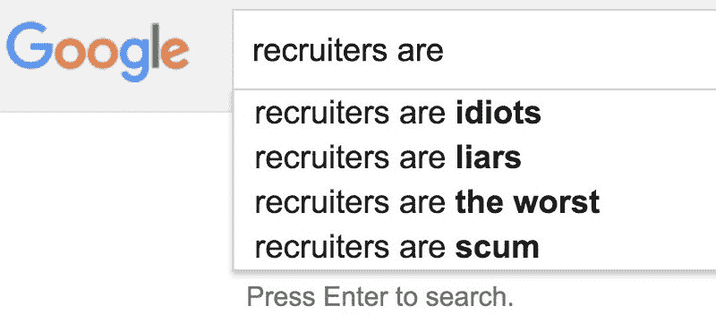

# 为什么这么多开发人员讨厌招聘人员

> 原文：<https://www.freecodecamp.org/news/the-tech-recruiter-red-pill-967dd492560c/>

> 这是你最后的机会。在这之后，就没有回头路了。你吃了蓝色药丸——故事结束，你在床上醒来，继续自己的求职。你吃红色药丸——你呆在招聘区，我让你看看兔子洞有多深。

在 1999 年的电影《黑客帝国》中——你看过吧？——墨菲斯招募尼奥加入他的脏毛衣团伙，乘坐一艘生锈的气垫船穿越下水道。

当然，他不是这样向尼奥推销的。

相反，墨菲斯坐在一张破旧的皮躺椅上，继续激起尼奥对整个《黑客帝国》的好奇心。

“矩阵是什么？”

“不幸的是，没有人能被告知母体是什么。你得自己去看。”

墨菲斯说服尼奥采取下一步行动——吞下红色药丸——同时尽可能少地透露母体本身。通过这样做，他成功地创造了一种神秘感。紧急情况。害怕错过更好的生活。

如果这一切听起来很熟悉，那是因为这些是招聘人员使用的相同策略，他们希望你吃下红色药丸，回复他们主动发来的信息。

招聘人员使用一种名为“InMail”的工具，根据你 LinkedIn 个人资料中的关键词匹配向你发送信息。他们知道，如果他们一天发出 1000 条信息，即使只有 1%的人回复，他们也会有足够多的求职者继续做生意。

谁知道呢——也许他们甚至会中大奖，从高级开发人员、平台架构师或其他拥有特别受欢迎的技能的人那里得到反馈。

幸运的是，这些垃圾邮件发送者很容易被发现。如果“InMail”标签不会立即泄露它们，它们的非个人本性会泄露。

LinkedIn 通过向招募者提供武器建立了一个 260 亿美元的帝国，这些招募者在垃圾邮件军备竞赛中竞争。随着微软收购 LinkedIn，情况可能会在好转之前变得更糟。

招聘人员不仅仅是这些友好玩笑的笑柄。招聘人员在开发人员中广受诟病，他们经常删除自己的 LinkedIn 账户，只是为了逃离招聘人员的魔掌，或者通过[引诱他们](https://42floors.com/blog/startups/recruiter-black-hole)来反击。

但是尽管招聘人员可能很烦人，他们却是开发人员就业市场的现实。许多专注于招聘的初创公司试图通过使用与订购汽车(Lyft)、租赁房间(AirBnB)或购买《黑客帝国》三部曲相同类型的双边市场来消除招聘人员。

> 我不会骗你的，尼欧。每一个坚持自己立场的招聘初创公司，每一个试图将人力招聘人员从招聘过程中自动化出来的人都失败了。

没错——所有那些承诺让雇主“为你而战”的花哨网站，实际上只是更传统的、以人为本的招聘机构的漏斗。

事实证明，把一个人(一个求职者)卖给一个由人组成的组织(一个雇主)并不是一个容易用软件解决的问题。

在雇佣过程中，交易的双方都是人。双方都在不断权衡相互竞争的选择。双方都有时间压力。双方都带着各自的期望和认知偏见。

在没有人类参与的情况下，算法距离可靠地完成这类交易还有很长的路要走。这也是为什么招聘者依然存在，而且很可能会长期存在的原因。他们久经考验的外交和牵线搭桥的技巧有助于推动招聘进程。

#### 招聘人员不会离开。所以我们来谈谈它们是如何工作的。

内部招聘人员为一个雇主工作。他们专门为那个雇主招聘候选人。他们的工作更多的是文书性质的，他们的大部分报酬是以薪水的形式。关于内部招聘人员没什么好说的，除了你可以在 Quora 上关注一个有趣的[。](https://www.quora.com/profile/Ambra-Benjamin-1/answers?sort=views)

当人们谈论讨厌招聘人员时，他们指的是代理招聘人员，他们本质上是为多个雇主工作的销售人员。

你可能会问——如果所有的招聘人员都为雇主工作，那么当我们想要获得一份新工作时，谁为我们开发人员工作呢？

好吧，尽管机构招聘人员可能会让你相信他们是在为你工作，但他们是在为雇主工作，因为雇主付钱给他们。如果他们为你工作，他们就不会被称为招聘人员，他们会被称为代理人。但大多数(非自由职业者)工程师太便宜，无法支付代理费用，所以他们求助于招聘人员。

雇主支付给这些代理招聘人员——也被称为“第三方招聘人员”或“应急招聘人员”——一笔基于你的起薪的佣金。这通常在 15%到 30%之间。

因此，如果你的起薪是 100，000 美元(不包括奖金)，那么你的雇主将付给你的招聘人员 15，000 美元到 30，000 美元，这取决于双方商定的百分比。只有当你在公司呆的时间超过试用期(通常为 90 天)时，招聘人员才会拿到这笔钱。

重要的是要重申这笔钱不会从你的工资中扣除——雇主已经将这笔费用列入预算。从理论上讲，通过招聘人员不会让你付出任何代价。

因此，招聘者的动机与你作为求职者的动机非常一致:

1.  因为他们的工资是基于你的起薪，他们倾向于帮你协商尽可能高的起薪。
2.  他们安排的候选人越多，速度越快，招聘人员赚的钱就越多。所以他们会想帮你尽快找到工作，这样他们就可以去找其他求职者了。
3.  因为他们只有在你成功成为一名员工(并且至少呆 90 天)的情况下才会得到报酬，所以他们希望确保你有能力并且很适合公司的文化。

这个系统听起来足够健康，对吗？直到大约 10 年前，它实际上运行得相当好。这时 LinkedIn 出现了，把招聘变成了一场巨大的垃圾邮件盛宴。

InMails assemble!

今天，任何人都可以创建一个 LinkedIn 帐户，免费获得一个月的 LinkedIn 销售导航器，进行一些快速的关键字搜索，并开始用垃圾邮件填充开发人员的收件箱。

他们可以假装自己来自一家知名的招聘公司——不管是真实的还是虚构的。他们可以声称与你想工作的主要雇主有密切的工作关系。他们可以抛出大而可信的薪水数字来吸引你的注意。他们需要做的任何事情，让你通过点击回复按钮来服用他们的红色药丸。

接下来你知道的是，他们代表你向公司申请，只是在之后的过程中向雇主透露，他们实际上不是候选人，而是招聘人员。他们正在修改你的简历，删除你的个人联系方式，加强他们作为中间人的地位。他们正在使用各种各样的黑帽战术，试图用尽可能少的跑腿工作赢得那笔丰厚的招聘佣金。

在这个过程中，他们在浪费你的时间，败坏你的名声，甚至可能提醒你现在的雇主，你正在寻找另一份工作。

如果我们中有足够多的人停止回复这些邮件垃圾邮件发送者，他们发送垃圾邮件的预期价值就会下降，最终垃圾邮件发送者会放弃并停止向我们发送垃圾邮件。

#### 但并不是所有的招聘者都是垃圾邮件制造者。有些实际上可以帮助你。

仍然有很多有经验的、值得信赖的招聘人员。这些招聘人员已经与雇主建立了工作关系，比你这个一次性求职者更能理解雇主的需求和期望。

以工作要求为例。直到大约 20 年前，招聘信息中的要求部分是有意写出来吓走不合格的人的。但是时代变了，现在出现了巨大的人才短缺。即使这是一个编程技能的卖方市场，工作要求仍然是以买方市场的心态编写的。

一个好的招聘人员可以和雇主坐下来了解他们对一个职位真正的最低要求，并辨别他们工作要求中的哪一点对他们来说最重要。

例如，如果你有使用 Express.js 的经验，但以前从未使用过 Ruby on Rails，一个好的招聘人员会知道雇主是否会认为这些技能具有可比性。每个雇主——以及为他们工作的每个招聘经理——都是不同的。

你可以向招聘人员坦白你的知识和经验。与雇主不同，你可以坦诚地说出你目前的薪水和你想要的薪水。招聘人员有动机帮助你获得尽可能高的薪水，他们对不同公司、地点和职位的薪水范围有更好的了解。

一个好的招聘人员也能帮你节省大量时间，他会引导你离开他们认为不适合你的职位，而去那些他们认为你会开心并成功的职位。

哦，你有没有在你认为自己完全通过面试的时候被拒绝过？雇主可能不会告诉你他们为什么选择“追求其他候选人”

所以你花了几个小时——也许几天——去面试那份工作，却没有任何反馈。

嗯，如果你有一个好的招聘人员，他们可以作为一个幕后渠道。因为他们与雇主的工作关系超越了你的一个候选资格，他们有很强的能力去找出雇主为什么没有雇用你。你的招聘人员可以将这个信息黑洞转化为可操作的反馈来源，指导你哪里出了问题，并为你下一次面试的成功做好准备。

I know Bar Foo.

如果你想找一个好的招聘人员来帮你找工作，就不要去 LinkedIn 了。直接去找你的朋友。他们以前可能在某个招聘人员那里取得过成功。一个朋友的坦诚意见抵得上几十个可疑的 5 星 Yelp 评论。

许多老牌招聘公司只关注高级职位，这些职位更容易安排，也更容易获得更高的佣金。但如果你继续寻找，你会发现有些招聘人员专门从事广泛的学科和技能水平。

不要气馁。如果你想在求职中找到一个盟友，你的墨菲斯就在那里，准备好让你看看兔子洞有多深。

我只写编程和技术。如果你在推特上关注我，我不会浪费你的时间。？