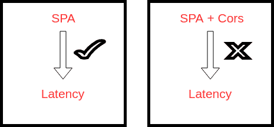
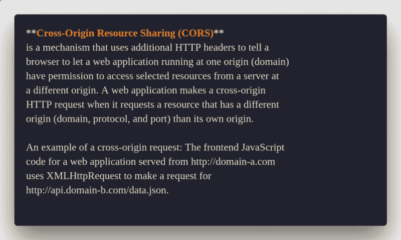
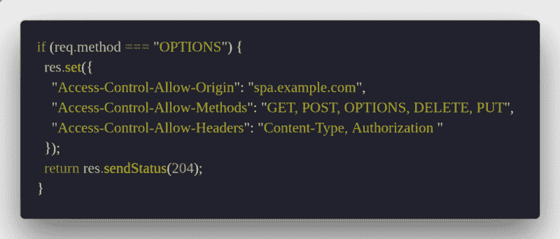

# 跨来源资源共享请求如何影响您的应用程序的性能

> 原文：<https://www.freecodecamp.org/news/the-terrible-performance-cost-of-cors-api-on-the-single-page-application-spa-6fcf71e50147/>

标题可能会让你认为这篇文章是另一篇关于“单页应用程序”缺点的咆哮文章。它更多的是关于在设计 SPA 时要牢记的*性能观点。*尤其是如果你的SPA 消费了来自不同域服务的 API。

如果您正在设计一个 SPA，它使用来自 SPA 的同一个域的 API，那就太好了。如果您的 SPA 只从同一个域上的 API 提取，那么您应该跳过这篇文章。

大多数水疗都涉及“微服务”。他们使用 SPA 中不同域提供的不同服务端点。这增加了我们产品的弹性、容错能力和改进的用户体验。除非我们严格遵循同一个域应用 **API 网关 SPA 的微服务模式**,否则多域请求将不可避免。

SPA + Cors does not always reduce the latency.

让我们想象一下，我们有一个来自域`api.example.com`的`GET` API `/users/report/:id`。我们的 SPA 从`spa.example.com`开始提供服务。`:id`意味着它是一个可以根据每个请求而变化的值。

您能猜出上述 API 设计在 [CORS](https://developer.mozilla.org/en-US/docs/Web/HTTP/CORS) (跨源资源共享)方面的问题及其对我们 SPA 性能的影响吗？

下面是来自 MDN 的 CORS 的简介:

CORS 是好的，尽管它是一个简单的请求，不会触发 T2 CORS T3 的飞行前准备。但是大多数时候，我们提出的请求并不是一个简单的“T4 请求”

这是因为我们需要发送一个不是 [CORS 安全列表请求报头](https://fetch.spec.whatwg.org/#cors-safelisted-request-header)的报头。标题的一个例子是`Authorization, x-corelation-id`。通常我们的`Content-Type`头值是`application/json`。这不是[CORS-safe listed-request-header](https://fetch.spec.whatwg.org/#cors-safelisted-request-header)的`[Content-Type](https://developer.mozilla.org/en-US/docs/Web/HTTP/Headers/Content-Type)`标头允许的值。

如果我们的`api.example.com`服务器接受`application/json`的`content-type`，我们的 SPA 域`spa.example.com`将首先通过`[OPTIONS](https://developer.mozilla.org/en-US/docs/Web/HTTP/Methods/OPTIONS)`方法发送一个 HTTP 请求。它被发送到另一个域`api.example.com`上的资源`/users/report/12345`。为了确定实际的请求是否可以安全发送，该选项将被预先发送。跨站点请求总是这样预先检查，因为它们可能对用户数据有影响。

服务器的工作是让另一个域知道发送数据是安全的。你可能已经在你的应用程序中为 CORS 做了类似的事情。

Allowing CORS on Express.js Server

一旦`api.example.com`服务器从“选项”方法向其他域`spa.example.com`发送正确的响应，那么只有您试图发出的请求的实际数据才完成。

> *因此，为了访问资源`api.example.com/users/report/12345` **，执行了两个实际请求。***

你可能会说是。我们可以使用`[Access-Control-Max-Age header](https://developer.mozilla.org/en-US/docs/Web/HTTP/CORS#Preflighted_requests#Access-Control-Max-Age)` 来缓存预检请求的结果。下次我们从`spa.example.com`访问资源`api.example.com/users/report/12345`时，没有飞行前请求。

是的，这是真的，但是请记住标题——单页应用程序(SPA)上 **CORS** 请求的可怕性能成本。这来自于我们正在使用的 API 及其设计方式。在我们的例子中，我们设计了我们的 API `/users/report/:id`，其中`:id`意味着它是一个可以改变的值。

> *预检缓存的工作方式是基于每个 URL，而不仅仅是来源。这意味着路径(包括查询参数)的任何变化都保证了另一个飞行前请求。*

因此在我们的例子中，为了访问资源`api.example.com/users/report/12345`和`api.example.com/users/report/123987`，它将从我们的 SPA 总共触发四个请求。

如果你的网络很慢，这可能是一个巨大的挫折。尤其是当一个选项请求需要 2 秒钟来响应，而数据又需要 2 秒钟。

现在想象一下，您的 SPA 应用程序为不同的域发出数百万个这样的请求。会对你的 SPA 的表现产生可怕的影响。你正在加倍每个请求的等待时间。

> 水疗中心在它们自己的领域里很棒。但对于消费不同的领域，他们有自己的成本。如果 API 设计得不好，SPA 的延迟问题带来的伤害会超过它提供的好处。

没有完全好或坏的解决方案或技术。知道它的缺点和如何让它工作才是最重要的。这是您的应用程序与其他应用程序的不同之处。