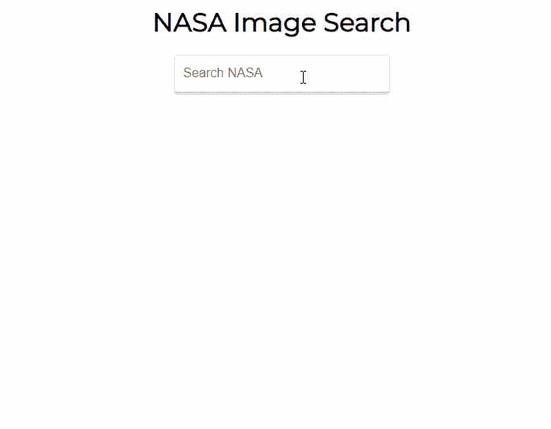
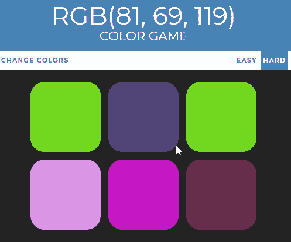
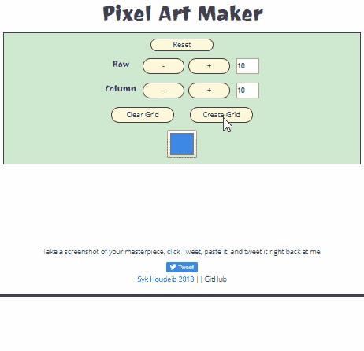

# 让我获得前端开发工作的工具和资源

> 原文：<https://www.freecodecamp.org/news/the-tools-and-resources-that-landed-me-a-front-end-developer-job-1314c6f1fa7f/>

学习前端开发有时候会有点力不从心。资源和工具如此之多，时间却如此之少。你应该选什么？你应该关注什么？

在我之前的文章[我如何在 10 个月内转行并找到一份开发人员的工作](https://medium.com/p/b8895e855a8b?source=your_stories_page---------------------------)中，我谈到了我的旅程。我是一名没有相关经验的英语教师，我设法在马德里的一家初创公司找到了一份前端开发人员的工作。

在这篇文章中，我将深入探究我曾经使用的资源和工具。

我们将参观我学过的课程，看看它们的优缺点。谈谈我和他们一起做的项目。然后，我们将围绕这一旅程中成功的所有其他基石进行详细的游览。比如使用 GitHub，建立投资组合，保持动力。

### 学什么，在哪里学？

我坐在屏幕前盯着太阳的图像。我想同时尖叫、大笑和哭泣。这不是任何太阳的图像，这是我刚刚从美国宇航局的数据库中提取的图像！在似乎永远都在试图弄清楚如何使用 NASA API 之后，我终于成功了。我感觉自己像个顶级黑客，我很快就能控制交通灯了！

事实上，我根本不会控制红绿灯，现在也不会。但当时我不知道的是，再过几天我就能得到一份真正的工作了。

Sun Image source: NASA Image and Video Library

那么一个人是如何从一点前端开发的知识都没有，到一份外勤的工作呢？要学什么，在哪里学？

刚开始学的时候，这是我最担心的事情之一。我的时间很宝贵，我需要尽可能用最好的方式投资。一直有人问我这个问题，尤其是我的 Twitter 社区。这是新手一直担心的事情。

这可能会让很多人感到惊讶，但我认为这是整个职业转变过程中最不重要的因素。这并不像一开始看起来那样具有决定性。

不管你用什么方法，只要你坚持不懈，保持动力，你都会学得越来越好。

不要误会我的意思，有一些低水平的课程，还有一些很棒的课程。找到学习所有必要技能的正确途径是非常重要的。

然而，如果你中途失去了动力，即使是最好的规划和最伟大的课程也将毫无用处。所以问题不在于哪些课程是最好的，而在于哪些课程遵循了一种能让你保持动力的方法。这取决于你作为一个个体，以及你如何学习。

我的建议是，在你一头扎进去之前，花些时间了解你的学习风格。找到适合你的方法。在你承诺之前尝试不同的课程和风格也是可以的。

### 我的课程

在我长达 10 个月的紧张学习过程中，我浏览了大量可用的资料。我寻找我每时每刻需要的东西，以及让我保持兴奋和投入的东西。我在课程中跳来跳去，从这里或那里学点东西，只通过我所学的东西来衡量我的进步。

我有一份全职工作，所以我需要资源来让我自己决定进度。经济上，我负担不起新兵训练营或昂贵的课程。所以我充分利用了所有可用的免费和打折资源。当我得到这份工作时，我已经花了不到 100 欧元。

在这一部分的末尾有一个链接，链接到我在这里提到的所有资源。

#### 首先是 YouTube

我看的第一个 web 开发教程是 Jake Wright 的《12 分钟学会 HTML》，接下来是《12 分钟学会 CSS》。这导致了我的第一个网页。这花了很少的时间，而且很有激励性。这是基本的，有点过时，但它非常适合零知识的绝对初学者。

我也经常使用 Traversy 媒体和 LevelUpTuts 教程视频。

#### 网络开发者训练营——柯尔特·斯蒂尔

这是 Udemy 最受欢迎的 web 开发课程之一。它经常以折扣价出售。柯尔特是个好教练。它从一开始就带你，慢慢构建。最后你会得到一堆好看的项目来展示。

但是，课程非常广泛，如果您只对前端感兴趣，可能会太多。代码跟随风格适合初学者。但是并不鼓励你自己去解决问题，这才是你需要学习的。

我制作了 [RGB 颜色游戏](https://github.com/Syknapse/RGB-Color-Changing-Game)和 [Patatap 克隆](https://github.com/Syknapse/Patatap-Clone)。它们很有趣，是面试中的一个很好的话题。尽早拥有一个正常运行的 web 应用程序是一个很好的信心提升。

#### FreeCodeCamp.org

这是我对任何刚开始从事 web 开发的人的第一个建议。你注册并立即开始写代码。准备和设置时间为零。你迷上了——需要那些绿色的扁虱！

课程涵盖了你学习现代发展所需的一切。它有一个活跃的社区。它是免费的。最重要的是，这个组织本身和它的使命都是伟大的。

但是最好的部分是项目。这需要一段时间，你必须从头开始建造。但这正是你发展技能所需要的那种练习。尽管没有直接的指南可以遵循，活跃的社区意味着你总能找到答案。

我制作了一个[致敬页面](https://github.com/Syknapse/Tychos-Supernova)给我最喜欢的明星(氢型，不是红毯型)、我的作品集和一个 React [随机报价生成器](https://github.com/Syknapse/random-quote-machine-react-beta)。

#### JavaScript 30 — Wes Bos

韦斯是我最喜欢的老师之一。你知道，当你上他的任何一门课时，你都会对这门学科有最新最深入的了解。我会毫不犹豫地推荐他的任何课程。

我主要致力于他的免费 JavaScript 30 课程，我不能夸大它有多有用。我做的每一个快速项目都成了参考。我会一遍又一遍地回想，回忆我是如何做这件事或那件事的。当我准备技术测试、面试和刚开始工作的几个星期时，我会参考它们。这可能是对一门课程最好的评价了！

这些令人敬畏的项目包括一个[钟](https://github.com/Syknapse/Clock)，一个[鼓机](https://github.com/Syknapse/Drum-Kit)，和一个[搜索工具](https://github.com/Syknapse/Ajax-Type-Ahead)。

#### Lynda.com

我利用免费试用的机会，上了一堆课。我发现克里斯蒂娜·张是一个优秀的教练。我从她的课程中学到了很多关于高级 CSS、工作流工具和在线建立网站的知识。我还通过 Ray Villalobos 提高了我的 Git 技能。

Lynda.com 的课程非常好。但是他们的目录对于网络开发来说不够专业。它缺乏其他更专注的平台的一致性。

#### 树屋

说到专业，树屋是一个很好的例子。我也只是做了免费试用来体验一下，我喜欢它。它有非常明确的路线和大量深入的学习材料。

#### 学会足够多的危险命令行——迈克尔·哈特尔

这是一个简单的简短教程，但它给了我解开命令行之谜并开始使用基本知识所需要的东西。

#### 面向开发者的 JavaScript 和 React 卡西迪·威廉姆斯

卡西迪是一个非常有知识的教练，她的风格是愉快的学习。这门课给了我很大的压力，迫使我去处理高级概念。在我开始第一份工作的 10 个月旅程的末尾，我开始了它。

我学会了如何使用 API 进行调用并显示返回的数据。我创建了一个 [GitHub 用户搜索应用](https://github.com/Syknapse/GitHub-User-Search-app)，这是我学习经历中的一个伟大时刻。然后我开始使用我在开头提到的 [Nasa 媒体搜索应用](https://github.com/Syknapse/NASA-Media-Search-App)。

当我不得不停下来为一个工作面试做一个带回家的挑战时，我还在努力。这个挑战和我在课程中所做的差不多。

我完成了挑战，得到了工作！

#### 前端 Web 开发人员 Nanodegree (FEND) — Udacity

开始学习几个月后，我获得了谷歌奖学金，在 Udacity 上学习前端课程。然后我被选中参加第二阶段，实际上是整个 Udacity FEND 项目。那对我来说是非常幸运的。

但是，这里强调一点很重要。如果你拿不到奖学金或者负担不起一个纳米学位，这不会影响你成功的机会。虽然这是一次对我帮助很大的积极经历，但它不是决定因素。事实上，我在完成 FEND 项目前几个月就得到这份工作了。

当我拿到奖学金的时候，我知道我很认真地想改变职业。所以如果没有它，我会开始在我的教育上投入更多的钱。举例来说，我会选择在 Treehouse 或 Udacity 按月订阅。

课程本身质量很好。讲师都是顶尖的行业从业者，在该领域拥有丰富的知识和经验。这些项目既有挑战性又令人兴奋。你得到了导师和对你的项目非常有价值的代码评审。

但是毫无疑问，这个课程和这次经历的最大好处是活跃和高度参与的社区。这应该是你在任何资源中寻找的第一件事。最终，你从课程伙伴那里学到的和从老师那里学到的一样多。

像素艺术项目只是该课程众多优秀项目中的一个。这是我迄今为止构建的最复杂的项目。当我试图添加更多功能时，它真的让我很投入，并帮助我“像程序员一样思考”。

#### 学习跟踪器

如果你想知道更多关于我前 10 个月到底做了什么的细节，请查看我的学习跟踪器。这是一个 GitHub repo，在这里你可以找到我做过的每一门课程和链接。加上许多其他有用的资源。你甚至可以把它作为你自己学习跟踪器的模板。

### 超越课程:成功的基石

课程和教程很棒，但是光靠它们是不够的。成功还有很多其他重要的工具。你应该给予这些至少和你选择的课程同等的重要性。

以下是我在从零到开发工作的过程中发现的无价之宝。

#### 保持动力

这是当务之急。失去它，我就一无所有了。当事情变得艰难时，有三件事帮助我保持动力。

首先是我的目标。我设定了一个目标，要在一年内找到一份初创公司的前端开发工作。这让我们更容易保持专注，度过自我怀疑和缺乏动力的时刻。

第二，我的亲密关系网。尤其是我的搭档和一个密友，他们同时在学习。和其他人一起做这个过程是非常有帮助的。他们正经历着同样的感受。能够互相交流想法，加强我们的学习，并获得建议，这真是太棒了。

第三是在线社区。我从身边的人身上学到了很多，不断得到鼓励和理解。

保持动力是一个挑战，但这是可以做到的。这都是关于我们在进步的感觉。继续建造东西，不管有多小。不要重复过去让你失败的学习方法。

#### 社交工具

对我来说，最重要的是 Twitter。它让我接触到专业人士和学习者。它让我了解情况，是一个不断的材料和资源的来源。它帮助我建立了人际网络，并最终帮助我找到了工作。

我的 Twitter 体验的核心是 freeCodeCamp、#100DaysOfCode 和#CodeNewbie 这些紧密相关的社区。这些都是非常积极和支持我的社区，帮助了我的每一步。Alexander Kallaway 的 [#100DaysOfCode](https://www.100daysofcode.com/) 挑战是一个非常简单的想法，而且确实有效。每天至少花一个小时写代码，公开承诺，鼓励他人。

这个社区在让我保持动力和责任感方面发挥了巨大的作用，对此我说不尽。向我在旅途中结识的所有好朋友发出热情的呼喊。

#### 开源代码库

当你进入代码世界的那一刻，你就开始听说 GitHub。当你第一次参观它时，它可能是一个非常令人生畏的地方。因为它完全是关于开源和协作的，所以作为一个初学者，你可能认为它与你无关。相信我吧。

这是你作为程序员工作的基石。您将在任何工作中每天使用 Git 和 Git 托管服务。你会很快意识到基本原理很简单。

一旦我克服了最初的困惑，GitHub 就成了我学习经历的中心。这基本上成了我的默认投资组合。我所有的代码都在那里。使用 GitHub 页面，我有了一个免费托管我所有项目的地方。我还用它来跟踪我的学习，并进行协作。

这一点甚至更加重要，因为我以前没有这方面的经验。我只有我的 GitHub 来展示我所知道的。它成为了我能做什么和我能学到什么的最好反映，也是大多数雇主首先会考虑的地方。所以我确保里面装满了项目和详细的文档。

当我决定在 Udacity 帮助我的课程伙伴时，我学习过程中的一个重要时刻到来了。我注意到许多人被 GitHub 吓倒了。所以我创建了一个简单的项目，一步一步的教程。我创造性地将其命名为[为这个项目做贡献](https://github.com/Syknapse/Contribute-To-This-Project)。教学是最好的学习方式，不管你知道的有多少，你仍然可以帮助别人学到一些东西。

#### 建立投资组合

即使有一个活跃的 GitHub 个人资料，你仍然需要一个作品集来展示你的作品。建立一个功能齐全的网站也是很好的实践。如果你没有项目要放入你的投资组合中，那就把它做出来，然后边做边往里面添加东西。

我很早就对我的投资组合有了一个想法。我把它画在一页纸上，想象着要过很长时间我才有能力把它变成现实。事实上，我开始建造它比我想象的要快得多。这很好，因为第一个宏伟的愿景永远不会完美。

这是我从零开始独自尝试过的最复杂的事情。一次让我受益匪浅的深度学习经历。我不得不不断研究，以找出如何做我想做的事情。我花了大量时间阅读 MDN 文档和堆栈溢出。我不得不面对挫折，浪费几个小时试图修复一个错误，结果却是一个拼写错误。

但这正是学习编程的意义所在。这些正是我每天在工作中使用的技能。学习如何研究、调试、解决问题和处理挫折是成为开发人员的关键。

然后我完成了我的作品集，它看起来和工作起来几乎和我希望的一模一样。我欣喜若狂——看我创造的东西！——几乎立刻意识到，作为一个投资组合，它完全没有用！我深吸一口气，接受了它，并在第二天开始建立我的新投资组合。我希望这个简单又实用。一个展示我的作品和一点关于我的地方。它需要在每种设备上运行。它不需要烟火和魔法。

这就引出了我的下一个相关问题。

#### 自己动手建造东西

我从零开始建立的这两个网站是我学习的基础。做一些没有教程的事情可能会令人望而生畏。但是对于学习来说是很棒的，即使结果不是很棒。这些早期的陷阱是学习的财富，帮助我在工作的最初几周做好准备。

这并不意味着我回避教程和指导项目。但它促使我在我正在构建的任何东西上添加额外的功能，更进一步，自己做更多的事情。

你建造了什么并不重要，你会从中学习。例如，我做了一个非常简单的温度转换器。这并不是一个令人兴奋的项目，但这是一个挑战，我必须完全靠自己解决。当我完成时，我很自豪它能正常工作。

#### 播客、文章、讲座、聚会

如果你是从零开始，要学的东西太多了。主动学习的时间对我来说是不够的。我用被动的时间让自己沉浸其中，尽可能多的了解这个我想进入的新世界。

我读文章，看演讲视频，听播客。我通常试图利用一切机会深入语法之外的概念。

聚会和会议很棒。我住在一个小镇上，在那段时间里管理了一个与技术相关的活动。但是如果你有机会，不要被吓倒。没有人会阻止你，要求你证明自己的价值！

以下是我最喜欢的一些资源:

*   命令行英雄—红帽播客
*   base . cs—Vaidehi Joshi 的计算机科学播客
*   Syntax.fm —韦斯·博斯和斯科特·托林斯基播客
*   CodeNewbie — Saron Yitbarek 播客
*   自由代码营媒体出版物
*   黑客午间文章
*   粉碎杂志— CSS 文章
*   CSS-技巧
*   时事通讯:JavaScript 周刊和前端焦点。
*   速成班:计算机科学——YouTube 系列
*   CS50—CS 哈佛讲座的 YouTube 视频
*   当然还有 YouTube 上关于这个领域的演讲和非技术方面的内容。这里有一个链接指向[我的播放列表](https://www.youtube.com/playlist?list=PLPOncoWIkU9MBFf9s-B_n-IxK0A03FWIG)，里面有我最喜欢的 YouTubers 节目。

### 祝你好运

我的学习过程是紧张的，有时是无情的。但重要的是避免倦怠。我花了很大的努力去有规律地休息，吃得好，有规律地锻炼，时不时地休息。当它开始让我感觉太多的时候，我会花一个下午或者一整天的时间完全切断联系。

这需要付出很多努力和牺牲，但对我来说，每一秒都是值得的。我很高兴我的新职业是前端开发人员，如果有必要，我会再做一次。

而且不要苛责自己，你的旅程和将要面对的困难都是不一样的。继续走。

我真的希望你喜欢这篇文章，并发现它很有用。如果你做了，请多次点击拍手按钮:)。如果你分享它，甚至会有更多的人看到它，这将是令人敬畏的！
*[在 Twitter 上关注我](https://twitter.com/Syknapse)，如果你想让我写得更详细，请告诉我。*

查看我关于获得第一份工作的文章