# 我使用的工具加快了我的工作流程，让我自己更有效率

> 原文：<https://www.freecodecamp.org/news/the-tools-i-use-speed-up-my-workflow-and-make-myself-more-productive-fb6f457e242e/>

由 Egwuenu 礼物

# 我使用的工具加快了我的工作流程，让我自己更有效率

Photo by [Szabo Viktor](https://unsplash.com/@vmxhu?utm_source=medium&utm_medium=referral) on [Unsplash](https://unsplash.com?utm_source=medium&utm_medium=referral)

几乎每个开发人员每天都使用不同的工具来帮助他们实现目标或完成特定的任务。在这篇文章中，我将概述我在日常活动中使用的工具。我想做的第一件事是定义一个工作流程。

### 什么是工作流？

工作流是处理一组数据的一系列事件或任务。工作流出现在各种商业和行业中。它们是描述事物如何从正在进行的工作到完成，或者从原始到处理的路径。

举个例子:我有一个写文章的工作流程。我从寻找帖子的创意开始。接下来，我创建一个大纲。然后撰写帖子的实际内容，发布所有这些都是完成任务的一系列事件。

作为一名开发人员，我倾向于利用某些工具来帮助加快完成特定任务的过程。尽管这些过程对每个人来说可能都不一样，但我仍然觉得有必要与你分享。最后没有知识流失吧？

### 我用来提高工作效率的工具

这将是一个广泛的列表，所以我会尝试将它们分成不同的类别，我会重点介绍我在编码、写作时使用的工具，以及我认为总体上对您有帮助的其他工具。

#### 编码工具

**吉塔拉克**

GitKraken Homepage

我最近从一个朋友那里知道了这个工具，我真的很喜欢使用它。比起使用 GUI，我更喜欢使用命令行，但是这个工具非常不同。GitKraken 是一个 GitHub 客户端应用程序，它的工作方式就像您已经习惯的命令行一样，但是它具有直观的 UI/UX，当您在命令行上使用它时，会有很好的体验。

**失眠**

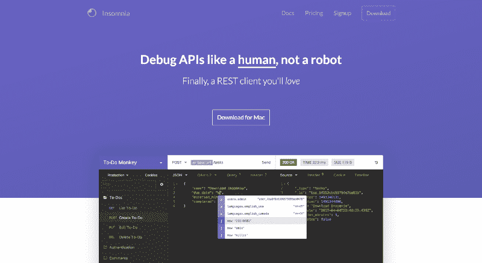

Insomnia Homepage

这个工具是我非常喜欢使用的另一个工具。它类似于 Postman，但也允许您查询 GraphQL 端点，这很酷吧。失眠症是一个强大的 HTTP 和 GraphQL 工具带，可以在 Mac、Linux 和 Windows 平台上使用。它的特性包括 GraphQL 支持、SVG 和图像预览、AWS 认证等。

**Visual Studio 代码**

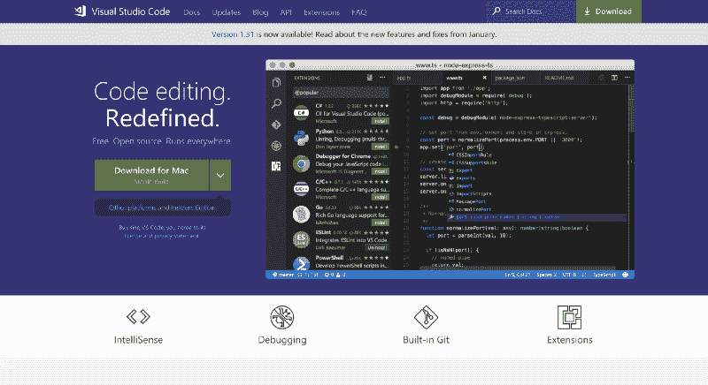

Visual Studio Code Homepage

Visual Studio Code 是一个我非常喜欢使用的代码编辑器。我已经用了几年了，但是我没有找到任何理由停止使用。随着不断的改进和新特性的定期添加，这是我对代码编辑器的首选。

**破折号**

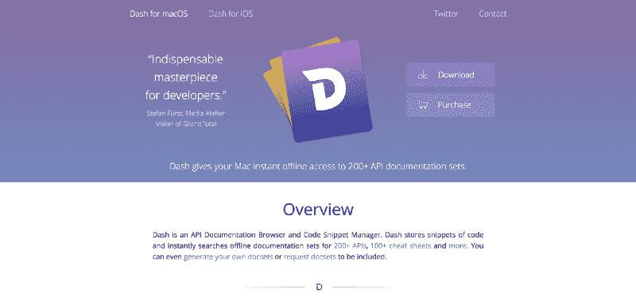

Dash website

Dash 是一款面向开发者的 Mac 应用，可以让你免费离线访问 200 多种 API 文档。您可以创建自己的文档集，甚至请求不包含的文档。对于 Windows 用户来说，这款应用的替代产品是 Zeal App。

**源代码管理**

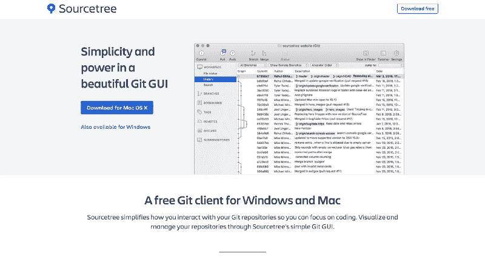

Sourcetree Homepage

有没有想过用 GUI 代替 Git 的命令行？那么 SourceTree 是你最好的选择。我已经提到过 GitKraken，它们都做同样的工作——我通常会偶尔在两个应用之间切换。所以我会说用最适合你的，它们都是很棒的应用。

**Postico**

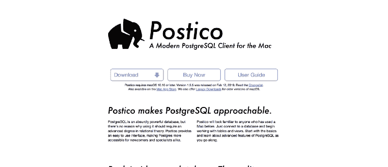

Postico Homepage

Postico 是 Postgres 的一款客户端应用。它有一个漂亮的用户界面，很容易访问。与我找到的其他应用程序相比，我更喜欢使用它，甚至更喜欢使用 Postgres 命令行。

**超级**

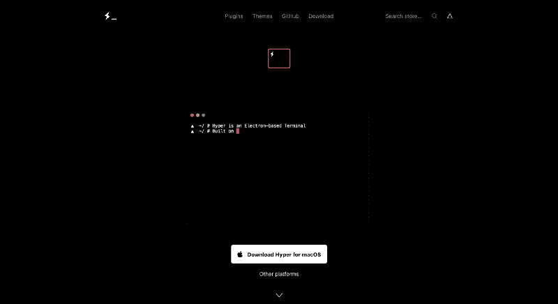

Hyper Homepage

Hyper 是我喜欢使用的一个工具。事实上，它是我编码的默认终端。Hyper 很容易定制，可以集成很多插件，对我来说是一个很好的选择。

#### 书写工具

**观念**

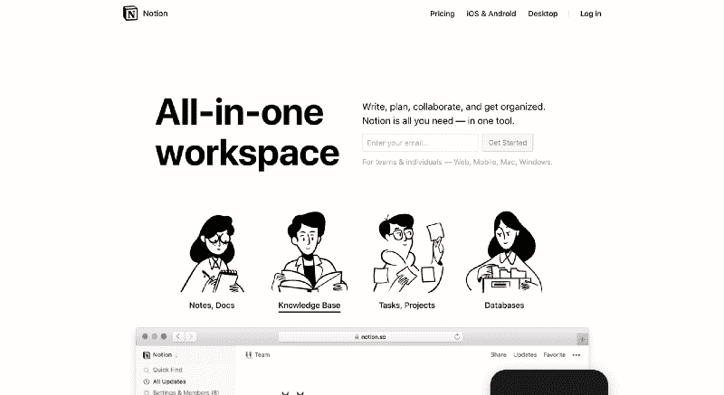

Notion website

观念是你需要的几乎所有东西的工具。我还没有接触过对这个工具有负面想法的人。超级有帮助。你可以用意念写作、计划和合作。

**收纳盒纸**

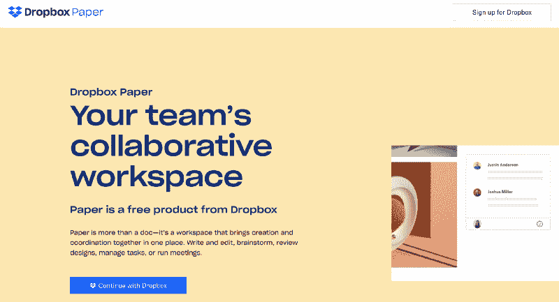

Dropbox paper website

Dropbox 的纸张是一个很好的写作工具。我经常用它来做笔记、写文章和做其他事情。它支持降价格式。

**小熊 App**

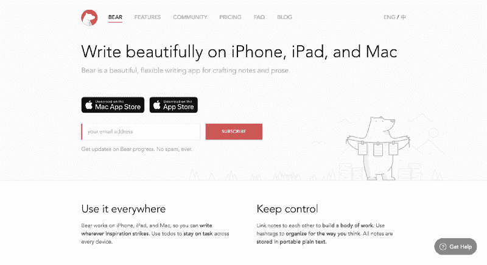

Bear Website

我喜欢多样化，所以如果我分享了许多执行类似任务的应用程序，请原谅我。小熊应用是一个制作和书写任何东西的应用。它可以用来写文章，记笔记，也可以作为一个待办事项应用程序。

**插入符号**

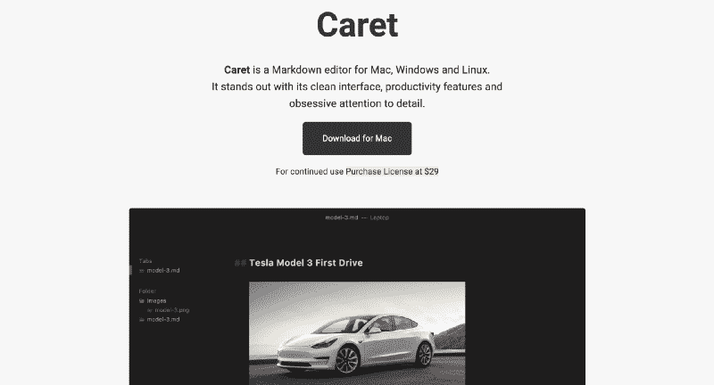

Caret 是一款面向 Mac、Windows 和 Linux 用户的 markdown 编辑器。它可以让你在 Markdown 中写内容，并且附带了很多非常有用的功能，比如我非常喜欢的黑暗模式。

#### 部署

**Netlify**

Netlify website

Netlify 是我喜欢用来部署我的应用程序的工具。它是一个统一的平台，可以自动化您的代码来创建高性能、易于维护的站点和 web 应用程序。

github pages

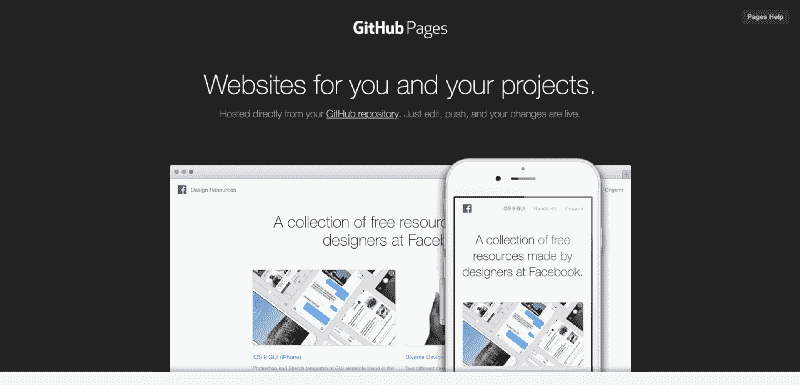

GitHub Pages Website

当你需要免费升级网站的部署版本时，GitHub Pages 非常有用。通过 git 存储库的几个设置步骤，您就有了一个已部署的网站。我经常用这个。

**萨帕尔**

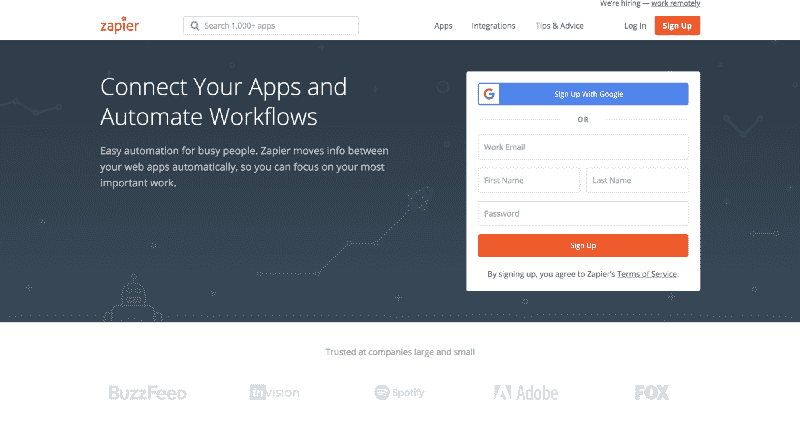

Zapier website

Zapier 是一个自动化工具，几乎可以自动化你能想到的任何东西。当我发表一篇新文章时，我用它来自动发送推文，通过我的 twitter 账户和 RSS feed 创建一个 zap。

#### 多方面的

**火箭**

Rocket website

火箭是一个松弛风格的苹果表情符号。它的工作原理就像 Slack 中的表情符号查找器一样。当您想要使用表情符号时，请输入冒号，键入其名称，然后再次按 Enter 键进行插入。比用 Mac 内置的表情符号键盘方便多了。

**Numi**

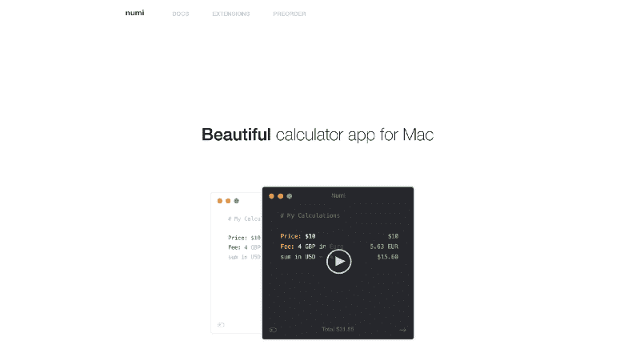

Numi Homepage

Numi 是一款适用于 Mac 电脑的计算器应用。我必须说，这不仅仅是一个计算器，因为它的功能远不止这些。当我发现我可以用它兑换几乎任何东西时，我大吃一惊，例如，把美元兑换成我的当地货币奈拉！？

**口袋**

Taskade website

Taskade 是一个有很多功能的应用。我用它来做待办事项，我的周计划，也用来做笔记。与此同时，这个应用程序可以做很多事情。难怪它被标记为敏捷团队的即时协作工具。

**RecordIt**

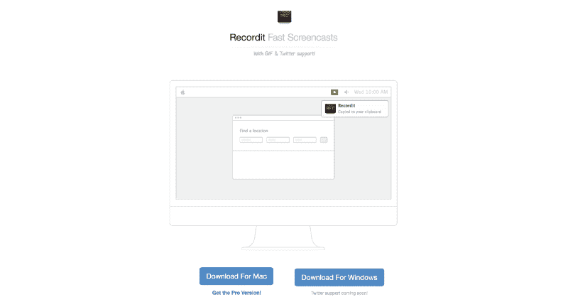

Recordit website

[RecordIt](http://recordit.co/) 是一款录制截屏视频的应用。我发现当我需要创建一个快速演示或展示一个特定的东西如何以 gif 格式工作时，这真的很有帮助。

**意识到**

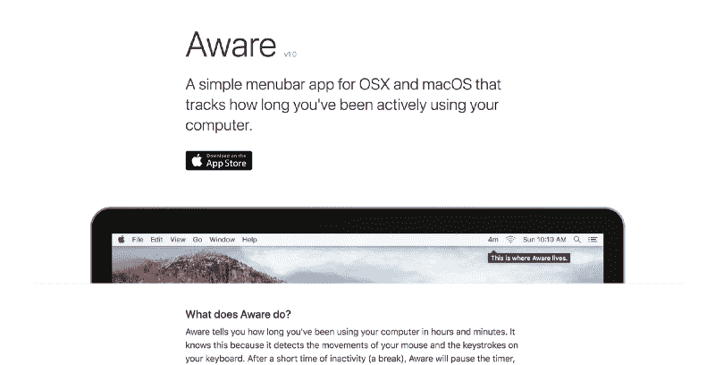

Aware website

[Aware](https://awaremac.com/) 是一款 Mac 应用程序，可以帮助您记录自己活跃使用电脑的时间。我用它来记录我工作或完成一项特定任务所花的时间。

#### **结论**

我希望你会发现列出的这些工具都很有用，并开始使用它们来使你的工作变得容易得多。我的想法是与你分享我发现有用的工具，如果你也能与我分享这里没有列出的你发现有用的工具，我真的很高兴。让我们都保持生产力！