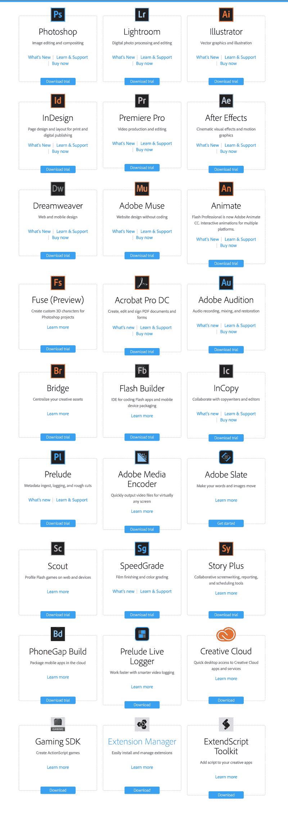
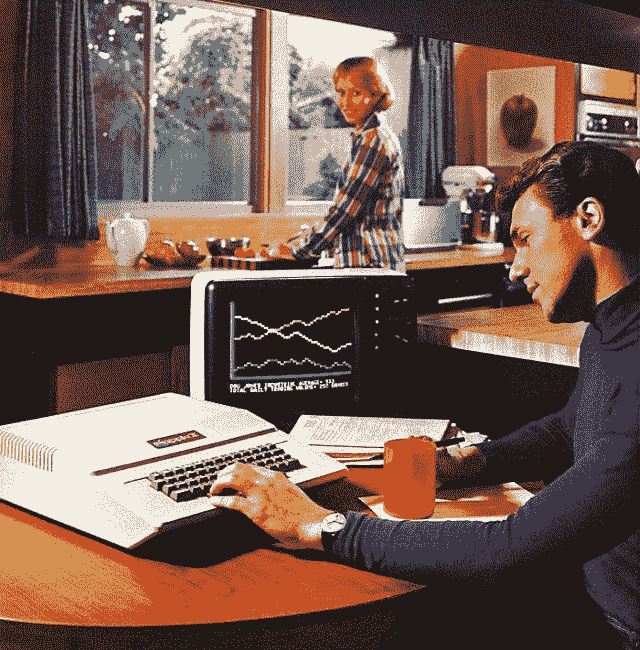

# 为了保持相关性，2016 年你必须掌握的 17 大设计工具

> 原文：<https://www.freecodecamp.org/news/the-top-17-design-tools-you-must-master-in-2016-to-stay-relevant-543ac02e681d/>

阿德里安·汉福特

# 为了保持相关性，2016 年你必须掌握的 17 大设计工具

#### (或者，有没有一种技能可以让所有软件都变得无关紧要？)

这是一个测验。浏览下面的 Adobe 桌面应用程序列表，看看你精通多少。

你做得怎么样？现在再次浏览 Adobe 的 iPhone 应用程序列表，记下您已经掌握的应用程序…

你的总数是多少？如果你对这 59 个项目中不到 17 个项目的熟练程度进行了统计，我有一些坏消息要告诉你。你落后了，你可能不会再被雇用了。我们的行业需要它。此外，我们欠我们的雇主尽可能多地使用我们每月 49.99 美元的订阅。

我说的对吗？当然不是。

设计师从一开始就被工具愚弄。无论是不断的软件升级还是拥有最新的计算机，人们都很容易相信我们的价值在于操作简单易用的机器，任何人都可以做到。

Advertisement introducing the Apple II

现成解决方案的可用性增加了任何人都可以成为设计师的感觉。二月份，显然又有 50 种新鲜资源涌入市场，诱使你走捷径。

不管你的简历怎么说，你带给工作的不是软件知识。在软件中点击可能感觉像是设计，但真正的工作并不发生在屏幕上。不，你是通过锻炼两耳之间的黏糊糊的东西来挣工资的。

我们不需要另一份免费资源清单或另一份每月软件清单。我们需要增强我们的脑力。对我来说，这意味着掌握我们武器库中最重要的武器:**清晰**。如果你能掌握这一概念，不管你是否还在 Power Mac G4 上运行 Pagemaker 7，你都会做得很好。

#### 那么什么是清晰，你如何得到它？

最终目标是去掉所有不重要的东西，直到你剩下一个清晰的、令人信服的想法。这就是清晰。比起简单，我更喜欢清晰这个词，因为这个目标并不容易。清晰很难。挑战始于对设计师实际工作的困惑。

有一种普遍的误解，认为设计师是装饰者。有些人认为我们的角色是在一个项目结束时出现，并在所有东西上涂上一层糖霜。

设计师挥舞魔杖结束项目永远不会带来清晰的结果。相反，你最终只能用创可贴来掩盖严重的缺陷。你最终得到的产品看起来令人愉快，但却很难使用。当设计师成为装饰师时，他们的作品可能看起来不错，但有些地方不对劲，你无法准确指出。强大的设计带来澄清，低效的设计混淆了潜在的问题。

对于不熟悉设计思维的人来说，我们的工作可能看起来像软件熟练程度的清单。然而，应用技巧和像素推进只是追求清晰的最后一步。

走向清晰的第一步是从一开始就作为团队中值得信任的成员参与到项目中。这可能意味着[离开你的代理工作，成为一名内部设计师](https://medium.com/@ade3/five-things-i-learned-after-i-left-the-marketing-agency-world-185dc889bfd#.sulu22e7l)。这可能意味着离开你的设计筒仓，和工程师们坐在一起。无论决策是在哪里做出的，你都需要置身于行动之中。然而，事情并没有因此变得更容易。

在他的书中 [*忘记你曾经学过的关于平面设计的所有规则*](http://www.amazon.com/Forget-Rules-Learned-Graphic-Design/dp/0823018636)*设计传奇[鲍勃吉尔](http://www.bobgilletc.com)暗示，*

> *“有趣的文字需要枯燥的图形。”*

*我喜欢为无聊的图形而奋斗的想法。如果你发现自己在用设计来弥补糟糕的写作，那就停下来。你不是在解决问题，而是在让问题变得更糟。*

*往往设计师对我们作品选词没有太大发言权。偶尔你会有机会和一个熟练的文案一起工作，但是更多时候选词者不会像你一样痴迷于清晰。这是个问题。*

> *“有些人对文字很有一套。其他人没有办法。”史蒂夫·马丁*

*你可能会认为单词不是你的责任。这是冷漠的谈话，这是通往设计师地狱的第一步。不，单词*是*你的工作。尽你所能从有趣的词开始。如果有必要，你可以自己写。*

*有趣的词从何而来？是专门留给文案或者口齿伶俐的产品经理的特殊技能吗？不。关于写作，你需要知道的最重要的事情是:*

*好的写作是好的思考的结果。*

*就是这样。如果你发现自己完全陷入了一个设计任务，你可以打赌这个问题是有缺陷的想法。不良思维有数百万个原因。比如说…*

*也许清晰是虚幻的，因为你不了解你的用户。这可能是问题的一个线索是当你被期望同时满足多个观众的时候。*

*也许清晰度受到数据驱动的愿望的挑战。不是为你最了解的用户设计，而是为增加的数据收集而设计。设计良好的 A/B 测试并不等同于设计良好的解决方案。*

*也许清晰性受到了压力的挑战，在工作还没有完全完成之前就交付。市场将以这样或那样的方式决定你产品的命运，思维的缺陷是相信未来的迭代(设计磨砂)可以由设计装饰者在客户决定他们是否喜欢你的产品后应用。*

*也许产品的复杂性、过于雄心勃勃的营销计划、政府监管、僵化的品牌标准或不结盟的利益相关者的竞争优先权会扼杀清晰性。我可以继续下去。*

*浏览内部政治的雷区超出了这篇文章的范围，但是就像文案一样，不要相信这不是你的工作。你有责任努力澄清。否则，你的工作将沦为一名发型师向思维像后退的发际线一样单薄的客户推荐梳子。当你被迫对光头的想法做出反应时，即使是世界上最好的软件也无法拯救你。*

*感谢阅读。你的分享、推荐和推文让我快乐无比。我每周写一个故事，所以如果你想跟上我疯狂的想法，请关注我。如果这是你第一次接触我的文字，我可以把你指向 [*活死人艺术*](https://medium.com/@ade3/art-of-the-living-dead-e5ecd9093ae7#.t6r7y3drh) 作为进入我僵尸头骨更深角落的最佳入口点吗？*

*保持创造力。*