# 2017 年和 2018 年谁对开源贡献最大？我们来分析一下 GitHub 的数据，一探究竟。

> 原文：<https://www.freecodecamp.org/news/the-top-contributors-to-github-2017-be98ab854e87/>

费利佩·霍法

为了这个分析，我们将查看 GitHub 在 2017 年发布的所有`PushEvents`。对于每一个 GitHub 用户，我们必须做出最好的猜测来确定他们属于哪个组织。我们将只查看今年至少获得 20 颗星的存储库。

这是我得到的结果，你可以在我的互动数据工作室报告中修改。

### 比较顶级云提供商

2017 年 GitHub 展望:

*   微软似乎有大约 1300 名员工积极地将代码推送到 GitHub 上的 825 个顶级存储库。
*   谷歌显示约 900 名员工活跃在 GitHub 上，他们将代码推送到约 1100 个顶级存储库。
*   亚马逊在 GitHub 上似乎只有 134 名活跃员工，仅向 158 个顶级项目推送代码。
*   并不是所有的项目都是一样的:虽然谷歌人贡献给仓库的代码比微软多 25%，但这些仓库收集的星星要多得多(530，000 对 260，000)。亚马逊仓库 2017 星总和？27,000.

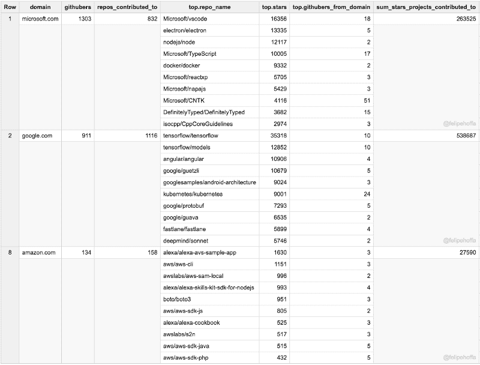

### RedHat、IBM、Pivotal、英特尔和脸书

如果亚马逊似乎远远落后于微软和谷歌，那么介于两者之间的公司是什么？根据这个排名，RedHat、Pivotal 和 Intel 对 GitHub 的贡献最大:

请注意，下表合并了所有 IBM 区域域——而各个区域仍然显示在后面的表中。

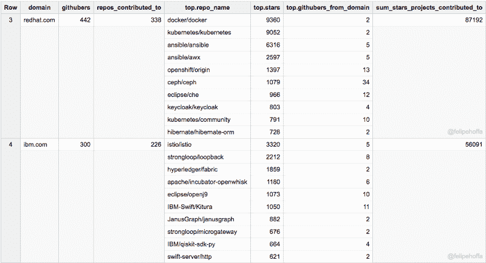

脸书和 IBM(美国)的 GitHub 用户数量与亚马逊相当，但他们参与的项目聚集了更多明星(尤其是脸书):

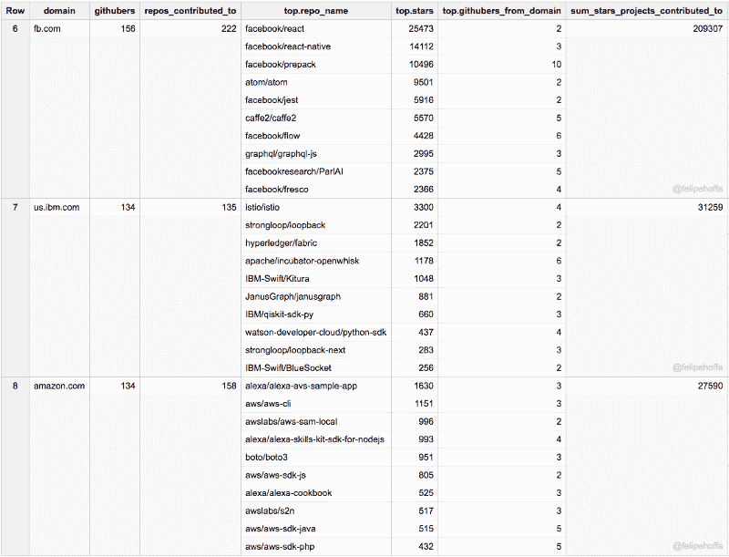

其次是阿里、优步和威克斯:

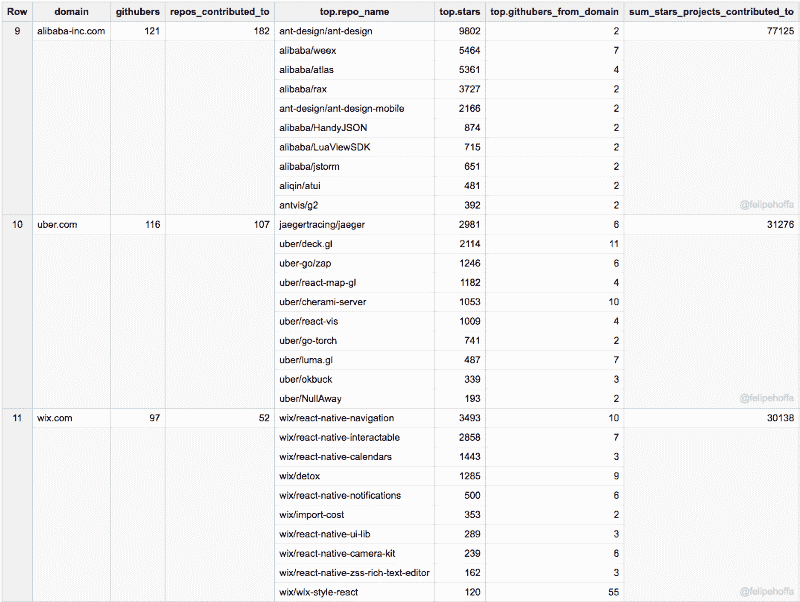

GitHub 本身，Apache，腾讯:

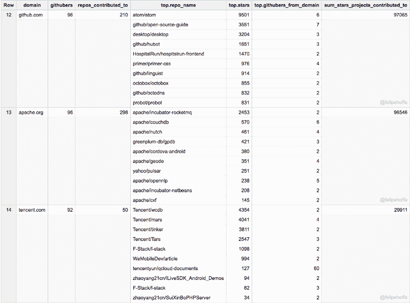

百度、苹果、Mozilla:

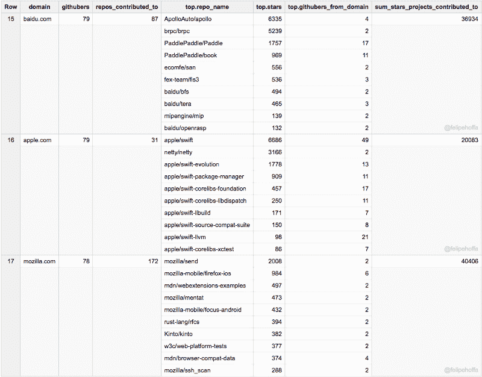

甲骨文，斯坦福，麻省理工，Shopify，MongoDb，伯克利，VmWare，网飞，Salesforce，Gsa.gov:

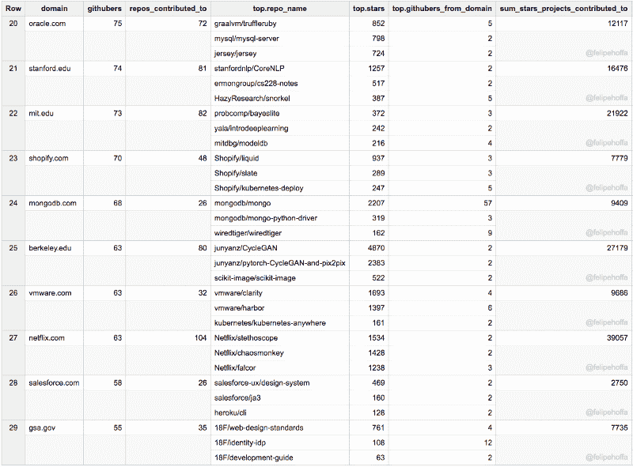

LinkedIn、Broad Institute、Palantir、Yahoo、MapBox、Unity3d、Automattic、Sandia、Travis-ci、Spotify:

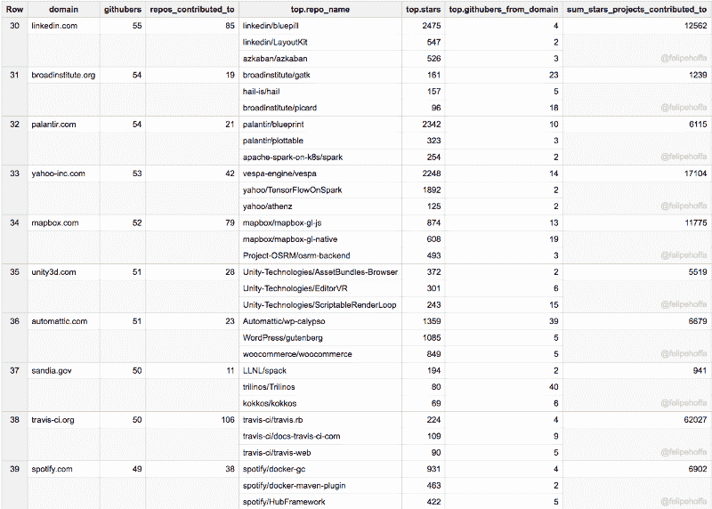

Chromium、UMich、Zalando、Esri、IBM(英国)、SAP、EPAM、Telerik、英国内阁办公室、Stripe:

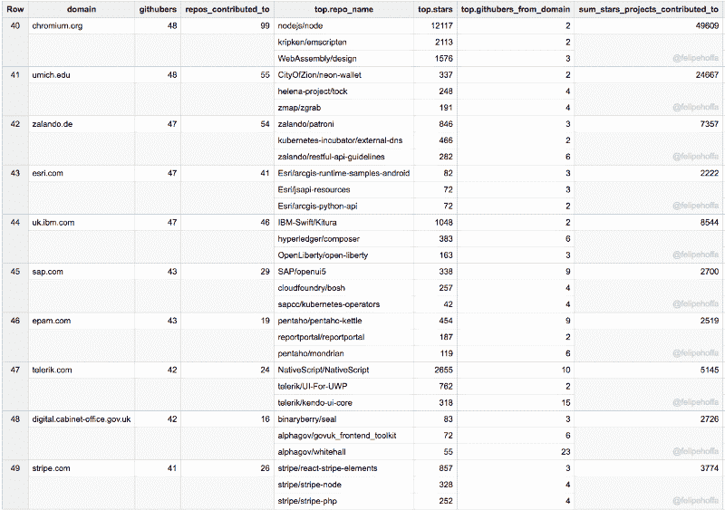

Cern、Odoo、Kitware、Suse、Yandex、IBM(加拿大)、Adobe、AirBnB、Chef、The Guardian:

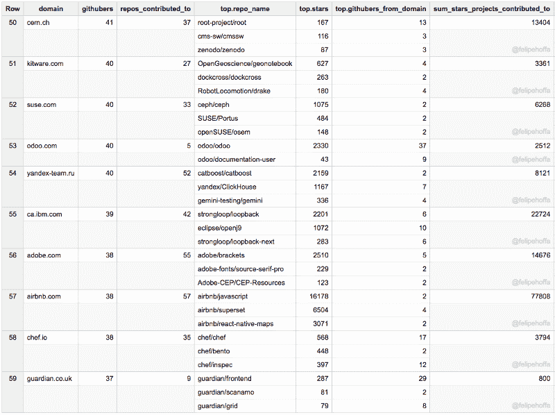

Arm、Macports、Docker、Nuxeo、NVidia、Yelp、Elastic、NYU、WSO2、Mesosphere、Inria

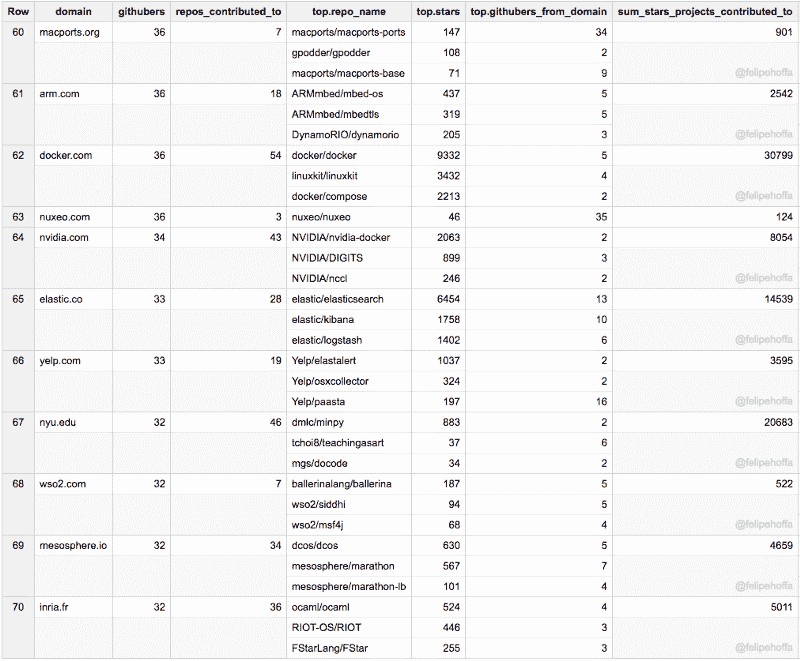

Puppet，斯坦福大学(CS)，DatadogHQ，Epfl，NTT Data，劳伦斯利弗莫尔实验室:

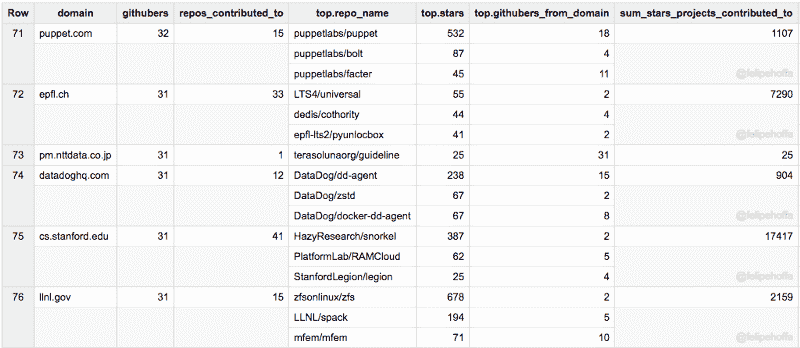

### 我的方法论

#### 我如何将 GitHub 用户与公司联系起来

确定每个 GitHub 用户所属的组织并不容易——但是我们可以使用 PushEvents 上包含的每个提交消息中显示的电子邮件域:

*   同一封邮件可能会出现在多个用户中，所以我只考虑了 GitHub 用户能够在此期间向超过 20 颗星的 GitHub 项目推送代码。
*   我只统计了期间推送 3 次以上的 GitHub 用户。
*   向 GitHub 推送代码的用户可以在他们的推送上显示许多不同的电子邮件——这是 Git 工作方式的一部分。为了确定每个用户的组织，我查看了他们的推送显示最频繁的电子邮件。
*   不是每个人都在 GitHub 上使用他们的组织邮箱。有很多 gmail.com、users.noreply.github.com 和其他电子邮件主机提供商。有时这样做的原因是匿名和保护他们的公司收件箱——但如果我看不到他们的电子邮件域，我就无法计数。抱歉。
*   有时候员工会跳槽。根据这些规则，我把它们分配给得到更多推送的那个。

#### 我的疑问

```
#standardSQLWITHperiod AS (  SELECT *  FROM `githubarchive.month.2017*` a),repo_stars AS (  SELECT repo.id, COUNT(DISTINCT actor.login) stars, APPROX_TOP_COUNT(repo.name, 1)[OFFSET(0)].value repo_name   FROM period  WHERE type='WatchEvent'  GROUP BY 1  HAVING stars>20), pushers_guess_emails_and_top_projects AS (  SELECT *    # , REGEXP_EXTRACT(email, r'@(.*)') domain    , REGEXP_REPLACE(REGEXP_EXTRACT(email, r'@(.*)'), r'.*.ibm.com', 'ibm.com') domain  FROM (    SELECT actor.id      , APPROX_TOP_COUNT(actor.login,1)[OFFSET(0)].value login      , APPROX_TOP_COUNT(JSON_EXTRACT_SCALAR(payload, '$.commits[0].author.email'),1)[OFFSET(0)].value email      , COUNT(*) c      , ARRAY_AGG(DISTINCT TO_JSON_STRING(STRUCT(b.repo_name,stars))) repos    FROM period a    JOIN repo_stars b    ON a.repo.id=b.id    WHERE type='PushEvent'    GROUP BY  1    HAVING c>3  ))SELECT * FROM (  SELECT domain    , githubers    , (SELECT COUNT(DISTINCT repo) FROM UNNEST(repos) repo) repos_contributed_to    , ARRAY(        SELECT AS STRUCT JSON_EXTRACT_SCALAR(repo, '$.repo_name') repo_name        , CAST(JSON_EXTRACT_SCALAR(repo, '$.stars') AS INT64) stars        , COUNT(*) githubers_from_domain FROM UNNEST(repos) repo         GROUP BY 1, 2         HAVING githubers_from_domain>1         ORDER BY stars DESC LIMIT 3      ) top    , (SELECT SUM(CAST(JSON_EXTRACT_SCALAR(repo, '$.stars') AS INT64)) FROM (SELECT DISTINCT repo FROM UNNEST(repos) repo)) sum_stars_projects_contributed_to  FROM (    SELECT domain, COUNT(*) githubers, ARRAY_CONCAT_AGG(ARRAY(SELECT * FROM UNNEST(repos) repo)) repos    FROM pushers_guess_emails_and_top_projects    #WHERE domain IN UNNEST(SPLIT('google.com|microsoft.com|amazon.com', '|'))    WHERE domain NOT IN UNNEST(SPLIT('gmail.com|users.noreply.github.com|qq.com|hotmail.com|163.com|me.com|googlemail.com|outlook.com|yahoo.com|web.de|iki.fi|foxmail.com|yandex.ru|126.com|protonmail.com', '|')) # email hosters    GROUP BY 1    HAVING githubers > 30  )  WHERE (SELECT MAX(githubers_from_domain) FROM (SELECT repo, COUNT(*) githubers_from_domain FROM UNNEST(repos) repo  GROUP BY repo))>4 # second filter email hosters)ORDER BY githubers DESC
```

### 常见问题解答

#### 如果一个组织有 1500 个存储库，为什么你只计算 200 个？如果一个知识库有 7000 颗星，为什么只显示 1500 颗？

我在筛选相关性。我只计算 2017 年给出的星星。例如，Apache 在 GitHub 上有超过 1500 个存储库，但今年只有 205 个获得了 20 星以上。

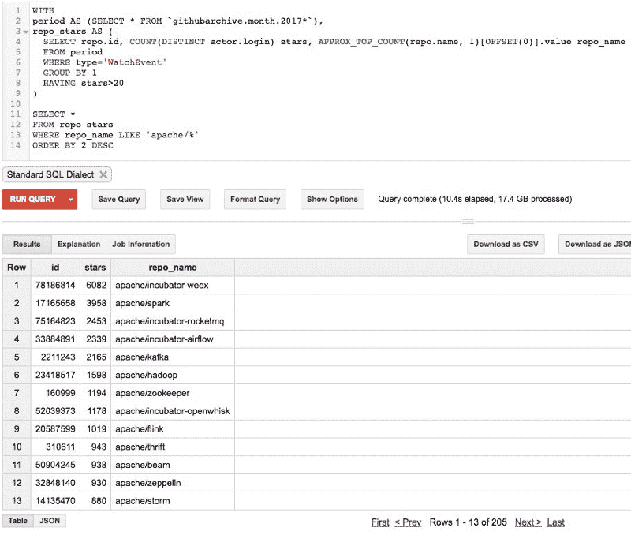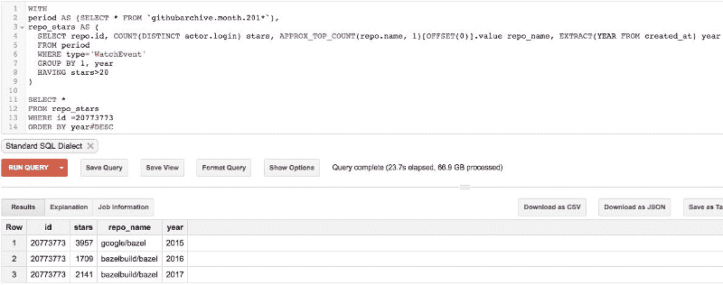

#### 这是开源的状态吗？

注意，分析 GitHub 不包括像 Android、Chromium、GNU、Mozilla 这样的顶级社区，也不包括 Apache 或 Eclipse Foundation，以及选择在 GitHub 之外运行大部分活动的其他项目。

#### 你对我的组织不公平。

我只能数我能看到的。请质疑我的假设，告诉我你会如何以更好的方式衡量事物。工作查询是最好的方法。

例如，当我用一个 SQL 转换将 IBM 的基于区域的域合并到它们的顶级域中时，看看它们的排名是如何变化的:

```
SELECT *, REGEXP_REPLACE(REGEXP_EXTRACT(email, r'@(.*)'), r'.*.ibm.com', 'ibm.com') domain
```

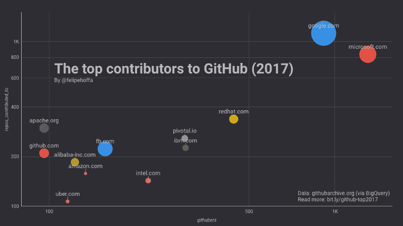

IBM’s relative position moves significantly when you combine their regional email domains.

#### 反应

[**关于“GitHub 2017 年度最佳贡献者”的几点思考。**](https://redmonk.com/jgovernor/2017/10/25/some-thoughts-on-the-top-contributors-to-github-2017/)
[*昨天，Google Dev Rel 团队的 Felipe Hoffa 发表了一些有趣的研究，探讨了…*redmonk.com](https://redmonk.com/jgovernor/2017/10/25/some-thoughts-on-the-top-contributors-to-github-2017/)

### 后续步骤

我以前犯过错误——而且很可能会再次发生。请看看所有可用的原始数据，质疑我所有的假设——看看你会得到什么结果会很酷。

[玩互动数据工作室报告](https://datastudio.google.com/open/0ByGAKP3QmCjLU1JzUGtJdTlNOG8)。

感谢[伊利亚·格里戈利克](https://www.freecodecamp.org/news/the-top-contributors-to-github-2017-be98ab854e87/undefined)这些年来让 [GitHub 档案](http://githubarchive.org)保持充足的 GitHub 数据！

想要更多的故事？查看我的[媒体](http://medium.com/@hoffa/)，[关注我的推特](http://twitter.com/felipehoffa)，订阅 reddit.com/r/bigquery。并且[尝试 big query](https://www.reddit.com/r/bigquery/comments/3dg9le/analyzing_50_billion_wikipedia_pageviews_in_5/)——每个月你都可以从[免费获得一个完整的万亿字节的分析。](https://cloud.google.com/blog/big-data/2017/01/how-to-run-a-terabyte-of-google-bigquery-queries-each-month-without-a-credit-card)

[**以逗号开头——难看还是高效？对 320 GB SQL 代码的调查**](https://hackernoon.com/winning-arguments-with-data-leading-with-commas-in-sql-672b3b81eac9)
[*用数据赢得争论:让我们分析 320 GB 的开源 SQL 代码，以确定我们是否应该使用尾随…*hackernoon.com](https://hackernoon.com/winning-arguments-with-data-leading-with-commas-in-sql-672b3b81eac9)[**一些编码员喜欢炎热的天气，但大多数人更喜欢寒冷的气候**](https://hackernoon.com/some-coders-like-it-hot-but-most-prefer-colder-climates-4703c3f02fbb)
[*以前我们发现一些开源编码员主要集中在相当寒冷的地方(冰岛、瑞典…*hackernoon.com](https://hackernoon.com/some-coders-like-it-hot-but-most-prefer-colder-climates-4703c3f02fbb)