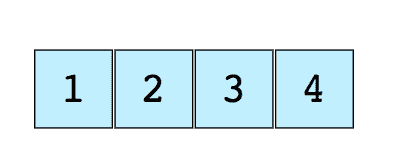
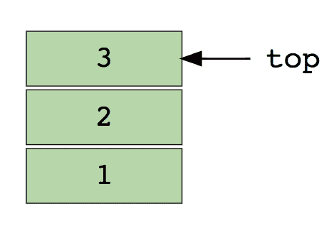
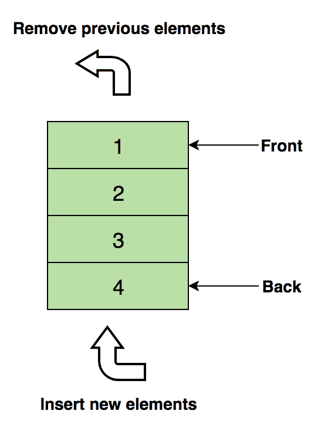
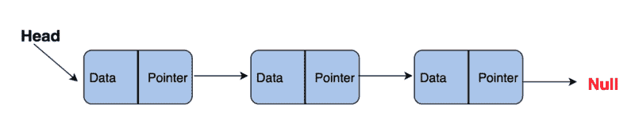
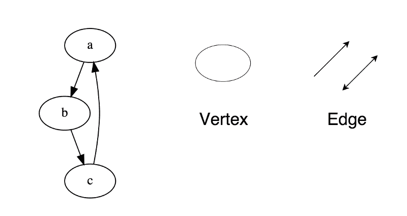
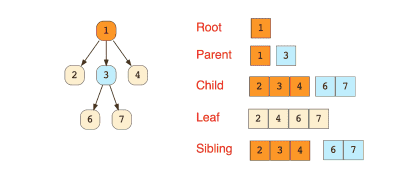
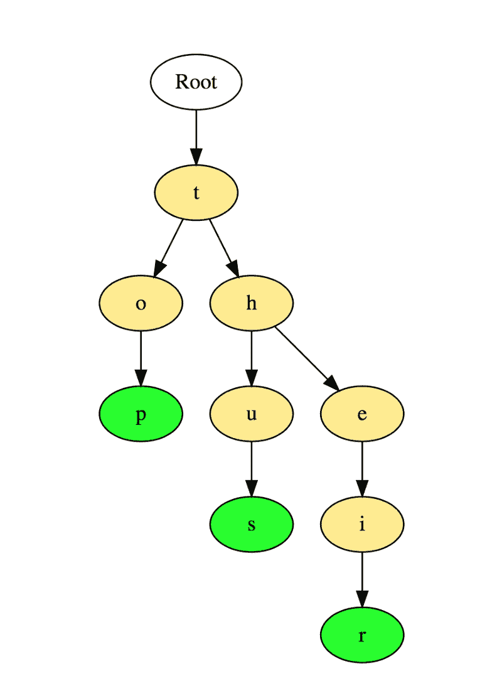
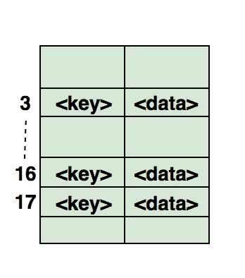

# 下一次编码面试你应该知道的顶级数据结构

> 原文：<https://www.freecodecamp.org/news/the-top-data-structures-you-should-know-for-your-next-coding-interview-36af0831f5e3/>

作者:法希姆·哈克

瑞士计算机科学家尼古拉斯·沃斯在 1976 年写了一本名为*算法+数据结构=程序的书。*

40 多年后，这个等式仍然成立。这就是为什么软件工程候选人必须展示他们对数据结构及其应用程序的理解。

几乎所有的问题都要求考生表现出对数据结构的深刻理解。不管你是刚毕业(大学或编码训练营毕业)，还是有几十年的经验。

有时面试问题会明确提到一种数据结构，例如，“给定一棵二叉树。”其他时候是隐式的，比如“我们想跟踪与每个作者相关的书籍数量。”

即使你只是想在当前的工作中做得更好，学习数据结构也是必不可少的。先从了解基础开始。

### 什么是数据结构？

简单地说，数据结构是一个以特定布局存储数据的容器。这种“布局”允许数据结构在一些操作中是有效的，而在另一些操作中是无效的。你的目标是理解数据结构，这样你就可以选择最适合手头问题的数据结构。

#### 我们为什么需要数据结构？

由于数据结构用于以有组织的形式存储数据，并且由于数据是计算机科学中最重要的实体，数据结构的真正价值是显而易见的。

无论你在解决什么问题，你都必须以这样或那样的方式处理数据——无论是员工的工资、股票价格、购物清单，甚至是简单的电话簿。

根据不同的场景，数据需要以特定的格式存储。我们有一些数据结构来满足我们以不同格式存储数据的需求。

### 常用的数据结构

让我们首先列出最常用的数据结构，然后我们将逐一介绍它们:

1.  数组
2.  大量
3.  行列
4.  链接列表
5.  树
6.  图形
7.  尝试(它们实际上是树，但是单独调用它们还是好的)。
8.  散列表

### 数组

数组是最简单也是最广泛使用的数据结构。堆栈和队列等其他数据结构都是从数组中派生出来的。

这是一个大小为 4 的简单数组的图像，包含元素(1、2、3 和 4)。

每个数据元素被赋予一个正数值，称为索引 *，*，它对应于数组中该项的位置。大多数语言将数组的起始索引定义为 0。

以下是两种类型的数组:

*   一维数组(如上所示)
*   多维数组(数组中的数组)

#### 对数组的基本操作

*   插入—在给定索引处插入元素
*   Get —返回给定索引处的元素
*   删除—删除给定索引处的元素
*   Size —获取数组中元素的总数

#### 常见的阵列面试问题

*   查找数组的第二个最小元素
*   数组中第一个不重复的整数
*   合并两个排序的数组
*   重新排列数组中的正值和负值

### **堆栈**

我们都熟悉著名的**撤销**选项，它几乎出现在每个应用程序中。想知道它是如何工作的吗？想法是:你把你工作的前一个状态(限制在一个特定的数字内)按照最后一个状态先出现的顺序存储在内存中。这不能仅仅通过使用数组来实现。这就是堆栈派上用场的地方。

现实生活中的堆栈示例可以是一堆按垂直顺序放置的书籍。为了拿到中间的那本书，你需要把放在它上面的所有书都拿走。这就是后进先出法的工作原理。

这是包含三个数据元素(1、2 和 3)的堆栈图像，其中 3 位于顶部，将首先被移除:

堆栈的基本操作:

*   推(push )-在顶部插入元素
*   Pop —从堆栈中移除后返回顶部元素
*   isEmpty —如果堆栈为空，则返回 true
*   top-返回顶部元素，而不从堆栈中移除

#### 常见的堆栈面试问题

*   使用堆栈计算后缀表达式
*   对堆栈中的值进行排序
*   检查表达式中的平衡括号

### **队列**

与堆栈类似，队列是另一种以顺序方式存储元素的线性数据结构。堆栈和队列之间唯一的显著区别是，队列不使用 LIFO 方法，而是实现 FIFO 方法，这是先进先出的缩写。

现实生活中一个完美的排队例子:人们在售票亭排队。如果来了一个新的人，他们将从末尾加入队伍，而不是从开始——站在前面的人将是第一个拿到票并因此离开队伍的人。

这是一个包含四个数据元素(1、2、3 和 4)的队列图像，其中 1 位于顶部，将首先被删除:

#### 队列的基本操作

*   enqueue()-将元素插入队列的末尾
*   dequeue()-从队列的开头删除元素
*   isEmpty() —如果队列为空，则返回 true
*   Top() —返回队列的第一个元素

#### 常见的排队面试问题

*   使用队列实现堆栈
*   反转队列的前 k 个元素
*   使用队列生成从 1 到 n 的二进制数

### **链表**

链表是另一种重要的线性数据结构，起初看起来可能与数组相似，但在内存分配、内部结构以及插入和删除的基本操作如何执行方面有所不同。

链表就像一个节点链，其中每个节点都包含数据和指向链中下一个节点的指针等信息。有一个 head 指针，它指向链表的第一个元素，如果链表是空的，那么它只是指向 null 或 nothing。

链表用于实现文件系统、哈希表和邻接表。

下面是一个链表内部结构的可视化表示:

以下是链接列表的类型:

*   单向链表(单向)
*   双向链表(双向)

#### *链表的基本操作:*

*   *插入和* —在链表的末尾插入给定的元素
*   *插入头部* —在链表的开始/头部插入一个给定的元素
*   *删除* —从链表中删除给定的元素
*   *delete head*—删除链表的第一个元素
*   *Search* —从链表中返回给定的元素
*   *isEmpty* —如果链表为空，则返回 true

#### 常见的链表面试问题

*   反转一个链表
*   检测链表中的循环
*   返回链表中从末尾开始的第 n 个节点
*   从链接列表中删除重复项

### **图表**

图是以网络形式相互连接的一组节点。节点也称为顶点。一个**对(x，y)** 称为一个**边** *，*，这表示顶点 **x** 连接到顶点 **y** 。边可以包含权重/成本，显示从顶点 x 到 y *需要多少成本。*

图表类型:

*   无向图
*   有向图

在编程语言中，图形可以用两种形式表示:

*   邻接矩阵
*   邻接表

常见的图形遍历算法:

*   横向优先搜索
*   深度优先搜索

#### 常见的图形面试问题

*   实施广度和深度优先搜索
*   检查一个图是否是树
*   计算一个图的边数
*   寻找两个顶点之间的最短路径

### **树木**

树是一种分层数据结构，由顶点(节点)和连接它们的边组成。树和图很相似，但是区别树和图的关键点是树中不能存在循环。

树广泛用于人工智能和复杂算法中，为解决问题提供有效的存储机制。

下面是一个简单树的图像，以及树数据结构中使用的基本术语:

以下是树的类型:

*   N-ary Tree
*   平衡树
*   二叉树
*   二叉查找树
*   AVL 树
*   红色黑色的树
*   2–3 棵树

在上面的树中，二叉树和二叉查找树是最常用的树。

#### 常见的面试问题

*   求二叉树的高度
*   求二叉查找树中的第 k 个最大值
*   查找距离根“k”距离的节点
*   在二叉树中查找给定节点的祖先

### 特里

Trie 也称为“前缀树”，是一种类似树的数据结构，被证明对于解决与字符串相关的问题非常有效。它提供快速检索，主要用于在字典中搜索单词，在搜索引擎中提供自动建议，甚至用于 IP 路由。

以下是三个单词“top”、“thought”和“their”如何存储在 Trie 中的示例:

单词以从上到下的方式存储，其中绿色的节点“p”、“s”和“r”分别表示“top”、“thus”和“their”的结尾。

常见的面试问题:

*   统计 Trie 中的单词总数
*   打印存储在 Trie 中的所有单词
*   使用 Trie 排序数组元素
*   使用 Trie 从字典中形成单词
*   建立一个 T9 字典

### **哈希表**

哈希是一个用于唯一标识对象并将每个对象存储在某个预先计算的唯一索引(称为其“键”)中的过程因此，对象以“键-值”对的形式存储，这种项目的集合称为“字典”每个对象都可以使用该键进行搜索。基于哈希有不同的数据结构，但是最常用的数据结构是**哈希表**。

哈希表通常使用数组来实现。

散列数据结构的性能取决于这三个因素:

*   散列函数
*   哈希表的大小
*   冲突处理方法

下面的例子说明了散列是如何映射到数组中的。这个数组的索引是通过哈希函数计算的。

#### 常见的面试问题

*   在数组中寻找对称对
*   追踪旅程的完整路径
*   查找一个数组是否是另一个数组的子集
*   检查给定的数组是否不相交

以上是你在参加编码面试之前应该了解的八大数据结构。

*如果你正在寻找编码面试的数据结构方面的资源，看看互动&挑战基础课程:[编码面试的数据结构](https://www.educative.io/d/data_structures) ( [Python](https://www.educative.io/collection/5642554087309312/5634727314718720) 、 [Java](https://www.educative.io/collection/5642554087309312/5724822843686912) ，或者 [JavaScript](https://www.educative.io/collection/5642554087309312/5663204961157120) )。*

*对于更高级的问题，请看 [Coderust 3.0:更快的编码面试准备与互动挑战&可视化](https://www.educative.io/collection/5642554087309312/5679846214598656)。*

如果你正在准备一个软件工程面试，这里有一个[全面的路线图来准备编码面试](https://medium.com/educative/3-month-coding-interview-bootcamp-904422926ce8)。

祝好运，学习愉快！:)