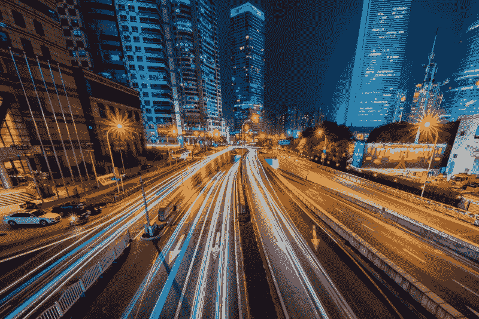
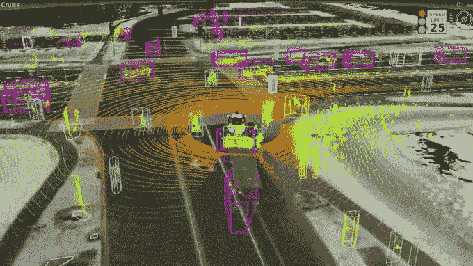
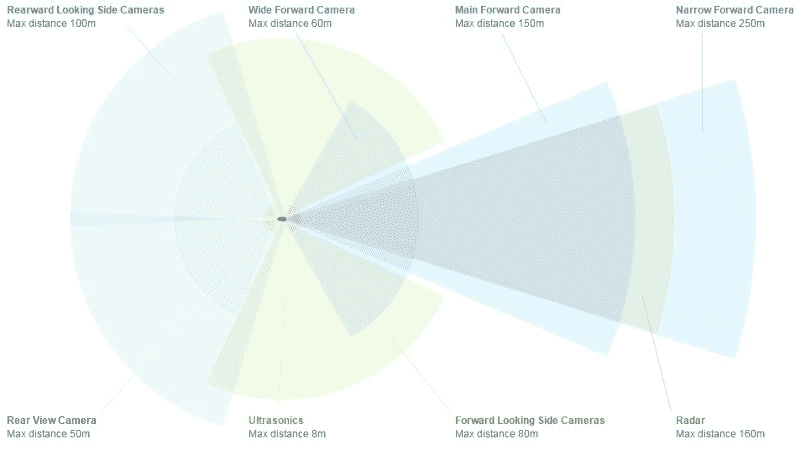
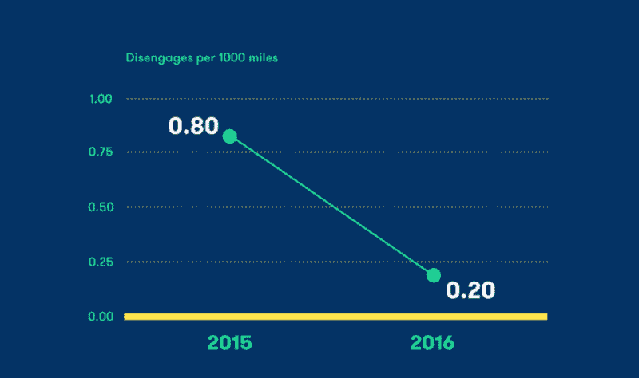
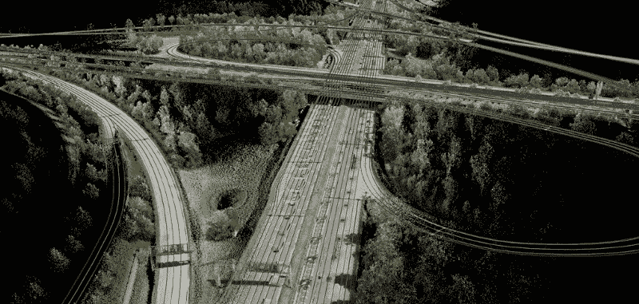
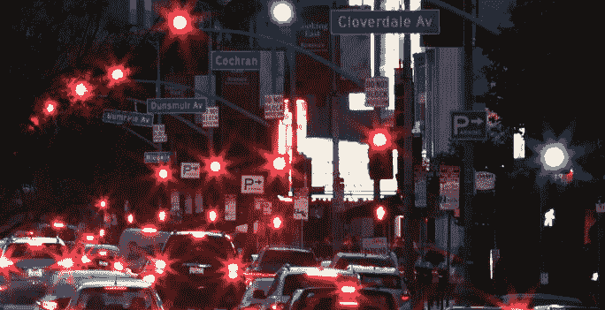
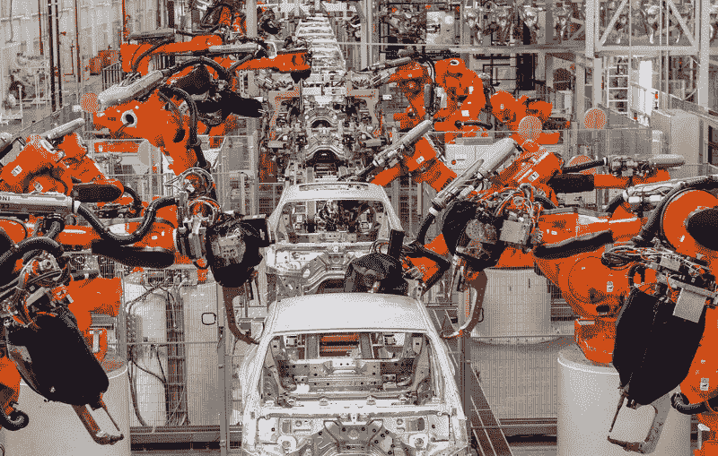
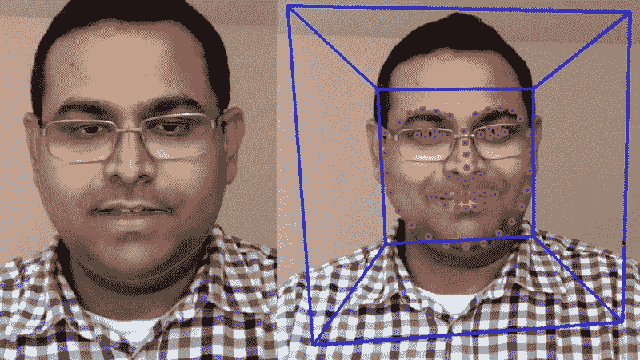
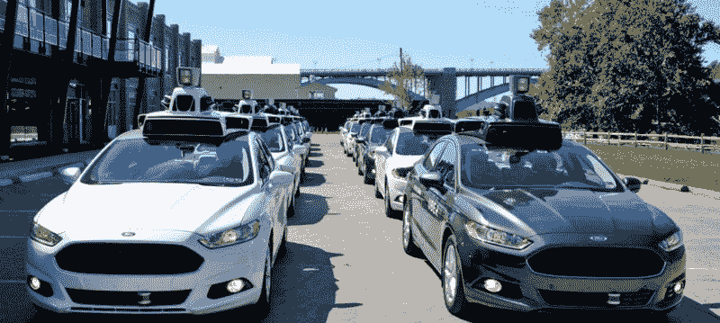

# 交通运输将迎来前所未有的指数级变化。

> 原文：<https://www.freecodecamp.org/news/the-transportation-industry-is-changing-in-more-ways-than-you-expect-e6a5b7deaf38/>

作者:亚当·凯尔

# 交通将会发生前所未有的指数级变化。

今天的汽车本质上是一台带轮子的电脑。在引擎盖下，你会发现一个复杂的计算机网络与几个传感器通信。这些可以检测各种问题，如轮胎压力，加速度和发动机油质量，同时还允许控制速度，温度，电动门和电动窗等。

汽车中的排放传感器的出现是政府监管的直接结果。在美国环境保护局制定了更严格的废气排放政策后，在美国汽车上安装催化转换器成为了标准。到 20 世纪 80 年代，氧传感器通过检测和诊断废气中排出的氧燃料比，成为现代排放控制的关键。

不久之后，类似的组件，如油位传感器、轮胎压力传感器、系紧安全带灯和检查发动机灯也被发明出来——旨在当出现问题时通知驾驶员。这些传感器和指示器有助于帮助消费者避免许多破坏性、昂贵或危险的维护问题，从而使汽车更加可靠、主流和实惠。

未来 10 年，交通运输业的进步将大大超越过去半个世纪的变化。

这些变化不仅会改善整体驾驶体验——未来 10 年将涉及生态系统的彻底改革，以至于从 A 点到 B 点将无法从今天的驾驶中识别。21 世纪的智能汽车和基础设施将*主动建议、*或在许多情况下*控制汽车，以防止潜在的事故和分心驾驶，同时提供实时路线规划和主动交通管理。*

How [driverless cars see the world](https://www.youtube.com/watch?v=tiwVMrTLUWg)

那么有什么变化呢？

> **车载汽车传感器**正在拓展感知的边界，而且比以往任何时候都更便宜——*汽车可以感知更多。*

前几年，汽车行业一直在从其他行业拼凑二手传感器。但是，自动驾驶汽车的规模和前景使得即使是最保守的汽车供应商[也在专门的自动驾驶汽车传感器供应链上投入巨资](https://www.cbinsights.com/blog/auto-corporates-investing-startups/)。[精确定位传感器](http://pointonenav.com/)和服务正变得越来越普遍，并推动精确度的边界。激光雷达、摄像头、深度传感器和雷达也在从根本上改变车辆的感知基准。这些传感器合在一起，将是未来几年开启新的自主水平的关键。

[The perception range of the sensor package in Tesla’s Autopilot system](http://www.tesla.com/autopilot)

> 自动驾驶系统和相关的基础设施变得越来越复杂——汽车可以知道更多。

Waymo 的自动驾驶里程现在达到了数百万英里，并且处于高度自动驾驶状态。特斯拉的自动驾驶里程表(取决于你问谁)显示的是几亿或[几十亿英里](https://www.bloomberg.com/news/articles/2016-12-20/the-tesla-advantage-1-3-billion-miles-of-data)，尽管是在较低的自主水平上。这些公司正在引领自主未来的潮流，但有一个庞大的支持团队将使自主成为可能。

[Waymo’s reported disengagements per 1000 miles driven](https://medium.com/waymo/accelerating-the-pace-of-learning-36f6bc2ee1d5#.z5b8c2dil)

专注于生成和压缩高分辨率、高清晰度地图的公司正在减少计算量，以解决车上的感知问题。工具和框架正在开发中，以使标记和注释图像变得更加容易。

计算机模拟越来越接近有能力训练底层神经网络*，而不需要*完全依赖物理世界中的真实汽车来发现边缘情况。

正在开发工具包来增加库存车辆的功能集，如自适应巡航控制和车道保持，以及开发一套训练集来教人工智能如何实际驾驶。

专用硬件通过以非常高效的方式运行特定算法，使视觉等任务更加高效。

[HD Maps include lane information and sign/signal information](http://360.here.com/2015/07/20/here-introduces-hd-maps-for-highly-automated-vehicle-testing/)

> **基础设施升级**针对连接和通信方面的新要求——汽车可以相互对话，也可以与环境对话。

随着自动驾驶汽车成为主流采用的可行选择，需要考虑和实施主要的基础设施增强。基础设施升级的范围很广，从绘制新的、更清晰的车道分隔线，一直到集成新的传感器和通信模块。自动驾驶汽车需要能够感知足够的环境信息，以便进行评估，制定计划，然后做出反应。基础设施目前向人类驾驶员描绘信息的方式不一定是直接向车辆描绘这些信息的最佳方式。对人类来说，我们使用不同颜色的颜料、标志和信号、圆锥和闪光。对于自动驾驶汽车来说，这些输入将涉及一个可以了解更多道路状况信息的[环境](https://www.wired.com/2016/03/self-driving-cars-wont-work-change-roads-attitudes/)——监控交通、优化交通流量的传感器，甚至可以[相互通信的汽车](https://www.technologyreview.com/s/602463/your-cars-sensors-are-about-to-shorten-your-commute/)。未来有多少自主系统将拥有基础设施 2.0，有多少我们的自主系统将适应更接近当前基础设施的东西？

[An example of a particularly difficult infrastructure to navigate](http://gizmodo.com/will-autonomous-cars-kill-the-traffic-light-1624440289)

> **智能制造**使集成新技术、以新方式、用新材料建造成为可能。

自动化也正在改变汽车本身的制造方式。可以根据物理、化学和热约束条件选择具有最佳特性的新材料。这些新材料可以以更巧妙的方式放在一起，使用 [AI 以非常非直观的方式设计结构元素](https://www.fastcompany.com/3054028/inside-the-hack-rod-the-worlds-first-ai-designed-car)。新的发展使得用生产材料制造原型零件变得更加便宜和快速。计算机视觉和机器学习技术的新应用，如强化学习，正在推动工厂自动化零件类型的界限。这些因素的结合正在改变汽车制造和测试的方式。

Advanced [BMW manufacturing line](http://www.goauto.com.au/mellor/mellor.nsf/story2/6A99C53ED0256365CA257CAB007C083D)

> **以驾驶员为中心的传感器**在从 0 级到 5 级自主系统的过渡中非常重要。

随着越来越多的情况出现，司机可能不是车辆的主要操作员，系统有必要确保司机在需要时[集中注意力。监控注意力分散、情绪状态、清醒、清醒和健康，所有这些都有可能只使用相机和软件来跟踪。其他测量驾驶员生物特征的传感器也可以提供关于汽车应该做什么的见解。整合其他健康数据(例如心脏病发作或中风的风险)可能会改变汽车在某些情况下的行为方式。所有这些功能都专注于让人们更安全，让汽车更能感知环境。](https://www.technologyreview.com/s/602441/semi-autonomous-cars-could-increase-distracted-driving-deaths/)

Tools like [OpenCV](http://www.learnopencv.com/facial-landmark-detection/) make it much easier to build computer vision systems

> 随着如此多的联网和智能汽车的出现，**车队管理、拼车和维修**方面的新服务将成为可能。

汽车在很大程度上是自动驾驶的，同时也装载了传感器，这两者的结合将催生许多新的商业模式。车队管理将变得更加有效，因为汽车将能够交流实时状态，并随着情况的变化而改变路线。

拼车将继续在优步等公司开创的路线规划效率方面取得长足进步。汽车维修行业也将发生类似的转变，因为我们将会更加了解汽车内部发生的事情。

汽车所有权本身可能会改变。平均而言，车主目前在 95%的时间里都没有停车。派遣自动驾驶汽车的拼车公司可能会取代拥有汽车的需求或愿望。无处不在的实时拼车(甚至是预自动化)已经在城市地区产生了巨大的汽车拥有量转化。

Uber’s [Self driving fleet](https://www.engadget.com/2016/09/14/uber-pittsburgh-self-driving-cars-experience/) in Pittsburgh

所有这些因素正在导致一场运输革命，然而，运输行业的新进入者面临着更加复杂的监管体系、客户开发流程和供应链。Comet Labs 的[运输实验室](http://cometlabs.io/transportation-lab)帮助初创公司开发**核心技术**，这些技术将**转变运输行业**，通过**提供金钱买不到的资源**(如高清地图数据、自主测试车辆和飞行员空间)来加速他们的客户开发。

你在建立运输技术吗？我们希望[收到您的来信](https://cometlabs.wufoo.com/forms/rpfir0m0f8l5g9/)。