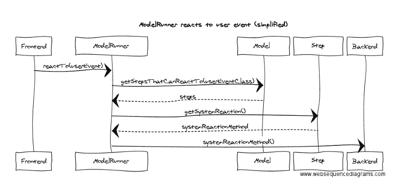

# 真相就在代码里

> 原文：<https://www.freecodecamp.org/news/the-truth-is-in-the-code-86a712362c99/>

每个软件开发人员迟早都会听到这样的话:

> "真理只能在一个地方找到:代码."

> –罗伯特·c·马丁，[干净代码](https://www.amazon.de/Clean-Code-Handbook-Software-Craftsmanship/dp/0132350882)

但这意味着什么呢？

敏捷宣言重视“工作软件胜过全面的文档”

然而，开发人员一直在编写软件行为的全面文档。密码。

代码注释和外部规范也记录了软件的行为。但是当代码改变时，它们可能不会得到更新。然后它们很快就不再反映软件的行为。

相反，代码*总是*反映软件的行为。它定义了它。

这就是为什么真相在代码里。

### 为你的读者写作

代码就是文档。任何类型的文档都应该是读者可以理解的。

代码的读者是编译器或解释器，以及其他开发人员。

因此，如果您的代码可以编译，这是不够的。其他开发人员也需要理解它。他们需要在将来处理你的代码，修改它并扩展它。

让代码变得可理解的一个常见建议是编写干净的代码。对变量和方法名称使用可理解语言的代码。这也使得许多代码注释变得不必要。

干净的代码应该表达意图:*某人通过调用一个方法可以实现什么*。而不是*方法如何实现。*

猜猜这个方法有什么作用:

```
BigDecimal addUp(List<BigDecimal> ns){..}
```

不如这样写:

```
BigDecimal calculateTotal(List<BigDecimal> individualPrice){..}
```

干净的代码是个好主意。但我认为这还不够。

### 共同理解的重要性

当有新的需求时，您需要理解实现它会如何影响现有的代码。

如果你的软件已经存在了一段时间，这可能是一个挑战。我经常听到这样的对话:

*X* :特色 *foo* 进行不下去了。

*Y* :为什么？

*X* :起因 *Z* 是唯一知道密码的人。他已经实现了我们现在需要更改的代码。

Y: 嗯，我们为什么不去问他呢？

因为他生病了/去度假了/去开会了/不在公司了。

*Y* :哦……

事情是这样的。为了确定你的代码是否可以理解，其他人应该试着去理解它。

这是有技巧的。[结对编程](https://en.m.wikipedia.org/wiki/Pair_programming)就是一个很好的例子。或者你和其他开发者坐下来。你向他们展示你写的代码。

尽管如此，如果许多开发人员参与一个产品会怎么样呢？如果开发团队改变了他们的成员怎么办？这使得编写足够多的人理解的代码变得更加困难。

### 故事

干净的代码给你正确的单词。

问题是:在你的代码中，你会用它们讲述什么样的故事？

我不知道。

但是对于一个典型的商业应用程序，我很确定我想在代码中读到什么样的故事。

在向你介绍了一个简单的例子之后，我将概述这个故事。

### 手套店的例子

作为软件的使用者，我想[达到一个期望的结果](https://medium.freecodecamp.com/nobody-wants-to-use-software-a75643bee654?source=linkShare-a74297325869-1489339708)。例如，我想拥有一副新手套，在冬天让我的手指保暖。

所以我上网，看到有一个专门经营手套的新网店。商店的网站让我买手套。用例的“基本流程”(也称为“快乐日场景”)可能如下所示:

*   系统从一个空的购物车开始。
*   系统显示手套列表。
*   我把喜欢的手套加入购物车。系统将手套添加到我的订单中。
*   我退房了。
*   我输入运输信息和付款细节。系统保存这些信息。
*   系统显示订单摘要。
*   我确认。系统开始运送我的订单。

几天后，我拿到了手套。

### 这是我想用代码阅读的故事。

### 第 1 章:用例

故事的第一章是关于用例的。当我阅读代码时，我希望按照代码中的一个用例一步一步地达到期望的结果。

我想了解系统在出现问题时的反应。从用户的角度来看。

我也想了解一路上可能出现的转折。例如，用户试图从支付细节返回到运输信息。会发生什么？这可能吗？

我想了解用例的每个部分应该看什么代码。

#### 那么一个用例的*部分*是什么呢？

用例的基本部分是一个*步骤*，它让用户更接近想要的结果。例如:“系统显示手套列表。”

并非所有用户都可以运行某个步骤，但只有特定用户组的成员可以运行该步骤。终端客户购买手套。营销人员将新的手套报价输入系统。

系统自己运行一些步骤。比如展示手套的时候。那里不需要用户交互。

或者步骤是与用户的交互。系统*对某个*用户事件*做出反应*。例如:用户输入运输信息。系统保存信息。

我想了解事件中预期的数据是什么。运输信息包括用户的姓名、地址等。

用户在任何给定时间只能运行步骤的子集。用户只能在发送信息后输入付款详情。因此有一个*流程*定义了用例中步骤的顺序。以及一个*条件*，它定义了系统是否能够根据系统的状态做出反应。

#### 要理解代码，您需要一种简单的方法来了解几件事情。

对于一个用例(如“购买手套”):

*   *步骤*的*流程*

对于每个步骤:

*   哪些*参与者*可以访问它(即哪些用户组)
*   在何种*条件下*系统反应
*   如果步骤是*自主的*，或者基于*用户交互*
*   *系统* *反应*

对于用户交互的每个步骤:

*   *用户事件*(如“用户输入的运输信息”)
*   事件附带的*数据*

一旦我知道在哪里可以找到一个用例及其代码部分，我就可以钻得更深。

### 第 2 章:通过组件将事情分解成步骤

让我们称你的软件的封装的、可替换的构建块为*组件。*组件的*职责*对组件之外的世界是可用的。

组件可以是:

*   像数据库这样的技术组件，
*   像“购物车服务”这样的服务，
*   领域模型中的实体。

这取决于你的软件设计。但是不管你的组件是什么:你通常需要几个组件来实现一个用例的一个步骤。

我们来看“系统显示手套列表”这一步的*系统反应*。你可能需要发展至少两个*职责*。一个人在数据库中找到手套，一个人将手套列表变成网页。

当阅读代码时，我希望理解以下内容:

*   组件的*职责是什么。*例如:数据库仓库的“寻找手套”。
*   每个职责的*输入* / *输出*是什么。示例输入:寻找手套的标准。示例输出:手套列表。
*   谁*协调*的职责。比如:先找手套。将结果转化为网页。

### 第 3 章:组件做什么

组件的代码履行职责。

这经常发生在领域模型中。领域模型使用与业务领域相关的术语。

例如，术语可以是 Glove。另一个术语可以是 Order。

领域模型描述了每个术语的数据。每只手套都有颜色、品牌、尺寸、价格等等。

领域模型还描述了对数据的计算。订单的总价是用户购买的每只手套的价格之和。

组件也可以是技术组件，如数据库存储库。代码需要回答:存储库如何创建、查找、更新和删除数据库中的元素？

### 讲述你的故事

也许你的故事看起来和上面的相似。可能不一样吧。不管你的故事是什么，编程语言给了你很大的自由来表达自己和讲述这个故事。

这是一件好事，因为它允许开发人员适应不同的环境和需求。

它还承担着开发者讲述太多不同故事的风险。即使是同样的产品。这使得理解别人写的代码变得不必要的困难。

解决这个问题的一个方法是使用设计模式。它们允许你构建你的代码。你可以在你团队甚至跨团队的公共结构上达成一致。

例如，Rails 框架基于众所周知的模型视图控制器模式。

模型是存放*域* *数据的地方。*

视图是客户端用户界面，就像 HTML 页面一样。它是*用户* *事件的起源。*

控制器在服务器端接收用户事件。它负责*流。*

因此，如果几个开发人员使用 Rails，他们知道在他们的故事的某些部分应该看哪一部分代码。

当分享他们的理解时，他们会发现缺少了什么。然后，他们可以就故事的哪一部分放在哪里达成进一步的约定。

如果这对你有用，那就很好。但是我想更进一步。

### 作为代码的要求

我的许多客户问我如何处理长期软件文档。

当在敏捷环境中工作时，如何为软件维护创建文档？

目前已经实施了哪些要求？

你在代码中的什么地方找到了它们的实现？

很长一段时间我都没有满意的答案。当然，除了:编写良好的自动化测试的重要性。清洁生产代码。共同理解。

但是几年前，我开始思考:

> 如果代码里有真理，代码就应该能说出真理。

换句话说:如果你非常小心地在代码中讲述了你的故事，为什么你还要再讲一遍呢？

需要有更好的方法。必须能够提取故事，并从中生成文档。非技术风险承担者也能理解的文档。

文档总是最新的，因为它来自定义软件行为的同一个来源。

唯一可靠的来源:代码本身。

经过大量的实验，我有了一些结果。我在一个名为[需求的 Github 项目中将它们公开为代码](https://github.com/bertilmuth/requirementsascode)。

### 它是如何工作的



*   一个模型实例定义了*参与者*、*用例*，它们的*流程*和*步骤*。它讲述了故事的第一章。您可以在本文的开头找到这样一个模型的例子。
*   模型配置 ModelRunner 实例。每个用户都有自己的跑步者，因为每个用户都可能在模型中的用例中选择不同的路径。
*   runner 通过调用后端的*系统反应*来对前端的*用户事件*做出反应。前端只通过 runner 与后端通信。
*   但是，只有当用户处于*流程*的正确位置并且满足步骤的*条件*时，跑步者才会做出反应。例如，如果用户之前已经输入了运输信息，那么运行者只对“EnterPaymentDetails”事件做出反应。
*   *系统* *反应*是单一方法。如第 2 章所述，方法体负责协调组件以实现该步骤。
*   第 3 章超出了代码需求的范围。这取决于应用程序。这使得需求作为代码与任意的软件设计兼容。

所以 ModelRunner 控制软件的用户可见行为。基于一个模型。

将[需求作为代码提取](https://github.com/bertilmuth/requirementsascode/tree/master/requirementsascodeextract)，您可以从配置运行器的同一个模型中生成文档。这样，文档总是反映软件是如何工作的。

要求代码提取使用 FreeMarker 模板引擎。这允许您生成任何您喜欢的纯文本文档。例如 HTML 页面。进一步的处理可以将它转换成其他文档格式，比如 PDF。

### 你的反馈将帮助我改进这个项目

几年前，我开始从事代码需求方面的工作。从一开始，它就经历了重大的改进。

为了了解这种方法是否可以扩展，我在一个有几千行代码的应用程序上进行了尝试。成功了。我也在较小的应用程序上尝试过。

尽管如此，到目前为止，作为代码的需求一直是我的爱好项目。

所以我需要你的帮助。请给我反馈。

你认为这个主意怎么样？你能想象它在你开发的软件环境中工作吗？还有其他反馈吗？

你可以在评论中给我留言，或者在 Twitter 或 LinkedIn 上联系我。

你可以[克隆](https://github.com/bertilmuth/requirementsascode)这个项目，然后自己尝试。

或者你可以[贡献](https://github.com/bertilmuth/requirementsascode/blob/master/CONTRIBUTING.md)来记录代码中的真相。

*2018 . 10 . 16 编辑:适应需求版本 1.0.0，代码*