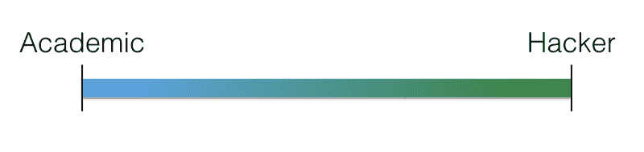
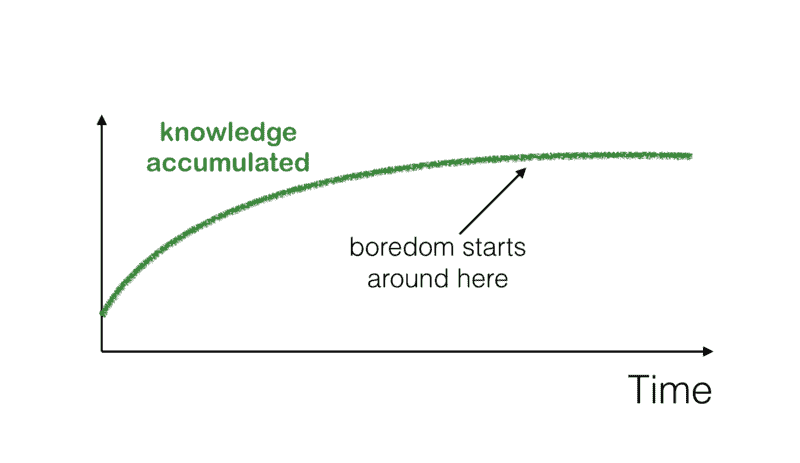
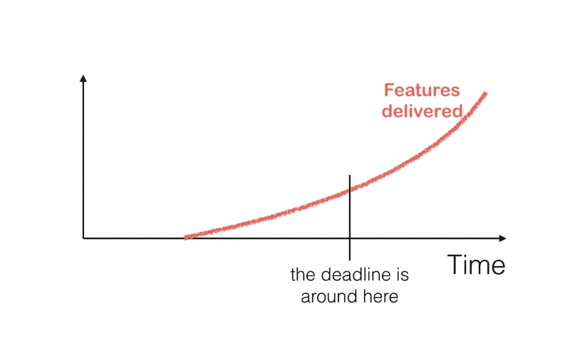
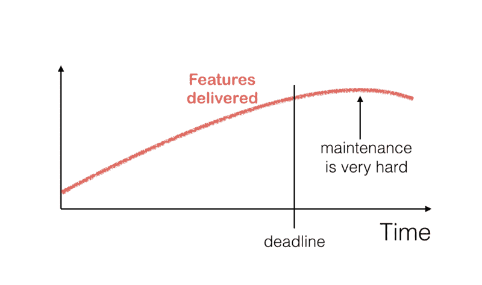
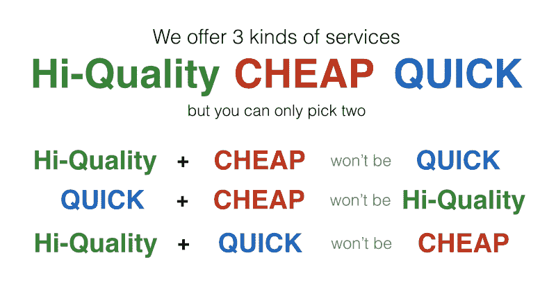
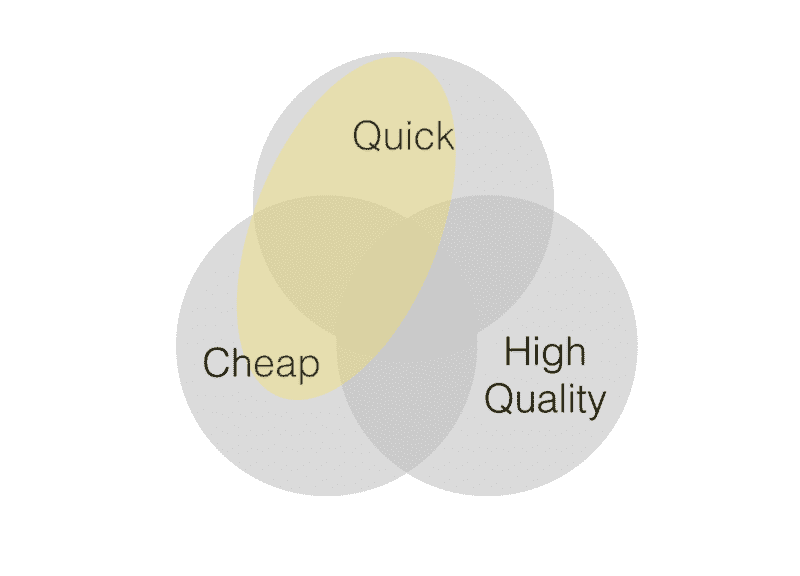
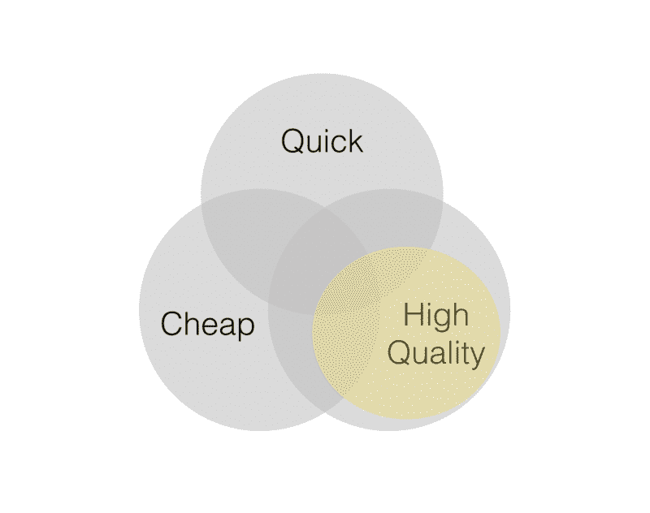

# 你是黑客还是学者？

> 原文：<https://www.freecodecamp.org/news/the-two-types-of-programmers-hackers-vs-academics-514044ed40c/>

在我 18 年的程序员生涯中，我参与了几十个不同的项目，从机器人到金融到医疗保健和电信。我有机会和数百名来自各种背景的程序员一起工作——每个人都有自己的习惯和态度。

我明白了，不管他们来自哪里，做什么工作，所有的程序员都属于这个范围:

### 学术

一个极端是擅长理论的程序员。他们热爱学习、阅读、探索和创新。对他们来说，每一行代码都像是对世界的贡献，甚至是未来的遗产。如果代码中有缺陷，那是因为他们还不知道任何更好的**。**

在他们的世界里，按照最佳实践，代码应该是*完美*、*无 bug*和*。他们欣赏聪明的做事方式，喜欢跟上最新的技术。*

不幸的是，当学习停止时，*学者*会感到无聊，会寻找其他项目——甚至换工作:

这种工作方式的缺点是项目进展缓慢。当你学东西的时候，你往往也会偶然发现你想学的其他东西。在交付任何重要功能之前，这种陷入兔子洞的循环可能会持续相当长一段时间:

但这也不全是坏事。当产品需要经得起*高标准*，*学术*实际上是程序员的正确类型。

例如，对于医疗保健软件来说，患者安全非常重要。您希望您的程序员在将代码推入“生产环境”(即人们的生活)之前花时间学习他们的东西。

即使是一只小虫子也可能是致命的。

另一个例子是金融业，一个简单的错误就可能造成巨大的损失。对于大多数安全性或安全性要求高的软件来说也是如此——在这种情况下，企业的声誉往往岌岌可危。

### 黑客

另一个极端是黑客*，根据加州大学新港分校的[深度研究，他是理想的“知识工作者”。黑客学得很快，并且(理想情况下)以恒定的速度交付结果。他们很少对一个特性请求说“不”，并且会以某种方式把它塞进代码中。](https://www.amazon.com/Deep-Work-Focused-Success-Distracted/dp/1455586692)*

但是过了一段时间，代码就变得支离破碎了。这个过程被阻塞到一定程度，以至于添加新特性会破坏其他本应正常工作的代码:

技术债务越积越多，从长远来看会损害业务。

这些程序员是顾问工作(T1)的完美候选人，在这里，项目是“T2 打了就跑”的(T3)。他们甚至可能得到报酬来修复他们放在代码中的缺陷！对咨询公司有利，对你的生意不利。当然，除非你碰巧处于产品开发的*原型*或*概念验证*阶段，并且大部分代码可能会被重写。

*黑客*是处于早期[最小可行产品](https://en.wikipedia.org/wiki/Minimum_viable_product)开发阶段的创业公司的理想选择。*黑客*可以快速生成结果。他们带来了最好的性价比(在金钱和时间方面)。在这些情况下，*学术*会阻碍发展。

### 结论

有一个笑话是这样的:

但实际上有两种实干家:

The hacker

黑客可以快速而廉价地完成这项工作，而[很少关注质量](https://medium.com/@alexewerlof/what-is-shitty-code-handwriting-ae7c00708b)。考虑到所有的维护成本，从长远来看这不会便宜。

学术上的关注质量，但事情会进展得非常缓慢，而且在你得到一些切实的成果之前，肯定会花费更多。此外，当他们感到厌倦时，他们可能会离开，给项目增加更多的成本——或者更糟的是，留下来，对自己的工作失去热情。

The academic

黑客和学院派是两个极端，实际上大多数程序员都介于两者之间。为你的项目和你正在开发的特定类型的软件选择合适的开发人员是很重要的。

理想情况下，你可以和黑客一起开始一个项目，而学术的*可以坐在后座，当产品成为热门并需要大量重构时磨刀霍霍。*

此外，人不是工厂制造的。他们可以改变。我见过的一些最聪明的开发人员可以根据项目阶段的不同，在成为黑客和成为学者之间转换。这是许多开发人员通过多年经验培养出来的黄金技能。

如果你❤你所阅读的，请分享它，并跟随我保持与最新的文章同步。另外，看看我另外两篇受欢迎的文章:

*   [什么是可怕的代码笔迹？](https://medium.com/@alexewerlof/what-is-shitty-code-handwriting-ae7c00708b)
*   编程是有史以来最好的工作

声明:所有观点都是我的，我不代表任何公司或企业。

更新:分享这篇文章后，我得到了一些值得分享的好评论:

> “学院派”只会学一次东西，但会多次应用。“黑客”永远也学不会。所以“交付的特性”图只适用于平台/堆栈/框架。第二次，“学术”将“黑客”远远甩在身后。

> 我非常同意你把更注重“正确性”的学者和注重“完成任务”的黑客区分开来。我更接近于后者，并且和一个更倾向于学术的同事有着非常好的合作。我一个人可以做很多事情，但这并不意味着它是好代码。另一方面，他仍然可以做很多事情，但实际上也会花时间把事情做好。我也看到了解决问题方式的不同，他会在设计解决方案之前阅读相关的解决方案，而我会尝试不同的解决方案，而不是阅读。我的方法能更快得到结果，而他的方法能得到更好的解决方案。这些事情结合在一起会使工作日变得非常有效率和有趣