# Unity 游戏开发初学者终极指南

> 原文：<https://www.freecodecamp.org/news/the-ultimate-beginners-guide-to-game-development-in-unity-f9bfe972c2b5/>

从游戏到交互式可视化，Unity 是一个很好的原型工具。在本文中，我们将介绍开始使用 Unity 所需的所有知识。

首先，简单介绍一下我:我是一名业余 unity 开发者、3d 建模师和图形设计师，在 Unity 和 Blender 上工作了 5 年多。我现在是都柏林大学金融数学专业的学生，偶尔会做一些自由平面设计、网页原型制作和游戏原型制作。

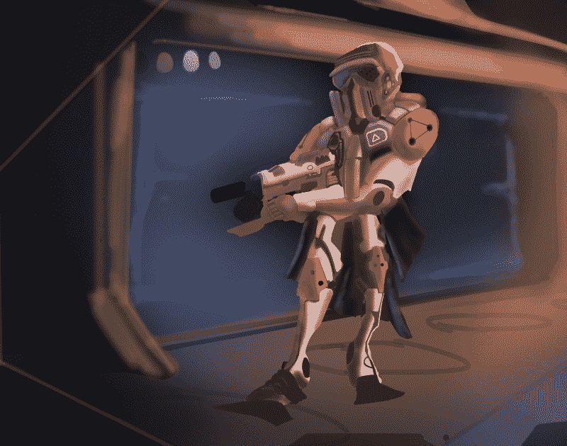

Concept art is one of the earliest phases in the game dev process, over the last 5 years i’ve got a lot of exposure to all areas of game design. Check out my [Portfolio](http://hugodolan.com/portfolio) of Graphic, UX, Concept Art, Game Dev etc…

### 介绍

这篇文章的目标读者是那些从未使用过 Unity，但有过编程或网页设计/开发经验的人。到本文结束时，您应该对引擎以及开始制作一个基本游戏所需的所有功能和代码有了一个很好的总体了解。

### 为什么是统一？

#### 如果你想做游戏

说到独立游戏开发，选择真的很少。如果你想构建游戏，三个主要的选择是虚幻，统一或游戏制作者。

Unity 可能是 3 个平台中最不固执己见的。它给你一个非常原始的现成产品，但是高度灵活、文档完善、高度可扩展，可以构建你能想到的几乎任何类型的游戏。

有很多非常成功的游戏，如《逃离塔尔科夫》(FPS)、《纪念碑谷》(Puzzler)和《我的战争》(Strategy / Survival)都内置在 Unity 中。

实际上，你构建第一个游戏的引擎可能并不重要，所以我的建议是选择一个并使用它。

#### 如果你想原型化用户体验

由于 unity 只是一个引擎，包含一系列物理、动画和实时 3d 渲染，所以它也是一个为 UX 研究制作成熟的交互式原型的绝佳空间。

Unity 完全支持 VR 和 AR，因此可以成为客户探索架构、自动化和模拟的伟大工具。

### **本条的章节**

*   **为什么要统一？**
*   **Unity 编辑器窗口**
*   **Unity 游戏对象**
*   **Unity 内置组件**
*   **创建定制组件**
*   **单行为的结构**
*   **操纵游戏对象**
*   **光线投射**
*   **碰撞检测**
*   **高级功能**
*   **给新人的建议**
*   **不错的资源和社区**
*   **结论**

### **Unity 编辑器窗口**

编辑器窗口分为几个部分。我们将非常简要地介绍这一点，因为我们将在整篇文章中不断提到它。如果您对此已经很熟悉，请跳过！

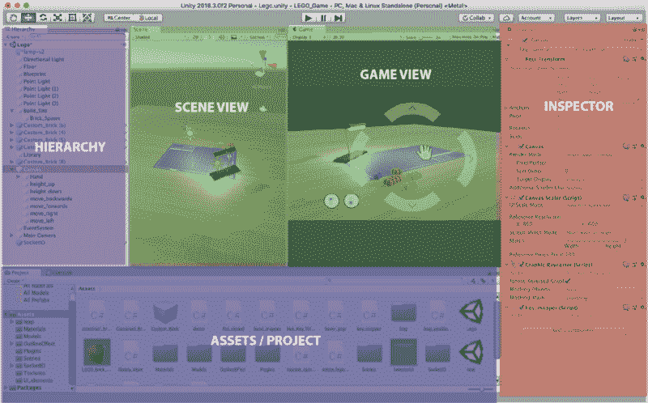

> **场景视图:**允许在场景中放置和移动游戏对象

> **游戏视图:**预览玩家从摄像机看到的场景

> **检查员:**提供场景中所选游戏对象的细节。

> 资产/项目:所有的预置，纹理，模型，脚本等都存储在这里

> **层级:**在场景中实现游戏对象的嵌套和结构化

现在我们可以开始了！

### Unity 游戏对象

#### 什么是游戏对象

游戏对象是 Unity 游戏引擎中一切的核心构件。这个名字几乎泄露了一切:

> 你在 Unity 场景中放置的任何东西都必须被包裹在一个“游戏对象”中。

如果你有网页设计背景，你可以认为游戏对象很像

元素！极其无聊的容器，但是高度可扩展以创建复杂的功能或视觉效果。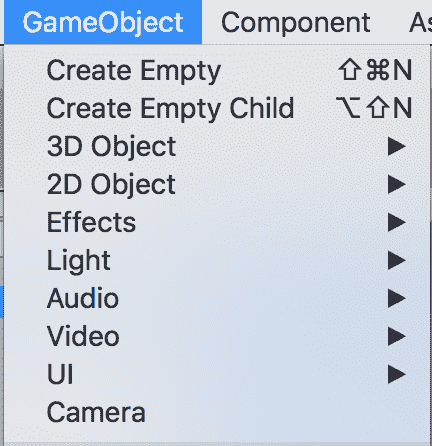

I’ve lifted this straight out of the Unity editor window just to make this point.

从粒子效果、相机、玩家、UI 元素等等，几乎所有的东西都是游戏对象。

#### 创建层次结构

就像 web 开发中的

一样，GameObject 也是一个容器。就像你嵌套来创建不同的和令人满意的布局或抽象一样，你可能希望对游戏对象做同样的事情。

> 嵌套游戏对象背后的逻辑与 web 开发非常相似，我将给出几个例子…

**杂乱&效率**

> ***网络类比:*** *你已经有了许多类似的元素，它们可能会在响应用户交互时动态生成，并希望保持它们的整洁。*

> ***Unity Translation:****你构建了一个《我的世界》克隆体，场景中有很多块，出于性能原因，你需要在场景中添加和移除“大块”块。因此，让它们成为每个块的空游戏对象的父对象是有意义的，因为删除块父对象会删除所有子块。*

**定位**

> ***网页类比:*** *你要保持所包含内容的位置相对于容器而不是网页。*

> ***Unity 翻译:*** *你已经创造了一群在玩家周围盘旋的辅助无人机。你真的不愿意写代码告诉他们去追玩家，所以你把他们实例化为玩家游戏对象的子对象。*

### Unity 内置组件

#### 参与者组件模型

游戏对象本身是没用的——正如我们所见，它们基本上只是容器。为了给它们添加功能，我们必须添加组件，这些组件本质上是用 C#或 Javascript 编写的脚本。

Unity 采用了一个演员组件模型，简单来说，游戏对象就是演员，组件就是你的脚本。

如果你以前编写过任何 web 应用程序，你会熟悉创建小型可重用组件的想法，比如按钮、表单元素、具有各种不同指令和可定制属性的灵活布局。然后将这些小组件组装成更大的网页。

这种方法的最大优点是可重用性和元素间明确定义的通信通道。同样，在游戏开发中，我们希望将意外副作用的风险降至最低。如果你不小心的话，小错误很容易失控，并且极难调试。因此创建小的、健壮的和可重用的组件是至关重要的。

#### 关键内置组件

我认为是时候举几个 Unity 游戏引擎提供的内置组件的例子了。

*   **网格过滤器:**允许你将 3D 网格的材质分配给游戏对象
*   **MeshRender:** 允许你给一个 3D 网格分配材质
*   **[Box | Mesh]碰撞器:**能够在碰撞过程中检测游戏对象
*   **刚体:**使真实物理模拟能够作用于具有 3d 网格的游戏对象，并将在箱式碰撞器上触发检测事件
*   **灯光:**照亮场景的一部分
*   **相机:**定义一个游戏对象的玩家视窗
*   用于显示 GUI 的各种 UI 画布组件

还有很多，但是这些是你需要熟悉的主要的。一个提示是，无论您身在何处，您都可以通过 unity 手册和脚本参考离线访问所有文档:

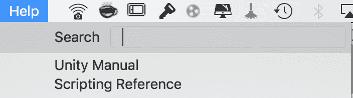

Just click on the help section, the docs in general are pretty good

### 创建自定义组件

内置组件主要控制物理和视觉效果，但要真正制作一个游戏，你需要接受用户的输入，操纵那些标准组件和游戏对象本身。

> 要开始创建组件，请进入所需的游戏对象>添加组件>在搜索栏中键入新组件的名称>新建脚本(c#)。

一般来说，我建议不要在 Unity 中使用 Javascript。它并没有随着 ES6 带来的所有好东西而不断更新，大多数更高级的东西都依赖于移植到 Javascript 的 C#东西…就我的经验而言，这只是一个巨大的变通办法。

### 单行为的结构

#### 关键功能

所有组件都继承自 MonoBehaviour 类。它包括几种标准方法，最重要的是:

*   **void Start()** 每当包含脚本的对象在场景中被实例化时都会被调用。这在我们想要执行一些初始化代码的任何时候都是有用的，例如，在玩家进入比赛后设置他们的装备。
*   **void Update()** 每帧调用哪一个。这是包含用户输入的大部分代码将要去的地方，更新各种属性，比如玩家在场景中的运动。

#### 检查员变量

通常我们希望组件尽可能灵活。例如，所有的武器可能有不同的伤害，射速，瞄准器等等。虽然所有的武器本质上是一样的，我们可能希望能够通过 unity 编辑器快速创建不同的变化。

另一个例子是当我们创建一个 UI 组件来跟踪用户的鼠标移动并将光标放在视窗中时。这里我们可能想要控制光标对移动的敏感度(如果用户使用的是游戏杆或游戏手柄而不是鼠标)。因此，让这些变量在编辑模式和运行时都易于更改是有意义。

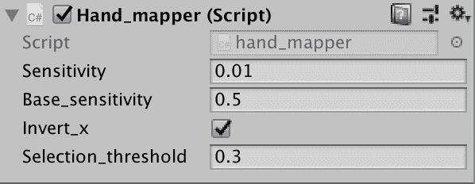

Variables in the inspector window can be changed at any time during runtime or edit mode. Note: Changes made during runtime will not be permanent.

我们可以很容易地做到这一点，只需在组件体中将它们声明为公共变量。

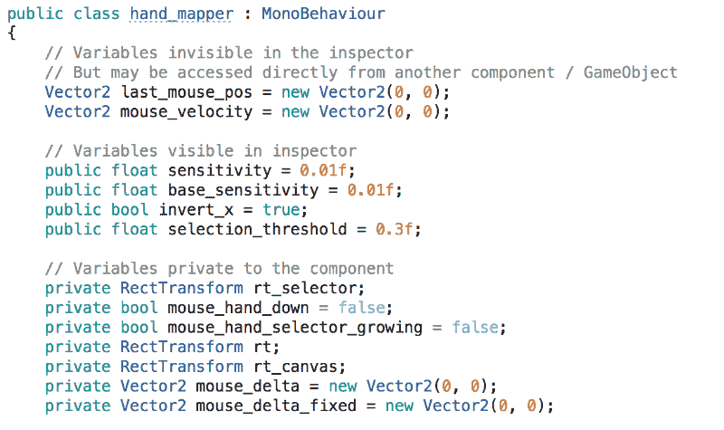

Notice how we can make variables have different levels of access, private, public, or public but not displayed in the inspector window.

#### 接受用户输入

当然，我们希望我们的游戏能够响应用户的输入。最常见的方法是在组件的 Update()函数中使用下面的方法(或者您喜欢的任何地方):

*   输入。GetKey(KeyCode。W)返回真 W 键被按住
*   输入。GetKeyDown(KeyCode。W)第一次按下 W 键时返回 True
*   输入。GetAxis("垂直")，输入。GetAxis("Horizontal ")返回-1，1 之间的鼠标输入移动

### 操纵游戏对象

一旦我们有了用户输入，我们希望场景中的游戏对象能够做出响应。我们可以考虑几种类型的响应:

*   平移、旋转、缩放
*   创建新的游戏对象
*   向现有游戏对象/组件发送消息

#### 转换

所有的游戏对象都有一个转换属性，可以对当前的游戏对象进行各种有用的操作。

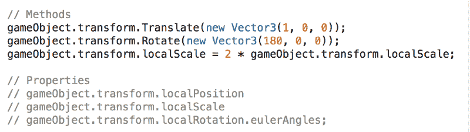

上面的方法都是不言自明的，只需注意我们使用小写的 *gameObject* 来指代拥有这个组件实例的游戏对象。

一般来说，最好使用*局部【位置，旋转】*而不是对象的全局位置/旋转。这通常会更容易以有意义的方式移动对象，因为局部空间轴将在父对象上定向和居中，而不是在世界原点和 x，y，z 方向上。

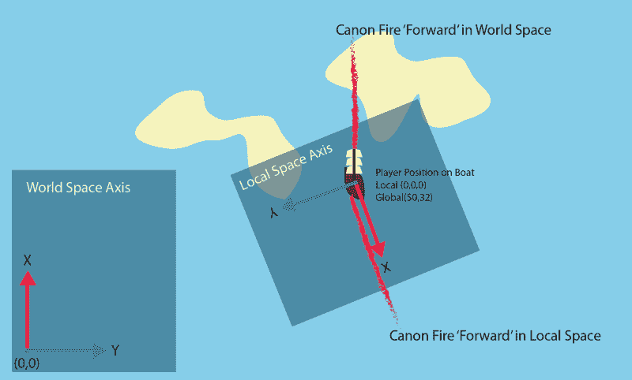

The benefits of local space become a little more obvious with a diagram!

如果您需要在本地空间和世界空间之间进行转换(这是经常发生的情况)，您可以使用以下方法:

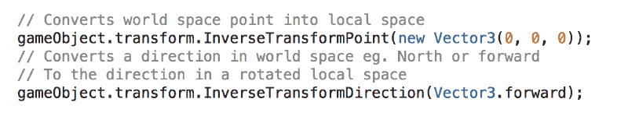

可以想象，这背后有一些相当简单的线性代数，方法名中的“逆”暗示了这一点。

#### 创建新的游戏对象

由于游戏对象基本上是你场景中的一切，你可能希望能够动态生成它们。例如，如果你的玩家有某种类型的射弹发射器，你可能希望能够创建飞行中的射弹，它们有自己的飞行逻辑，造成伤害等…

首先我们需要引入一个*预置*的概念。我们可以简单地通过将场景层次中的任何游戏对象拖动到 assets 文件夹中来创建它们。

What prefab looks like in the Asset tab

这实际上存储了我们刚刚在场景中拥有的具有所有相同配置的对象的模板。

An example of a custom brick object which is used to dynamically generate Lego bricks in a scene, it has a bunch of components attached to it with various default values.

一旦我们有了这些预设组件，我们就可以将它们分配给场景中任何组件上的检查员变量(如我们之前所讨论的)，这样我们就可以随时创建预设指定的新游戏对象。

然后，我们可以执行预置的“实例化”,并操纵它到场景中的期望位置，并建立必要的父关系。

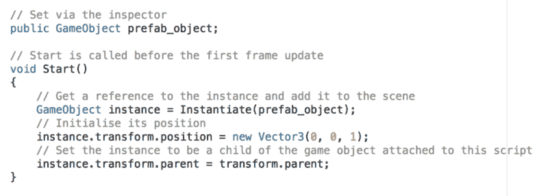

### 访问其他游戏对象和组件

我们经常需要与其他游戏对象以及它们的相关组件进行通信。一旦你有一个游戏对象的参考，这是非常简单的。

> component name comp = some _ game _ object。get component<componentname>()；</componentname>

之后，你可以访问组件的任何公共方法/变量来操作游戏对象。这是最简单的一点，但是实际上获取游戏对象的引用可以通过几种方式来完成…

#### 通过检查员变量访问

这是最直白的。简单地为游戏对象创建一个公共变量，就像我们之前演示的预置一样，然后通过检查器手动地将它拖放到组件上。然后如上访问变量。

#### 通过标记访问

我们可以通过检查器标记游戏对象或预设，然后使用查找游戏对象功能来定位对它们的引用。

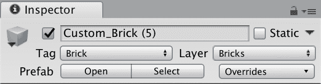

这是简单地做如下。

> 游戏对象 some_game_object =游戏对象。FindGameObjectWithTag(" Brick ")；

#### 通过转换访问

如果我们希望访问某个父对象中的组件，我们可以通过 transform 属性轻松地做到这一点。

> component name comp = game object . transform . parent . get component<componentname>()；</componentname>

#### 通过 SendMessage 访问

或者，如果我们希望向许多其他组件发送消息，或者希望向嵌套层次结构中更高层的对象发送消息，我们可以使用 send message 函数，该函数接受函数名，后跟参数。

> 游戏对象。SendMessage("MethodName "，params)；//广播消息

> 游戏对象。sendmessage upward(" method name "，params)；//仅由嵌套在上面的组件接收。

### 光线投射

你可能听说过这一点，当人们比较 FPS 游戏是“基于物理”还是“基于光线”。光线投射本质上就像有一个激光笔，当它接触到一个“碰撞体”或“刚体”时，它会返回一个“命中”并传回物体的细节。

这在两种情况下会派上用场(可能还有更多):

1.  如果你正在为一个游戏设计一个武器系统，你可以使用光线投射进行命中检测，甚至可以定制光线的长度，这样近战物品只能在短距离内“命中”
2.  创建一个从鼠标指针到三维空间中的一个点的光线，也就是说，如果你希望用户能够在策略游戏中用鼠标选择单位。

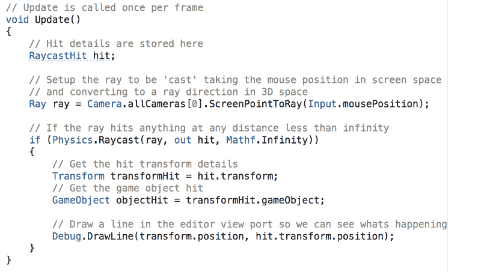

Example 2 detailed above

正如你所看到的，这个的代码有点复杂。要理解的关键是，要将光线投射到鼠标在 3d 空间中指向的地方，需要 ScreenPointToRay 变换。这样做的原因是相机正在将 3d 空间渲染为笔记本电脑屏幕上的 2d 视口，因此自然会有一个投影要转换回 3d。

### 冲突检出

前面我们提到了可以添加到物体上的碰撞器和刚体组件。碰撞的规则是碰撞中的一个对象必须有一个刚体，另一个必须有一个碰撞器(或者两者都有两个组件)。请注意，当使用光线投射时，光线只会与附加了碰撞器组件的对象进行交互。

一旦在附加到对象的任何自定义组件中进行了设置，我们就可以使用 OnCollisionEnter、OnCollisionStay 和 OnCollisionExit 方法来响应冲突。一旦我们有了碰撞信息，我们就可以让游戏对象负责，并使用我们之前学到的知识与附加到它的组件进行交互。

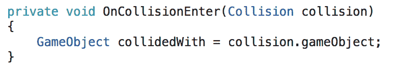

需要注意的一点是，刚体为物体提供了重力等物理特性，所以如果你想关闭这个特性，你需要检查 *is_kinematic* on。

Check on is kinematic to disable unwanted physics but retain nice collision detection.

### 高级功能

我们现在不会深入讨论这些，但可能会在以后的文章中讨论——只是为了让您意识到它们的存在。

#### 创建 GUI

Unity 有一个成熟的 UI 引擎来为你的游戏设计 GUI。总的来说，这些组件的工作方式与引擎的其他部分非常相似。

#### 扩展 Unity 编辑器

Unity 允许你添加自定义按钮到你的检查器，这样你就可以在编辑模式下影响世界。例如，为了帮助构建世界，您可以开发一个自定义工具窗口来构建模块化房屋。

#### 动画

Unity 有一个基于图形的动画系统，使您能够混合和控制各种对象上的动画，如实现基于骨骼的动画系统的玩家。

#### 材料和 PBR

Unity 运行基于物理的渲染引擎，实现实时照明和真实材质。现实情况是，你要么需要先学习 3d 建模，要么在学习之前使用其他人制作和优化的模型，以便制作出看起来不错的东西。

### 给新人的建议

如果你打算写你的第一个游戏，不要低估编写哪怕是最琐碎的游戏的复杂性和时间。请记住，Steam 上的大多数游戏都有团队全职开发多年！

选择一个简单的概念，把它分解成小的可实现的里程碑。强烈建议将你的游戏分成尽可能小的独立组件，因为如果你保持组件简单而不是单一的代码块，你就不太可能遇到错误。

在你为你的游戏的任何部分写任何代码之前，去研究一下其他人以前为解决同样的问题做了什么——很可能他们会有一个更巧妙的解决方案。

### 不错的资源和社区

游戏设计有一个最好的社区，这个行业有很多技术高超的专业人士免费或几乎免费提供内容。这是一个需要 3d 建模师、概念艺术家、游戏设计师、程序员等等的领域。我将我在这些领域中遇到的一些优秀的通用资源链接如下:

**概念艺术**

*   [朱枫设计学院](https://www.youtube.com/channel/UCbdyjrrJAjDIACjCsjAGFAA)(超过 90 小时的概念艺术教程)
*   [Tyler Edlin Art](https://www.youtube.com/channel/UCm9pCim4dDN4KJZUILGizgA) (伟大的 BST 艺术社区，专业人士对每月挑战进行反馈)
*   [艺术咖啡馆](https://www.youtube.com/channel/UCyGGrJ-wQlvcWujLKHzB42w)(与著名概念艺术家的访谈和研讨会)
*   Trent Kaniuga (插画师和 2D 艺术家，也在制作自己的游戏)

**三维建模**

*   CG Cookie(Blender 有史以来最好的网格建模基础，他们有 Blender 的其他优秀内容)
*   托尔·弗里克(硬表面建模师【搅拌机中的 雕刻家)
*   Gleb Alexandrov(Blender 中强大的简短渲染教程)

**游戏设计**

*   DoubleFine 失忆两周(游戏开发者进行为期两周的黑客马拉松并记录他们的整个设计过程)
*   [游戏制作者工具包](https://www.youtube.com/channel/UCqJ-Xo29CKyLTjn6z2XwYAw)(考察游戏设计原则)

**编程**

*   [手工英雄](https://www.youtube.com/channel/UCaTznQhurW5AaiYPbhEA-KA)(用 C 从头开始写游戏和引擎)
*   [乔纳森·布洛](https://www.youtube.com/channel/UCCuoqzrsHlwv1YyPKLuMDUQ)(直播其游戏开发的独立开发者)
*   [Brackeys](https://www.youtube.com/channel/UCYbK_tjZ2OrIZFBvU6CCMiA) (Nice Unity 教程)

### 结论

希望你们喜欢这个教程！我做一些图形设计工作，以及游戏和用户界面原型，所以检查出 [**我的投资组合**](http://hugodolan.com/portfolio) ！我也在链接的**上。**

[**投资组合**](https://hugodolandesigns.portfoliobox.net) | [**领英**](https://www.linkedin.com/in/hugo-dolan-62971a174/)

[http://eepurl.com/gkV7ov](http://eepurl.com/gkV7ov)