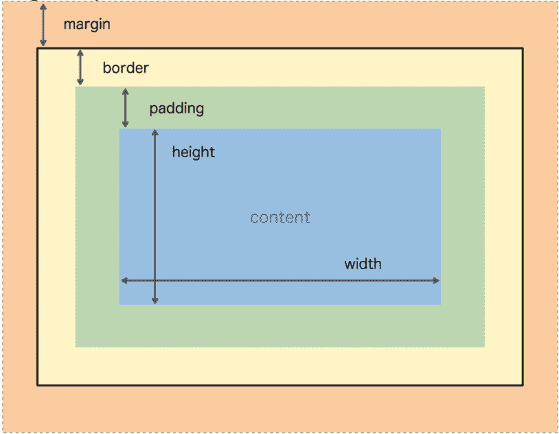

# 编码训练营入门——一个免费的网络开发课程，帮助你准备参加任何训练营

> 原文：<https://www.freecodecamp.org/news/the-ultimate-bootcamp-primer/>

## 一个 4 小时的免费课程，将教你足够的 web 开发，为任何编码训练营做好准备。

今天，我很高兴地宣布，我们将为那些考虑从事网络开发教育的人开设一门课程。

它叫做[《编码训练营初级读本](https://scrimba.com/g/gbootcampprimer)(<–链接)，它将教你构建网站最基本的构建模块:HTML、CSS 和 Javascript。您还将学习如何设置计算机、调试代码、搜索解决方案、解决问题等等。最后，您应该能够构建一个有风格的页面，比如计算器、名称生成器或个人页面。

这些课程是由位于犹他州盐湖城的顶尖编码训练营 V School 创建的。实际上，这正是他们让学生在开始沉浸式训练营之前要经历的课程。

对于那些不打算参加编码训练营，但对 web 开发感兴趣的人来说，这也是一个很好的资源。在我看来，它是为普通大众设计的，因为我们相信每个人都可以从学习基本的编码技能中受益。

现在，让我们来看看潜在的教学哲学，以及课程是如何组织的。

# 五、学校的学习理念

经过多年的教学，V School 已经形成了一种学习理念，可以用`The easy way is the hard way.`来最好地描述:解决问题和挑战是最好的学习方式。自然，这门课程将会有*大量*的实践操作

大多数教程都在 Scrimba 上，但也会有一些外部资源的链接，比如一些主题的作业和操作视频。

建议您不要过度观看课程。确保你经常休息，睡觉的问题，并采取你的时间。

### 给这些课程的学生的提示:

*   如果你对某些事情不确定，一定要再看一遍截屏。这并不意味着你不擅长学习或记忆。
*   试着运用你的知识，可以离开去尝试一些东西，然后回到课程中来。
*   学习不应该是孤独的。通过网上搜索、向朋友或同学询问、向老师寻求帮助。

V School 还慷慨地为你创建了一个专用的 slack 频道，让你寻求帮助和帮助他人。请加入，让我们围绕这个课程建立一个社区！

# 如何使用 schimba

最好是看一遍，而不是读一百遍。如果你不熟悉 Scrimba 的工作方式，请观看我们的截屏视频，V School 的教育主管 Bob Ziroll 将带你了解它。

# 外部链接-计算机设置

在我们开始上课之前，我们需要对您的计算机进行一些设置。欢迎[观看我们的视频](https://scrimba.com/p/pG66Msa/c9PnvGCp?utm_source=dev.to&utm_medium=referral&utm_campaign=gbootcampprep_launch_article)来学习如何做到这一点。

# 外部链接-使用 VS 代码

在课程的某个阶段，你需要能够在离线编辑器中编写一些代码。我们通常推荐 VSCode，但实际上任何代码编辑器都可以。如果你想遵循安装步骤，你可以在我们的视频中找到它们。

# 预习:V 校预科项目

这门课程对任何人都是免费开放的。它最后还有一个顶点项目，可以作为 V School 的预科项目，供任何有兴趣申请的人使用。

所以，如果你正在考虑加入 V 学校，或者对训练营犹豫不决，一般来说，这门课也适合你。

# HTML 简介


在这个截屏中，V School 的讲师 Nate Jensen 将向我们介绍 HTML 的基本概念:样板文件、标签和 HTML 语法。

# HTML 元素

继续上一章的介绍，接下来是最常见的 HTML 元素，如`<h1>`到`<h6>`标签、`<span>`、`<div>`、`<p>`等。

# HTML 属性

在这一章中，Nate 将介绍 HTML 属性。一些 HTML 元素，比如图像标签``有源属性`src`。一个主播标签`<a>`有`href`。属性为我们的元素增加了额外的功能。

# 任务-愚蠢的中央情报局第 1 部分

这是[我们的第一个任务](https://scrimba.com/p/pG66Msa/cmkeLgAM?utm_source=dev.to&utm_medium=referral&utm_campaign=gbootcampprep_launch_article)，你应该尝试自己完成它，不要偷工减料，比如复制粘贴代码，即使这可能会花费你相当长的时间来完成它。话虽如此，如果你陷入了困境，总是向 Scrimba 或 V 学院的课程页面上的其他人寻求帮助。

# HTML5 语义标签

在这一章中，Nate 介绍了什么是语义标签，以及为什么在 HTML5 中引入了语义标签。

# CSS 简介(内嵌样式)


在这篇文章中，V School 的讲师 Grant Wilhelm 向我们展示了如何通过使用`style`属性内联编写 HTML 元素来添加样式。

```
<div style="color:red;font-size:55px">Welcome to CSS!</div> 
```

# CSS 选择器

在这一部分中，Grant 向我们展示了如何用`link`标记链接一个单独的样式表。

```
<link rel="stylesheet" href="index.css" /> 
```

然后 Grant 介绍了使用选择器的样式，作为上一章中内联样式的更好替代。

例如，要在我们的`styles.css`文件中定位一个`<h1>`标签，我们可以写:

```
h1 {
  color: Blue;
  font-size: 55px;
} 
```

# 任务-愚蠢的中央情报局第 2 部分

这是[我们的下一个自我驱动的任务](https://coursework.vschool.io/silly-cia-part-2/)，和第一个任务相似，强烈建议你不要偷工减料，如果被困太久就伸出援手。

# 任务- CSS 战争:选择器觉醒

恭喜你完成了之前的任务！没有什么比一个好的挑战更能提升你的技能了。保持下去，直接投入到你的下一个任务中。

# CSS 颜色和字体

欢迎来到你的下一个 CSS 演员表，我们希望你喜欢你的挑战。

在这一章中，我们将学习在 CSS 中定义颜色，除了只写颜色的名字，我们有相当多的选择。

我们可以使用十六进制(简称 hex)表示法。

```
body {
  background-color: #a4f6b9;
} 
```

用`rgb`指定红、绿、蓝值。

```
.header {
  background-color: rgb(55, 155, 255);
} 
```

或者用`rgba`表示，其中`a`是一个 alpha 参数，是一个介于 0.0(完全透明)和 1.0(完全不透明)之间的数字。

```
.header {
  background-color: rgba(55, 155, 255, 0.5);
} 
```

# CSS 显示属性

当使用 HTML 时，我们将讨论占据整个页面宽度的*块*元素，以及只占据所需宽度的*内联*元素。

通常，我们可能想要覆盖缺省值。例如，如果我们希望一个接一个地显示几个图像，而不是并排显示。

我们可以通过使用`display`属性来实现这个默认设置。

```
/* img by default is an inline element */
img {
  display: block;
  height: 175px;
  width: 175px;
} 
```

# 注册我们的电子邮件列表

这可能是一个完美的时间来插入和提供保持联系，并从 V 学校获得最新的更新。你可以在我们的截屏中注册。

# 任务-新闻

欢迎来到[你的下一个挑战](https://coursework.vschool.io/block-vs-inline-newsies/)！如果你被卡住了，确保你回去重新观看一些以前的截屏，否则，你已经得到了这个！

# CSS 盒子模型

在这个截屏中，格兰特将介绍 CSS 盒子模型。



# 从头开始分配颜色网格

我们的新作业时间到了，当你完成后，我们将期待在下一课继续学习。

# CSS 布局和定位

在这个截屏中，Grant 将帮助我们学习 CSS 的布局和定位原则。例如，如何重叠元素，使其中一些元素在页面上具有粘性等。

# 分配- CSS 标志

在下一个任务中，你将被要求用纯 CSS 制作一些国家的国旗！当有疑问时，后退一步，重新观看之前的一些演员表，下次作业再见。

# 作业-设计一个博客

[我们的下一个任务](https://coursework.vschool.io/design-a-blog/)将略有不同，因为你可以非常容易地将其个性化，并以此作为你未来真实生活博客的基础！

# 外部链接-调试简介

调试技巧在 web 开发中非常重要。什么是 bug，以及如何在我们的截屏中找到它们的一些方法。

# 外部链接- Chrome 开发工具

你选择的浏览器中的开发者工具将是你需要学习的最重要的工具之一。看看我们关于这个话题的入门读物。

# 外部链接-使用谷歌

我们确信你非常熟悉使用谷歌搜索东西。我们收集了一些如何有效搜索的技巧，所以一定要看看。

# Javascript 数据类型

大家好，欢迎来到本课程的 Javascript 部分，我们的老朋友 Nate 将帮助我们编写 Javascript 的第一行代码。内特将引入*原语*和*复杂*数据类型。

原语是:

*   字符串，例如`"hello"`
*   数字，例如`2`、`3`
*   布尔值，例如`true`或`false`

复杂是基元的组合:

*   数组，例如`[1, 2, true, "hello"]`
*   物体，例如`{likes: "travel", countries_visited: 21, has_passport: true}`

# 任务-杂货店 JS

恭喜你。您已经完成了第一个 Javascript 任务。如果你遇到困难，一定要伸出援手，更重要的是，玩得开心！

# Javascript 数组

欢迎回到我们的下一集。Nate 更深入地研究了数组，并展示了如何访问数组的各种元素并确定其长度。

```
//              0        1       2        3         4
var colors = ['blue', 'green', 'red', 'yellow', 'purple'];

console.log(colors[1]); // green
console.log(colors.length); // 5 
```

# Javascript 条件句

在这个截屏中，Nate 将帮助我们学习如何在 Javascript 程序中添加逻辑。

通常，只有当其他东西在正确的位置时，我们才愿意做一些事情。例如，如果用户的生日是在他们看你的页面的那一天，给他们看一个五彩纸屑动画:)

为此，我们将使用*条件句*。

内特将向我们介绍所有的`if`、`else if`和`else`，以及它们的用法等等。

# 任务-如果陈述奥林匹克

很好，是时候用下一个 JS 作业来练习这些 if 语句了

# Javascript 循环

编程中另一个常见的事情是多次重复某个操作。你不必复制粘贴代码到你需要的次数，因为有*循环*来完成。

```
for (i = 0; i < 100; i++) {
  // your code you wish to repeat
} 
```

内特将教我们所有关于`for`循环的知识，甚至你如何用上一课的*条件句*来增强它们。

# 分配-偶数/奇数循环

好样的。现在让我们来练习循环。一定不要偷工减料，如果卡住了就寻求帮助。祝你好运，玩得开心。

# 作业-循环和数组练习

好吧！现在让我们做一个非常普通的编程任务，并一起[练习循环和数组。](https://coursework.vschool.io/loops-and-arrays-practice/)

# Javascript 函数第 1 部分

还记得我们在关于循环的那一章中说过不必复制粘贴代码吗？嗯，一个编程术语是 *DRY* ，不要重复。

当我们有一段想要在多个地方重用的代码时，就会用到函数。

```
function sum(x, y) {
  console.log(x + y);
} 
```

# Javascript 函数第 2 部分

很好，现在当我们知道如何创建一个函数时，我们如何使用它呢？使用函数的一个术语是*调用*一个函数。

我们可以调用上一章的函数

```
sum(2, 2); //displays 4 
```

更多关于调用、如何存储函数结果以及如何将它们与循环结合起来的内容，请参见本章 Nate 的截屏。

# 分配功能练习

欢迎回来！我们现在有一个练习函数的练习。遇到困难时伸出援手，祝你开心和好运。

# Javascript 对象第 1 部分

现在是时候介绍 Javascript 对象了。如果你在读完数据结构一章后还不明白它们的意义，我们现在将深入讨论它们。

对象是为了那些我们需要深入描述的情况。对象有*属性*。例如，您的朋友和亲戚的个人详细信息可能存储在一个对象中，因此您知道何时给他们寄生日贺卡。

```
// to create an object
var person = {
  name: 'Rick',
  age: 70,
  relation: 'grandfather'
};

// to access a property, use '.' dot notation
console.log(person.name);
console.log(person.age); 
```

当人们谈论属性和它们的值时，你会经常听到人们说*键-值对*。

# Javascript 对象第 2 部分

您也可以在现有对象上创建属性。

```
var car = {
  type: 'Honda',
  make: 'Civic',
  wheels: 4,
  honk
};

car.hasHadAccident = true;

console.log(car.hasHadAccident); // displays true 
```

并且一些属性可以被分配给函数

```
var car = {
  type: 'Honda',
  make: 'Civic',
  wheels: 4,
  honk: function() {
    console.log('HOOOOONK');
  }
};

car.honk(); // HOOOOONK 
```

# 作业-社会 JS

我们的下一个任务将帮助你编写更复杂的数据结构，并帮助你思考它们。

# 任务循环奥林匹克

欢迎再次回来，[下一个练习](https://coursework.vschool.io/loop-olympics/)将为您提供使用和创建 for 循环的额外练习。

# Javascript 约定

Javascript 是一种非常动态的语言，有很多方法可以做事情。多年来，开发人员已经提出了一套可行的规则，一般来说，每个人都倾向于遵循这些规则。这些包括命名变量和函数的方式，空格的使用，在哪里以及如何使用注释，等等。

Nate 在我们的截屏视频中分享了这些重要的开发人员之间的礼貌规则，一定要看看。

# 任务-星球日报编辑

我们现在有另一个练习要完成。这项任务将让你从 GitHub 中克隆一个包含一些 javascript 代码的库。代码被糟糕的 JS 约定所困扰，你的目标是清理它
并确保它正确运行。

# DOM 简介

到目前为止，我们学习了 Javascript，但是它如何应用到实际的 web 开发中呢？

当您需要以编程方式更新 HTML 和 CSS 时，Javascript 就派上了用场。增加交互性，让事情发生在你的页面上。

在这个截屏中，Bob 解释了如何实现这一点。

# 什么是 DOM？

DOM 代表“文档对象模型”。它本质上是一套工具，提供给开发人员，使他们能够以编程方式更改页面。DOM 只是一个对象，我们可以使用不同的方法和属性对页面进行修改。

我们访问 DOM 的方法是通过给带有`.js`文件的页面添加一个`<script>`标签。

```
<html>
  <head>
    <title>What is the DOM?</title>
  </head>
  <body>
    <h1>What is the DOM?</h1>
    <script src="index.js"></script>
  </body>
</html> 
```

然后在`index.js`文件中，我们可以通过使用`document`关键字来访问 DOM。

```
console.log(document); 
```

# 将`document`分配到控制台

这将是一个简短的问题。对于[你的下一个任务](https://scrimba.com/p/pG66Msa/cy6g7zCM?utm_source=dev.to&utm_medium=referral&utm_campaign=gbootcampprep_launch_article)尝试从头开始构建一个基本的 HTML 页面，尝试记录`document`并查看控制台中实际记录的内容。

# 选择元素- getElementById

在这个 cast 中，Bob 向我们展示了如何通过元素上提供的`id`来选择特定的 DOM 元素。

```
<html>
  <head> </head>
  <body>
    <!-- We specify id for h1 -->
    <h1 id="hello"></h1>
    <script src="index.pack.js"></script>
  </body>
</html> 
```

现在我们可以用 Javascript 选择该元素

```
var hello = document.getElementById('hello');
console.log(hello); // <h1 id="hello"> 
```

# 分配- getElementById

欢迎来到[下一个练习](https://scrimba.com/p/pG66Msa/c27rwau4?utm_source=dev.to&utm_medium=referral&utm_campaign=gbootcampprep_launch_article)。在这一课中，你将练习一些 DOM 操作，并尝试解决一个你以前没有接触过的问题。别担心，任何搜索引擎都是你的朋友！

# 选择多个元素

在这一章中，Bob 向我们展示了如何选择多个 DOM 元素。在这种情况下你真的有选择。元素可以通过它们的 id、类名或标签名来选择。

```
<html>
  <head> </head>
  <body>
    <h1 class="things">Thing 1</h1>
    <h1 class="things">Thing 2</h1>
    <h1 class="things">Thing 3</h1>

    <script src="index.js"></script>
  </body>
</html> 
```

```
var things = document.getElementsByClassName('things');
console.log(things); // HTMLCollection with 3 elements. 
```

# 查询选择器和查询选择器全部

还有另一种方法可以帮助我们选择元素，这三种方法都可以使用:标签、id 和类名。

```
document.querySelector('#favorite-things'); // returns the first element that matches the id
document.querySelectorAll('#favorite-things'); // returns all elements that match the id 
```

# 修改元素的文本

能够选择元素当然很好，但是一旦选择了元素，能够更新它们真的很有用。最常见的用法之一是用 Javascript 更新一些文本。

在这一章中，Bob 介绍了几种方法，并分析了它们的优缺点。其中之一是:

```
<p id="paragraph">PLACEHOLDER</p> 
```

```
document.querySelector('#paragraph').textContent = "I've changed!"; 
```

# 修改样式

如果我们可以修改一些文本，这同样适用于修改样式。

```
<h1 id="header">Modifying Styles with JS</h1> 
```

```
var header = document.getElementById('header');
header.style.color = 'blue'; // header changes color to blue 
```

# 修改样式-类名和类列表

通常，您可能不想永久更改样式。根据某个事件或输入改变颜色一段时间，然后将其恢复到默认位置是很常见的。例如，您正在字段中输入文本，您可能想要突出显示该框的边缘。

这是添加和删除一个类的完美例子。

```
<h1 id="header" class="title another">Modifying Styles with JS</h1> 
```

```
document.querySelector('#header').classList.add('new-class'); // now classes in #header are: title new-class another
document.querySelector('#header').classList.remove('title'); // now classes in #header are: new-class another

// to turn on or off use toggle
document.querySelector('#header').classList.toggle('title'); // adds title class back. 
```

# 修改元素-值

当我们谈到修饰元素时，`<input />`标签值得我们特别注意。这有点奇怪，因为它没有`textContent`属性，而访问用户在输入字段中输入的内容的方式是使用`value`属性。

```
<input type="text" id="text-input" /> 
```

```
var inputBox = document.getElementById('text-input');
console.log(inputBox.value); // will log user's input 
```

# 在 JS 中创建元素

如果我们可以修改一个元素，为什么不创建它呢？

我们可以用`createElement()`函数来做。

例如，如果我们有一个列表

```
<ul id="my-list">
  <li>0</li>
  <li>1</li>
  <li>2</li>
</ul> 
```

我们可以像这样添加另一个`<li>`元素:

```
// create a new list element
var newLi = document.createElement('li');

// add an order number inside, so it looks like <li>3</li>
newLi.textContent = '3';

//select the existing list
var myList = document.getElementById('my-list');

// add the newly created li to the list.
myList.append(newLi); 
```

# 在 JS - innerHTML 中创建元素

Bob 在上一章中向我们展示的方法是直接方法。但是在这一章中，他向我们展示了对于这样的快速操作，我们可以通过使用`innerHtml`来简化代码。

```
var myList = document.getElementById('my-list');
// innerHTML is a string represantation, which is why it's possible to just add another element.
myList.innerHTML += '<li>3</li>'; 
```

# 在 JS 中创建元素——for 循环+ createElement

好了，现在让我们应用我们所学的知识。

我们可以将循环知识与`createElement`结合起来，在屏幕上显示信息。

想象一下，你正在举办一个聚会，你已经发出了邀请。当有人同意来的时候，你想在一页纸上显示他们的名字。这份名单是可以改变的。因此，不同的用户可能会看到不同的信息，这取决于他们何时看到您的页面。

让我们看看这是如何做到的

```
<html>
  <head> </head>
  <body>
    <ul id="guests"></ul>

    <script src="index.js"></script>
  </body>
</html> 
```

```
// my guests
var partyGuests = [
  'Jason Lee Scott',
  'Kimberly Hart',
  'Zack Taylor',
  'Trini Kwan',
  'Billy Cranston'
];

// grab the list
var guestList = document.getElementById('guests');

// for every guest in the partyGuests array
for (var i = 0; i < partyGuests.length; i++) {
  // create a list element for each
  var newName = document.createElement('li');

  // and guest's name to the list element
  newName.textContent = partyGuests[i];

  // add the list element to my list of guests
  guestList.append(newName);
} 
```

# 事件监听器

到目前为止，我们所学的所有 DOM 修改都导致了这一章。很多变化通常取决于用户与页面的交互。

这就把我们带到了*事件*和*事件监听器*。事件是点击、悬停、键盘按压，是人们与网页交互的常用方式。事件侦听器是一些特殊的代码，它们等待那些事件，然后在发生某些事情时触发您的代码。

让我们看一个按钮的例子。

```
<html>
  <head>
    <link href="styles.css" rel="stylesheet" />
  </head>
  <body>
    <button id="button">Click me</button>

    <script src="index.js"></script>
  </body>
</html> 
```

```
var button = document.getElementById('button');

// add an vent listener for clicks
button.addEventListener('click', function() {
  // when a user clicks the button, run this function.
  console.log('The button was clicked!');
}); 
```

# 自学-从输入元素中获取值

欢迎来到[你的下一个挑战。](https://scrimba.com/p/pG66Msa/cVyMwNtZ?utm_source=dev.to&utm_medium=referral&utm_campaign=gbootcampprep_launch_article)您需要记录用户的输入，并在用户点击按钮后将其记录在控制台中。如果你不知道怎么做，也不用担心。演员阵容中有一些有用的环节，我们相信你能做到。

# DJ JS -事件听众练习

课程进行到这一步，做得很好。现在是时候在我们的下一个练习中练习事件监听器了。和往常一样，如果你遇到困难，请观看一些之前的截屏视频，并随时寻求帮助。

# 课前项目

干得好。您已经完成了课程材料，并为[课程前项目](https://scrimba.com/p/pG66Msa/cvzkbnsq?utm_source=dev.to&utm_medium=referral&utm_campaign=gbootcampprep_launch_article)做好了准备。这个项目是针对那些想注册 V 学校的人，但是如果你想做一些额外的练习，也可以随时加入。

# 恭喜你。

衷心祝贺您完成本课程。你工作非常努力，你应该为自己感到骄傲。这是你奇妙旅程的开始！

[https://www.youtube.com/embed/QftjGj8Pg60?feature=oembed](https://www.youtube.com/embed/QftjGj8Pg60?feature=oembed)