# Flexbox 终极指南—通过示例学习

> 原文：<https://www.freecodecamp.org/news/the-ultimate-guide-to-flexbox-learning-through-examples-8c90248d4676/>

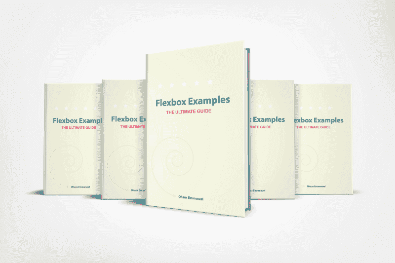

Note — this is a long read, so if you want, you can download this article and read it offline [here](https://payhip.com/b/YVGf).

理解 **Flexbox** 的最好方法是什么？学习基础知识，然后建立大量的东西。这正是我们在本文中要做的。

### 一些需要注意的事情

*   本文是为中级开发人员编写的，并且假设您已经对 Flexbox 有所了解。但是…
*   如果你知道一些 CSS，但完全不知道 Flexbox，[我在这里写了一个全面的指南(免费文章，46 分钟阅读)](https://medium.freecodecamp.org/understanding-flexbox-everything-you-need-to-know-b4013d4dc9af)。
*   而如果你对 CSS 不是很了解，我推荐上我的[CSS 完全(实用)入门(74 节课的付费课程)](http://bit.ly/learn_css)。
*   您不必按照这里列出的顺序来学习本文中的示例。
*   Flexbox 只是一种布局技术。现实世界的项目需要的不仅仅是布局。
*   当您看到像`div.ohans`这样的符号时，它指的是类名为`ohans`的 div

### 示例 1:如何用 Flexbox 制作照片库

使用 Flexbox 按行和列运行照片比大多数人想象的要容易。

考虑一个简单的标记，如下所示:

```
<main class="gallery">                    </main>
```

我们在一个`main.gallery`中有 10 幅图像。

假设`main.gallery`被设计为覆盖可用屏幕。

```
.gallery {   min-height: 100vh}
```

#### 关于图像的快速注释

默认情况下，图像是`inline-block`元素。它们有宽度和高度。它们将保持在一行上，除非受到大小的限制，例如图像太大而无法放在一行上。

#### 起点

综上所述，上述所有标记和样式的结果如下:

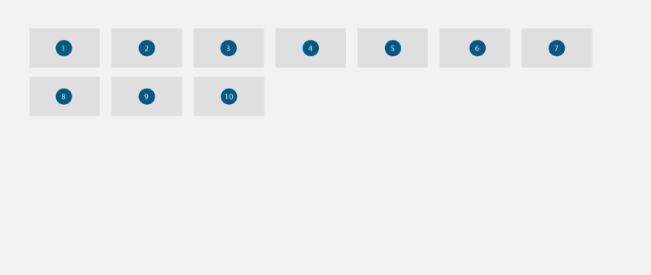

10 images with their width and height declarations intact. They fall unto the next line when appropriate. Obedient lads ;)

现在，让 Flexbox 登场:

```
.gallery {    display: flex }
```

此时，图像的默认行为已经改变。它们从`inline-block`元素变成`flex-items.`

作为在`.gallery`内启动的 Flexbox 上下文的结果，图像现在将被压缩成一行。另外，它们会像这样沿着垂直方向伸展:

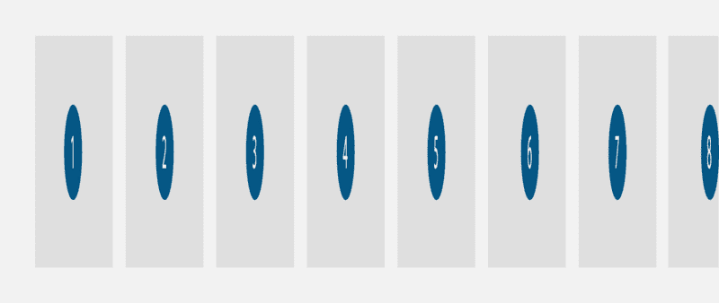

The Images now stretch along the vertical, and are squashed unto one line. Nothing’s uglier :(

这是 Flexbox 默认行为的结果:

1.  将所有子元素压缩成一行。不要包装元素。

这对画廊来说是不好的，所以我们这样改变这种行为:

```
.gallery {    flex-wrap: wrap}
```

这将包装元素，并在适当的时候将它们分成多行。

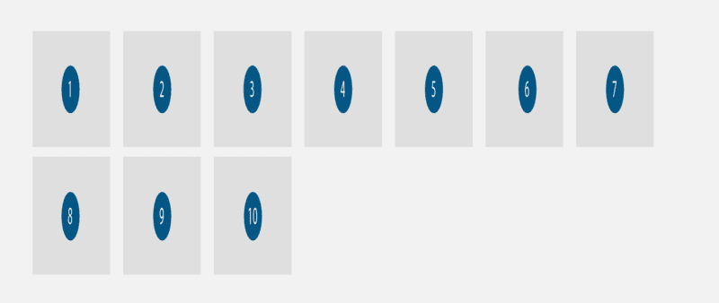

With the wrap value altered, the images now wrap unto the next line

2.图像现在换行到下一行。但是它们仍然沿着垂直方向伸展。我们当然不**不**希望这种行为，因为它扭曲了形象。

`stretch`行为是由于`flex`容器上的默认`align-items`值造成的。

```
align-items: stretch
```

让我们改变这一点:

```
.gallery {  ...  align-items: flex-start}
```

这将防止图像被拉伸。它们将采用默认的`width`和`height` 值。

它们也将与垂直轴的起点对齐，如下所示:

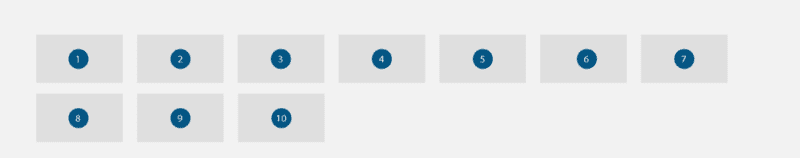

Now we have images that aren’t distorted. This is pretty much where we began before introducing Flexbox.

现在我们有了 Flexbox 驱动的图库。

#### 使用 Flexbox 的优势

在这一点上，使用 Flexbox 没有太大的优势。我们拥有与推出 **Flexbox** 型号之前相同的外观。

除了免费获得一个响应图库，使用 Flexbox 的其他优势来自它带来的对齐选项。

请记住，flex 容器`.gallery`采用了以下属性值。`flex-direction: row` `justify-content: flex-start`和`align-items: flex-start.`

通过调整默认值，图库的布局可以瞬间切换，如下所示:

```
.gallery {   ...   justify-content:center;}
```

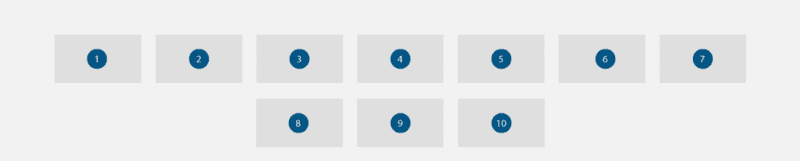

The images are now perfectly centered along the horizontal.

如上图所示，这将使图像沿水平方向居中对齐:

```
.gallery {   ...   justify-content:center;   align-items: center;}
```

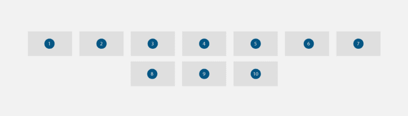

Taking steps further, we have the images perfectly aligned to the center (horizontally and vertically)

如上图所示，这将图像水平和垂直对齐到`.gallery`的中心

Flexbox 提供了许多对齐选项。如果您认为合适，可以随意尝试更多的对齐选项。

您可以在[代码栏](https://codepen.io/ohansemmanuel/full/dzgLLw/)中查看实际的 Flexbox 图库。

### 示例 2:如何使用 Flexbox 构建卡

卡片在互联网上变得流行起来。谷歌、Twitter、Pinterest，似乎其他所有人都在转向卡片。

卡片是一种 UI 设计模式，它将相关信息分组到一个大小可变的容器中。它看起来像一张扑克牌。

卡片有许多好的用途。一个常见的例子是臭名昭著的定价网格。

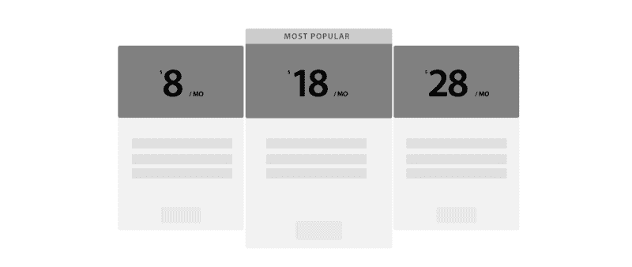

sample pricing grid mockup

让我们建造一个。

#### 加价

每张卡都有一个标记，如下所示:

```
<section class="card">  <header>  </header>
```

```
 <ul>    <li></li>    <li></li>    <li></li>  </ul>  <button></button></section>
```

至少会有 3 张牌。将卡片包装成一个`div.cards`

```
<div class="cards"></div>
```

现在我们有了一个父元素。

对于此示例，父元素已设置为填充整个视口。

```
.cards {   min-height: 100vh}
```

#### 设置 Flexbox

以下代码块将在`.cards`内启动 Flexbox 格式化上下文

```
.cards {  display: flex;  flex-wrap: wrap}
```

如果你还记得上一个例子，`flex-wrap`将允许`flex-items`换行。

当子元素不适合父元素时，就会发生这种情况。这是因为合并的子元素的计算宽度更大。

继续给`.card`一个初始宽度。

使用 Flexbox:

```
.card {  flex: 0 0 250px}
```

这将把`flex-grow`和`flex-shrink`值设置为`0`。`flex-basis`值将被设置为`250px`

此时，卡片将与页面的开头对齐。它们也将沿垂直方向伸展。

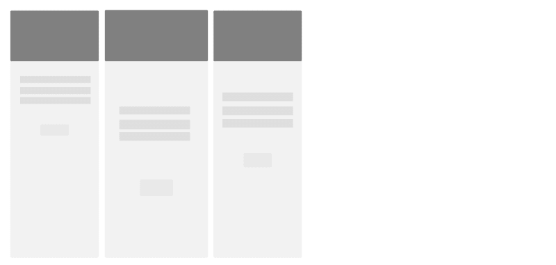

cards aligned to the start of the page

在某些情况下，这可能是您的用例的理想选择。但大多数情况下，不会。

#### Flex 容器的默认行为

上面的结果是由于 flex 容器的默认行为造成的。

因为`justify-content`被设置为值`flex-start`，所以卡片从`top left`页的开始处开始。

此外，卡片会拉伸以填充父元素的整个高度，因为默认情况下`align-items`被设置为`stretch`。

#### 改变默认值

通过改变 Flexbox 提供的默认值，我们可以取得令人印象深刻的结果。

见下文:

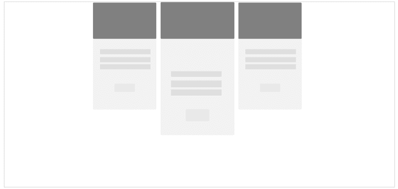

align-items: flex-start; justify-content: center

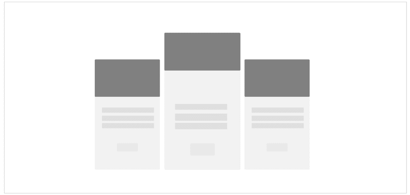

align-items: flex-end; justify-content: center

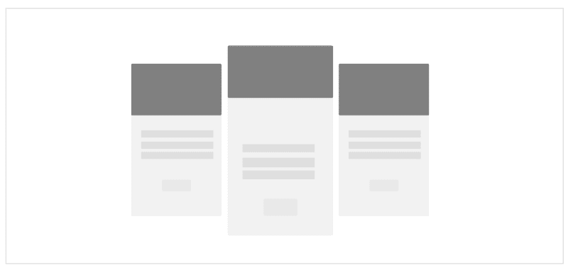

align-items: center; justify-content: center

要查看最终项目，请参见此[代码打开](https://codepen.io/ohansemmanuel/full/Ljqdpa/)。

### 示例 3:如何用 Flexbox 构建网格

整个 CSS 框架都是建立在这个例子中将要讨论的概念之上的。这是非常重要的东西。

#### 什么是网格？

网格是一系列相交的垂直和水平直线，用于构建内容。


a series of intersecting straight (vertical, horizontal) guide lines

如果你熟悉诸如 Bootstrap 之类的 CSS 框架，那么你肯定以前使用过网格。

您的里程可能会有所不同，但在本例中，我们将考虑不同的网格类型。

先说第一个，**基础网格**。

#### 基本网格

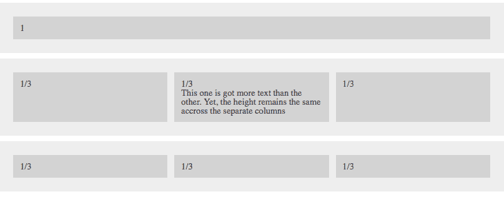

A set of basic grids each having equally spaced columns

这些网格具有以下特征:

*   网格单元的间距应该相等，并扩展到适合整行。
*   网格单元的高度应该相等。

使用 Flexbox 很容易实现这一点。考虑下面的标记:

```
<div class="row">  <div class="row_cell">1</div></div>
```

每个`.row`将是它自己的 flex 容器。

然后，`.row`中的每个元素都变成了一个 flex 项目。所有弹性项目在行内均匀分布。

根据设计，我们是否有 3 个子元素并不重要

```
<div class="row">  <div class="row_cell">1/3</div>  <div class="row_cell">1/3</div>  <div class="row_cell">1/3</div></div>
```

或 6 个子元素

```
<div class="row">  <div class="row_cell">1/6</div>  <div class="row_cell">1/6</div>  <div class="row_cell">1/6</div>  <div class="row_cell">1/6</div>  <div class="row_cell">1/6</div>  <div class="row_cell">1/6</div></div>
```

或者 12 种元素

```
<div class="row">  <div class="row_cell">1/12</div>  <div class="row_cell">1/12</div>  <div class="row_cell">1/12</div>  <div class="row_cell">1/12</div>  <div class="row_cell">1/12</div>  <div class="row_cell">1/12</div>  <div class="row_cell">1/12</div>  <div class="row_cell">1/12</div>  <div class="row_cell">1/12</div>  <div class="row_cell">1/12</div>  <div class="row_cell">1/12</div>  <div class="row_cell">1/12</div></div>
```

#### 解决方案

做这件事只有两步。

1.  启动 Flexbox 格式化上下文:

```
.row {   display: flex;}
```

2.让每个`flex-item`以相等的比例展开以适合整行:

```
.row_cell {   flex: 1}
```

仅此而已。

#### 解决方案解释。

```
flex: 1
```

`flex`是一个简写的属性名，用于按顺序设置三个不同的 Flexbox 属性，即`flex-grow`、`flex-shrink`和`flex-basis`。

`flex: 1`仅设置了值`1`。这个值归属于`flex-grow` 属性。

`flex-shrink`和`flex-basis`属性将被设置为`1`和`0`。

```
flex: 1  === flex: 1 1 0
```

#### 特定大小的网格单元

有时候你想要的不是一排网格一样的单元格。

你可能希望细胞是其他细胞的两倍，或任何分数。

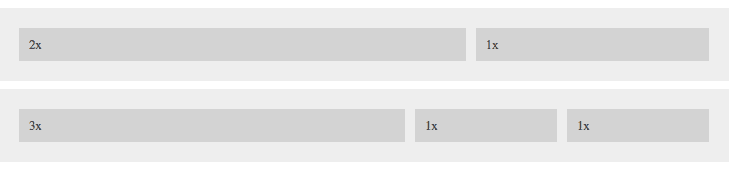

grid of row cells that are 2x or 3x the other cells.

解决方案非常简单。

向这些特定的网格单元格添加一个修饰符类，如下所示:

```
.row_cell--2 {   flex: 2}
```

将类包含在标记中。请参见下面标记中的第一个子元素`div`:

```
<div class="row">  <div class="row_cell row_cell--2">2x</div>  <div class="row_cell">1/3</div>  <div class="row_cell">1/3</div></div>
```

类别为`.row__cell--2`的单元格将是默认单元格的两倍。

对于占用 3 倍可用空间的单元格:

`.row_cell--3 {`
`flex: 3`


#### 特定对齐的网格单元

得益于 Flexbox，每个单元不必绑定到某个对齐值。您可以为任何单元格指定特定的对齐方式。

为此，请像这样使用修饰符类:

```
.row_cell--top {  align-self: flex-start}
```

这将使特定单元格与`row`的顶部对齐。

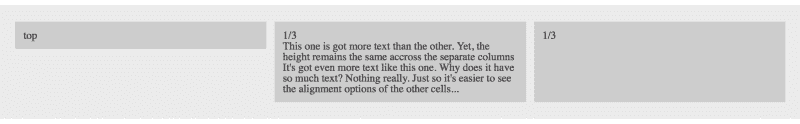

applying the .row_cell — top class will align the specific cell to the top of the `row`

您还必须将该类添加到标记中的特定单元格。请参见下面标记中的第一个子元素`div`:

```
<div class="row">  <div class="row_cell row_cell--top"></div>  <div class="row_cell"></div>  <div class="row_cell"></div></div>
```

以下是其他可用的对齐选项:

```
.row_cell--bottom {  align-self: flex-end}
```

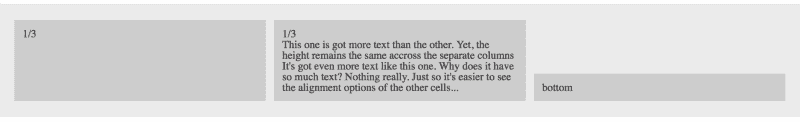

applying the .row_cell — bottom class will align the specific cell to the bottom of the `row`

```
.row_cell--center {  align-self: center}
```

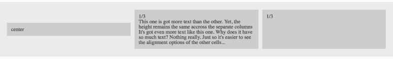

applying the .row_cell — center class will align the specific cell to the center of the `row`

#### 行内整体对齐

因为特定的单元格可以对齐，所以行中的整个**子元素也可以对齐。**

为此，请使用如下修饰符类:

```
.row--top {   align-items: flex-start}
```

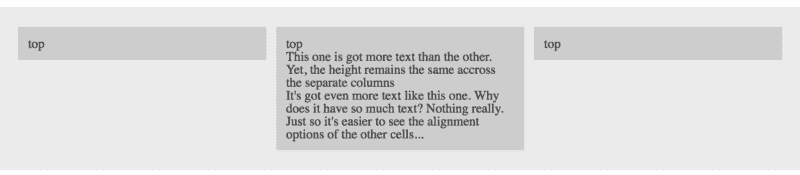

a row with all three cells aligned to the top of the row.

需要注意的是，修饰符类`.row--top`必须添加到`row`或父类`flex-container`中

```
<div class="row row--top">  <div class="row_cell"></div>  <div class="row_cell"></div>  <div class="row_cell"></div></div>
```

其他对齐选项如下所示:

```
.row--center {   align-items: center}
```

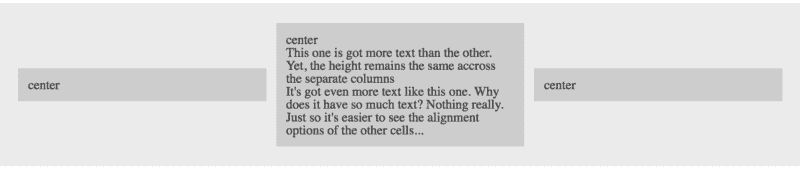

a row with all three cells aligned to the center of the row.

```
.row--bottom {   align-items: flex-end}
```

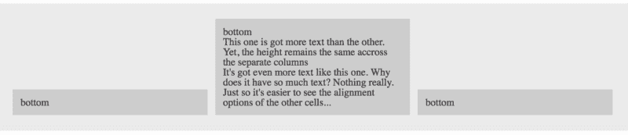

a row with all three cells aligned to the center of the row.

#### 嵌套网格

不需要做任何特别的事情，这些`rows`可以嵌套在它们自己里面。

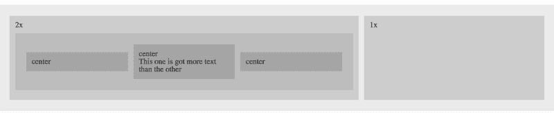

A row with two cells, one 2x the other. Within the larger cell, a row of three centered cells has been nested.

您可以查看在这里创建的最终网格[。](https://codepen.io/ohansemmanuel/full/xLBLLG/)

#### 更多网格

虽然您可以通过 Flexbox 垂直网格和更复杂的配置获得精美的建筑网格，但请使用最佳工具。学习、掌握和使用 [CSS 网格布局](https://medium.com/flexbox-and-grids/how-to-efficiently-master-the-css-grid-in-a-jiffy-585d0c213577)。它是网格的终极 CSS 解决方案。

### 示例 4:如何使用 Flexbox 构建网站布局

社区通常不赞成将 Flexbox 用于成熟的 web 布局。

虽然我同意这一点，但我也认为在某些情况下你可以逃脱惩罚。

我能给出的最重要的建议是:

> ***在有意义的地方使用 Flexbox***

我将在下面的例子中解释这个语句。

#### 圣杯布局

还有什么比臭名昭著的“**圣杯**”更好的网站布局呢？


The holy grail layout — header, footer and 3 other content containers.

有两种方法可以尝试用 Flexbox 构建这种布局。

首先是用 Flexbox 构建布局。将`header`、`footer`、`nav`、`article`和`aside`全部放在一个`flex-container`中。

让我们从那开始。

#### 加价

考虑下面的基本标记:

```
<body>  <header>Header</header>  <main>    <article>Article</article>    <nav>Nav</nav>    <aside>Aside</aside>  </main>  <footer>Footer</footer></body>
```

除此之外，圣杯还有一个特别的规则。这条规则启发了上面的标记:

中间的列`article`应该首先出现在标记中，在两个侧栏`nav`和`aside`之前。


“<article></article>” appears first in the markup, but is centered in the layout.

#### 启动 Flexbox 格式化上下文

```
body {   display: flex}
```

因为子元素应该从上到下堆叠，所以必须更改 Flexbox 的默认方向。

```
body { ... flex-direction: column}
```

**1** 。 `header`和`footer`应该有固定的宽度。

```
header,footer {  width: 20vh /*you can use pixels e.g. 200px*/}
```

**2。必须使** `main`填满`flex-container`内的可用剩余空间

```
main {   flex: 1}
```

假设你没忘，`flex: 1`相当于`flex-grow: 1`、`flex-shrink: 1`和`flex-basis: 0`

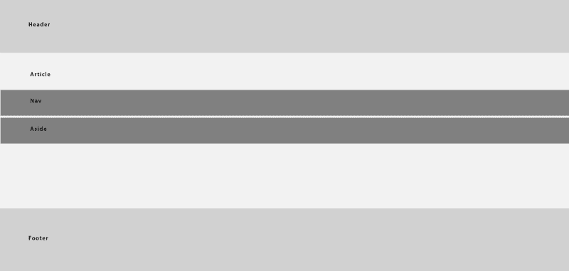

This will cause `main` to “grow” and contain the available remaining space.

此时，我们需要注意`main`中的内容，即`article`、`nav`和`aside`。

将`main`设置为`flex-container`:

```
main {  display: flex}
```

让`nav`和`aside`占据固定的宽度:

```
nav,aside {  width: 20vw}
```

确保`article`占据剩余的可用空间:

```
article {   flex: 1}
```

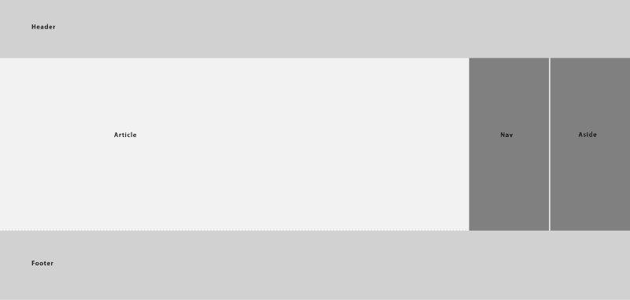

`"article"` now takes up the remaining available space

现在还有一件事要做。

对`flex-items`重新排序，使`nav`首先显示:

```
nav {  order: -1}
```


The final result. [https://codepen.io/ohansemmanuel/full/brzJZz/](https://codepen.io/ohansemmanuel/full/brzJZz/)

`order`属性用于对`flex-items`的位置进行重新排序。

一个容器内的所有`flex-items`将显示在**中，增加**和`order`的值。具有最低`order`值的`flex-item`首先出现。

所有的`flex-items`都有默认的`order`值`0`。

#### 圣杯布局(另一个解决方案)

之前的解决方案使用一个`flex-container`作为整体容器。布局严重依赖于 Flexbox。

让我们看看更“理智”的方法。再看一看假设的最终结果:


The holy grail layout

`header`和`footer`可以被视为块元素。在没有任何干预的情况下，它们将填满其包含元素的宽度，并从上到下堆叠。

```
<body>  <header>Header</header>  <main>    <article>Article</article>    <nav>Nav</nav>    <aside>Aside</aside>  </main>  <footer>Footer</footer></body>
```

使用这种方法，唯一需要的`flex-container`就是`main`。

这种方法的唯一挑战是你必须自己计算`main`的高度。除了`header`和`footer.`所占据的空间之外，`main`应该填充可用的空间

```
main {  height: calc(100vh - 40vh);}
```

考虑上面的代码块。它使用 CSS `calc`函数来计算`main.`的高度

无论你的里程数是多少，`main`的高度必须等于`calc(100vh — height of header — height of footer ).`

和前面的解决方案一样，你必须给`header`和`footer`一个固定的高度。然后继续，以与上一个解决方案相同的方式处理`main`。

您可以在此处查看[的实际结果。](https://codepen.io/ohansemmanuel/full/brzybZ/)

#### 两栏网站布局

两栏布局很常见。使用 Flexbox 也可以轻松实现。

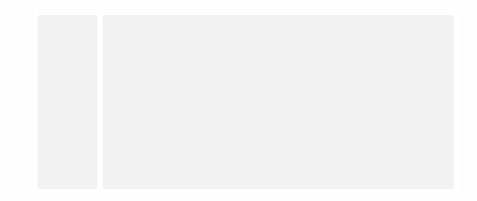

2 column layout with a sidebar and main content area.

考虑下面的标记:

```
<body>  <aside>sidebar</aside>  <main>main</main></body>
```

启动 Flexbox 格式化上下文:

```
body {  display: flex;}
```

给`aside`一个固定的宽度:

```
aside {   width: 20vw}
```

最后，确保`main`填满剩余的可用空间:

```
main {  flex: 1}
```

差不多就是这么多了。

### 示例 5:具有 Flexbox 的媒体对象

媒体对象无处不在。从推特到脸书的帖子，它们似乎是大多数用户界面设计的首选。

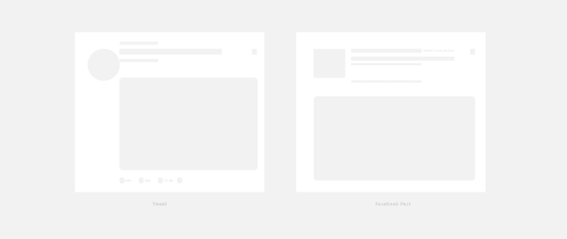

Sample Tweet and Facebook post

考虑下面的标记:

```
<div class="media">    <div class="media-body">    <h3 class="media-heading"> Header </h3>    <p></p>  </div></div>
```

如您所料，`.media`将建立 Flexbox 格式化上下文:

```
.media {   display: flex}
```

默认情况下，`container`的`flex-items`沿垂直方向拉伸，以填充`flex-container`内的可用高度。

确保`.media-body`占据所有剩余的可用空间:

```
.media-body {   flex: 1}
```


The box on the left stretches to fit the available screen. The media body takes up the remaining horizontal space within the media object (white)

让我们修理被拉长的盒子。

```
.media {  ...  align-items: flex-start}
```

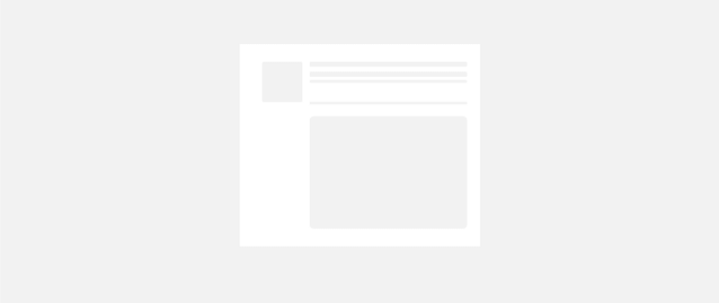

The flex items are now aligned to the start of the media object. The image now takes it default’s size. No weird stretching :)

仅此而已。

#### 翻转的媒体对象


A flipped media object has the image on the other side (right) of the media object

您没有更改`html`源顺序来创建翻转的媒体对象。

就像这样对`flex-item`重新排序:

```
.media-object {   order: 1}
```

这将使图像显示在`.media-body`和`media-heading`之后

#### 嵌套的媒体对象

您甚至可以继续嵌套媒体对象。而不改变我们编写的任何 CSS 样式。

```
<div class="media">    <div class="media-body">    <h3 class="media-heading"> Header </h3>    <p></p>        <!--nested-->    <div class="media">        <div class="media-body">        <h3 class="media-heading"> Header </h3>        <p></p>    </div>    </div><!--end nested-->  </div> </div>
```

有用！


Media objects nested within media objects.

#### Unicode 媒体对象

看来我们不仅仅局限于图像。

在不改变任何 CSS 样式的情况下，您可以用 unicode 表示图像。

```
<div class="media">  <div class="media-object">?</div>  <div class="media-body">    <h3 class="media-heading"> Header </h3>    <p></p>  </div></div>
```

我已经在那里贴上了表情符号。

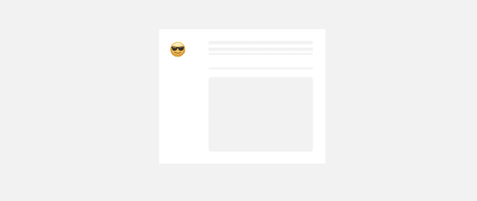

Media object with emoji support.

去掉`img`并用一个包含所需 unicode 的`div`替换它，得到上面的输出。你可以在这里抓取更多的表情符号 unicode[。](https://emojipedia.org)

#### HTML 实体媒体对象

你可能也使用了如下所示的 html 实体。

```
<div class="media">  <div class="media-object">☎</div>  <div class="media-body">    <h3 class="media-heading"> Header </h3>    <p></p>  </div></div>
```

本例中使用的 html 实体是`☎`，您可能会看到下面的结果。

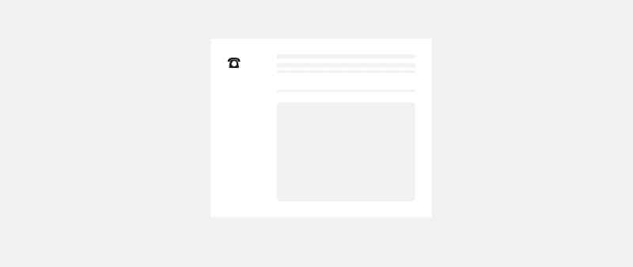

html entity, ☎

你可以在这个[代码笔](https://codepen.io/ohansemmanuel/full/jLJbGL/)中查看这些例子的结果。

### 示例 6:如何用 Flexbox 构建表单元素

现在很难找到没有一两张表格的网站。

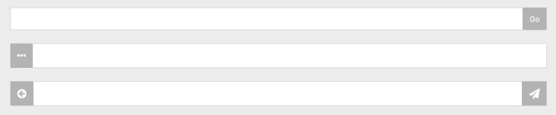

form inputs appended and prepended with other elements

考虑下面的标记:

```
<form class="form">  <input class="form__field">  <button class="form__item">…</button></form><form class="form">  <span class="form__item">…</span>  <input class="form__field"></form><form class="form">  <span class="form__item">…</span>  <input class="form__field">  <button class="form__item">…</button></form>
```

此示例显示了将输入字段与按钮或文本范围对齐的组合。使用 Flexbox，解决方案同样非常简单。

启动 Flexbox 格式化上下文:

```
.form {  display: flex}
```

确保输入字段占用可用空间:

```
.form__field {   flex: 1}
```

最后，你可以按照你认为合适的方式来设计附加的或前置的文本和按钮。

```
.form__item {  ... }
```

你可以在这个[代码笔](https://codepen.io/ohansemmanuel/full/ZJPmNj/)中查看这个例子的完整结果。

### 示例 7:如何使用 Flexbox 构建移动应用布局

在本例中，我将向您展示下面的移动应用程序布局流程:

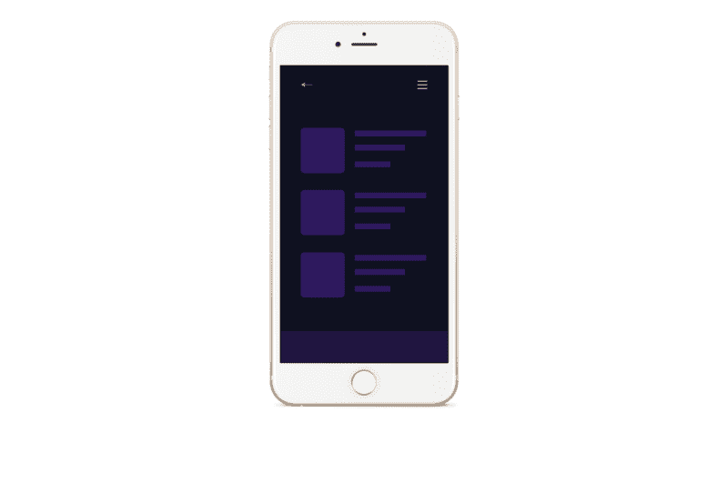

The mobile app layout we will build with Flexbox

然而，这个例子是不同的。

我将用伪代码解释构建移动布局的过程，您将继续构建它。

这将是让你的手**变湿**的一种练习形式。

#### 第一步

剥去 iPhone 的布局，我们得到了这个:

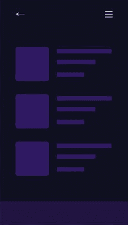

The barebones layout

#### 第二步

将包含体定义为`flex-container`

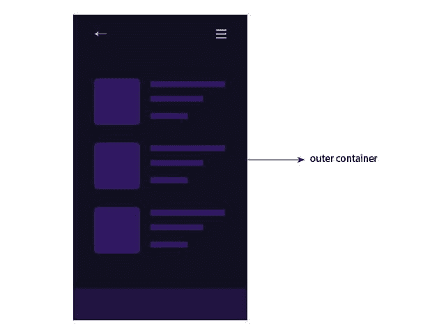

Initiate the Flexbox formatting context as a flex container.

#### 第三步

默认情况下，`flex-container`的`flex-direction`被设置为`row`。这种情况下，改成`column`。

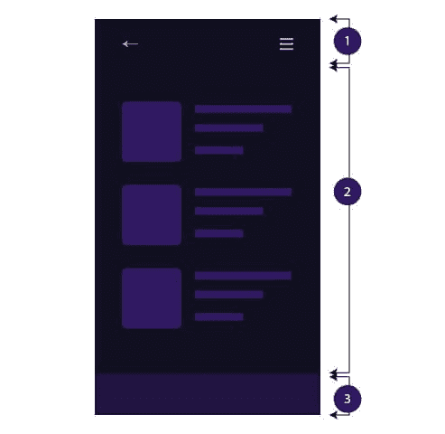

Change the default flex direction to have 3 child elements aka `flex-items`

#### 第四步

给出项目 1 和 3 的固定高度，如`height: 50px.`

#### 第五步

项目 2 的高度必须能填满可用空间。使用`flex-grow`或`flex`速记`flex: 1.`

#### 第六步

最后，将每个内容块视为一个媒体对象，如前面的示例所示。

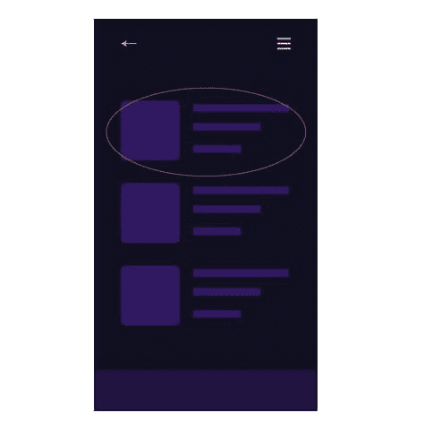

Treat the blocks of content as media objects.

按照上面的六个步骤，成功搭建移动 app 布局就成功了。

### 想成为职业选手吗？

下载我的免费 CSS Grid 小抄，还能免费获得两门优质互动 Flexbox 课程！

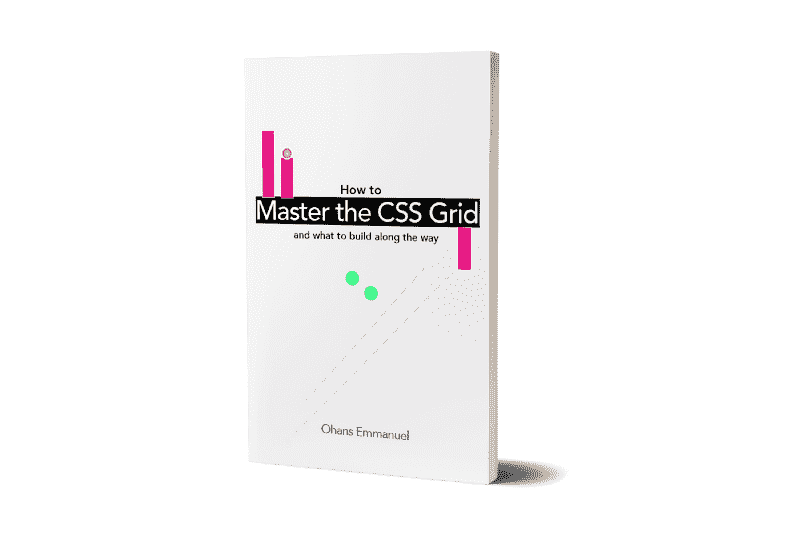

[Get the Free CSS Grid Cheat sheet + Two Quality Flexbox Courses for free!](http://eepurl.com/dcNiP1)

[立即获取](http://eepurl.com/dcNiP1)