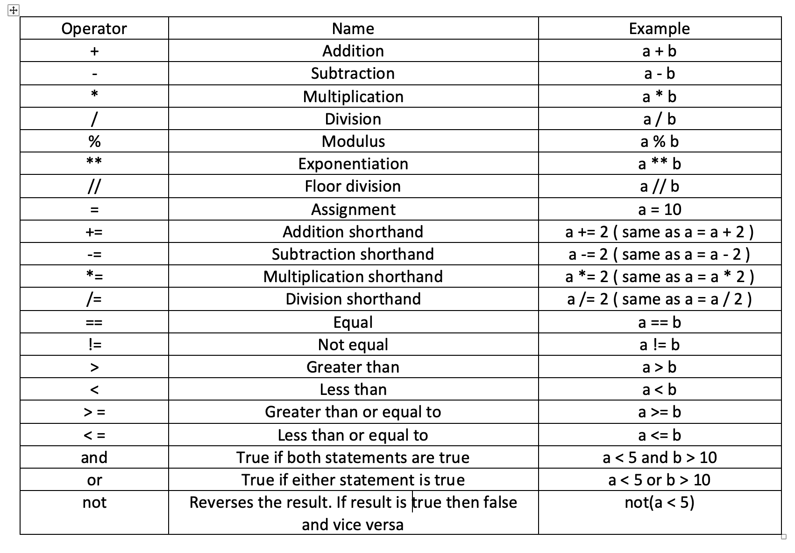

# Python 终极指南:如何从初学者到专业人员

> 原文：<https://www.freecodecamp.org/news/the-ultimate-guide-to-python-from-beginner-to-intermediate-to-pro/>

如果你对数据科学、Web 开发、机器人或物联网感兴趣，你必须学习 Python。由于使用量大，应用范围广，Python 已经成为发展最快的编程语言。

对于初学者或者非技术背景的人来说，学习 Python 是一个不错的选择。语法就像说和写简单的英语。例如，考虑这个语法，它显示了与英语的相似之处。

```
print("Hello folks")
```

我们将在本教程中使用`Python3`,因为它被广泛使用。Python 的大部分框架和库都支持这个版本。

> **注意:**3 . 5 . 2 以上的任何版本都支持大部分的库和框架。

## 索引:

1.  [简介](#introduction-)
2.  [安装](#installation-)
3.  [Python 外壳](#python-shell-)
4.  [评论](#comment-)
5.  [打印](#print-)
6.  [缩进](#indentation-)
7.  [变量](#variables-)
8.  [操作员](#operators-)
9.  [条件语句](#conditional-statements-)
10.  [用于循环](#for-loops-)
11.  [While 循环](#while-loops-)
12.  [用户输入](#user-input-)
13.  [类型转换](#typecasting-)
14.  [字典](#dictionaries-)
15.  [列表](#lists-)
16.  [元组](#tuples-)
17.  [设置](#sets-)
18.  [函数和参数](#functions-and-arguments-)
19.  [参数](#args-)
20.  [关键字参数](#keyword-arguments-)
21.  [默认参数](#default-argument-)
22.  [kwargs](#kwargs-)
23.  [范围](#scope-)
24.  [退货单](#return-statement-)
25.  [λ表达式](#lambda-expression-)
26.  [列表理解](#list-comprehension-)
27.  [哎呀概念](#oops-concepts-)
28.  [类](#classes-)
29.  [方法](#methods-)
30.  [物体](#objects-)
31.  [构造器](#constructor-)
32.  [实例属性](#instance-attributes-)
33.  [类属性](#class-attributes-)
34.  [自我](#self-)
35.  [继承](#inheritance-)
36.  [超级](#super-)
37.  [多重继承](#multiple-inheritance-)
38.  [多态性](#polymorphism-)
39.  [封装](#encapsulation-)
40.  [装修工](#decorator-)
41.  [异常情况](#exceptions-)
42.  [包导入](#package-import-)
43.  [JSON 处理](#json-handling-)

注意:本指南的开头是面向初学者的。如果你有 Python 的中级经验，可以使用上面的链接跳过。

## **简介**:

根据 Github 的 [octoverse](https://octoverse.github.com/#top-languages) ，Python 是 2019 年开发者使用第二多的语言。


Octoverse graph of how languages have evolved

在学习任何语言之前，了解该语言是如何产生的是有帮助的。嗯，Python 是由荷兰程序员[吉多·范·罗苏姆](https://en.wikipedia.org/wiki/Guido_van_Rossum)开发的，于 1991 年发布。

Python 是一种解释型语言。它使用 [CPython](https://en.wikipedia.org/wiki/CPython) 解释器将 Python 代码编译成字节码。对于一个初学者来说，不需要太了解 CPython，但是一定要清楚 Python 内部的工作原理。

Python 背后的理念是代码必须可读。它借助缩进来实现这一点。它支持许多编程范例，如函数式编程和面向对象编程。当你通读这篇文章时，你会对这些有更多的了解。

大多数初学者心中的基本问题是一门语言能做什么。以下是 Python 的一些使用案例:

*   服务器端开发(Django，Flask)
*   数据科学(Pytorch，张量流)
*   数据分析/可视化(Matplotlib)
*   脚本(美汤)
*   嵌入式开发

> **注意:**我不特别认可上述任何库或框架。它们很受欢迎，并广泛应用于各自的领域。

## 装置

学习任何编程语言的第一步是安装它。如今，Python 与大多数操作系统捆绑在一起。在终端中使用以下命令检查 Python 是否可用:

```
python3 --version
```

您将看到以下输出:

```
Python 3.7.0
```

请注意，您的 Python 版本可能有所不同。如果您安装了 Python 并且版本高于 3.5.2，那么您可以跳过这一部分。

对于没有安装 Python 的用户，请遵循以下步骤:

*   [Windows 用户](#windows-user-)
*   [Mac 用户](#mac-user-)
*   [Linux 用户](#linux-user-)

### Windows 用户:

*   去 [Python 的官网](https://www.python.org/downloads/)。
*   点击下载按钮(下载 Python 3.8.2 ) [ **注意:**根据您阅读本文的时间，版本可能会有所不同]
*   转到下载软件包的路径，双击安装程序。
*   选中“将 Python 3.x 添加到路径”复选框，然后单击“立即安装”。
*   一旦完成，你会得到一个提示“安装成功”。使用上面的命令再次检查 python 是否配置正确。
*   要确认 Python 的安装和配置是否正确，请使用命令`python3 --version`。

### Mac 用户:

*   首先从 app store 安装 [xcode](https://apps.apple.com/in/app/xcode/id497799835?mt=12) 。
*   如果您想要使用终端安装 Xcode，请使用以下命令:

```
xcode-select --install 
```

*   之后，我们将使用 brew 包管理器来安装 Python。要安装和配置 [brew](https://brew.sh/) ，请使用以下命令:

```
/bin/bash -c "$(curl -fsSL https://raw.githubusercontent.com/Homebrew/install/master/install.sh)" 
```

*   brew 设置完成后，使用以下命令更新任何过期的软件包:

```
brew update
```

*   使用以下命令安装 Python:

```
brew install python3
```

*   要确认 Python 的安装和配置是否正确，请使用命令`python3 --version`。

### Linux 用户:

*   要使用`apt`安装 Python，请使用以下命令:

```
sudo apt install python3 
```

*   要使用`yum`安装 Python，使用以下命令:

```
sudo yum install python3 
```

*   要确认 Python 的安装和配置是否正确，请使用命令`python3 --version`。

## Python shell:

shell 是您会遇到的最有用的工具之一。Python shell 使我们能够在将任何概念集成到我们的应用程序之前快速测试它。

转到终端或命令行提示符。输入`python3`命令，您将得到以下输出:

```
➜ python3.7
Python 3.7.0 (v3.7.0:1bf9cc5093, Jun 26 2018, 23:26:24)
[Clang 6.0 (clang-600.0.57)] on darwin
Type "help", "copyright", "credits" or "license" for more information.
>>>
```

在本教程中，我们将在 python3 shell 的帮助下学习一些概念，你可以在上面看到。从现在开始，每当我提到**转到 Python shell** ，就意味着你必须使用`python3`命令。

为了学习剩下的概念，我们将创建一个名为“testing”的文件，扩展名为`.py`。要运行该文件，我们将使用以下命令:

```
python3 testing.py
```

我们去 Python shell 吧。在`>>>`标记后键入`10 + 12`。您将得到输出 22:

```
>>> 10 + 12
22
```

## 正在评论:

注释使编写代码变得容易，因为它们帮助我们(和其他人)理解为什么要编写一段特定的代码。注释的另一个优点是它们有助于提高代码的可读性。

```
# Stay Safe
```

当您添加上述语法时，Python 解释器认为它是一个注释。不执行`#`之后的所有内容。

你可能想知道为什么你应该使用注释。假设你是一名开发人员，你被分配到一个大型项目中。这个项目有一千多行代码。为了理解一切是如何工作的，你需要一行一行地通读所有的代码。

还有比这更好的解决方案吗？啊哈！评论。注释帮助我们理解为什么要编写一段特定的代码，以及它返回什么或者做什么。把它看作是每一段代码的文档。

## 打印:

除了编辑器中的调试工具之外，帮助开发人员解决问题的最常用的工具是打印语句。print 语句是所有编程中最被低估的语法之一。

那么它对调试问题有什么帮助呢？好吧，假设你有一个模块，你想检查执行流程来理解或调试它。有两个选择。您可以使用调试器或添加打印语句。

使用调试器并不总是可能的。例如，如果您使用 Python shell，则调试器不可用。在这种情况下，印刷帮助了我们。另一个场景是当您的应用程序正在运行时。您可以添加一个打印语句，该语句将显示在您的应用程序的日志中，并在运行时监视它们。

Python 提供了内置的打印方法，语法如下:

```
print("Stay safe...")
```

## 缩进:

这种语言的另一个有趣的部分是缩进。为什么？答案很简单:它使代码可读性强，格式良好。在 Python 中，遵循缩进规则是强制性的。如果没有遵循正确的缩进，您将得到以下错误:

```
IndentationError: unexpected indent
```

看，即使是 Python 中的错误也是如此易读易懂。开始时，你可能会被强制缩进所困扰。但是随着时间的推移，你会明白缩进是开发人员的朋友。

## **变量:**

顾名思义，变量是可以变化的东西。变量是指计算机程序使用的内存位置。

在大多数编程语言中，你需要把类型赋给变量。但是在 Python 中，你不需要。例如，在 C 中声明一个整数，使用下面的语法:`int num = 5;`。在 Python 中是`num = 5`。

转到 Python shell 并逐步执行操作:

*   `Integer`:可以是正数、负数、零，不含小数点的数值。

```
>>> num = 5
>>> print(num)
5
>>> type(num)
<class 'int'>
```

正如你在这里看到的，我们已经声明了一个`num`变量，并赋值为 5。Python 内置的`type`方法可以用来检查变量的类型。当我们检查`num`的类型时，我们会看到输出`<class 'int'>`。现在，只需关注输出中的`int`。`int`代表整数。

*   类似于整数，但有一点小小的不同——浮点数是一个带小数位的数值。

```
>>> num = 5.0
>>> print(num)
5.0
>>> type(num)
<class 'float'>
```

这里我们给`num`分配了一个单小数的数字。当我们检查`num`的类型时，我们可以看到它是`float`。

*   `String`:字符或整数的构成。它们可以用双引号或单引号来表示。

```
>>> greet = "Hello user"
>>> print(greet)
Hello user
>>> type(greet)
<class 'str'>
```

这里我们给`greet`分配了一个字符串。从输出中可以看出，greet 的类型是一个字符串。

*   `Boolean`:值为真或假的二元运算符。

```
>>> is_available = True
>>> print(is_available)
True
>>> type(is_available)
<class 'bool'>
```

这里我们给`is_available`赋了一个真值。此变量的类型为布尔型。您只能指定**真**或**假**。记住 **T** 和 **F** 应该大写，否则会给出如下错误:

```
>>> is_available = true
Traceback (most recent call last):
  File "<stdin>", line 1, in <module>
NameError: name 'true' is not defined
```

*   `NoneType`:当我们没有变量值时使用。

```
>>> num = None
>>> print(num)
None
>>> type(num)
<class 'NoneType'>
```

## 操作员:

请看下图，了解 Python 中所有可用的算术运算符:



Operators table

让我们一个一个地检查操作员。

### 算术运算符

这些包括加法、减法、删除、取幂、取模和地板除法。也是一些操作符的简写语法。

首先，我们将声明两个变量，`a`和`b`。

```
>>> a = 6 # Assignment
>>> b = 2
```

让我们试试基本的算术运算:

```
>>> a + b # Addition
8
>>> a - b # Subtraction
4
>>> a * b # Multiplication
12
>>> a / b # Division
3.0
>>> a ** b # Exponentiation
36
```

为了测试其他算术运算，让我们改变`a`和`b`的值。

```
>>> a = 7
>>> b = 3
>>> a % b # Modulus
1
>>> a // b # Floor division
2
```

Python 中也有速记算术运算。回头参考上面的图片来测试它们。使用`print`语句打印速记操作的输出。

### 比较运算符

这些包括等于、大于和小于。

```
>>> a = 5 # Assign
>>> b = 2 # Assign
>>> a > b # Greater than
True
>>> a < b # less then
False
>>> a == b # Equal to
False
>>> a >= 5 # Greater than or equal to
True
>>> b <= 1 # Less than or equal to
False
```

### 逻辑运算符

这些运算符包括 not、and 和 or。

```
>>> a = 10
>>> b = 2
>>> a == 2 and b == 10 # and
False
>>> a == 10 or b == 10 # or
True
>>> not(a == 10) # not
False
>>> not(a == 2)
True
```

## 条件语句:

顾名思义，条件语句用于评估一个条件是真还是假。

很多时候，当你开发一个应用程序时，你需要检查某个条件，并根据结果做不同的事情。在这种情况下，条件语句非常有用。If、elif 和 else 是 Python 中使用的条件语句。

我们可以比较变量，检查变量是否有值或者是否是布尔值，然后检查它是真还是假。转到 Python shell 并逐步执行操作:

**条件号 1:** 我们这里有一个整数和 3 个条件。第一个是`if`条件。它检查数字是否等于 10。

第二个是`elif`条件。这里我们检查数字是否小于 10。

最后一个条件是`else`。当上述条件都不匹配时，执行该条件。

```
>>> number = 5
>>> if number == 10:
...     print("Number is 10")
... elif number < 10:
...     print("Number is less than 10")
... else:
...     print("Number is more than 10")
...
```

输出:

```
Number is less than 10
```

**注意:**不一定要检查`if`条件中的两个条件是否相等。也可以在`elif`里做。

**条件号 2:** 我们这里有一个布尔 and 2 条件。你注意到我们是如何检查条件是否真实的吗？如果`is_available`，则打印“是，可用”，否则打印“不可用”。

```
>>> is_available = True
>>> if is_available:
...     print("Yes it is available")
... else:
...     print("Not available")
... 
```

输出:

```
Yes it is available
```

**条件 3:** 在 not 运算符的帮助下，我们颠倒了条件 2。

```
>>> is_available = True
>>> if not is_available:
...     print("Not available")
... else:
...     print("Yes it is available")
... 
```

输出:

```
Yes it is available
```

**条件 4:** 这里我们声明数据为 None，并检查数据是否可用。

```
>>> data = None
>>> if data:
...     print("data is not none")
... else:
...     print("data is none")
... 
```

输出:

```
data is none
```

**条件号 5:** 在 Python 中也可以使用内联 if。实现这一点的语法如下:

```
>>> num_a = 10
>>> num_b = 5
>>> if num_a > num_b: print("num_a is greater than num_b")
...
```

输出:

```
num_a is greater than num_b
```

**条件 6:** 在 Python 中也可以使用 inline if else。实现这一点的语法如下:

```
expression_if_true if condition else expression_if_false 
```

示例:

```
>>> num = 5
>>> print("Number is five") if num == 5 else print("Number is not five")
```

输出:

```
Number is five
```

**条件数 7:** 也可以使用嵌套的 if-else 语句。实现这一点的语法如下:

```
>>> num = 25
>>> if num > 10:
...     print("Number is greater than 10")
...     if num > 20:
...             print("Number is greater than 20")
...     if num > 30:
...             print("Number is greater than 30")
... else:
...     print("Number is smaller than 10")
...
```

输出:

```
Number is greater than 10
Number is greater than 20
```

**条件 8:** 你也可以在条件语句中使用`and`运算符。它声明如果条件 1 和条件 2 都为真，则执行它。

```
>>> num = 10
>>> if num > 5 and num < 15:
...     print(num)
... else:
...     print("Number may be small than 5 or larger than 15")
...
```

输出:

```
10
```

因为我们的数字在 5 和 15 之间，所以我们得到 10 的输出。

**条件编号 9:** 你也可以在条件语句中使用`or`运算符。它声明如果条件 1 或条件 2 为真，则执行它。

```
>>> num = 10
>>> if num > 5 or num < 7:
...     print(num)
...
```

输出:

```
10
```

你是否因为`num`的值是 10，而我们的第二个条件声明`num`小于 7 而感到困惑？那么为什么我们得到的输出是 10 呢？是因为`or`的状况。当其中一个条件匹配时，它将执行它。

## 对于循环:

任何编程语言中另一个有用的方法是迭代器。如果你要多次实现一个东西，你会怎么做？

```
print("Hello")
print("Hello")
print("Hello")
```

嗯，这是一种方法。但是想象一下你要做一百次或者一千次。嗯，我们要写很多书面声明。有一种更好的方法叫做迭代器或循环。我们可以使用`for`或`while`循环。

这里我们用的是极差法。它指定了循环应该重复的范围。默认情况下，起点为 0。

```
>>> for i in range(3):
...     print("Hello")
...
```

输出:

```
Hello
Hello
Hello
```

您也可以通过这种方式指定范围`range(1,3)`。

```
>>> for i in range(1,3):
...     print("Hello")
...
```

输出:

```
Hello
Hello
```

“Hello”只打印两次，因为我们在这里指定了范围。把范围想成`Number on right - Number on left`。

嗯，你也可以在 for 循环中添加一个 else 语句。

```
>>> for i in range(3):
...     print("Hello")
... else:
...     print("Finished")
```

输出:

```
Hello
Hello
Hello
Finished
```

请看我们的循环迭代了 3 次(3 - 0)，一旦完成，它就执行 else 语句。

我们也可以将一个 for 循环嵌套在另一个 for 循环中。

```
>>> for i in range(3):
...     for j in range(2):
...             print("Inner loop")
...     print("Outer loop")
...
```

输出:

```
Inner loop
Inner loop
Outer loop
Inner loop
Inner loop
Outer loop
Inner loop
Inner loop
Outer loop
```

正如您所看到的，内部循环 print 语句执行了两次。在执行完外部循环 print 语句后。内部循环又执行了两次。这里发生了什么？如果你感到困惑，那么考虑这样来解决它:

*   我们的解释器来了，发现有一个`for`循环。它再次下降并检查是否有另一个`for`回路。
*   所以现在它将执行两次内部`for`循环并退出。一旦完成，它就知道外部 for 循环已经指示它再重复两次。
*   它再次开始并看到内部 for 循环，然后重复。

嗯，你也可以选择通过某个`for`循环条件。pass 在这里是什么意思？每当 for 循环发生时，解释器看到`pass`语句，它不会执行它，而是移到下一行。

```
>>> for i in range(3):
...     pass
...
```

您将不会在 shell 上得到任何输出。

## While 循环:

Python 中另一个可用的循环或迭代器是`while`循环。我们可以在一个`while`循环的帮助下实现一些和我们在`for`循环中实现的一样的结果。

```
>>> i = 0
>>> while i < 5:
...     print("Number", i)
...     i += 1
...
```

输出:

```
Number 0
Number 1
Number 2
Number 3
Number 4
```

请记住，无论何时使用 while 循环，添加一个 increment 语句或一个将在某个点结束 while 循环的语句是很重要的。否则，while 循环将永远执行。

另一种选择是在一个`while`循环中添加一个`break`语句。这将打破循环。

```
>>> i = 0
>>> while i < 5:
...     if i == 4:
...             break
...     print("Number", i)
...     i += 1
...
```

输出:

```
Number 0
Number 1
Number 2
Number 3
```

如果我们发现`i`的值是 4，我们就打破了`while`循环。

另一个选择是在`while`循环中添加一个`else`语句。该语句将在 while 循环完成后执行。

```
>>> i = 0
>>> while i < 5:
...     print("Number", i)
...     i += 1
... else:
...     print("Number is greater than 4")
...
```

输出:

```
Number 0
Number 1
Number 2
Number 3
Number 4
Number is greater than 4
```

`continue`语句可用于跳过当前执行，并继续下一次执行。

```
>>> i = 0
>>> while i < 6:
...     i += 1
...     if i == 2:
...             continue
...     print("number", i)
...
```

输出:

```
number 1
number 3
number 4
number 5
number 6
```

## 用户输入:

假设您正在构建一个命令行应用程序。现在，您必须接受用户输入并相应地采取行动。为此，您可以使用 Python 的内置`input`方法。

实现这一点的语法如下:

```
variable = input(".....")
```

示例:

```
>>> name = input("Enter your name: ")
Enter your name: Sharvin
```

当您使用`input`方法并按回车键时，系统会提示您在`input`方法中输入的文本。让我们检查一下我们的任务是否有效:

```
>>> print(name)
Sharvin
```

在那里！它正在完美地工作。这里的`Sharvin`是字符串类型。

```
>>> type(name)
<class 'str'>
```

让我们再举一个例子，我们将赋值一个整数而不是一个字符串，并检查类型。

```
>>> date = input("Today's date: ")
Today's date: 12
>>> type(date)
<class 'str'>
```

你困惑吗？我们输入一个整数 12，它仍然以字符串的形式给出它的类型。这不是一个错误。这就是输入的工作方式。为了将字符串转换成整数，我们将使用类型转换。

## 类型转换:

我们看到`input`方法也为整数返回一个字符串。现在，如果我们想将这个输出与另一个整数进行比较，我们需要一种方法将其转换回整数。

```
>>> date_to_int = int(date)
>>> type(date_to_int)
<class 'int'>
```

这里，我们使用 Python 内置的`int`方法将上面用户输入部分声明的日期转换成整数。这叫做类型转换。

基本上，您可以借助类型转换完成以下转换:

*   整数到字符串:`str()`
*   字符串到整数:`int()`
*   要浮点的整数:`float()`

> 注意:从浮点到整数的转换也是可能的。

```
>>> type(date)
<class 'str'>

# Converting from string to float
>>> date_to_float = float(date)
>>> type(date_to_float)
<class 'float'>

# Converting from float to string
>>> date_to_string = str(date_to_float)
>>> type(date_to_string)
<class 'str'>

# Converting from float to integer
>>> date_to_int = int(date_to_float)
>>> type(date_to_int)
<class 'int'>
```

## 词典:

假设您想要存储一些用户详细信息。那么如何存储这些细节呢？是的，我们可以使用变量来存储它们，如下所示:

```
>>> fname = "Sharvin"
>>> lname = "Shah"
>>> profession = "Developer"
```

要访问该值，我们可以执行以下操作:

```
>>> print(fname)
Sharvin
```

但是这是一种优雅和优化的访问方式吗？答案是否定的。为了更加友好，让我们将数据存储在一个键值字典中。

什么是字典？字典是一个无序且可变的集合(即它可以被更新)。

下面是字典的格式:

```
data = {
	"key" : "value"
}
```

让我们通过一个例子来进一步理解字典:

```
>>> user_details = {
...     "fname": "Sharvin",
...     "lname": "Shah",
...     "profession": "Developer"
... }
```

### 如何访问字典中的值

我们可以通过两种方式访问字典中的值。我们将看一看这两者，然后调试它们，找出哪一个更好。

方法 1: 要从`user_details`字典中访问`fname`键的值，我们可以使用以下语法:

```
>>> user_details["fname"]
'Sharvin'
```

方法 2:我们也可以使用`get`从`user_details`字典中访问`fname`键的值。

```
>>> user_details.get("fname")
'Sharvin'
```

我知道方法 1 看起来更容易理解。当我们试图访问字典中没有的数据时，就会出现问题。

```
>>> user_details["age"]
Traceback (most recent call last):
  File "<stdin>", line 1, in <module>
KeyError: 'age'
```

我们得到一个 KeyError，它表示密钥不可用。让我们用方法 2 尝试同样的场景。

```
>>> user_details.get("age")
```

我们的控制台上没有打印任何东西。让我们进一步调试一下，知道为什么会出现这种情况。给我们的`get`操作分配一个可变年龄，我们将在控制台中打印它。

```
>>> age = user_details.get("age")
>>> print(age)
None
```

因此，当`get`没有找到密钥时，它会将值设置为 None。因此，我们没有任何错误。现在你可能想知道哪一个是正确的。大多数时候使用方法 2 更有意义，但是对于一些严格的检查条件，我们需要使用方法 1。

### 如何检查密钥是否存在

您可能想知道如何检查字典中是否有特定的键。Python 提供了内置方法`keys()`来解决这个问题。

```
>>> if "age" in user_details.keys():
...     print("Yes it is present")
... else:
...     print("Not present")
...
```

我们将获得以下输出:

```
Not present
```

如果我们想检查字典是否为空呢？为了理解这一点，让我们如下声明一个空字典:

```
>>> user_details = {}
```

当我们在字典上直接使用 if-else 时，如果数据存在，它将返回 true，如果数据为空，则返回 false。

```
>>> if user_details:
...     print("Not empty")
... else:
...     print("Empty")
...
```

输出:

```
Empty
```

我们还可以使用 Python 的内置方法`bool`来检查字典是否为空。记住，如果字典为空，bool 返回 False，如果字典为空，bool 返回 True。

```
>>> bool(user_details)
False

>>> user_details = {
...     "fname" : "Sharvin"
... }
>>> bool(user_details)
True
```

### 如何更新现有键的值

所以现在我们知道了如何获得一个特定的键并发现它是否存在——但是如何在字典中更新它呢？

如下声明一个字典:

```
>>> user_details = {
...     "fname":"Sharvin",
...     "lname": "Shah",
...     "profession": "Developer"
... }
```

要更新该值，请使用以下语法:

```
>>> user_details["profession"] = "Software Developer"
>>> print(user_details)
{'fname': 'Sharvin', 'lname': 'Shah', 'profession': 'Software Developer'}
```

更新字典中键的值与给变量赋值是一样的。

### 如何添加键值对

下一个问题是如何给字典添加一个新值？让我们添加一个值为 100 的`age`键。

```
>>> user_details["age"] = "100"
>>> print(user_details)
{'fname': 'Sharvin', 'lname': 'Shah', 'profession': 'Software Developer', 'age': '100'}
```

如您所见，我们的字典中添加了一个新的键值。

### 如何移除键值对

为了从字典中删除键值，Python 提供了一个名为`pop`的内置方法。

```
>>> user_details.pop("age")
'100'

>>> print(user_details)
{'fname': 'Sharvin', 'lname': 'Shah', 'profession': 'Software Developer'}
```

这将从`user_details`字典中删除`age`键值对。我们也可以使用一个`del`操作符来删除这个值。

```
>>> del user_details["age"]

>>> print(user_details)
{'fname': 'Sharvin', 'lname': 'Shah', 'profession': 'Software Developer'}
```

`del`方法也可以用来**删除整个字典**。使用以下语法删除完整的字典`del user_details`。

### 如何抄字典

字典不能用传统的方法复制。例如，不能将`dictA`的值复制到`dictB`，如下所示:

```
dictA = dictB
```

要复制这些值，您需要使用`copy`方法。

```
>>> dictB = user_details.copy()

>>> print(dictB)
{'fname': 'Sharvin', 'lname': 'Shah', 'profession': 'Software Developer'}
```

## 列表:

假设你有一堆没有标注的数据。换句话说，每条数据都没有定义它的键。那么你将如何储存它呢？拯救名单。它们的定义如下:

```
data = [ 1, 5, "xyz", True ]
```

列表是随机的、有序的和可变的数据的集合(即，它可以被更新)。

### 如何访问列表元素

让我们尝试访问第一个元素:

```
>>> data[1]
5
```

等等，这里发生了什么？我们试图访问第一个元素，但我们得到的是第二个元素。为什么？

列表的索引从零开始。那么我这么说是什么意思呢？元素位置的索引从零开始。访问元素的语法如下:

```
list[position_in_list]
```

要访问第一个元素，我们需要按如下方式访问它:

```
>>> data[0]
1
```

您还可以指定一个范围来访问这些位置之间的元素。

```
>>> data[2:4]
['xyz', True]
```

在这里，第一个值代表开始，而最后一个值代表我们需要该值的位置。

### 如何向列表中添加项目

要在列表中添加项目，我们需要使用 python 提供的 append 方法。

```
>>> data.append("Hello")

>>> data
[1, 5, 'abc', True, 'Hello']
```

### 如何更改项目的值

要更改项目的值，请使用以下语法:

```
>>> data[2] = "abc"

>>> data
[1, 5, 'abc', True]
```

### 如何从列表中删除项目

要从列表中删除一个条目，我们可以使用 Python 内置的`remove`方法。

```
>>> data.remove("Hello")
>>> data
[1, 5, 'abc', True]
```

### 如何在列表中循环

我们还可以循环遍历列表，找到某个元素并对其进行操作。

```
>>> for i in data:
...     print(i)
...
```

输出:

```
1
5
abc
True 
```

### 如何检查项目是否存在

要检查特定项目是否存在于列表中，我们可以使用 if 循环，如下所示:

```
>>> if 'abc' in data:
...     print("yess..")
...
yess..
```

### 如何复制列表数据

要将列表数据从一个列表复制到另一个列表，我们需要使用`copy`方法。

```
>>> List2 = data.copy()
>>> List2
[1, 5, 'abc', True]
```

### 如何检查列表的长度

我们还可以使用 Python 内置的`len`方法来检查列表的长度。

```
>>> len(data)
4
```

### 如何连接两个列表

要连接两个列表，我们可以使用`+`操作符。

```
>>> list1 = [1, 4, 6, "hello"]
>>> list2 = [2, 8, "bye"]
>>> list1 + list2
[1, 4, 6, 'hello', 2, 8, 'bye']
```

如果我们试图访问列表中不存在的元素位置，会发生什么？我们在这种情况下得到一个`list index out of range error`。

```
>>> list1[6]
Traceback (most recent call last):
  File "<stdin>", line 1, in <module>
IndexError: list index out of range
```

## 元组:

元组是有序且不可变的数据类型(即，数据不能被改变)。

让我们创建一个元组:

```
>>> data = ( 1, 3 , 5, "bye")
>>> data
(1, 3, 5, 'bye')
```

### 如何访问元组元素

我们可以像访问列表中的元素一样访问元组中的元素:

```
>>> data[3]
'bye'
```

我们可以按如下方式访问索引范围:

```
>>> data[2:4]
(5, 'bye')
```

### 如何更改元组的值

如果你在想等等——我们怎样才能改变元组的值，那么你是对的，我的朋友。我们不能改变元组的值，因为它是不可变的。如果我们尝试更改一个元组的值，会出现以下错误:

```
>>> data[1] = 8
Traceback (most recent call last):
  File "<stdin>", line 1, in <module>
TypeError: 'tuple' object does not support item assignment
```

有一种变通方法可以用来更改元组的值:

```
>>> data = ( 1, 3 , 5, "bye")
>>> data_two = list(data) # Convert data to list
>>> data_two[1] = 8 # Update value as list is mutable
>>> data = tuple(data_two) # Convert again to tuple
>>> data
(1, 8, 5, 'bye') 
```

我们在列表中看到的所有其他方法也适用于元组。

**【注意:一旦创建了元组，就不能在其中添加新值。】**。

## 集合:

集合是 Python 中的另一种数据类型，它是无序和无索引的。集合声明如下:

```
>>> data = { "hello", "bye", 10, 15 }
>>> data
{10, 15, 'hello', 'bye'}
```

### 如何访问一个值

由于集合是无索引的，我们不能直接访问集合中的值。因此，要访问集合中的值，需要使用 for 循环。

```
>>> for i in data:
...     print(i)
...

10
15
hello
bye
```

### 如何更改值

一旦创建了集合，就不能更改值。

### 如何添加项目

为了向集合中添加一个项目，python 提供了一个名为`add`的内置方法。

```
>>> data.add("test")
>>> data
{10, 'bye', 'hello', 15, 'test'}
```

### 如何检查长度

为了检查集合的长度，我们使用了`len`方法。

```
>>> len(data)
5
```

### 如何移除项目

使用`remove`方法移除一个项目:

```
>>> data.remove("test")
>>> data
{10, 'bye', 'hello', 15}
```

## 函数和参数:

函数是声明我们想要执行的操作的一种便捷方式。在函数的帮助下，你可以根据操作来分离逻辑。

函数是一个代码块，它帮助我们实现重复逻辑的可重用性。功能可以是内置的，也可以是用户自定义的。

为了声明一个函数，我们使用了`def`关键字。下面是这些函数的语法:

```
>>> def hello_world():
...     print("Hello world")
... 
```

这里我们声明了一个函数，当它被调用时，打印一个“Hello world”语句。要调用函数，我们使用以下语法:

```
>>> hello_world()
```

我们将获得以下输出:

```
Hello world
```

记住函数调用中的`()`括号意味着执行它。去掉那些圆括号，再试一次。

```
>>> hello_world
```

您将获得以下输出:

```
<function hello_world at 0x1083eb510>
```

当我们从函数调用中去掉圆括号，它就给了我们一个函数引用。在上面你可以看到,`function hello_world`的引用指向这个内存地址`0x1083eb510`。

假设您必须执行一个加法运算。你可以通过声明`a`和`b`然后执行加法来实现。

```
>>> a = 5
>>> b = 10
>>> a + b
15
```

这是一条路。但是现在考虑到`a`和`b`的值已经改变，需要重新做一次。

```
>>> a = 5
>>> b = 10
>>> a + b
15
>>> a = 2
>>> b = 11
>>> a + b
13
```

这看起来还是可行的。现在想象我们需要将一组两个数相加一百次。集合中的数字对于每次计算都是不同的。那有很多事要做。不要担心，我们有一个功能可以解决这个问题。

```
>>> def add(a,b):
...     print(a+b)
... 
```

这里我们添加了`a`和`b`作为`add`函数的强制参数。为了调用这个函数，我们将使用下面的语法:

```
>>> add(10,5)
```

输出:

```
15
```

看看定义一个函数并使用它是多么容易？如果我们没有通过一个论点会发生什么？

```
>>> add()
Traceback (most recent call last):
  File "<stdin>", line 1, in <module>
TypeError: add() missing 2 required positional arguments: 'a' and 'b'
```

Python 抛出了一个 TypeError，并通知我们该函数需要两个参数。

你能猜到如果我们通过第三次辩论会发生什么吗？

```
>>> add(10,5,1)
Traceback (most recent call last):
  File "<stdin>", line 1, in <module>
TypeError: add() takes 2 positional arguments but 3 were given
```

Python 会通知我们已经传递了 3 个参数，但是只有 2 个位置参数。

那么当我们不知道一个函数可以接受多少个参数时，我们能做什么呢？为了解决这个问题，我们使用 args 和 kwargs。

## 参数:

当您不知道有多少个参数将被传递给函数时，请使用 args 和 kwargs(下面将讨论 kwargs)。

为了给函数传递 n 个参数，我们使用 args。我们在论点前加一个`*`。

> 请记住，当您在前面附加一个`*`时，您将收到一个参数元组。

```
>>> def add(*num):
...     print(num)
...
```

这里的`*num`是 args 的一个实例。现在，当我们调用函数`add`时，我们可以传入 n 个参数，它不会抛出一个`TypeError`。

```
>>> add(1,2,3)
(1, 2, 3)

>>> add(1,2,3,4)
(1, 2, 3, 4)
```

现在，为了执行加法运算，我们将使用 Python 的内置函数`sum`

```
>>> def add(*num):
...     print(sum(num))
... 
```

现在，当我们调用 add 函数时，我们将得到以下输出:

```
>>> add(1,2,3) # Function call
6
>>> add(1,2,3,4) # Function call
10
```

## 关键字参数:

有时我们不知道调用函数时传递给函数的参数的顺序。在这种情况下，我们使用关键字参数，因为您可以在调用中以任何顺序传递它们，我们的函数会知道它们的值。看一下这个例子:

```
>>> def user_details(username, age):
...     print("Username is", username)
...     print("Age is", age)
...
```

让我们按如下方式调用这个函数:

```
>>> user_details("Sharvin", 100)
```

我们将获得以下输出:

```
Username is Sharvin
Age is 100
```

这看起来是正确的，但是想象一下如果我们这样调用我们的函数:

```
>>> user_details(100, "Sharvin")
```

我们将获得以下输出:

```
Username is 100
Age is Sharvin
```

这看起来不对。所发生的是`username`取值 100，而`age`取值“Sharvin”。在这种我们不知道参数顺序的情况下，我们可以在调用函数时使用关键字参数:

```
>>> user_details(age=100, username="Sharvin") 
```

输出:

```
Username is Sharvin
Age is 100
```

## 默认参数:

假设有一种情况，我们不确定当调用函数时，某个参数是否会得到一个值。在这种情况下，我们可以使用如下默认参数:

```
>>> def user_details(username, age = None):
...     print("Username is", username)
...     print("Age is", age)
...
```

在这里，我们给我们的年龄论点赋予一个`None`。如果我们在调用函数时没有传递第二个参数，它将把 None 作为默认值。

让我们调用这个函数:

```
>>> user_details("Sharvin")
```

输出:

```
Username is Sharvin
Age is None
```

如果我们传入第二个参数，它将覆盖 None 并使用它作为值。

```
>>> user_details("Sharvin", 200)
Username is Sharvin
Age is 200
```

但是，如果我们将函数中的第一个参数指定为默认参数，将第二个参数指定为强制参数，会发生什么情况呢？转到 Python shell 并尝试一下:

```
>>> def user_details(username=None, age):
...     print("Username is", username)
...     print("Age is", age)
...
```

您将得到以下错误:

```
 File "<stdin>", line 1
SyntaxError: non-default argument follows default argument
```

> **记住:**必须先声明所有强制参数，然后声明默认参数。

## kwargs:

可能有这样一种情况，您不知道有多少个关键字参数将被传递到函数中。在这种情况下，我们可以使用 Kwargs。

为了使用 kwargs，我们将`**`放在参数前面。

> **记住:**当你在前面加上一个`**`时，你将会收到一本论证字典。

让我们通过例子来理解这一点。我们将声明一个函数，它接受 username 作为其前面带有`**`的参数。

```
>>> def user(**username):
...     print(username)
...
```

当我们如下调用`user`函数时，我们将收到一个字典。

```
>>> user(username1="xyz",username2="abc")
```

输出:

```
{'username1': 'xyz', 'username2': 'abc'}
```

这里发生了什么？看起来和 args 一样吧？

不，不是的。在 args 中，不能通过名称访问特定的值，因为它是元组的形式。在这里，我们以字典的形式获取数据，因此我们可以轻松地访问该值。

考虑这个例子:

```
>>> def user(**user_details):
...     print(user_details['username'])
...
```

让我们调用我们的函数:

```
>>> user(username="Sharvin",age="1000")
```

您将得到以下输出:

```
Sharvin
```

## 范围:

作用域定义了变量或函数在哪里可用。Python 中有两种类型的作用域:全局和局部。

### 全球范围

在 Python 代码主体中创建的变量或函数称为全局变量或函数，是全局范围的一部分。例如:

```
>>> greet = "Hello world"
>>> def testing():
...     print(greet)
...
>>> testing()
Hello world
```

这里变量`greet`是全局可用的，因为它是在程序体中声明的。

### 局部范围

在函数内部创建的变量或函数称为局部变量或函数，是局部范围的一部分:

```
>>> def testing():
...     greet = "Hello world"
...     print(greet)
...
>>> testing()
Hello world
```

这里的`greet`是在测试函数内部创建的，并且只在那里可用。让我们尝试在我们的主体中访问它，看看会发生什么:

```
>>> print(greet)
Traceback (most recent call last):
  File "<stdin>", line 1, in <module>
NameError: name 'greet' is not defined
```

**记住:**在测试上面的代码之前，通过按 ctrl + d 重新启动 Python 控制台，并使用`python3`命令再次启动 shell。第一个示例在全局范围内声明了`greet`变量，这意味着当您运行第二个示例时，它仍然可以在内存中使用。

由于`greet`不是全局可用的，我们得到的错误是它没有被定义。

## 退货声明:

到目前为止，我们的功能非常简单。他们接收数据，处理数据，并打印出来。但是在现实世界中，您需要一个函数来返回输出，以便可以在不同的操作中使用它。

为此，使用 return 语句。记住，返回语句只是函数和方法的一部分。return 语句的语法非常简单。

```
>>> def add(a, b):
...     return a + b
...
>>> add(1,3)
4
```

我们不是打印我们的加法，而是返回输出。返回输出的值也可以存储在变量中。

```
>>> sum = add(5,10)
>>> print(sum)
15
```

## λ表达式:

考虑这样一种情况，你不想在一个函数中执行太多的计算。在这种情况下，编写一个完整的函数是没有意义的。为了解决这个问题，我们使用λ表达式或λ函数。

那么什么是 lambda 表达式呢？这是一个匿名函数，它们被限制在一个表达式中。lambda 表达式可以接受 n 个参数。

lambda 表达式的语法是:

```
variable = lambda arguments: operation
```

让我们通过例子来更好地理解它:

```
>>> sum = lambda a: a + 10
```

这里我们声明了一个变量`sum`，我们用它来调用 lambda 函数。`a`表示传递给该函数的参数。

让我们调用我们的函数:

```
>>> x(5)
15
```

## 列表理解:

考虑这样一种情况，您想要一个正方形列表。通常你会声明一个`squares`列表，然后在一个 for 循环中你会将数字平方。

```
>>> squares = []
>>> for x in range(10):
...     squares.append(x**2)
...
>>> squares
[0, 1, 4, 9, 16, 25, 36, 49, 64, 81]
```

这是可行的，但是我们可以在理解列表的帮助下，用一行代码来实现。

有两种方法可以实现这一点。让我们来理解他们两个。

```
>>> squares = list(map(lambda x: x**2, range(10)))
>>> squares
[0, 1, 4, 9, 16, 25, 36, 49, 64, 81]
```

在这里，我们使用`list`构造函数来构建一个列表，并在 lambda 函数中计算出数字。实现相同结果的另一种方法如下:

```
>>> squares = list(x**2 for x in range(10))
>>> squares
[0, 1, 4, 9, 16, 25, 36, 49, 64, 81]
```

我更喜欢这种方式，因为它更容易更简洁，更容易理解。

当我们有一个条件，我们想要一组两个数相同的时候呢？我们需要写两个 for 循环和一个 if 循环。

让我们看看会是什么样子:

```
>>> num_list = []
>>> for i in range(10):
...     for j in range(10):
...             if i == j:
...                     num_list.append((i,j))
...
>>> num_list
[(0, 0), (1, 1), (2, 2), (3, 3), (4, 4), (5, 5), (6, 6), (7, 7), (8, 8), (9, 9)]
```

那是许多工作。就可读性而言，这很难理解。

让我们用列表理解来达到同样的结果。

```
>>> num_list = list((i,j) for i in range(10) for j in range(10) if i == j)

>>> num_list
[(0, 0), (1, 1), (2, 2), (3, 3), (4, 4), (5, 5), (6, 6), (7, 7), (8, 8), (9, 9)]
```

看看在一个表达式中获得相同的输出是多么容易？嗯，这就是列表理解的力量。

## OOP 概念:

Python 是一种多范式编程语言。这意味着 Python 可以使用不同的方法来解决问题。其中一个范例是过程式或函数式编程。它像菜谱一样组织代码——以函数和代码块的形式组织一系列步骤。

解决这个问题的另一种方法是创建类和对象。这就是所谓的面向对象的编程。对象是数据(变量)和作用于这些数据的方法的集合。类是每个对象的蓝图。

在面向对象编程中需要理解的重要一点是，对象是范例的中心——它们不仅代表数据，也代表程序的结构。

您可以选择最适合当前问题的范例，在一个程序中混合不同的范例，和/或随着程序的发展从一个范例切换到另一个范例。

### 面向对象编程的优势

*   **继承:**这是 OOP 中最有用的概念之一。它指定子对象将具有父对象的所有属性和行为。因此，继承允许我们定义一个从另一个类继承所有方法和属性的类。
*   **多态性:**为了理解多态性，让我们把这个词分成两部分。第一部分“poly”表示许多，“morph”表示形成或塑造。因此，多态性意味着一个任务可以用许多不同的方式执行。

    比如你有一个类`animal`，所有的动物都会说话。但是他们说话不一样。在这里，“说话”行为是多态的，取决于动物。所以，抽象的“动物”概念实际上并不“说话”，但具体的动物(像狗和猫)有“说话”这个动作的具体实现。

    多态性是指相同的函数名或方法名被用于不同的类型。
*   封装:在面向对象编程中，你可以限制对方法和变量的访问——我们可以将方法和变量设为私有。这可以防止数据被意外修改，称为封装。

首先，我们将理解类、对象和构造函数。然后在这之后，我们将再次研究上述性质。如果您已经了解了类、对象和构造函数，请随意跳过。

## 类别:

Python 中提供了原始数据结构，例如数字、字符串和列表。这些都可以用于简单的表示，如名称、地点、成本等等。

但是如果我们有更复杂的数据呢？如果数据属性的重复有一个模式，我们能做什么？

假设我们有 100 种不同的动物。每种动物都有名字、年龄、腿等。如果我们想给每种动物添加其他属性，或者在列表中增加一种动物，该怎么办？为了管理如此复杂的场景，我们需要类。

根据官方 [Python 文档](https://docs.python.org/3/tutorial/classes.html):

> 类提供了一种将数据和功能捆绑在一起的方法。创建一个新类会创建一个新类型的对象，允许创建该类型的新实例。

每个类实例都可以附加属性来维护其状态。类实例也可以有修改其状态的方法(由其类定义)。

类的语法:

```
class ClassName:

    <expression-1>
    .
    .
    .
    <expression-N>
```

我们使用`class`关键字来定义一个类。我们将定义一个`class Car`。

```
class Car:
    pass
```

## 方法:

方法看起来和函数一样。唯一的区别是方法依赖于对象。函数可以通过名字来调用，而方法需要通过使用它们的类引用来调用。它们是在类内部定义的。

在我们的例子中，让我们创建两个方法。一个是引擎，另一个是轮子。这两种方法定义了我们汽车中可用的零件。

下面的程序会让我们更好地了解类:

```
>>> class Car:
...     def engine(self):
...             print("Engine")
...

>>> Car().engine()
Engine
```

这里我们通过使用`Car()`引用来调用`engine`方法。

总而言之，这个类提供了应该定义什么的蓝图，但是它没有提供任何真正的内容。上面的`Car`类定义了引擎，但它不会说明具体汽车的引擎是什么。它是由对象指定的。

## 对象:

对象是类的实例。让我们考虑一下上面汽车的例子。这里汽车是我们的`class`，`toyota`是汽车的`object`。我们可以创建对象的多个副本。每个对象都必须使用类来定义。

创建对象的语法是:

```
toyota = Car() 
```

让我们考虑一下我们的`Car`例子，以便更好地理解对象:

```
class Car:

    def engine(self):
        print("Engine")

    def wheel(self):
        print("Wheel")

toyota = Car()
```

上面的`toyota = Car()`是一个**类对象**。类对象支持两种操作:属性引用和实例化。

类实例化使用函数符号。实例化操作(“调用”一个类对象)创建一个空对象。

现在我们可以使用我们创建的对象`toyota`从我们的类`Car`中调用不同的方法。让我们称这个方法为`engine`和`wheel`。

打开编辑器，创建一个名为`mycar.py`的文件。在该文件中，复制以下代码:

```
class Car:

    def engine(self):
        print("Engine")

    def wheel(self):
        print("Wheel")

if __name__ == "__main__":
    toyota = Car()
    toyota.engine()
    toyota.wheel()
```

保存上面的代码。现在让我们仔细看看我们的程序。

这里我们在`Car`类的帮助下创建一个`toyota`对象。`toyota.engine()`是一个方法对象。当一个方法对象被调用时，到底发生了什么？

在调用中,`toyota.engine()`不带任何参数，但是如果你看到方法声明，我们可以看到它带了一个`self`参数。

您可能对它为什么不抛出错误感到困惑。每当我们使用一个方法对象时，调用`toyota.engine()`被转换成`Car.engine(toyota)`。在接下来的章节中，我们会对自我有更多的了解。

使用以下命令运行程序。

```
python mycar.py 
```

您将获得以下输出:

```
Engine
Wheel
```

## 构造者:

`__init__`方法是 Python 中的构造器方法。构造函数方法用于初始化数据。

转到 Python shell 并输入以下示例:

```
>>> class Car():
...     def __init__(self):
...             print("Hello I am the constructor method.")
... 
```

当我们调用我们的类时，我们将得到以下输出:

```
>>> toyota = Car()
Hello I am the constructor method.
```

**注意:**你永远不需要调用 **init** ()方法——当你创建一个类实例时，它会被自动调用。

## 实例属性:

所有的类都有对象，所有的对象都有属性。属性就是特性。我们使用`__init__()`方法来指定一个对象的初始属性。

让我们以汽车为例:

```
class Car():
    def __init__(self, model): 
        self.model = model  #instance attribute
```

在我们的例子中，每个`Car()`都有一个特定的模型。因此，实例属性是每个实例的唯一数据。

## 类别属性:

我们看到实例属性特定于每个对象，但是类属性对于所有实例都是相同的。让我们在类属性的帮助下看一下汽车的例子。

```
class Car():

    no_of_wheels = 4 #class attribute
```

所以每辆车可以有不同的型号，但是所有的车都只有 4 个轮子。

## 自我:

现在让我们来理解一下`self`是什么意思，以及我们如何在面向对象编程中使用它。`self`代表一个类的实例。通过使用`self`关键字，我们可以访问在类的构造函数和方法中初始化的数据。

让我们看一个如何使用`self`的例子。让我们在我们的类`Car`下创建一个名为`brand`的方法。

在这个`__init__`方法中，当我们实例化我们的对象时，我们将通过传递我们汽车的模型名称来传递一个模型。这个名字可以在类中的任何地方访问，例如在我们的例子中是`self.model`。

转到名为`mycar.py`的文件，用以下代码替换旧代码:

```
class Car(): 

  def __init__(self, model): 
    self.model = model

  def brand(self): 
    print("The brand is", self.model)  

if __name__ == "__main__":
  car = Car("Bmw")
  car.brand() 
```

现在，当我们使用以下命令运行上面的程序时:

```
python mycar.py
```

我们将获得以下输出:

```
The brand is Bmw 
```

**注意:** `self`是约定，不是真正的 Python 关键字。`self`是方法中的一个参数，我们可以用另一个名称来代替它。但是建议使用`self`,因为它增加了代码的可读性。

## 继承:

继承是指一个类继承另一个类的属性。

从其继承属性的类称为基类。继承另一个类的属性的类称为派生类。

继承可以定义为父子关系。子对象继承父对象的属性。从而使子类成为派生类，而父类是基类。这里的术语属性指的是属性和方法。

派生类定义的语法如下所示:

```
class DerivedClassName(BaseClassName):
    <statement-1>
    .
    .
    .
    <statement-N>
```

值得注意的是，子类覆盖或扩展了父类方法的属性和行为。这就是说，子类继承了其父类的所有属性和行为——但是它们也能够指定不同的行为来遵循。

类的最基本类型是对象，通常所有其他类都将其作为父类继承。让我们修改前面的例子来理解继承是如何工作的。

我们将创建一个名为`vehicle`的基类:

```
class Vehicle:
    def __init__(self, name):
        self.name = name

    def getName(self):
        return self.name
```

我们已经创建了一个类`Vehicle`，并用`self.name`实例化了一个构造函数，我们正在`getName`方法中使用它。每当调用该方法时，它将返回为该类实例化对象时传递的`name`。

现在让我们创建一个子类`Car`:

```
class Vehicle:
    def __init__(self, name):
        self.name = name

    def getName(self):
        return self.name

class Car(Vehicle):
  pass
```

`Car`是`Vehicle`的子类。它继承了父类的所有方法和属性。

现在让我们在子类`Car`中使用来自`Vehicle`类的方法和属性。

```
class Vehicle:

    def __init__(self, name, color='silver'):
        self.name = name
        self.color = color

    def get_name(self):
        return self.name

    def get_color(self):
        return self.color

class Car(Vehicle):
  pass

audi = Car("Audi r8")
print("The name of our car is", audi.get_name(), "and color is", audi.get_color())
```

让我们明白我们在这里做了什么。

我们用一个构造函数声明了一个名为`Vehicle`的类，该构造函数将 name 作为参数，而 color 有一个默认参数。

我们在里面有两个方法。`get_name`返回名称，而`get_color`返回颜色。我们已经实例化了一个对象并传递了汽车名称。

你会注意到这里我们在子类声明中使用了基类方法。

使用以下命令运行上述程序:

```
python mycar.py
```

输出:

```
The name of our car is Audi r8 and color is silver 
```

我们也可以覆盖父方法或属性。在上面的例子中，我们已经定义了我们的车辆颜色为银色。但是如果我们的车是黑色的呢？

现在对于每个子类，我们不能在父类中进行更改。这是最重要的功能。

```
class Vehicle:

    def __init__(self, name, color='silver'):
        self.name = name
        self.color = color

    def get_name(self):
        return self.name

    def get_color(self):
        return self.color

class Car(Vehicle):

    def get_color(self):
        self.color = 'black'
        return self.color

audi = Car("Audi r8")
print("The name of our car is", audi.get_name(), "and color is", audi.get_color()
```

正如你在上面的程序中看到的，我没有实例化一个构造函数。这背后的原因是我们的子类`Car`只使用了来自`Vehicle`类的属性，并且已经继承了它们。所以在这种情况下，不需要重新实例化这些属性。

现在，当我们运行上述程序时，我们将得到以下输出:

```
The name of our car is Audi r8 and color is black 
```

## 超级:

返回超类的一个临时对象，然后允许我们调用那个超类的方法。

用`super()`调用先前构建的方法使我们不必在子类中重写这些方法，并允许我们用最少的代码更改来交换超类。因此`super`扩展了继承方法的功能。

让我们使用`super()`来扩展我们的汽车示例。我们将用父类`Vehicle`中的`brand_name`和`color`实例化一个构造函数。现在我们将使用`super`从我们的子类(`Car`)中调用这个构造函数。我们将创建一个从`Car`类返回`self.model`和从`Vehicle`类返回`self.brand_name`、`self.color`的`get_description`方法。

```
class Vehicle:

    def __init__(self, brand_name, color):
        self.brand_name = brand_name
        self.color = color

    def get_brand_name(self):
        return self.brand_name

class Car(Vehicle):

    def __init__(self, brand_name, model, color):  
        super().__init__(brand_name, color)       
        self.model = model

    def get_description(self):
        return "Car Name: " + self.get_brand_name() + self.model + " Color:" + self.color

c = Car("Audi ",  "r8", " Red")
print("Car description:", c.get_description())
print("Brand name:", c.get_brand_name())
```

当我们运行上面的程序时，我们得到以下输出:

```
Car description: Car Name: Audi r8 Color: Red
Brand name: Audi
```

## 多重继承:

当一个类从多个父类继承方法和属性时，它被称为多重继承。这允许我们在派生类或子类中使用多个基类或父类的属性。

多重继承的一般语法如下:

```
class DerivedClassName(Base1, Base2, Base3):
    <statement-1>
    .
    .
    .
    <statement-N>
```

让我们使用多重继承属性来扩展我们的车辆示例。在本例中，我们将创建 3 个类，即`Vehicle`、`Cost`和`Car`

类别`Vehicle`和`Cost`将是父类别。一个`Vehicle`类代表一般属性，而`Cost`类代表其定价。

因为`Car`有一个通用属性，cost 会有两个父类。因此，我们将继承多个父类。

```
class Vehicle:

    def __init__(self, brand_name):
        self.brand_name = brand_name

    def get_brand_name(self):
        return self.brand_name

class Cost:		

    def __init__(self, cost):
        self.cost = cost

    def get_cost(self):
        return self.cost

class Car(Vehicle, Cost):	

    def __init__(self, brand_name, model, cost): 
        self.model = model 
        Vehicle.__init__(self, brand_name) 
        Cost.__init__(self, cost) 

    def get_description(self):
        return self.get_brand_name() + self.model + " is the car " + "and it's cost is " + self.get_cost()

c = Car("Audi ",  "r8", "2 cr")
print("Car description:", c.get_description())
```

在这里你会发现上面的程序有一点不同于本教程中的所有其他程序。我已经在`Car`类的构造函数中使用了`Vehicle.__init__(self, brand_name)`。这是从父类调用属性的一种方式。另一个是我在上面解释过的`super`。

当我们运行上述程序时，我们将得到以下输出:

```
Car description: Audi r8 is the car and it's cost is 2 cr 
```

尽管多重继承可以被有效地使用，但还是应该小心谨慎，这样我们的程序才不会变得模糊不清，让其他程序员难以理解。

## 多态性:

多态性这个词意味着有许多形式。在编程中，多态性意味着相同的函数名(但不同的签名)用于不同的类型。

让我们使用多态性来扩展我们的 car 程序。我们将创建两个类，`Car`和`Bike`。这两个类有共同的方法或函数，但是它们打印不同的数据。这个程序非常简单明了:

```
class Car: 

    def company(self): 
        print("Car belongs to Audi company.")

    def model(self): 
        print("The Model is R8.") 

    def color(self): 
        print("The color is silver.") 

class Bike: 

    def company(self): 
        print("Bike belongs to pulsar company.") 

    def model(self): 
        print("The Model is dominar.") 

    def color(self): 
        print("The color is black.") 

def func(obj): 
    obj.company() 
    obj.model() 
    obj.color() 

car = Car() 
bike = Bike() 

func(car) 
func(bike)
```

当我们运行上述代码时，我们将得到以下输出:

```
Car belongs to Audi company.
The Model is R8.
The color is silver.
Bike belongs to pulsar company.
The Model is dominar.
The color is black.
```

## 封装:

在大多数面向对象编程中，我们可以限制对方法和变量的访问。这可以防止数据被意外修改，称为封装。

让我们在汽车例子中使用封装。现在想象我们有一个超级秘密的引擎。在第一个例子中，我们将使用私有变量隐藏我们的引擎。在第二个例子中，我们将使用一个**私有方法**隐藏我们的引擎。

**例 1:**

```
class Car:

  def __init__(self): 
    self.brand_name = 'Audi '
    self.model = 'r8'
    self.__engine = '5.2 L V10'

  def get_description(self):
        return self.brand_name + self.model + " is the car"

c = Car()
print(c.get_description)
print(c.__engine)
```

在本例中,`self.__engine`是一个私有属性。当我们运行这个程序时，我们将得到下面的输出。

```
Audi r8 is the car
AttributeError: 'Car' object has no attribute '__engine'
```

我们得到一个错误，`Car`对象没有 _engine，因为它是一个私有对象。

**例 2:**

我们还可以通过在方法名前面添加`__`来定义一个私有方法。下面是我们如何定义私有方法的例子。

```
class Car:

  def __init__(self):
      self.brand_name = 'Audi '
      self.model = 'r8'

  def __engine(self):
      return '5.2 L V10'

  def get_description(self):
      return self.brand_name + self.model + " is the car"

c = Car()
print(c.get_description())
print(c.__engine()) 
```

在这个例子中,`def __engine(self)`是一个私有方法。当我们运行这个程序时，我们将得到下面的输出。

```
Audi r8 is the car
AttributeError: 'Car' object has no attribute '__engine' 
```

现在，假设我们想要访问私有属性或方法，我们可以通过以下方式来实现:

```
class Car:

  def __init__(self):
      self.brand_name = 'Audi '
      self.model = 'r8'
      self.__engine_name = '5.2 L V10'

  def __engine(self):
      return '5.2 L V10'

  def get_description(self):
      return self.brand_name + self.model + " is the car"

c = Car()
print(c.get_description())
print("Accessing Private Method: ", c._Car__engine()) 
print("Accessing Private variable: ", c._Car__engine_name)
```

以下程序的输出是:

```
Audi r8 is the car
Accessing Private Method:  5.2 L V10
Accessing Private variable:  5.2 L V10
```

封装使您能够更好地控制代码中的耦合程度。它允许一个类在不影响代码其他部分的情况下改变它的实现。

## 装饰者:

想象一下，你必须扩展多个函数的功能。你会怎么做？

一种方法是你可以进行函数调用，在这个函数中，你可以处理它。在 30 到 40 个函数调用中进行修改，并记住在哪里调用是一件麻烦的事情。但是 Python 提供的更优雅的方式是用 decorators。

什么是室内设计师？装饰器是一个函数，它接受一个函数并扩展它的功能，而不用显式地修改它。好吧，如果你还不明白什么是装修工，我可以理解。不要担心，我们有一个名为 example 的工具来解释它。

让我们尝试一个例子来理解装饰者。编写装饰器有两种方法。

### 方法 1

我们声明一个装饰函数，在函数的参数中，我们期望函数作为一个参数被传递。在里面，我们写了一个包装器函数，在那里操作被执行并被返回。

```
>>> def my_decorator(func):
...     def wrapper():
...             print("Line Number 1")
...             func()
...             print("Line Number 3")
...     return wrapper
...
>>> def say_hello():
...     print("Hello I am line Number 2")
...
```

为了调用这个函数，我们用`say_hello`作为参数来分配装饰器。

```
>>> say_hello = my_decorator(say_hello)
```

我们也可以使用`say_hello`来检查参考。我们将得到输出，告诉我们它已经被`my_decorator`函数包装了。

```
<function my_decorator.<locals>.wrapper at 0x10dc84598>
```

让我们调用我们的`say_hello`函数:

```
>>> say_hello()
Line Number 1
Hello I am line Number 2
Line Number 3
```

看看这个魔术，在第 1 行和第 3 行之间打印了一行“你好，我是第 2 行”,因为函数调用是在那里执行的。

方法 1 很笨拙，正因为如此，许多人更喜欢不同的方法。

### 方法 2

这里我们的 decorator 声明保持不变，但是我们改变了调用分配给 decorator 的方式。无论哪个函数要求 decorator 用`@decorator_name`包装自己。

```
>>> def my_decorator(func):
...     def wrapper():
...             print("Line Number 1")
...             func()
...             print("Line Number 3")
...     return wrapper
...
>>> @my_decorator
... def say_hello():
...     print("Hello I am line Number 2")
...
>>> say_hello()
```

输出是相同的:

```
Line Number 1
Hello I am line Number 2
Line Number 3
```

装饰器是一种强大的工具，它用于应用程序的以下开发场景:

*   设置记录器
*   设置配置
*   设置错误捕获
*   扩展所有函数和类的通用功能

## 例外情况:

当我们学习各种句法时，我们会遇到各种错误。这些错误是因为语法而发生的。但是在现实世界的应用程序中，错误(或通常所说的 bug)不仅是由于语法问题，还可能是由于网络错误或其他原因。

为了处理这些问题，我们使用 Try - Except。在`try`块中，我们编写希望被执行的表达式，而在`except`块中，我们捕捉错误。Try-Except 块如下所示:

```
try:
	expression
except:
	catch error
```

让我们通过一个例子来理解这一点:

```
>>> try:
...     print(value)
... except:
...     print("Something went wrong")
...
```

这里我们试图打印值变量，但是它没有被定义。因此，我们得到以下输出:

```
Something went wrong
```

你可能认为“出了问题”这句话没什么用。那么，我们如何知道这里出了什么问题呢？

我们可以打印异常，并使用它来找出哪里出错了。让我们在我们的示例中对此进行测试:

```
>>> try:
...     print(value)
... except Exception as e:
...     print(e)
...
```

结果是:

```
name 'value' is not defined
```

哇哦。这就是魔法。它通知我没有定义“值”。

Python 还提供了一个名为`raise`的工具。假设你不希望某种情况发生，如果它发生了，你想提出来。在这种情况下，您可以使用`raise`。考虑下面的例子:

```
>>> i = 5
>>> if i < 6:
...     raise Exception("Number below 6 are not allowed")
...
```

我们得到的输出如下:

```
Traceback (most recent call last):
  File "<stdin>", line 2, in <module>
Exception: Number below 6 are not allowed
```

异常有许多子类型，所以我建议您通读一下 [Python 文档](https://docs.python.org/3/tutorial/errors.html#errors-and-exceptions)来理解它们。

## 包导入:

您已经学习了 Python 的基础知识，现在您已经准备好构建出色的应用程序了。但是等等，我们仍然错过了一些重要的话题。

如果没有包导入，您将被迫在一个文件中写入所有内容。想象一下那会是一片混乱。

创建两个名为`main.py`和`hello.py`的文件。记住两个文件需要在同一个目录中。

在`hello.py`下复制粘贴以下代码:

```
def say_hello():
    print("Hello world")
```

在`main.py`下复制粘贴以下代码:

```
import hello

if __name__ == "__main__":
    hello.say_hello()
```

在`hello.py`中，我们声明了一个打印“Hello world”的`say_hello()`函数。在`main.py`你会看到一份进口声明。我们正在导入 hello 模块，并从该模块调用`say_hello()`函数。

使用以下命令运行我们的程序:

```
➜ python main.py
```

输出:

```
Hello world
```

现在让我们了解如何导入另一个目录中的模块。

让我们创建一个名为“data”的目录，并将我们的`hello.py`移动到该目录中。

转到`main.py`并更改之前的导入语句。

```
from data import hello

if __name__ == "__main__":
    hello.say_hello()
```

从目录导入有两种方式。

*   方法一:`from data import hello`
*   方法二:`import data.hello`

我更喜欢方法 1，因为它可读性更好。你可以选择任何你认为更好的方法。

让我们使用以下命令运行我们的应用程序:

```
➜ python main.py
```

并且出现错误。等等，为什么会这样？我们做的一切都是对的。让我们来看看这个错误:

```
Traceback (most recent call last):
  File "main.py", line 1, in <module>
    from data import hello
ImportError: No module named data
```

Python 告诉我们它不能识别名为 data 的模块。为了解决这个问题，在数据目录中创建一个`__init__.py`。将该文件留空并再次运行该程序，您将获得以下输出:

```
Hello world
```

默认情况下，python 不会把一个目录当作一个模块。要通知 Python 将一个目录当作一个模块，需要使用`__init__.py`。

## JSON 处理:

如果您以前从事过 web 开发或应用程序开发，您可能知道所有的 API 调用都是以 JSON 格式进行的。虽然 JSON 看起来类似于 Python 中的字典，但请记住它是非常不同的。

为了处理 JSON，Python 提供了一个内置的`json`包。要使用这个包，我们需要按如下方式导入它:

```
import json
```

这个库提供了两种方法来帮助我们处理 JSON。让我们逐一了解。

### JSON 负载:

如果你有一个 JSON 字符串，并且想把它转换回字典，你需要使用`loads`方法。转到 Python shell 并复制粘贴以下代码:

```
>>> import json
>>> json_string = '{ "user_name":"Sharvin", "age":1000}' #JSON String
>>> type(json_string)
<class 'str'>
>>> data = json.loads(json_string)
>>> type(data)
<class 'dict'>
>>> data
{'user_name': 'Sharvin', 'age': 1000}
```

### JSON 转储:

现在让我们使用`dumps`方法将数据转换回 JSON 字符串格式。

```
>>> jsonString = json.dumps(data)
>>> type(jsonString)
<class 'str'>
>>> jsonString
'{"user_name": "Sharvin", "age": 1000}'
```

要了解更多关于 JSON 操作的信息，请阅读 Python 文档。

## 就是这样！

我们完事了。我希望你现在理解了 Python 的基础知识。恭喜你！这是一个巨大的成就。

欢迎反馈。此外，如果你想了解任何其他主题，你可以在 Twitter 上发布主题名称，并包括我的 Twitter 句柄。[ **@sharvinshah26** ]

> 请随时在 [Twitter](https://twitter.com/sharvinshah26) 和 [Github](https://github.com/Sharvin26) 上联系我。