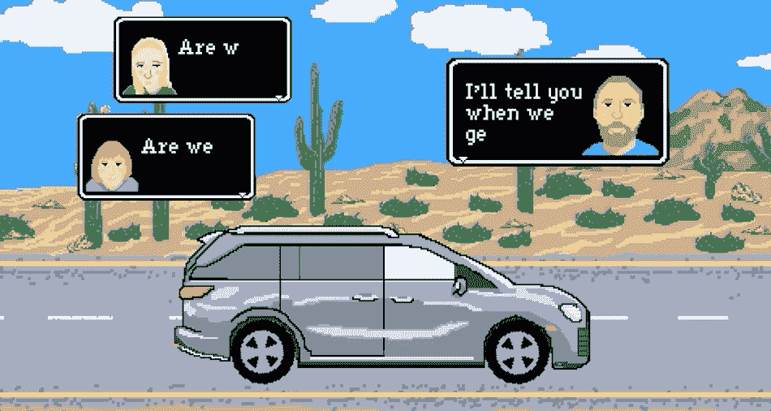

# 初学者的终极 Webhooks 课程

> 原文：<https://www.freecodecamp.org/news/the-ultimate-webhooks-course-for-beginners/>

理解 webhooks 将为您的项目和应用程序打开一个可能性的世界。Webhooks 允许不同的 web 应用程序和服务相互通信。

我们在 freeCodeCamp YouTube 频道上发布了一个 webhooks 课程，将带你从一个完全的初学者到能够在你自己的应用中使用 webhooks。

我们已经在 freeCodeCamp.org YouTube 频道上发布了很多课程，我可以诚实地说，这是该频道制作得最好的课程之一。

克雷格·丹尼斯教授这门课程。他是 Twilio 的一名开发人员教育者，创建了许多受欢迎的课程。

您将通过专家指导、有趣的动画和实际操作来学习所有关于 webhooks 的知识。你将学习如何在没有代码和低代码的情况下使用 webhooks。Craig 准备了大量笔记供您在学习本课程时使用。

Application events animation from the course.

以下是本课程的部分内容:

### 第一单元-整合

*   欢迎
*   定义事件、处理程序和挂钩
*   灯泡力矩
*   寻找灵感

### 单元 2 -从 Webhook 捕获数据

*   跳入网钩
*   探索请求
*   使用数据
*   当地发展
*   打开隧道
*   无服务器

### 第三单元-完全挂钩

*   介绍项目
*   文本确认
*   设置流程
*   就地处理事情
*   部署您的无服务器功能
*   那是一个包裹

Webhooks animation from the course.

本课程结束时，您将学会如何使用 webhooks 创建项目，并了解如何在自己的项目中使用 webhooks。

你可以在 freeCodeCamp.org YouTube 频道观看完整的课程[(2.5 小时观看)。](https://www.youtube.com/watch?v=41NOoEz3Tzc)