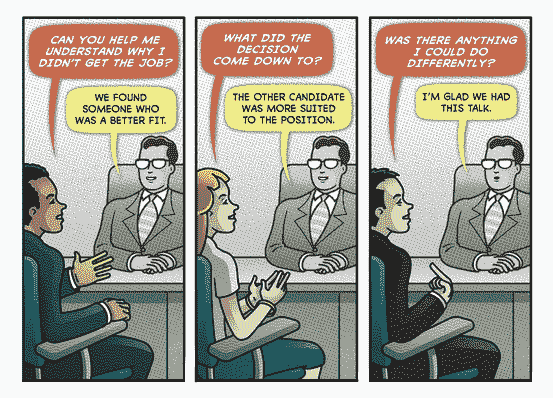

# 如果你想让招聘者认真对待你，建立一个强有力的个人叙事。

> 原文：<https://www.freecodecamp.org/news/the-unspoken-truth-of-an-interview-how-personal-narrative-dictates-your-success-a354864d730d/>

作者加雷斯·多丁

# 如果你想让招聘者认真对待你，建立一个强有力的个人叙事。

我们都经历过。伏案工作。滚动浏览求职公告板。寻找你能再次工作的一丝希望。

在某些时候，你寻求帮助。这就是你如何从招聘人员的桌子对面结束的。

凭借与雇主的关系，招聘人员对你的求职有很大的影响力。他们可以决定你最终会成为一家崛起的初创企业还是一家衰落的企业集团。

无论他们会把你带到第一家公司，还是花时间培养你找到更好的公司，通常都归结为一件事:个人叙事。

我和一位招聘人员坐下来，进一步了解他们如何看待应届毕业生，以及毕业生如何才能在就业市场上获得优势。

马特是纽约一家大型设计初创公司的招聘人员。他忍不住用一句“工作怎么样?”开始了谈话。你在现在的岗位上开心吗？”

我们很快转移到他所说的求职中最容易被忽视的部分:塑造你的个人叙事。

### **第一印象和叙述**

与大多数人的设想相反，面试——以及你的叙述——真正开始于你走进办公室的那一刻。一切都会影响你给面试官的第一印象——从你是否早到，到你如何与接待员交谈。

心理学家 Nicholas Rule 将第一印象描述为一种几乎是瞬间发生的情况。

> “这发生得如此之快——仅仅几分之一秒——以至于我们看到的有时会主导我们知道的。”—尼古拉斯规则

一旦你到了办公室，计划谈话要点的时间已经过去了。当你走进办公室时，你的注意力应该放在房间里的人身上，而不是你头脑中的焦虑。

一直帮助我的一个小技巧是，在我去公司办公室之前想象一下面试。仔细考虑你手中的文件，你要穿的衣服，你要如何介绍自己。

如果你在走进办公室之前练习这个简单的可视化技巧，你会更好地预料到他们的问题，并更好地准备应对。

### 会融合吗？

Don’t try so hard to blend in.

人们通常认为一个个人故事意味着你如何脱颖而出，或者是什么让你与众不同。这当然是其中的一部分。

但是在你的故事中，一个经常被忽视的部分是你如何融入招聘经理对他们团队的描述，以及公司的发展方向。

这就是混合进入画面的地方。

在我们从心理学的角度深入了解融合的含义之前，让我们从物理学的角度来看一下它。融合是从你的外表开始的。

招聘人员马特说，当一名求职者穿着西装去一家科技公司参加开发人员面试时，他会立刻产生反感。

Not a good look

他说，这样的服装会立刻给接下来的面试制造尴尬的气氛，因为这样的职业打扮缺乏他在潜在团队成员身上寻找的亲密因素。

除非西装是其他员工的普通服装，否则我会选择不戴你最好的领带去参加下一次面试。

### 融入文化

然而，你的外表远不是融合的唯一方面。招聘人员马特也从心理学的角度谈到了融入的必要性。他说你需要创造一个精神形象。

在规定的面试时间内，你必须让招聘人员相信，你是他们未来几年每周与他们一起工作 40 小时的理想人选。

让我们更深入地了解这意味着什么。

> “你的品牌是一个故事，一个帮助人们讲述自己关于你的故事。大多数故事都是不公平的、偏见的、缺乏信息的和恐惧的……它们从来都不是真的，没有人像你一样了解你。”——塞思·戈丁

这个故事由你来塑造。看起来像是你的面试官会一起出去玩的人。不管他们在寻找什么，你所呈现的故事应该融入到氛围中，并让人隐约感到熟悉。

例如，我发现激发面试官的怀旧感可以很好地快速建立联系。

我能回忆起这个技巧在各种求职过程中无数次帮助我——最重要的是在我大学毕业后找第一份工作的时候。

作为一名刚毕业的大学生，我缺乏很多工作经验。但是我仍然想要一份有声望的工作。所以我申请了世界银行。

我告诉自己，如果这个“伸展”的职位进展不顺利，我可以随时采取流水线的方式，向不太理想的职位发出数百封电子邮件，并祈祷一切顺利。

在去世界银行面试之前，我做了功课。我知道大多数员工都是国际人士，有海外项目的经验，而且大部分是欧洲人。

我从了解这个地方的人那里听到的一切都是，在世界银行工作的人有一种骑士般的冒险精神，类似于和平队或外交部。

Illustration by Peter and Maria Hoey

我知道，为了脱颖而出，即使作为一名工程师，我也需要让我的故事与他们的故事紧密结合。

不幸的是，我没有在智利教英语，没有在乌干达建房子，也没有在任何其他冒险活动中发挥作用。但是我小时候在英国生活过，有机会去旅行。所以我确保在整个面试过程中把这一点透露出来，并谈论我未来的旅行计划。

直到今天，我仍然相信这是我和其他申请同一个项目的工程师的不同之处。

### 少即是多

至此，你已经运用了想象技巧，想象自己在面试中的样子。你已经做了调查，了解了办公室的文化和氛围。你是一个合格的候选人，所以你知道如何穿着。你可能也很有资格讲述你的故事。

如果你停在这里，你会领先于大多数候选人。但是如果你想真正掌握你的叙述，你必须记住:少即是多。

哈佛商学院的迈克尔·诺顿最近做的一项研究让我明白了这一点。

在开始这项研究之前——包括对其他人进行评价——参与者被问及对一个人有更多的了解是否会让他们更愿意喜欢一个新的人。

不出所料，88%的人表示，他们之前掌握的信息越多，他们就越有可能喜欢上新的对象。

但是数据显示了非常不同的东西。参与者对这些有远见的人了解得越多，他们对他们的评价就越低。

研究人员一遍又一遍地尝试这项相同的研究，甚至进行了一项类似的研究，让参与者写下关于他们自己的特征。他们收集了这些特征——绝大多数都是积极的——并把它们分成描述假想人物的组。

即使在这种情况下，用来描述人们的特质几乎都是积极的，拥有较短清单的人通常更受欢迎。

这项研究的结果似乎意味着，当你让人们去想象一些事情，并在你的故事中留下更多的神秘时，你更有可能留下积极的印象。

所以，想办法用尽可能少的谈话要点来讲述你的故事。留给面试官更多的想象空间，你会发现雇主更有可能觉得有必要给你回电。

很多关于求职过程的建议都是以一系列不同的提示的形式出现的，比如如何格式化你的求职信，如何进行适当的眼神交流，以及其他一些似乎与时俱进的建议。

但招聘人员马特发现，准备一份强有力的个人陈述是最接近永恒的职业建议的事情。这对我很有效。

如果你喜欢这篇文章，点击下面的心形推荐它，这样更多的人会在媒体上看到它。看看[习惯和设计](http://habitsanddesign.com)我的在线出版物对数据和文化的交集感兴趣。