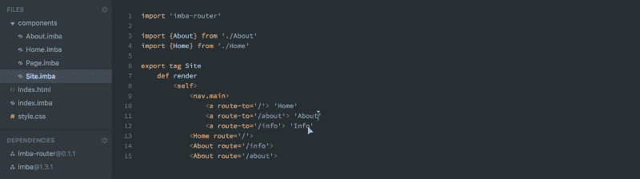
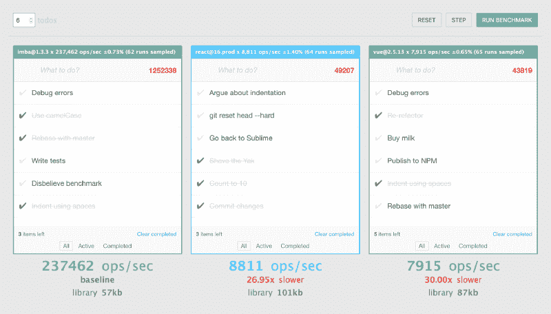
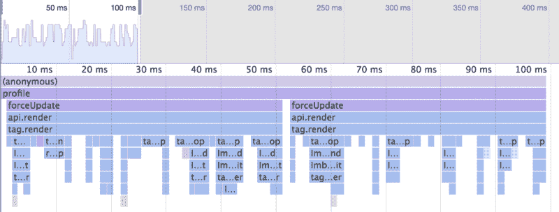
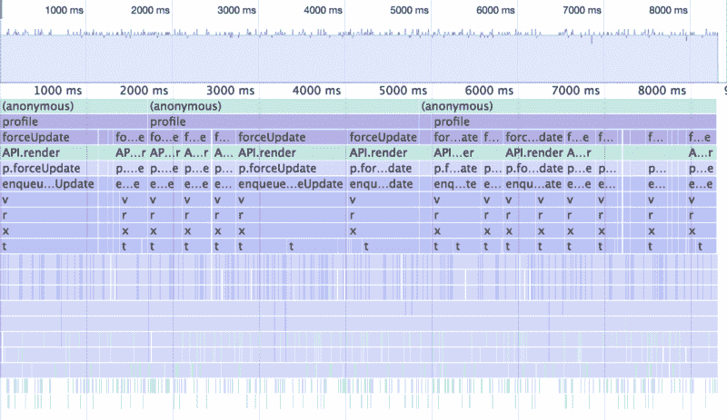
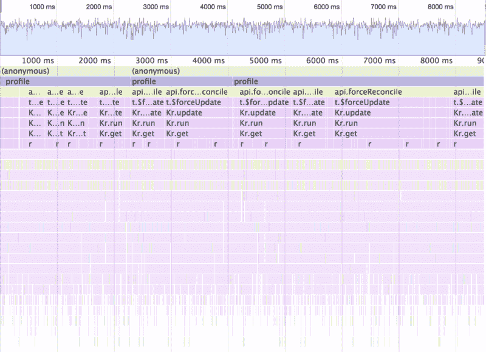

# 虚拟 DOM 很慢。遇见记忆中的世界

> 原文：<https://www.freecodecamp.org/news/the-virtual-dom-is-slow-meet-the-memoized-dom-bb19f546cc52/>

被辛迪加·阿尔萨瑟

# 虚拟 DOM 很慢。见见记忆中的世界。

#### 超越虚拟 DOM 和状态管理


虚拟 DOM 是一个奇妙的创新。通过允许我们以声明的方式编写视图，它带来了一种更加高效的编写 web 应用程序的方式。

这个巨大的好处与初始渲染的性能没有什么关系。相反，更新 DOM 以反映状态变化的过程变得更快了。

这个使 DOM 与状态同步的过程通常被称为 [DOM 协调](https://reactjs.org/docs/reconciliation.html)。

如果我们有一个无限快速的协调器，我们可以通过在每一帧上渲染一切来大大简化我们的应用程序。状态层根本不需要了解视图——更不用说发出事件并跟踪当状态的某些部分发生变化时哪些视图需要做出反应。无论您如何处理，视图将始终与数据保持同步。

可悲的是，虚拟 DOM 实现并没有无限快。事实上，它们慢得惊人。幸运的是，许多人已经加入了 Immutability 的行列，在这种情况下，虚拟 DOM 感谢您！其他方法将所有状态包装在 observables(例如 mobx)中，并跟踪哪个视图依赖于哪个状态。这使您只能协调视图的一部分，但也有其自身的缺点。

最大的问题是我们倾向于根据我们的视图层来决定如何管理我们的应用程序状态。如果我们可以在数据层和视图层并不真正了解或关心彼此的情况下获得更好的性能会怎么样？

### 遇见记忆中的世界

Imba 是一种网络编程语言。它驱动着 scrimba.com[的互动截屏平台](https://scrimba.com)，我是这个平台的首席开发者。Imba 的诞生是为了让开发 web 应用程序再次变得有趣。它具有受 Ruby 启发的清晰易读的语法。它编译成可读和高性能的 JavaScript，并在现有的生态系统中工作。



The whole stack of scrimba.com is written in [Imba](http://imba.io/guides), but the language can easily be used just for the view layer.

除了清晰易读的语法之外，Imba 最大的好处是它真正地将 DOM 元素视为一等公民，比 JSX 更深入。它允许您以声明方式编写视图，但是它**不使用虚拟 DOM。**相反，Imba 将视图编译到一个**存储的 DOM 中，**结果是**快了一个数量级**。

#### 它是如何工作的

总的想法是，我们围绕 DOM 元素创建轻量级包装器，并将声明性视图编译成 setterss 链，每个 setter 链都直接修改底层 DOM。

```
tag AppView
    def render
        <self>
            <h1.title> "Welcome"
            <p.desc .red=(Math.random > 0.5)> "Roulette"
```

上面的 Imba 视图将大致编译成以下 javascript:

```
class AppView extends Imba.Tag {
  render() {
    var $ = this.$; // inline cache for tag
    return this.setChildren($.$ = $.$ || [
      Imba.tag('h1',$).flag('title').setText("Welcome"),
      Imba.tag('p',$).flag('desc').setText("Roulette")
    ]).synced(
      $[1].flagIf('red',Math.random() > 0.5)
    );
  }
}
```

这是一个*非常*简单的例子来说明基本概念。在编译过程中，我们将创建和更新分成不同的分支。第一次为一个`<AppVi` ew >调用 render 时，将会创建子项并设置静态属性。在所有后续调用中，我们唯一真正做的工作是翻转类名 o `f o` ur < p >。尽管要复杂得多，但同样的概念也用于条件、循环和标记树中的其他东西。

如果你对它的实际工作方式感兴趣，我推荐你阅读[这篇简介](http://imba.io/guides/advanced/performance#performance)。

### 基准

> 他们说，反应很快。他们说，反应够快了。他们说，反应纤维将足够快。

大多数基准测试类似于“插入/洗牌/移除 1000 行”。这几乎不能说明真实世界的性能。当有成百上千的变化时，大部分差异被实际的 DOM 突变、重画等吞噬掉了。它无法衡量最重要的指标。

如果您真的想测试 DOM 协调的性能，您需要看看实现使 DOM 与状态同步的速度有多快， ***尤其是在很少/没有变化的时候***。

因此，为了捕捉协调器性能的真实视图，我们可以在每次迭代中更改应用程序状态的一小部分，然后测量强制使视图与更改后的状态同步所需的时间。视图不应该监听状态的任何部分，并且状态不需要通知任何人它是否已经改变。



Screenshot from [dom-reconciler-bench](https://somebee.github.io/dom-reconciler-bench/index.html)

[这个基准](https://somebee.github.io/dom-reconciler-bench/index.html)逐步通过一个确定的状态变更序列，每次迭代最多进行**一次变更。我们正在测量协调*整个应用视图*所需的时间:**

1.  切换任务的完成
2.  删除任务
3.  插入任务
4.  重命名任务
5.  无所事事

### 结果

在 iMac (4GHz i7)上运行基准测试会产生以下结果:

#### Safari 11

*   Imba 1.3: **360458** 操作/秒
*   反应 16.2: **9752** 操作/秒— **慢 36.96 倍**
*   Vue 2.5: **8719** 操作/秒— **慢 41.34 倍**

#### 铬 65

*   Imba 1.3: **282484** 操作/秒
*   反应 16.2: **8882** 操作/秒— **慢 31.81 倍**
*   Vue 2.5: **8103** 操作/秒— **慢 34.86 倍**

#### 火狐 58

*   Imba 1.3: **234334** 操作/秒
*   反应 16.2: **5075** 操作/秒— **慢 46.17 倍**
*   Vue 2.5: **3119** 操作/秒—**75.13 倍慢**

这似乎令人愤慨，对不对？当然，这不可能是正确的。

*   所有的实现在每一步上都是真正协调的。
*   所有的实现都是阻塞的、同步的和确定的。
*   所有实现都执行相同数量的 DOM 突变。
*   是的，我们正在使用 React 的缩小生产版本。开发版在同一个测试上比 Imba 慢**200 x**。
*   内存化的 DOM 在一次迭代中几乎不会产生垃圾，使用的内存更少，而且概念上非常简单。

所有的实现都可以进一步优化。我很高兴在 [GitHub](https://github.com/somebee/dom-reconciler-bench) 接受拉取请求。需要说明的是，我非常尊重 React 所取得的成就，我也非常喜欢 Vue。Imba 从中获得了很多灵感。我怀疑应该有可能使用类似的方法来编译 Vue 模板，并希望有人尝试一下！

### 压型

让我们在没有任何变化的情况下测试原始协调器的性能。这将花费在实际 DOM 变异上的时间从等式中去掉了，并让我们清楚地了解了在协调过程中进行了多少工作。Chrome 中的 CPU 图表直观地显示了使用内存化 DOM 技术所做的工作减少了多少。

#### Imba 1.3



Imba completes 100000 iterations in 99.7ms — 5.1ms spent in GC

#### 反应 16.2



React completes 100000 iterations in 8312.7ms (83.4x slower) — 100.4ms spent in GC

#### Vue 2.5



Vue completes 100000 iterations in 8514.7ms (85.4x slower) — 308.4ms spent in GC

### 规模大吗？

> “有很多，我的意思是，很多小项目声称速度更快，开发更容易，但仔细检查通常缺乏非常重要的功能(如模块生命周期挂钩)，当然没有它们性能会更高，但在待办事项应用程序之外使用这些库的灵活性是有限的。”

这是一段引用自某人的话，他通读了这篇文章的早期草稿，我想正面处理它。性能差异不仅限于简单的测试，恰恰相反。Imba 已经在 scrimba.com的生产中使用了几年，但它仍然不适合心脏虚弱的人。对于大多数开发者来说，Vue 和 React 的庞大生态系统将很难(也可能不明智)被抛弃。 [Imba 文档](http://imba.io/guides/essentials/introduction)仍然有很多需要改进的地方，但是我们每天都在改进它。

### 有关系吗？

你肯定听说过反应够快。但是够快吗？React 是否快了 15%其实并不重要，但随着数量级的提高，我们可以开始探索构建应用程序的更简单的方法。


这不是关于*感知的*速度，而是关于它让你做什么。在 scrimba.com 的 T2，我们不担心与国家保持同步。我们不担心状态改变时的跟踪。我们的数据模型是不可观察的。我们只是渲染。无论何时。**这是一种解放。**