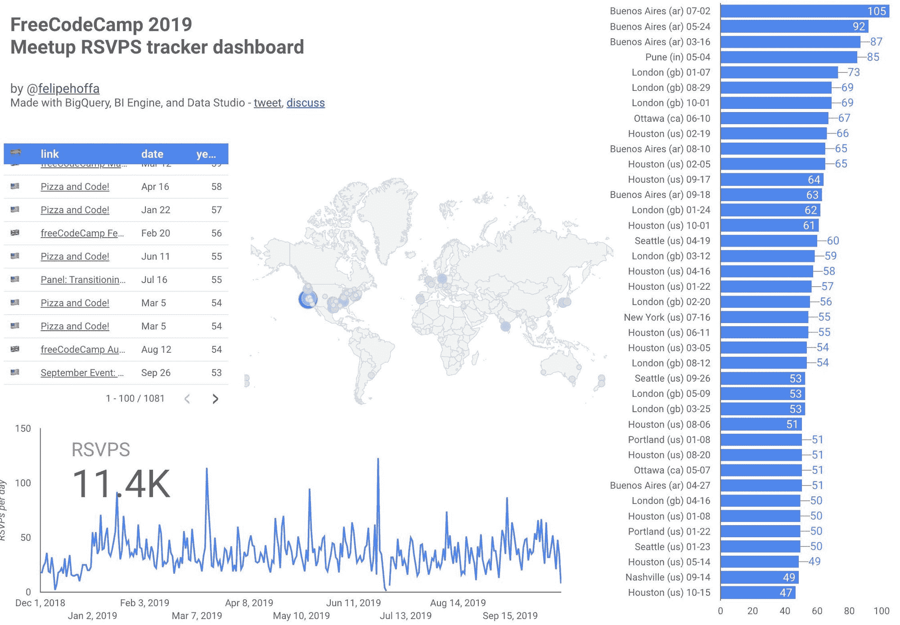

# WeWork 正拼命通过向 225，000 个社区征税来榨取 Meetup.com 的现金

> 原文：<https://www.freecodecamp.org/news/the-wework-meetup-debacle-and-a-new-chapter/>

更新:在我发表这篇文章的几个小时后，Meetup 悄悄地在他们的公告顶部添加了一条说明。他们没有在推特上或做任何其他事情来宣传这张纸条，但一些人注意到了它，并与我分享了它。

它是这样说的:

> "**更新 2019 年 10 月 15 日下午 1:30 ET:**此次支付变更目前只是针对小部分群体的有限测试。这些精选组的组织者可以选择退出该测试。短期内我们不会对支付方式做出任何重大改变。我们承诺在任何变更生效前提供预先通知。”

他们已经屈服于反弹。既然他们的“油炸青蛙”方法已经失败，他们现在要“煮青蛙”，并随着时间的推移推出这些变化。Meetup 没有在推特上或以其他方式提醒组织者这次撤回。

这是活动组织者和参与者的胜利。但这是暂时的。Meetup 已经露出了他们的真面目。他们开始在更多的社区推行这种新的基于 RSVP 的定价只是时间问题。

100%清楚:freeCodeCamp.org 社区仍在努力开发 Meetup 的开源替代品，我们正在稳步前进。

(结束更新。)

* * *

昨晚，Meetup.com 悄悄推出了新的定价结构。

从“十月”开始，Meetup 将活动组织者每月支付的费用从 20 美元减少到 2 美元。

哇-听起来太棒了。团组织者不用交那么多？那么，为什么每个人都如此疯狂？

嗯，meetup 还会对每次回复 Meetup 的人收取 2 美元的费用。每一个。单身。时间。

让我们做一些快速的数学运算。以前，一群人每月花费 20 美元使用 Meetup.com 来组织他们的活动。

有了这个新的定价，让我们假设你有一个中等规模的 meetup 群，每周聚会一次，每次有 30 个 RSVPs。

集团的总集体 Meetup.com 费用现在将从每月 20 美元变为:

```
($2 * 30 RSVPs * 4 events per month) = $240 
```

哦，等等——我忘了补充一点，除此之外，Meetup.com 还会向团体组织者收取每月 2 美元的费用。所以 **$242** 。

成本增加了 1，210%。

这里还有一些数学。

[Felipe Hoffa](https://twitter.com/felipehoffa) 创造了[这个可视化](https://datastudio.google.com/reporting/57a6765c-e846-4294-969f-fbeba53885f0?s=r3k7kdy7Fwo)来展示 meetup 新的基于 RSVP 的定价将如何影响 freeCodeCamp 和它在世界各地的几十个 Meetup 群组:



到目前为止，2019 年我们已经收到了 8600 份免费代码营活动的回复。这将转化为:

```
(11,400 RSVPs * $2) = $22,800 in Meetup.com fees
```

抱歉，Meetup.com。你的软件平台对我们的非营利组织和它的学习团体社区来说不值每年 22，800 美元。

到目前为止，大多数聚会都是完全免费的。Meetup 有向参加的人收费的选项，但是很少有 meetup 使用这个功能。

> 我们每个月都有超过 150 名参与者 [@Dallas_Hackers](https://twitter.com/Dallas_Hackers?ref_src=twsrc%5Etfw) 。我们经常收到超过 100 份回复。这项活动我们不收费。组织者每月自掏腰包支付 12 美元。
> 
> 如果你多收费，我们就直接从你的服务中掉线，用无数的其他方式来宣布。
> 
> — Tinker (@TinkerSec) [October 14, 2019](https://twitter.com/TinkerSec/status/1183879641393532929?ref_src=twsrc%5Etfw)