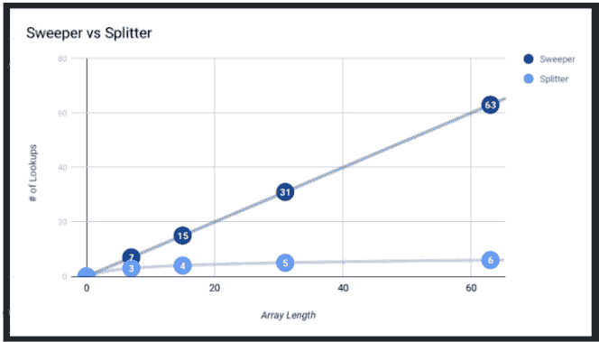

# 二分搜索法解释了 Javascript 中的算法

> 原文：<https://www.freecodecamp.org/news/the-working-developers-guide-to-algorithms/>

如果你想获得新的解决问题的技能并提升你的计算机科学知识，看看 Scrimba 的免费一小时课程[工作开发者算法指南](https://scrimba.com/course/galgorithmsguide?utm_source=dev.to&utm_medium=referral&utm_campaign=galgorithmsguide_launch_article)就够了。它是为那些没有计算机科学背景的人设计的，他们觉得学习算法思维会让他们受益。

## 课程是做什么的？

我们的指南将带您了解如何设计六种不同的二分搜索法算法。在经典的 Scrimba 风格中，它包含了一系列的挑战，因此您将获得所需的肌肉记忆，以提高您作为软件开发人员的技能，并更好地处理算法。

您将了解到:

*   二进位检索
*   大 O 符号
*   命令代码
*   递归
*   尾部递归
*   阵列分裂
*   阵列视图
*   划分

每种算法分三个阶段教授:

*   **演练:**乔纳森从概念上介绍算法。
*   **实现:**我们亲手制作了自己版本的算法。
*   **解决方案:** Jonathan 向我们展示了他的实现，以供比较。

## 先决条件

如果你对 Javascript 有很好的理解，并且已经是一名开发人员或者是 Bootcamp 的毕业生，你将会从这个课程中获得最大的收获。

如果你还没有，可以看看 Scrimba 的免费教程[JavaScript 简介](https://scrimba.com/course/gintrotojavascript?utm_source=dev.to&utm_medium=referral&utm_campaign=galgorithmsguide_launch_article)和[ES6+](https://scrimba.com/course/gintrotoes6?utm_source=dev.to&utm_medium=referral&utm_campaign=galgorithmsguide_launch_article)简介。

## 讲师简介

李宗盛·马丁是一名软件开发人员、网络教育家、演说家和作家。他通过写作、演讲、沉浸式训练营、研讨会和在线教程来帮助其他开发人员实现他们的职业和个人目标。

他的客户包括美国国家航空航天局(NASA)和惠普(HP)等公司，他正是带你经历学习之旅的合适人选。所以让我们开始吧！

## 二进位检索

[](https://scrimba.com/p/pk57XHz/cPJqarfK?utm_source=dev.to&utm_medium=referral&utm_campaign=galgorithmsguide_launch_article) 
*点击图片进入课程。*

在第一集的[中，乔纳森介绍了 **Big-O 符号**和**二分搜索法**的概念，这是我们将要使用的算法。](https://scrimba.com/p/pk57XHz/cPJqarfK?utm_source=dev.to&utm_medium=referral&utm_campaign=galgorithmsguide_launch_article)

**Big-O 符号**是一种描述算法最坏情况性能的方法。O(n)的一个大 O 表示，如果一个数组的长度为 n 个元素，运行时间将与 n 成正比，换句话说，一个 7 个条目的数组在最坏的情况下将需要 7 次查找，就像一个 700 万个条目的数组在最坏的情况下将需要 700 万个条目一样。我们也可以说这个算法的运行时间是线性的，如上图所示。

**二分搜索法**是回答“这个元素出现在列表中的什么位置？”这个问题的几种策略之一

回答这个问题时，有两种主要方法:

*   **Sweeper** :检查列表中的每一项，直到找到正确的项目。
*   **分割器** / **二分搜索法**:将列表分成两半，检查你是否走得太远或不够远来定位项目，分别搜索右侧或左侧，并重复直到找到项目。

我们可以从检查老式纸质电话簿的角度来考虑这些方法。清除器方法包括从头开始查看每一个条目，直到找到正确的条目。分割法是大多数人会使用的一种方法——随机打开书，看看你是否需要前进或后退，直到找到条目。

二分搜索法比清除器方法更有效，尤其是对于较大的列表。但是它只在列表已经被排序时才起作用。

清扫器方法具有线性运行时间(见上图)和 O(n)的大 O，而分离器方法具有亚线性运行时间和 O(log n)的大 O。

## 必要的

在第一次挑战中，Jonathan 鼓励我们用传统的方式实现二分搜索法，也就是用一个大 O of O(n)，使用固定数量的内存和循环。

Jonathan 为我们提供了一个测试套件，我们可以用它来确保我们的解决方案是成功的，并鼓励我们在检查他的实现之前亲自尝试一下这个挑战。这里没有剧透，所以去剧组亲自试试吧。

虽然这个解决方案很短，并且接近二分搜索法的原始公式，但是您可能已经注意到，这个解决方案很难编写，并且从软件工艺的角度来看不是最佳的解决方案。请继续阅读，找出提升解决方案的方法...

## 递归

[在《T2》中，我们将通过实施一个有一些限制的新版本来改进我们的二分搜索法。虽然我们的解决方案应该仍然有很大的 O(n ),但它不应该使用循环，而必须使用递归。所有变量都应该用`const`操作符初始化，这样它们就不会变异。](https://scrimba.com/p/pk57XHz/c2Pr87c4?utm_source=dev.to&utm_medium=referral&utm_campaign=galgorithmsguide_launch_article)

Jonanthan 向我们展示了解决方案的框架版本，然后鼓励我们自己尝试挑战:

```
let binarySearchWithRecursion = (array, element, compare = defaultCompare) => {
	return -1;
};

export default binarySearchWithRecursion; 
```

如果你已经完成了这个挑战，你可能已经看到这个解决方案更容易阅读，但相当冗长。在最坏的情况下，它还会导致无限递归。继续学习本课程，看看是否有简化解决方案的方法...

## 尾部递归

下一个演员面临的挑战是通过减少重复来改进我们之前的实现。

Jonathan 警告我们，这个解决方案看起来会比前两个更差，但是，它为我们提供了一些更好的优化。现在就去参加课程，亲自尝试挑战，看看 Jonathan 的解决方案。

## 阵列分裂

如果你完成了前面的挑战，你可能已经感觉到我们仍然在通过递归向二分搜索法传递很多额外的信息。[这个施法](https://scrimba.com/p/pk57XHz/cEKyndHw?utm_source=dev.to&utm_medium=referral&utm_campaign=galgorithmsguide_launch_article)看起来是一种叫做**阵法分裂**的清理方式。

我们可以根据之前的电话簿例子来考虑数组拆分——每当我们决定电话簿的一半是不相关的，我们就把它撕下来扔掉。类似地，我们的下一个解决方案应该忽略数组中不包含我们想要的条目的任何部分。

为了帮助我们实现这一点，Jonathan 从一些基本代码开始:

```
let binarySearchWithArraySplitting = (
	array,
	element,
	compare = defaultCompare
) => {
	return -1;
}; 
```

然后，像往常一样，他让我们自由地尝试自己的解决方案，然后带我们完成他自己的实现。

虽然这是二分搜索法的一种优雅的方法，因为它涉及制作数组的一部分的副本，但它不再有 O(n)的大 O，并且具有更高的内存使用率和更慢的运行时间。继续学习本课程，看看是否有办法用类似的代码解决方案重新获得更高的性能...

## 阵列视图

[在本次](https://scrimba.com/p/pk57XHz/cmdvdnhb?utm_source=dev.to&utm_medium=referral&utm_campaign=galgorithmsguide_launch_article)中，我们寻找将之前解决方案的更高性能与数组拆分的优雅相结合的方法。为此，我们创建一个类似数组的对象，它响应与数组相同的方法。然后我们将注入这个对象来代替原来的数组。

Jonathan 让我们从初始化函数`ArrayView`开始，该函数返回一个需要三个参数的对象:`array`、`start`和`end`。被调用时，`ArrayView`应该用四种方法返回一个对象，`length`、`toArray`、`slice`和`get`。

```
export let ArrayView = (
    array,
    start = 0,
    end = array.length,
) => ({
    length: end - start,
    toArray: () => array.slice(start, end),
    slice: () => ,
    get: () => ,
});

let binarySearchWithArrayView = (array, ...args) =>
    binarySearchWithArraySplitting(ArrayView(array), ...args) 
```

我们的挑战是在不复制原始数组的情况下实现`ArrayView`的`slice`和`get`方法。点击通过来尝试它，然后查看乔纳森的演练。

尽管这个解决方案产生了更好、更可读的代码，但是它比我们以前的一些解决方案要长。继续本课程，看看我们是否能保留`ArrayView`的好处，同时从二分搜索法代码中提取更多的逻辑...

## 数组分区

在课程的最后一次挑战中，乔纳森给了我们一个目标，将我们之前版本中的一些神秘的反弹逻辑提取到一个数据结构中。

为此，我们需要一个简单的数据结构来返回数组的中间、左边或右边部分。为了让我们开始，乔纳森设置了一个函数`ArrayPartition`:

```
export let ArrayPartition = (array, pivot) => ({
	left: () => array.slice(0, pivot),
	middle: () => array.get(pivot),
	right: () => array.slice(pivot + 1, array.length),
}); 
```

接下来，Jonathan 设置了一个名为`binarySearchWithPartition`的新版本二分搜索法，它的起始签名与`binarySearchWithArraySplitting`相同:

```
let binarySearchWithPartition = (array, element, compare = defaultCompare) => {
	if (array.length === 0) {
		return -1;
	}
	const middle = Math.floor(array.length / 2);
	const comparison = compare(element, array.get(middle));

	if (comparison === 0) {
		return middle;
	}

	//bounce logic
	const [left, right] =
		comparison === -1 ? [0, middle - 1] : [middle + 1, array.length];
	//end of bounce logic

	const subIndex = binarySearchWithArraySplitting(
		array.slice(left, right),
		element,
		compare
	);

	return subIndex === -1 ? -1 : left + subIndex;
};

let binarySearchWithPartitionAndView = (array, ...args) =>
	binarySearchWithPartition(ArrayView(array), ...args); 
```

我们现在的挑战是重写`binarySearchWithPartition`而不使用上面强调的`bounce`逻辑，而不是创建一个数组分区并调用它的左、中、右方法。

现在就去参加课程，亲自尝试挑战。正如 Jonathan 指出的，这个挑战很棘手，所以如果你陷入太长时间，可以直接跳到他的解决方案，但是先自己尝试一下。

## 总结

你已经完成了课程的最后一课，干得好！我们已经介绍了二分搜索法的几种方法，每种方法都有各自的优缺点，并且我们已经建立了一些很好的肌肉记忆来有效地处理算法。

既然您已经看到了六种不同的二分搜索法方法，您可能会注意到它出现在编程的许多不同地方。

Jonathan 以 10 种算法为特色的完整课程将在今年年底推出，但在此期间，我希望你能很好地利用你新学到的二分搜索法技能。

快乐编码:)

[https://www.youtube.com/embed/v684EuCrPAM?feature=oembed](https://www.youtube.com/embed/v684EuCrPAM?feature=oembed)