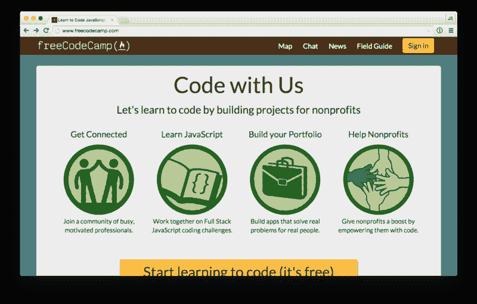
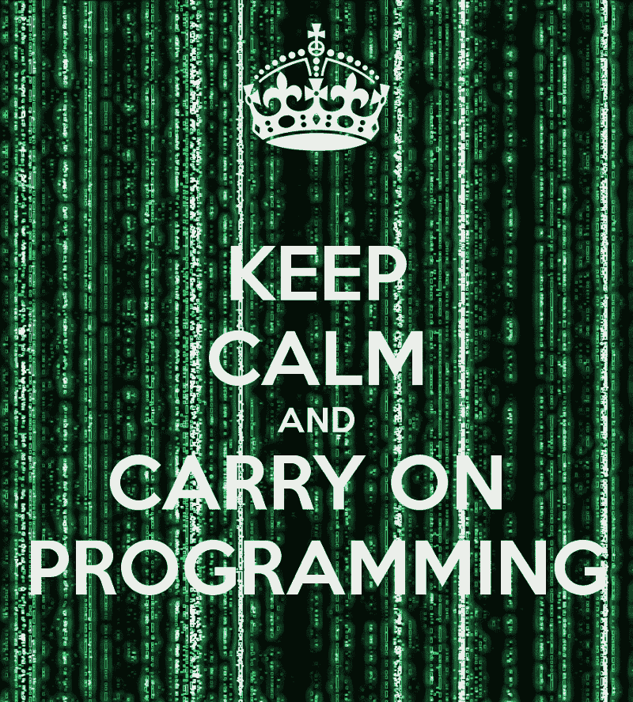

# 回顾我作为一名主动程序员的一年

> 原文：<https://www.freecodecamp.org/news/the-year-of-a-self-starter-programmer-in-review-ed005a041f92/>

用阿里的铁

# 回顾我作为一名主动程序员的一年

这是我个人发展最关键的一年。这很难。真的很难。这就是为什么对我来说，2015 年的关键词是“hustle”。

我辞掉了工作，开始寻求一个非常重要的职业转变——从金融/咨询到软件工程。

我存了一些钱，可以帮助我收支平衡，直到我可以将我的初学者编程技能货币化。

从那以后，我开始自学如何编码，每天花大量的时间编程。

在这段时间里，我只花了 20 欧元去上一些 Udemy 课程。除此之外，我没有为任何其他编程课程或教程支付一分钱。相反，我会在 Treehouse 和 Lynda 上开设试用账户，这样我就不用支付课程费用了。

在试用期间，我会简单地学习 HTML、CSS 和 JavaScript 的所有课程(jQuery、Angular、Node.js 和 Express.js 也是)。

然后，我偶然发现了比那些更传统的资源好得多的东西:[自由代码营](http://www.freecodecamp.com)。

自由代码营是一个像我一样的人们一起学习编码的社区。他们遵循单一的综合课程。他们一起克服了每个自我启动编程遇到的同样的问题。

最棒的是，在你完成挑战后，你有机会为非营利组织建立真实的项目。

自由代码营给了我很大的帮助，因为它让我明白，做一名程序员不仅仅是知道一门编程语言的来龙去脉。它是关于合作和结对编程的。这是关于成为一群人的一部分，他们互相推动学习新技能。

成为自由代码营的一员是我在编程学习过程中做出的最好的决定。他们帮助我沿着陡峭的学习曲线从基础到中级再到高级。

我最初的计划是在 freelancer.com 学习编程技能三个月后赚钱，直到我找到一份编程工作。

你猜怎么着？结果不是那样的。我太幼稚了，认为我可以在几个月内被雇用，在一个需要多年实践才能达到像样的程序员水平的领域。

最终我花光了钱，我不得不做兼职来支付我的账单，并在桌子上放一些食物。这是我一生中最艰难的时期之一。我会每天编码并申请工作。

具有讽刺意味的是，当我在找兼职工作时，我收到了全职工作的邀请。但是这意味着每天留给我学习编码的时间更少了。

我最终放弃了找兼职的想法，我开始找全职的。我设法在一家炙手可热的美国初创公司的当地子公司找到了一份每天工作 6 小时的工作。

他们雇用了我，我松了一口气，但不幸的情况仍然存在。他们花了两个月的时间把一份合同拿到我面前签字，这样我就可以真正开始工作了。

那两个月是痛苦的，但是我忍受了，并且尽我最大的努力保持我之前的高度动力。

在我发现自己被录用后，我也开始申请初级编程工作，我对市场需求变得更加熟悉。初级工作并不像我想象的那么“初级”。他们中的许多人仍然需要一年的经验，以及一些扎实的软件工程知识。

在四个月的时间里，我申请了 40 多份编程工作。没有一家公司给我回过电话面试。

但不知何故，我设法保持积极和现实的期望。我专注于写代码，并通过自由代码营工作。因为我知道我得到第一次编程面试只是时间问题。

我是对的。在经历了四个月的失业后，我接到了一个电话，要我去面试一个 javascript 开发人员的职位。这对我意义重大，我的信心直线上升。最棒的是，其他采访电话很快就来了。

现在，我正在和两家公司就一个 JavaScript 工程师的职位进行深入的谈判。与此同时，我仍在那家炙手可热的美国初创公司的当地子公司工作，这样我就能继续工作。

回顾了这一年发生的所有事情之后，我必须承认，如果没有我的女朋友，我不可能成功地克服所有的困难。这一年来她坚持不懈地支持我。我想感谢她为我做的一切，并告诉她我有多爱她。

离除夕还有几天，我想祝你一切顺利。继续编码，因为这个世界永远需要充满激情的新科技产品。

所以，[如果你想了解我的错误，请订阅我的电子邮件列表](http://eepurl.com/bONtiH)，然后[在 Twitter 上给我发一条推文](https://twitter.com/@RautaAlin)。:)