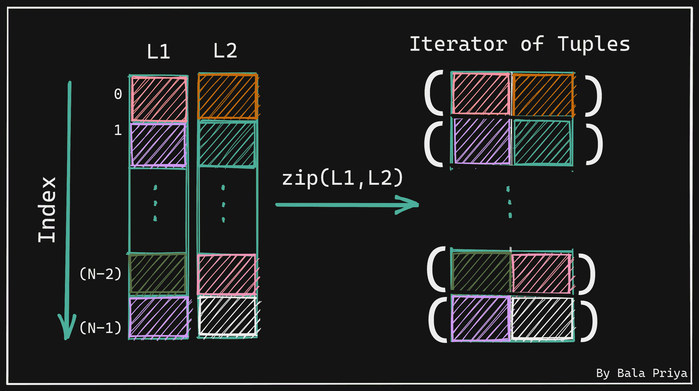

# Python zip()函数–用代码示例解释

> 原文：<https://www.freecodecamp.org/news/the-zip-function-in-python-explained-with-examples/>

用 Python 编码的时候，有没有需要并行遍历多个 iterables？

在本教程中，我们将使用 Python 的`zip()`函数高效地对多个可迭代对象执行并行迭代。

以下是我们将在本帖中介绍的内容:

*   [如何使用 Python 中的‘in’操作符来遍历 Iterables](#how-to-use-the-in-operator-in-python-to-traverse-iterables)
*   [为什么使用 Python 的 range()对象总是不是最佳选择](#why-using-python-s-range-object-is-not-an-optimal-choice-always)
*   [Python 的 zip()函数如何工作](#how-python-s-zip-function-works)
*   [zip()函数如何创建元组迭代器](#how-the-zip-function-creates-an-iterator-of-tuples)
*   [如何使用 Python 的 zip()函数——自己试试吧！](#how-to-use-python-s-zip-function-try-it-yourself-)
*   当可重复项长度不同时会发生什么？
*   当你向 zip()函数传递一个或者没有 Iterable 时会发生什么？
*   [如何使用 Python 中的 zip_longest()函数](#how-to-use-the-zip_longest-function-in-python)

## 如何使用 Python 中的“in”运算符来遍历 Iterables

在我们继续学习`zip()`函数之前，让我们快速回顾一下如何使用带有`for`循环的`in`操作符来访问 iterable(列表、元组、字典、字符串等)中的项。).下面的代码片段显示了一般语法:

```
for item in list_1:
	# do something on item
```

简单地说，我们告诉 Python 解释器:“*嘿，你好！请通过`list_1`循环访问每个`item`并对每个`item`进行一些操作。*

如果我们有不止一个列表(或者任何可迭代的)会怎么样？比如，`N`列表–你可以插入你最喜欢的数字来代替`N`。现在事情可能看起来有点困难，下面的方法行不通:

```
# Example - 2 lists, list_1 and list_2

for i1 in list_1:
	for i2 in list_2:
    	 # do something on i1 and i2
```

请注意上面的代码:

*   首先点击`list_1`中的第一项，
*   然后通过`list_2`循环访问`list_2`中的每个项目，
*   然后访问`list_1`中的第二项，
*   并且再次循环通过整个`list_2`,并且
*   这样做，直到它遍历整个`list_1`

显然，这不是我们想要的。我们需要能够从两个列表中访问特定索引的项目。这正是所谓的*并行迭代*。

## 为什么使用 Python 的 range()对象并不总是最佳选择

您可能会想到将`range()`对象与`for`循环一起使用。*“如果我知道所有的列表都有相同数量的条目，我能不能只使用`index`来点击每个列表，并在指定的`index`取出条目？”*

好吧，让我们试一试。代码在下面的代码片段中。你知道所有的列表-`list_1`，`list_2`，...，`list_N`–包含相同数量的项目。创建一个如下所示的`range()`对象，并使用索引`i`来访问每个 iterables 中位置`i`处的项目。

```
for i in range(len(list_1)):
	# do something on list_1[i],list_2[i],list_3[i],...,list_N[i]
```

现在你可能已经猜到了，只有当所有的 iterables 都包含相同数量的 items 时，它才会像预期的那样*工作。*

考虑一个或多个列表被更新的情况——比方说，一个列表可能删除了一个项目，而另一个列表可能添加了一个项目。这将导致混乱:

*   您可能会在访问位于*索引处的项目时遇到`IndexErrors`，这些项目不再有效*，因为该索引处的项目已被移除，或者
*   您可能*根本没有*在*访问新添加的项目*，因为它们所在的索引当前不在被访问的索引范围内。

现在让我们看看 Python 的`zip()`函数如何帮助我们并行遍历多个列表。请继续阅读，找出答案。

## Python 的 zip()函数是如何工作的

让我们从查找`zip()`的文档开始，并在随后的章节中解析它。

**语法**:`zip(*iterables)`–函数`zip()`接受一个或多个可迭代变量作为参数。

> 制作一个迭代器，从每个可迭代对象中聚集元素。
> 1。返回元组的迭代器，其中第 *i* 个元组包含来自每个参数序列或可迭代对象的第 *i* 个元素。
> 2。当最短的输入 iterable 用尽时，迭代器停止。
> 3。使用一个可迭代的参数，它返回一个 1 元组的迭代器。
> 4。如果没有参数，它将返回一个空迭代器。–Python 文档

## zip()函数如何创建元组的迭代器

下图通过从两个输入列表`L1`和`L2`创建元组的*迭代器来帮助我们理解`zip()`函数是如何工作的。在 iterables 上调用`zip()`的结果显示在右边。*



*   注意右边的第一个元组(在索引`0`处)如何包含 2 个条目，分别在`L1`和`L2`中的索引`0`处。
*   第二元组(在索引`1`处)包含在`L1`和`L2`中索引`1`处的项目。
*   通常，索引`i`处的元组包含`L1`和`L2`中索引`i`处的项目。

让我们在下一节尝试几个例子。

## 如何使用 Python 的 zip()函数——自己试试吧！

尝试在您最喜欢的 IDE 中运行以下示例。

作为第一个例子，让我们挑选两个列表`L1`和`L2`，每个列表包含 5 个条目。让我们调用`zip()`函数，并传入`L1`和`L2`作为参数。

```
L1 = [1,2,3,4,5]
L2 = ['a','b','c','d','e']

zip_L1L2 = zip(L1,L2)

print(zip_L1L2)
# Sample Output
<zip object at 0x7f92f44d5550> 
```

让我们将 zip 对象转换成一个列表并打印出来，如下所示。

```
print(list(zip_L1L2))

# Output
[(1, 'a'), (2, 'b'), (3, 'c'), (4, 'd'), (5, 'e')]
```

### 当可迭代的长度不同时会发生什么？

如果你回到文档，编号列表中的第二项是:*“当最短的输入 iterable 用尽时，迭代器停止。”*

与使用`range()`对象不同，使用`zip()`不会在所有可重复项的长度可能不同时抛出错误。让我们验证一下，如下图所示。

让我们从`L2`中移除`'e'`，并重复上述步骤。

```
L1 = [1,2,3,4,5]
L2 = ['a','b','c','d']

zip_L1L2 = zip(L1,L2)

print(list(zip_L1L2))

# Output
[(1, 'a'), (2, 'b'), (3, 'c'), (4, 'd')]
```

我们现在看到输出列表只包含 4 个元组，并且来自`L1`的项目`5`还没有被使用。到目前为止一切顺利！

### 当您向 zip()函数传递一个或没有 Iterable 时会发生什么？

让我们再次回顾文档的第 3 项和第 4 项。

> 用一个可迭代的参数，它返回一个 1 元组的迭代器。没有参数，它返回一个空迭代器。

让我们继续验证这一点。观察当我们在下面的代码片段中只传入`L1`时，我们是如何得到 1 元组的:

```
L1 = [1,2,3,4,5]
zip_L1 = zip(L1)
print(list(zip_L1))

# Output
[(1,), (2,), (3,), (4,), (5,)] 
```

当我们不带参数调用`zip()`函数时，我们得到一个空列表，如下所示:

```
zip_None = zip()
print(list(zip_None))

# Output
[]
```

现在让我们创建一个更直观的例子。下面的代码片段展示了我们如何使用`zip()`来压缩 3 个列表并执行有意义的操作。

给定一份水果清单，列出它们的价格和你购买的数量，每件商品的总花费就会被打印出来。

```
fruits = ["apples","oranges","bananas","melons"]
prices = [20,10,5,15]
quantities = [5,7,3,4]

for fruit, price, quantity in zip(fruits,prices,quantities):
  print(f"You bought {quantity} {fruit} for ${price*quantity}")

# Output
You bought 5 apples for $100
You bought 7 oranges for $70
You bought 3 bananas for $15
You bought 4 melons for $60 
```

现在我们明白了`zip()`函数是如何工作的，我们也知道了它的局限性，即当最短的可迭代次数用完时，迭代器就会停止。因此，让我们看看如何使用 Python 中的`zip_longest()`函数来克服这个限制。

## 如何在 Python 中使用 zip_longest()函数

让我们从`itertools`模块导入`zip_longest()`函数:

```
from itertools import zip_longest
```

现在让我们尝试一个更早的例子，即`L2`比`L1`少包含一个项目。

```
L1 = [1,2,3,4,5]
L2 = ['a','b','c','d']

zipL_L1L2 = zip_longest(L1,L2)

print(list(zipL_L1L2))

# Output
[(1, 'a'), (2, 'b'), (3, 'c'), (4, 'd'), (5, None)]
```

请注意来自`L1`的项目`5`仍然包含在内。但是由于`L2`中没有匹配项，所以最后一个元组中的第二个元素是`None`。

如果你想的话，你可以定制更多。例如，你可以用一个更具指示性的术语来代替`None`，比如`Empty`、`Item Not Found`等等。您所要做的就是将可选的`fillvalue`参数设置为您希望在调用`zip_longest()`时 iterable 中没有匹配项时显示的项。

我希望你现在理解了 Python 的`zip()`和`zip_longest()`函数。

感谢您的阅读！很快在另一篇文章中再见。