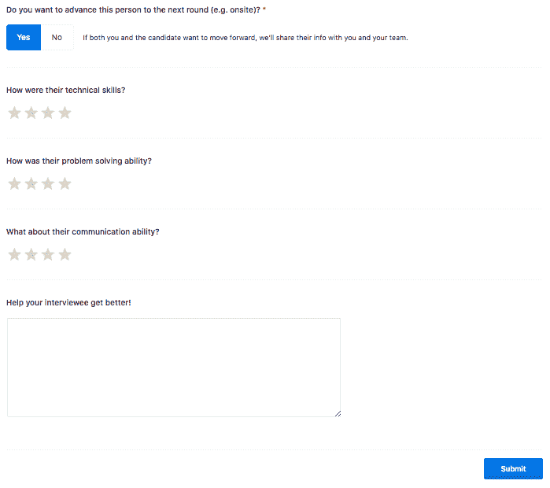
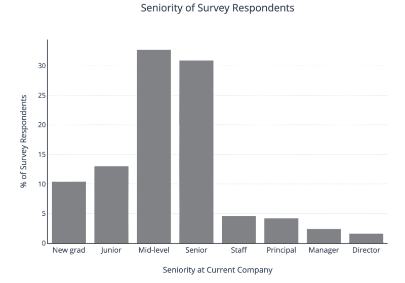
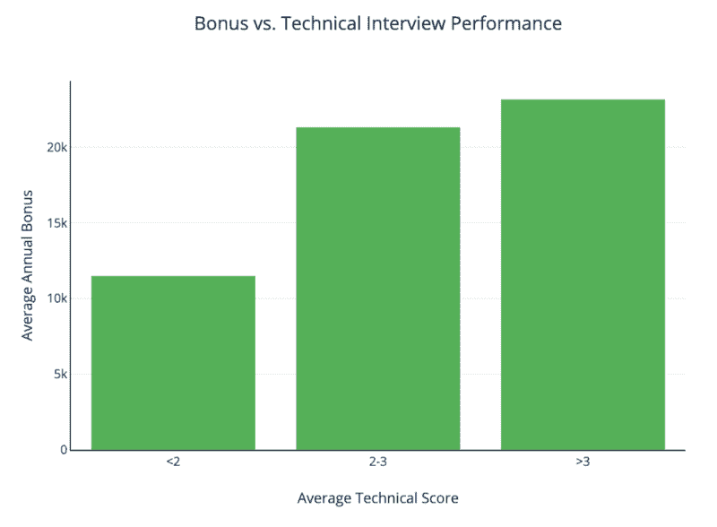

# 技术面试成绩和工资是有真实联系的。这是数据。

> 原文：<https://www.freecodecamp.org/news/there-is-a-real-connection-between-technical-interview-performance-and-salary-heres-the-data-35dc28b6967a/>

由猫希克斯

# 技术面试成绩和工资是有真实联系的。这是数据。

Photo by [Amy Hirschi](https://unsplash.com/photos/JaoVGh5aJ3E?utm_source=unsplash&utm_medium=referral&utm_content=creditCopyText) on [Unsplash](https://unsplash.com/search/photos/interview?utm_source=unsplash&utm_medium=referral&utm_content=creditCopyText)

在一天结束时，金钱是我们决定追求什么工作的巨大驱动力。过去，我们写过关于如何协商薪水的文章，也有很多关于整个科技行业薪水的 T2 劳工统计和报告。但是，就像英语招聘中的许多事情一样，很少有具体数据表明技术面试表现是否在薪酬中发挥作用。

因此，我们开始收集数据，并询问那些在使用我们的平台分享工资信息后成功找到工作的用户。有了我们独特的真实编码访谈数据集，我们可以问这样的问题:

*   在薪酬方面，面试表现重要吗？
*   将职位的其他部分看得比薪酬更重要(如价值观一致)的工程师最终会拿到更低的薪水吗？
*   获得更高的薪水还有什么重要的因素吗？

需要明确的是，这是对过去平均面试表现及其与当前工资的关系的探索，而不是看某人在面试中表现如何，然后看他们接受特定工作时的工资。换句话说，我们没有把工作面试和同一份工作的薪水联系起来。我们认为，考虑到[个人面试表现的波动性](http://blog.interviewing.io/after-a-lot-more-data-technical-interview-performance-really-is-kind-of-arbitrary/)，查看这些更通用的衡量标准比试图匹配单一面试和工作机会更能提供信息。但是我们的采访平台允许我们在多次采访中查看受访者的表现，这给了我们更多的稳定性和更多的数据。

### 设置

在 interviewing.io 平台上，人们可以在线匿名练习技术面试，真正的工程师在另一边。

当采访者和受访者在我们的平台上匹配时，他们在一个协作编码环境中见面，有语音、文本聊天和白板，并直接进入技术问题。查看我们的[记录](https://interviewing.io/recordings/)页面，了解这一过程。

该平台上的面试问题往往属于你在电话屏幕上遇到的后端软件工程职位的问题，面试官通常来自谷歌、脸书、Dropbox、Airbnb 等顶级公司。

每次面试后，面试官都会从几个不同的方面给应聘者打分:技术能力、沟通能力和解决问题的能力。这些都被分为 1 到 4 级，其中 1 级是“差”，4 级是“令人惊叹！”。在我们的平台上，3 分或以上的分数通常意味着这个人足够优秀，可以继续前进。您可以在下面看到我们的反馈表:

考虑到这一点，我们调查了 interviewing.io 用户目前的角色，包括工资、奖金以及他们对工作的满意度。然后，我们将他们的薪酬与他们在我们平台上接受采访时的表现联系起来。

我们最终得到了来自 494 名工程师的回复，由于薪酬方案非常复杂，而且因公司而异，我们以几种不同的方式分析了数据，考察了年薪数字、奖金和股权。然后，我们将薪酬数据与技术面试中的表现联系起来，看看这是否重要，如果重要，有多大。

### 结果呢

我们考察了面试表现(技术技能、沟通能力和解决问题的能力)与以下因素之间的关系:基本工资、奖金和股权。在所有情况下，我们都根据位置(在湾区意味着更高的薪水)和经验(高级工程师的薪水更高)进行了校正，如果可以，我们还根据公司规模进行了校正(大公司通常会支付更高的薪水)。

所有调查参与者的平均年薪约为 13 万美元，其中 57%的人报告了年度奖金。对于这个群体来说，平均每年的奖金是 2 万美元。对于报告股票金额的人来说，平均值是 5.4 万美元。以下是调查受访者的经验水平/资历分布。

### 这是我们的发现。

更好的技术技能与更高的报酬相关

可能不足为奇的是，在面试中技术技能得分高的人确实能赚更多的钱。首先，我们来看看底薪。[ [2](http://blog.interviewing.io/#perfcomp-fn2)

奖金也与技术技能相关，在表现上增加一分可能价值约 1 万英镑。[ [3](http://blog.interviewing.io/#perfcomp-fn3)

### 薪酬与其他面试技巧的关系

我们还研究了面试官在面试后给出的另外两个评价:沟通和解决问题。更好的沟通分数与薪水有一个小的但在统计上显著的相关性(r = .15，p < .01)，但是我们发现问题解决分数没有显著的关系。

在奖金方面，我们也没有发现沟通能力和解决问题能力之间的关系。

老实说，这种非关系并没有让我们感到太惊讶，因为在相对较小的样本量下，众所周知很难获得评级的子成分来显示与工资等更远更复杂的东西的关系。这些关系很有可能确实存在，除了实际面试表现之外，还有许多决定因素，如资历和市场薪酬标准，我们希望在更大的范围内重复这项调查，以了解这个问题。

### 还有什么？

我们问工程师他们是否对自己的角色感到满意，发现感到满意的工程师比感到不满意的工程师平均多挣 14k 美元。[ [4](http://blog.interviewing.io/#perfcomp-fn4)

我们还研究了人们对自己表现的看法。在之前的一篇文章中，我们探讨了人们在面试后如何评价自己的技术表现，以及面试官如何评价他们，并发现即使是经验丰富的工程师也不擅长猜测他们的表现。

对于这个项目，**我们很好奇过于自信的工程师是否会得到更高的薪水**(也许他们会更努力地谈判！).因此，我们也调查了那些认为自己的表现高于实际面试分数的人——**，但发现他们的薪酬待遇没有差别。**

我们好奇的另一件事是，在做工作决定时把金钱看得比其他因素更重要的人是否会有更高的薪水。所以我们要求人们对工作决策中最重要的变量进行排序。32%的受访者表示，薪酬方案是他们决策中最重要的部分；第二高的回答是“符合我的兴趣和价值观”

但是这些问题对实际的薪水没有任何预测价值:**认为钱最重要的人和认为钱最不重要的人的薪水没有明显的不同。**

有可能薪资会受到很多外部因素的影响，比如地点和角色类型，候选人在薪资问题上并没有太多的谈判权。

我们还研究了股权，报告的平均股权规模为 54k。我们没有发现面试表现和报道的股票组合之间有任何重要的联系。也就是说，大量的研究记录了基于性别、种族和其他重要的社会文化和人口因素的各种薪酬差距，我们希望在获得更多数据时重复这一分析。

### 这些发现对你来说意味着什么？

面试表现不仅能让你获得成功，还能与你最终的薪酬有明显的联系。例如，在你的技术面试中仅仅做得好一点就可以获得 10，000 甚至更多的价值，加上奖金，它可以给你的年度奖金增加 20，000。

考虑到技术面试表现有多重要，如果我们不建议[在我们的平台上注册免费匿名模拟面试](https://interviewing.io/signup)，那就是失职。所以，请去做吧。

如果你对我们的薪资调查感兴趣，或者想参与并为本帖的 v2 做出贡献，也请这么做！

想在技术面试中表现出色，并在此过程中获得下一份工作吗？[加入面试. io](http://www.interviewing.io) ！

[*猫希克斯*](https://www.drcathicks.com/) *，本帖作者，是一位专注于学习的研究员和数据科学家。她从事研究咨询，发表过关于学习环境的实证研究，并领导过 Google 和 Travr.se 工程团队的认知工作研究。她拥有加州大学圣地亚哥分校的心理学博士学位。*