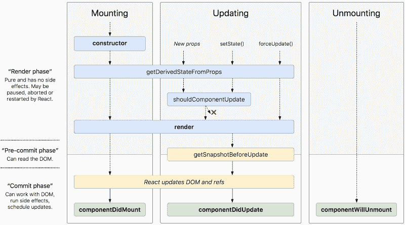
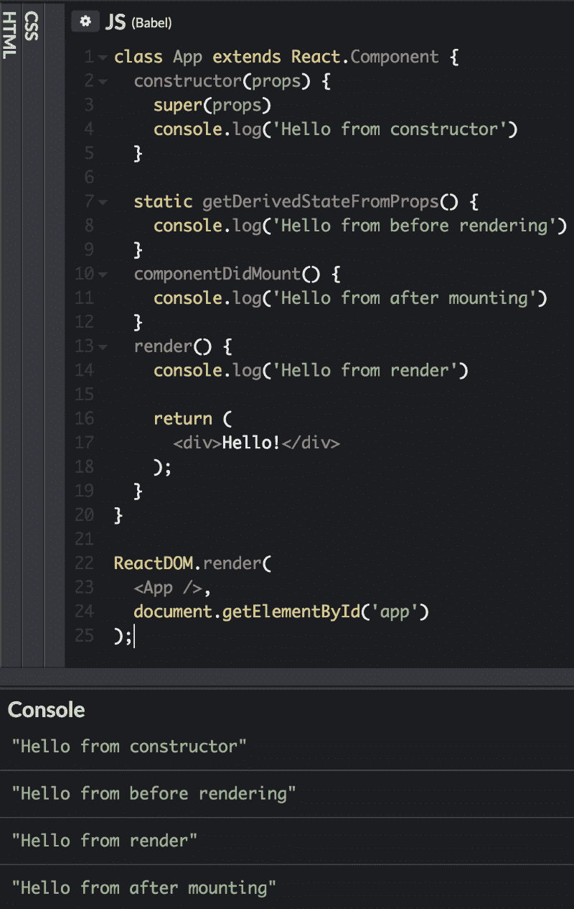
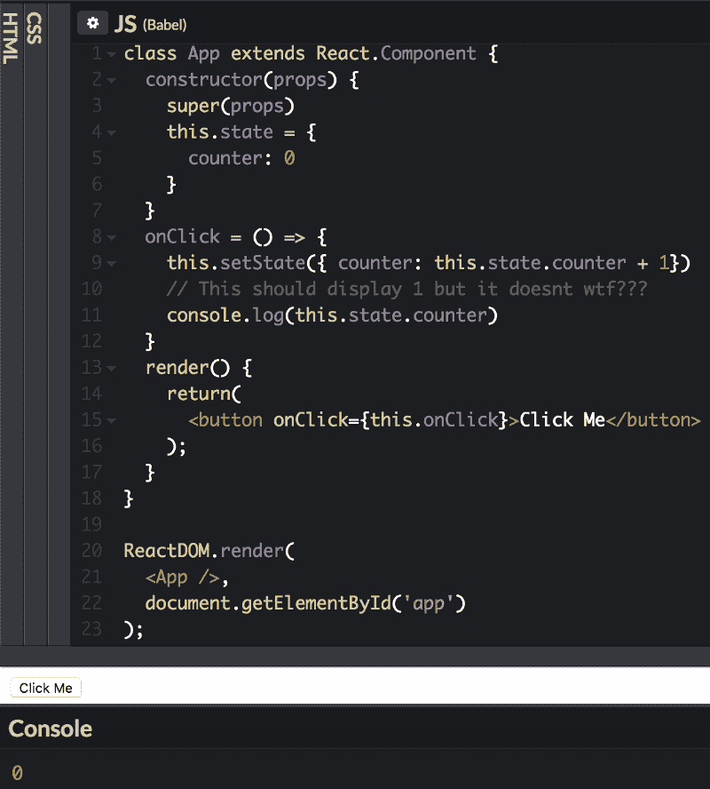
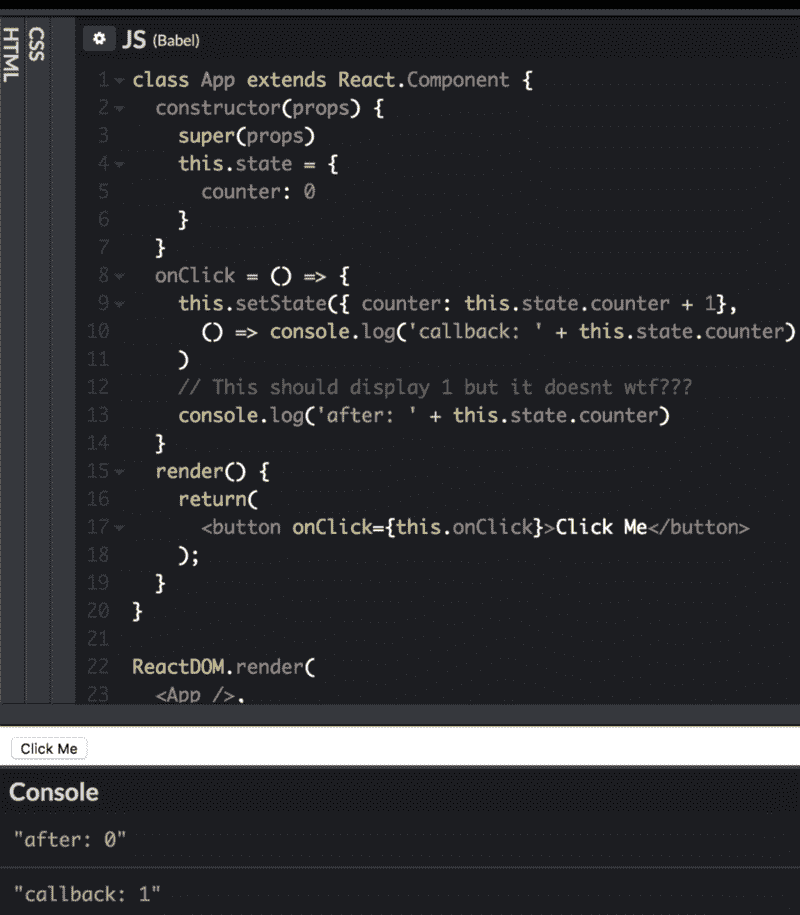
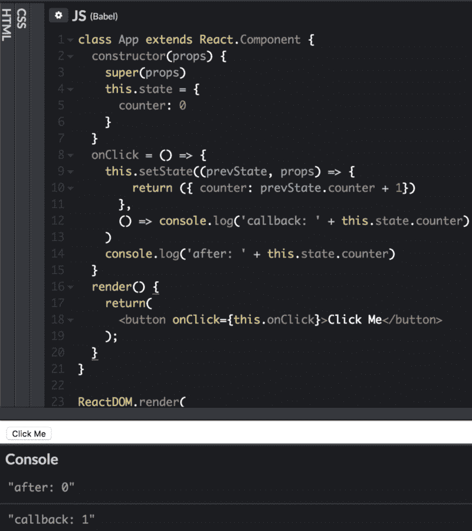
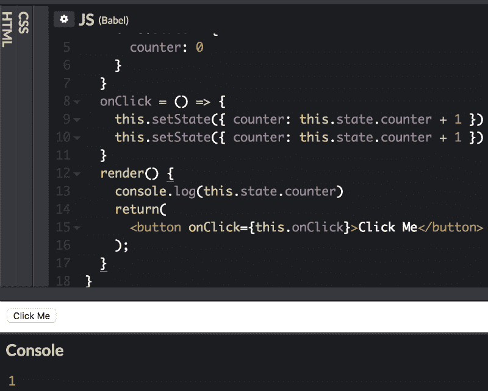
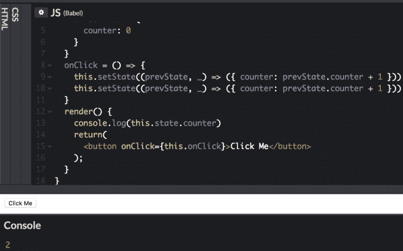

# 这些是你在 React.js 中应该知道的概念(在你学习了基础知识之后)

> 原文：<https://www.freecodecamp.org/news/these-are-the-concepts-you-should-know-in-react-js-after-you-learn-the-basics-ee1d2f4b8030/>

作者克里斯·查克

# 这些是你在 React.js 中应该知道的概念(在你学习了基础知识之后)


Photo by [Daniel Jensen](https://unsplash.com/photos/Hfg3xK7KDDk?utm_source=unsplash&utm_medium=referral&utm_content=creditCopyText) on [Unsplash](https://unsplash.com/)

你已经完成了你的第一个 React.js 教程，你感觉很好。现在怎么办？在接下来的文章中，我将讨论 5 个概念，它们将使你的反应技能和知识更上一层楼。

如果你完全是新手，花点时间完成[本教程](https://reactjs.org/tutorial/tutorial.html)并在之后回来！

### 1.[组件生命周期](https://reactjs.org/docs/react-component.html#static-getderivedstatefromprops)

到目前为止，这个列表中最重要的概念是理解组件的生命周期。组件生命周期就像它听起来的那样:它详细描述了组件的生命周期。像我们一样，组件出生，在地球上做一些事情，然后他们死了☹️

但是和我们不一样，一个组件的生命阶段有点不一样。它看起来是这样的:



Image from [here!](http://projects.wojtekmaj.pl/react-lifecycle-methods-diagram/)

让我们来分解这个图像。每个彩色水平矩形代表一个生命周期方法(除了“React updates DOM and refs”)。这些列代表部件寿命中的不同阶段*。*

*一个组件一次只能处于一个阶段。它从安装开始，然后转移到更新。它会一直更新，直到从虚拟 DOM 中删除。然后进入卸载阶段，并从 DOM 中删除。*

*生命周期方法允许我们在组件生命周期的特定点运行代码，或者响应组件生命周期的变化。*

*让我们来看看组件的每个阶段以及相关的方法。*

#### ***安装***

*由于基于类的组件是类，因此得名，第一个运行的方法是`constructor`方法。通常，`constructor`是您初始化组件状态的地方。*

*接下来，组件运行`getDerivedStateFromProps`。我将跳过这个方法，因为它的用途有限。*

*现在我们来看返回 JSX 的`render`方法。现在将 React“挂载”到 DOM 上。*

*最后，运行`componentDidMount`方法。如果需要，您可以在这里对数据库进行异步调用或直接操作 DOM。就这样，我们的组件诞生了。*

#### *更新*

*每当状态或道具改变时，该阶段被触发。像在 mounting 中，`getDerivedStateFromProps`被调用(但这次没有`constructor`！).*

*下一次`shouldComponentUpdate`运行。在这里你可以比较旧的道具/状态和新的道具/状态。您可以通过返回 true 或 false 来确定组件是否应该重新呈现。通过减少额外的重新渲染，这可以使你的 web 应用程序更加高效。如果`shouldComponentUpdate`返回假，这个更新周期结束。*

*如果没有，React 重新渲染，`getSnapshotBeforeUpdate`随后运行。这种方法的用途也有限。反应然后运行`componentDidUpdate`。像`componentDidMount`一样，你可以用它进行任何异步调用或操纵 DOM。*

#### *卸载*

*我们这部分人过得很好，但是天下没有不散的宴席。卸载阶段是组件生命周期最后一个阶段。当您从 DOM 中删除一个组件时，React 会在它被删除之前运行`componentWillUnmount`。您应该使用此方法清理任何打开的连接，如 WebSockets 或 intervals。*

#### *其他生命周期方法*

*在进入下一个话题之前，先简单说一下`forceUpdate`和`getDerivedStateFromError`。*

*`forceUpdate`是一种直接导致重新渲染的方法。虽然可能有一些用例，但通常应该避免。*

*另一方面，生命周期方法不是组件生命周期的直接组成部分。如果一个组件出现错误，`getDerivedStateFromError`就会运行，您可以更新状态以反映错误的发生。大量使用这种方法。*

*下面的 [**代码片段**](https://codepen.io/chrischuck/pen/EdrBxW) 显示了挂载阶段的步骤:*

*

Mounting lifecycle methods in order* 

*理解 React 的组件生命周期和方法将允许您在应用程序中维护正确的数据流和处理事件。*

### *2.[高阶组件](https://reactjs.org/docs/higher-order-components.html)*

*您可能已经使用了高阶元件或 hoc。比如 Redux 的`connect`函数，就是返回一个 HOC 的函数。但是什么是特设委员会呢？*

*从 React 文档中:*

> *高阶分量是接受一个分量并返回一个新分量的函数。*

*回到 Redux 的 connect 函数，我们可以看看下面的代码片段:*

```
*`const hoc = connect(state => state)const WrappedComponent = hoc(SomeComponent)`*
```

*当我们调用`connect`时，我们得到一个可以用来包装组件的特设返回。从这里开始，我们只需将组件传递给 HOC，并开始使用 HOC 返回的组件。*

*HOCs 允许我们将组件之间的共享逻辑抽象成一个单一的总体组件。*

*一个很好的 HOC 用例是授权。您可以在每个需要的组件中编写您的身份验证代码。它会迅速且不必要地膨胀你的代码。*

*让我们看看如何在没有 hoc 的情况下对组件进行授权:*

*使用 HOCs，您可能会这样做:*

*下面是上面代码的一个工作代码片段[](https://codepen.io/chrischuck/pen/yRwMeo)**。***

***查看上面的代码，您可以看到我们能够保持常规组件非常简单和“简单”,同时仍然为它们提供身份验证。`AuthWrapper`组件将所有认证逻辑提升到一个统一的组件中。它所做的只是获取一个名为`isLoggedIn`的属性，并根据该属性的真假返回`WrappedComponent`或段落标签。***

***如您所见，hoc 非常有用，因为它们让我们重用代码并消除膨胀。我们很快会有更多的练习！***

### ***3. [React State 和 setState()](https://reactjs.org/docs/state-and-lifecycle.html)***

***你们大多数人可能都用过反应状态，我们甚至在我们的例子中也用过。但是重要的是要理解，当状态发生变化时，React 将触发对该组件的重新渲染(除非您在`shouldComponentUpdate`中指定了其他方式)。***

***现在我们来谈谈如何改变状态。改变状态的唯一方法是通过`setState`方法。该方法获取一个对象，并将其合并到当前状态。除此之外，还有一些事情你也应该知道。***

***第一，`setState`是异步。这意味着状态不会在你调用`setState`后准确更新，这可能会导致一些恶化的行为，我们希望现在能够避免！***

***

setState asynchronous behavior*** 

***看上面的图像，你可以看到我们调用了`setState`，然后紧接着调用了`console.log` state。我们新的计数器变量*应该*是 1，但实际上是 0。那么，如果我们想在`setState`实际更新状态后访问新的状态呢？***

***这就把我们带到了下一个我们应该知道的关于`setState`的知识，那就是它可以接受回调函数。让我们修正我们的代码吧！***

***

It works!*** 

***太好了，它起作用了，现在我们做对了吗？不完全是。在这种情况下，我们实际上没有正确使用`setState`。我们不是将一个对象传递给`setState`，而是给它一个函数。这种模式通常在使用当前状态设置新状态时使用，就像上面的例子一样。如果你没有这样做，可以继续传递一个对象给`setState`。让我们再次更新我们的代码！***

***

Now we’re talking.*** 

***下面是上面`setState`代码的 [**代码笔**](https://codepen.io/chrischuck/pen/wYYxrd) 。***

***传递一个函数而不是一个对象有什么意义？因为`setState`是异步的，依靠它来创造我们的新价值会有一些陷阱。例如，在`setState`运行的时候，另一个`setState`可能已经突变了状态。传递`setState`函数给了我们两个好处。首先，它允许我们获取状态的静态副本，该副本永远不会自行改变。第二，它将对`setState`调用进行排队，以便它们按顺序运行。***

***看一下下面的例子，我们尝试使用两个连续的`setState`调用将计数器增加 2:***

***

Typical async behavior from earlier*** 

***以上是我们之前看到的，而我们有下面的修复。***

***

The fix to get our expected behavior*** 

***[**CodePen**](https://codepen.io/chrischuck/pen/GYemvM) 为以上代码。***

***在第一张图中，两个`setState`函数都直接使用了`this.state.counter`，正如我们之前了解到的，在第一个`setState`被调用后，`this.state.counter`仍然为零。因此，我们得到 1 而不是 2，因为*两个*`setState`函数都将`counter`设置为 1。***

***在第二张图中，我们传递给`setState`一个函数，它将保证两个`setState`函数按顺序运行。最重要的是，它获取状态的快照，而不是使用当前未更新的状态。现在我们得到了预期的结果 2。***

***这就是你需要知道的关于反应状态的全部内容！***

### ***4.[反应上下文](https://reactjs.org/docs/context.html)***

***这使我们现在对上下文作出反应，上下文只是组件的全局状态。***

***React context API 允许您创建全局上下文对象，这些对象可以被赋予您所创建的任何组件。这允许您共享数据，而不必通过 DOM 树一路向下传递 props。***

***那么我们如何使用上下文呢？***

***首先创建一个上下文对象:***

***`const ContextObject = React.createContext({ foo: "bar" })`***

***React 文档描述了如何在组件中设置上下文，如下所示:***

***`MyClass.contextType = MyContext;`***

***然而，在 CodePen (React 16.4.2)中，这不起作用。取而代之的是，我们将使用一个特设来以类似于丹·阿布拉莫夫[所推荐的](https://github.com/facebook/react/issues/12397#issuecomment-375501574)的方式使用上下文。***

***我们正在做的是用`Context.Consumer`组件包装我们的组件，并作为道具传入上下文。***

***现在，我们可以编写如下内容:***

***我们将可以从 props 中的上下文对象访问`foo`。***

***你可能会问，我们如何改变环境。不幸的是，这有点复杂，但我们可以再次使用一个特设，它可能看起来像这样:***

***让我们一步一步来。首先，我们获取初始上下文状态，即我们传递给`React.createContext()`的对象，并将其设置为包装组件的状态。接下来我们定义任何改变状态的方法。最后，我们将组件包装在`Context.Provider`组件中。我们将状态和功能传递给价值主张。现在，当用`Context.Consumer`组件包装时，任何孩子都会在上下文中得到这些。***

***将所有内容放在一起(为简洁起见，省略了 hoc):***

***现在我们的子组件可以访问全局上下文了。它能够将状态中的`foo`属性更改为`baz`。***

***这里有一个完整的 [**代码笔**](https://codepen.io/chrischuck/pen/jeJLZG?editors=0011) 的链接，用于上下文代码。***

### ***5.与 React 保持同步！***

***最后一个概念可能是最容易理解的。它只是保持 React 的最新版本。React 最近做了一些重大的改变，它只会继续成长和发展。***

***例如，在 React 16.3 中，某些[生命周期方法](https://reactjs.org/blog/2018/03/29/react-v-16-3.html#component-lifecycle-changes)被弃用，在 React 16.6 中，我们现在获得了[异步组件](https://reactjs.org/docs/code-splitting.html#reactlazy)，在 16.7 中，我们获得了[挂钩](https://reactjs.org/docs/hooks-intro.html)，旨在完全替换类组件。***

### ***结论***

***感谢阅读！我希望你喜欢 React 并从中学习了很多。虽然我希望你确实从阅读中学到了很多，但我鼓励你自己尝试所有这些特点/怪癖。读书是一回事，但掌握它的唯一方法就是自己动手！***

***最后，继续编码。学习一项新技术可能看起来令人畏惧，但接下来你就会成为一名反应专家。***

***如果你有任何意见，问题，或者认为我错过了什么，请在下面留下。***

***再次感谢您的阅读！求分享，滴个？(*一二)，快乐编码。****