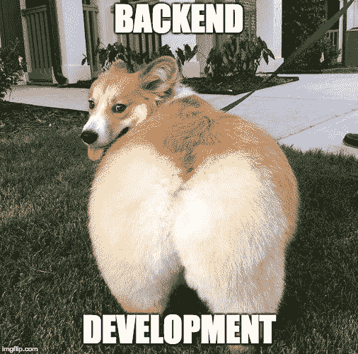
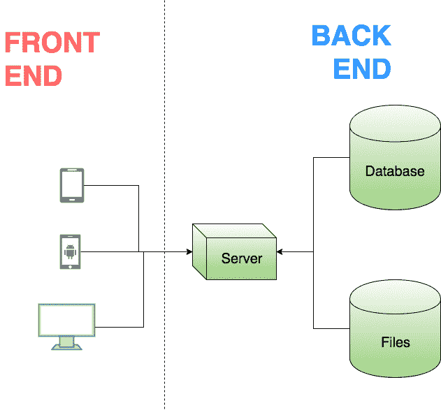
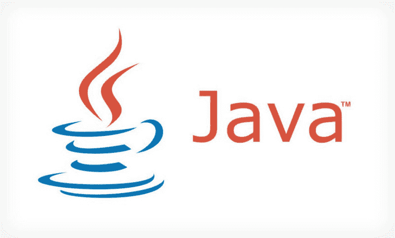
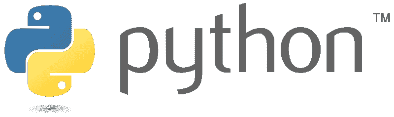
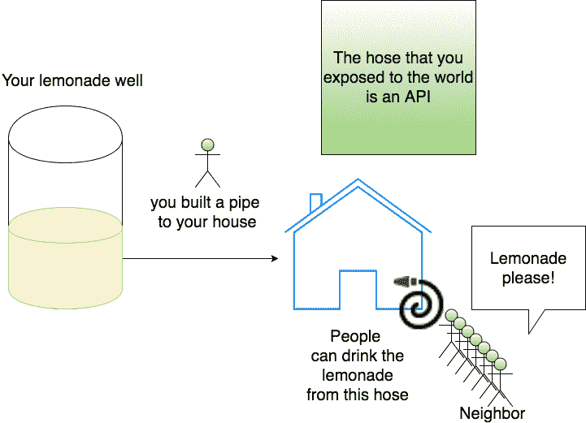
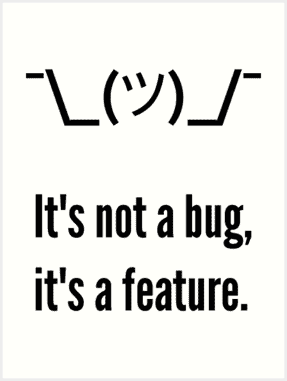

# 如果你是编程新手，这些是你应该知道的计算机科学术语

> 原文：<https://www.freecodecamp.org/news/these-are-the-top-computer-science-terms-you-should-know-if-youre-new-to-programming-fc8592242622/>

作者:阿智·华创

# 如果你是编程新手，这些是你应该知道的计算机科学术语

#### 用简单的英语解释重要的计算机科学术语和概念

由于许多来自非计算机科学背景的朋友和家人问我不同的术语和概念，我将尝试用最简单的语言解释下面的计算机科学概念。

在本快速指南中，您将了解到**每个术语/概念的含义**，以及**为什么重要**:

*   后端开发
*   前端开发
*   编程语言
*   算法
*   应用程序接口
*   病菌
*   开放源码
*   众包

在这篇文章的最后，我还会分享一些资源给你，让你了解更多！

### 后端开发

Backend Development

你可能经常听到“后端开发”这个术语。尤其是如果你一直在 LinkedIn 上闲逛的话。

在这种情况下，“后端”指的是技术堆栈的一层。这主要包括编写或维护一个带有数据库的 web 服务来保存数据。

Frontend/Backend

通常，后端开发与诸如 Java、Scala、Python、DynamoDB、MongoDB、nodeJS、MySQL、MapReduce 等技术相关联。

这与前端开发形成对比，前端开发通常指的是用户界面(UI)层，或功能面向客户的一面。

#### 为什么这很重要

了解前端和后端开发之间的差异可以让你知道在将来开始开发应用程序之前应该考虑哪些组件。

### 前端开发

前端开发通常需要开发面向客户的功能，例如网页或 iOS/Android 应用程序。

这里涉及到不同类型的技术，比如 **HTML，CSS，JavaScript，jQuery，React，Angular，Swift** 等。

我之所以称它们为*技术而不是编程语言*是因为其中一些是帮助你建立基础并指导你编程的框架，但它们本身并不是编程语言。例如，反应和角度。

编程语言只是人类与计算机交流的一种方式。有些人可能认为 HTML 是一种编程语言…我认为这是另一天的话题。？

#### 为什么它很重要

前端开发以前只是 HTML，CSS，JavaScript。如今，它已经是一个拥有自己的技术栈和构建工具的庞然大物了。前端技术正以闪电般的速度发展。我非常鼓励学习前端工具，这样你就可以理解今天的编程世界正在发生什么。

### 程序设计语言

计算机非常善于执行它被告知的命令。为了让我们人类与计算机交流，我们需要**一套通用的可理解语言**——一套人类和计算机都能同意并交流的指令。

在人类世界中，我们使用英语、汉语、西班牙语等语言进行交流。

说到计算机，我们称之为*编程语言*。一种编程语言**允许人类和计算机交流**。编程语言的例子有 Java、C++、Python 等等。

#### 为什么它很重要

学习编程语言可以让你理解你在互联网上看到的东西是如何在引擎盖下工作的——就像知道你的汽车如何以及为什么运行一样。通过一些努力，你将能够构建自己的应用程序，比如 Candy Crush 或 Twitter。

Java

Python

### 算法

> 在计算或其它解决问题的操作中，尤指计算机所遵循的过程或一套规则。—谷歌:)

计算机擅长执行指令，作为软件工程师，我们编写指令供计算机执行。一个**算法**是*为了解决一个特定的问题，可以在有或没有计算机的情况下执行的一系列步骤或指令。*

作为计算机科学专业的学生，我们学习的第一个问题是排序问题。它的本质是以最有效的方式对一组或一组项目进行排序。

Sorting a collection of items

排序的方式有很多种。一个流行的是[冒泡排序](https://en.wikipedia.org/wiki/Bubble_sort)，也称为“比较排序”。它包括比较和挑选两个项目中较大的一个，并对所有其他元素重复，直到所有东西最终都被排序。其他还有[插入排序](https://en.wikipedia.org/wiki/Insertion_sort)、[合并排序](https://en.wikipedia.org/wiki/Merge_sort)等等很多很多！

我强烈建议你去探索它们，因为这是对算法的迷人介绍。这里有一个 Youtube 视频，可以了解更多关于排序算法的信息。

#### 为什么它很重要

算法是计算机科学的核心——理解什么是算法以及它们是如何工作的会让你成为更好的软件工程师。句号。

### 应用程序接口

API，又名应用程序编程接口，又名信息源。更具体地说，想象你家里有一口柠檬水井。你的邻居想喝一口你的柠檬水，但是你不想这口井被污染。那你是做什么的？

你决定建立一个软管连接到你的房子外面的小软管。所有想品尝你神奇柠檬水的邻居都会排队打开水管取你的柠檬水。所有这一切都不需要靠近你的井，你也可以控制什么时候泵柠檬水，如果有一天你的井干涸了，交换柠檬水，或者可能对喝很多柠檬水的人收费。

这是当今许多公司背后的想法——这些公司建立一个珍贵数据的“井”,然后将其出售给希望通过 API 访问这些数据的其他人。

#### 为什么它很重要

今天的互联网依赖于不同服务之间的无缝通信。这就是我们如何能够建立相互交流的工具/网站。API 是允许所有通信发生的基础层。这就是为什么知道互联网如何和用什么来交流是很重要的。

### Bug？

你可能在社交媒体网站上看到过下面这个迷因，但可能不明白它的真正含义。

bug 是计算机程序中的一个错误，它阻止程序按预期运行。

例如，让我们假设您下载了一个 iOS 应用程序，这是一种计算机程序，它应该以华氏温度显示当地的天气温度。然而，iOS 应用程序可能只显示摄氏温度，而不是您预期的华氏温度。

在这种情况下，程序没有按预期执行(应该显示华氏温度，而不是摄氏温度)，您可以将该错误称为 bug。

这在业内是如此普遍，以至于软件工程师把它变成了一个内部笑话，因此有了迷因，“这不是一个错误，这是一个功能”。

#### 为什么它很重要

bug 一直都在发生。了解这一点有助于你在互联网上导航，并在你发现有什么不对劲时指出来。下一次，你会正确地称它为“bug”，而不是“那个东西没有盘旋正确”。

### 开放源码

我将尝试用一个我想到的简单类比来解释开源:)

想象一下，你是一个柠檬水摊位的老板，你有一个制作全市最好的柠檬水的特殊配方。你不会和任何人分享这个秘方，因为你害怕别人会拿走它，偷走你的顾客。在这种情况下，你的秘方被认为是“秘密来源”，除了你之外，任何人都不允许接触。

或者，想象你在网上免费分享你的柠檬水配方，并利用互联网的力量来帮助你改进它，这样每个人都可以享受并受益于最好的柠檬水。在这种情况下，你的食谱被认为是“开源”的，因为它是免费提供的，其他人可以贡献、使用和/或修改它。

随着脸书的崛起和鼓励互联网社区参与开发令人兴奋的新技术的科技公司浪潮，这个术语变得更加流行。

#### 为什么它很重要

由于开源，互联网在过去的几年里发展得如此之快。这是一场革命，每个人都应该知道为什么免费制作东西并与世界分享是有意义的。

### 众包

> 众包(crowdsourcing)——通过招募大量的有偿或无偿服务(通常通过互联网)来获取(信息或对特定任务或项目的投入)。

众包是让一大群人为一项共同的事业做出贡献的想法。

假设你又在经营同一个柠檬水摊。你的顾客说你的柠檬水需要一种新的口味。你意识到利用互联网的力量，你可以请人帮你集思广益，找出最好的柠檬水配方。

然后你可以开一个 Twitter 账户，开始让世界各地的人们贡献他们最好的柠檬水配方。这被称为众包，这是让人们为一个共同的事业做出贡献的行为(在这种情况下，是制作柠檬水)。

#### 为什么它很重要

互联网让所有人团结起来，为应对世界上一些最严峻的挑战贡献自己最聪明的头脑。众包让我们可以通过互联网无缝地做到这一点。我认为这是人类的一大进步。

### 推荐资源

*   斯坦福大学的在线 CS 101——该课程给你一个 CS 术语的基本概述，互联网是如何工作的，数字图像是如何形成和处理的等等。最棒的是，它是免费的！
*   [Python 速成班](https://amzn.to/2pPBtkL)—Python 编程入门的最佳资源之一。如果你想接触编程，我推荐你从 Python 和下面的书开始。
*   [Python，实用指南](https://amzn.to/2yaiUfB)——这是一本有趣的书，在你完成 Python 速成课程后可以得到。我想你可以不用这本书来做这里的大部分事情，但是它确实给了你更详细的一步一步的指导。非常适合喜欢通过例子学习的人。
*   算法简介——如果你想了解更多关于算法的知识，这是计算机科学的核心原则，这本书值得大力推荐。这是*许多 CS 课程的*教材。
*   参加编码面试 —这是我的私人教练课程，我会向你展示我是如何准备面试的，我参加编码面试的技巧和诀窍，以及更多。

阿智·钟是推特的一名软件工程师。不写代码的时候，他打网球，写文章，或者制作 Youtube 视频。

*如果你喜欢这篇文章，并且想要一份 PDF 格式的副本，请考虑[订阅我的邮件列表](http://eepurl.com/dnt9Sf)，在那里我可以分享行业新闻、编程花絮、采访笔记等等！*