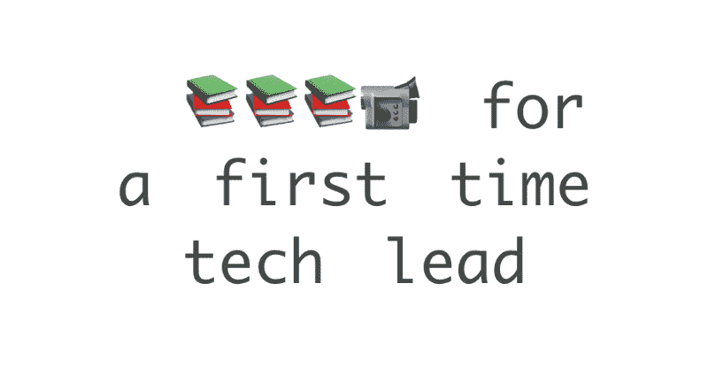

# 这些书帮助我第一次成为一名技术领导者

> 原文：<https://www.freecodecamp.org/news/these-books-helped-me-navigate-my-first-time-being-a-tech-lead-a9e0d100524f/>

丹尼·佩雷斯

# 这些书帮助我第一次成为一名技术领导者

技术负责人因为一项长期任务被调到另一个团队，我接替了工程经理/团队负责人的职位。

从外面看，技术负责人的工作似乎是可行的，但我很快意识到我做得有些过头了。不幸的是，我的团队负责大量的集中式基础设施和日常技术操作。我没有接受过技术领导培训，怎么会有呢？我很确定技术领导的角色在不同的公司中是如此的不同，所以怎么会有指导方针呢？

在我之前担任团队的高级工程师时，我觉得自己有能力处理更大的项目，但我只处理过一个项目。现在，我需要为我的 5 名工程师的小团队管理 3-5 个项目。

我所能做的最好的事就是像上一个人那样做，这只能让你保持清醒。我意识到，对我来说，度过这一难关的唯一方法就是看书，学习所有我在大学里从未学过的管理知识。

那年我读了很多书。比过去三年加起来还多。我读过的最有帮助的书都可以归结为我(像许多其他人一样)努力工作的 3 个方面:处理团队和个人的表现，授权，让我的团队成为一个伟大的团队。

*免责声明:我已经尽力链接到作者的网站。否则，如果你想得到这本书，这些链接会转到亚马逊(不是推荐链接)。我和下面的作者没有任何联系，只是他们作品的粉丝。

### 处理绩效

我觉得影响团队的一件事是表现不佳的团队成员。当然，像许多其他人一样，我自己从未见过有效的绩效评估，也没见过其他领导如何处理他们团队的绩效(这可能是件好事，但对我没有帮助)。

虽然我在很大程度上知道你应该做什么，比如谈论和处理问题，但我很难真正做到这一点——作为一名新领导，我该如何向团队中以前的同事提供反馈呢？前几次肯定很尴尬！

幸运的是，在这个领域，有人比我聪明得多，他们分享了大量的经验来帮助你克服这类问题。

*   金·斯科特
    如果你想专注于给出好的反馈，这为给出和接受反馈提供了一个非常强大的心智模型，而不会感觉自己像个混蛋。它专注于与人坦诚相待，以免你对他们图谋不轨或羞辱他们。
*   曼迪·弗林特、伊丽莎白·温伯格·赫恩和[撰写的《领导团队:10 大挑战和解决方案》和布莱恩·w·菲茨帕特里克、本·科林斯-苏斯曼](https://www.amazon.com/dp/1491932058)
    撰写的《调试团队:通过合作提高生产力》如果你想专注于让自己摆脱团队中的一些问题，这两本书深入探讨了团队可能会遇到的常见问题，以及一些如何处理这些问题的分步指南。这是一个我不太愿意向其他经理询问的领域。我们有许多小团队，我们都非常友好，所以很难找到可以交谈的人。下一个最好的事情是看看其他更成功的领导者在这些情况下做了什么。
*   [经理在 Youtube 上与 UMCB 表现不佳者的对话](https://youtu.be/RXxHBSuW4lM)
    你很少能看到别人的绩效评估——这些评估本质上是隐私和个人的(或者你是人力资源)。如果你想知道关于糟糕表现的“好”对话是什么样的，这个视频对我帮助很大！还有一些其他相关的视频会告诉你不要做什么，但很高兴看到你如何快速化解尴尬的局面。

第一课总结:非常明确地说出你对他们工作的期望，这样他们就不会说，“我怎么会知道？”

### 授权

我的工作的另一个尴尬之处是告诉人们该做什么——我们的团队有一个我们基本一致的使命，但我们并不总是做很酷的事情，而且工作仍然必须按时完成。

我见过其他人做得很好，也见过其他人做得很差——但我无法向你解释为什么。头几次我感到很尴尬，我说，“嘿，罗杰，你能看一下这个问题吗？”结果是开发人员带着我没有预料到的东西回来了(参见第一课)。

当我还是团队中的工程师同事时，我觉得自己有能力从事更大的项目，并确保我们运送的是正确的东西。但是现在，我也要对团队正在进行的所有项目负责，而不仅仅是我的项目。我现在有两倍多的事情要做，典型的工程师出身的经理在一次挫折中可能会问，“如果我一直被困在会议中和与人打交道，我什么时候应该编码？”

很难兼顾我现在负责的所有项目，以及做关键项目的工作，规划跨团队计划，并在这里插入 20 多件事情。

*   [罗伯特·海勒《如何授权》(基本经理人系列)](https://www.amazon.com/dp/0789428903)
*   Richard Luecke、Perry McIntosh 撰写的《忙碌经理授权指南》( Worksmart 系列)

总结一下这些书:非常明确地说出你对项目/任务的期望，这样他们就不会说，“我怎么会知道？”

虽然这两本书听起来有点俗气，但它们给了我一个很好的授权框架和过程。读完之后，我开始在日历上划出时间来检查我们的项目，并试图将人们的目标和动机与我们必须做的工作匹配起来。我们中的一些人获得了 AWS 证书，一名工程师获得了晋升，一名实习生全职加入了我们。我们也创造了伟大的东西。

### 打造一支优秀的团队

建立一个更好的团队的一个方法是看更多的团队和他们是如何运作的，并把他们作为建立你自己的团队的指导范例。问题是，除非你离开你的工作，去别的地方工作，否则你不会看到那么多的团队，所以你可能甚至不知道你的团队最好的时候是什么样子！

我非常喜欢读这些书，因为它们提供了真实团队的案例研究，以及一些知名公司的真实故事。有些人的工作非常糟糕，有些人则不然，他们会深入解释原因。

这些书更侧重于软件工程团队:

*   [与技术领导交谈:从新手到实践者作者 Patrick Kua](https://www.thekua.com/atwork/2014/09/talking-with-tech-leads/)
    Patrick Kua 是一个很棒的演讲者[，他的一些关于技术领导的演讲可以在 Youtube](https://www.youtube.com/results?search_query=patrick+kua) 上找到，内容包括[作为第一次担任技术领导我希望知道的事情](https://www.youtube.com/watch?v=CjgWwmBW-bc)和[领导团队的极客指南](https://www.youtube.com/watch?v=N9UPW-2wL5U)
*   Joost Visser，Sylvan Rigal，Gijs Wijnholds，Zeeger Lubsen

这些书涵盖了一般的团队:

*   Andrew Stellman 和 Jennifer Greene 撰写的《美丽的团队:来自资深团队领导者的鼓舞人心的警示故事》
*   《极限团队:为什么皮克斯、网飞、Airbnb 和其他尖端公司在大多数人失败的地方取得成功》作者罗伯特·布鲁斯·肖
*   [攀登团队:构建成功团队和组织的策略，作者:David Loftesness，Alexander Grosse](https://www.amazon.com/dp/149195227X)

用一句话来总结:非常明确地说出你对团队文化的期望**，这样他们就永远不会说，“我怎么知道？”**

### **包扎**

**一年多来，我带领团队度过了一段美好的时光。虽然有时想到我将如何度过特别有问题的一周是令人难以置信的令人畏惧的，但我的团队将保持正轨，随着时间的推移，我们能够转向更积极的工作。管理中有许多不同的领域，你可以花很多时间去学习，但是如果你只做一件事，其他什么都不做…**

**告诉你的团队，作为他们的领导，他们对你的期望要非常明确，这样你就永远不会说:“我怎么会知道？”**

**媒体上的同行技术领导:第一次成为技术领导最困难的部分是什么？**

**如果你喜欢这篇文章，给它一些？跟着我来到灵媒台。**

***最初发布于 2018 年 12 月 11 日[www . intra cate cloud . io](https://www.intricatecloud.io/2018/12/9-books-that-helped-me-navigate-my-first-time-being-a-tech-lead)。***