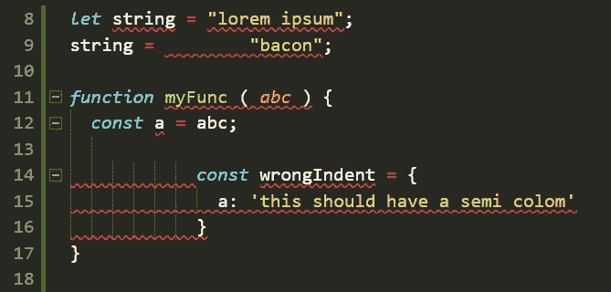
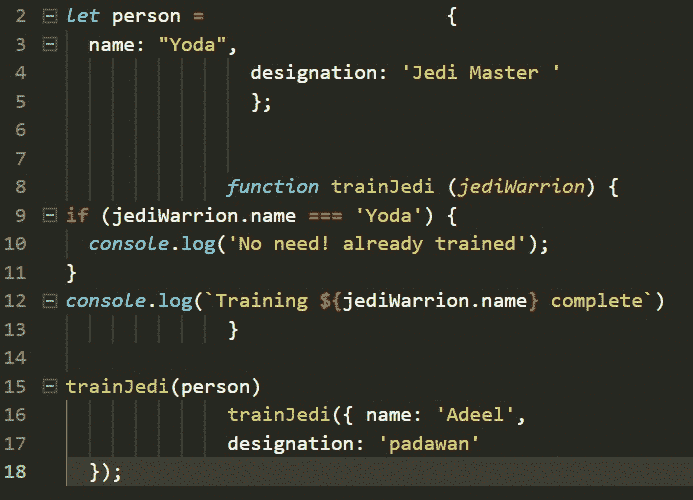
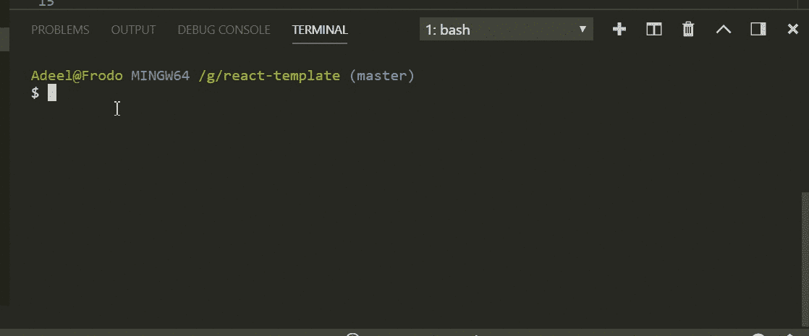

# 这些工具将帮助你编写干净的代码

> 原文：<https://www.freecodecamp.org/news/these-tools-will-help-you-write-clean-code-da4b5401f68e/>

#### 看看更漂亮的，ESLint，Husky，Lint-Staged 和 EditorConfig

学习写好的代码，但是你不知道从哪里开始…浏览风格指南，比如 Airbnb 的 Javascript 风格指南 …尝试用最佳实践写代码...

删除死代码？在代码库中寻找未使用的变量？试图在代码中找到有问题的模式？比如，到底有没有？

这听起来耳熟吗？

有这么多要学的东西，同时要做这么多事情，真是太忙了。

你是管理多元化团队的团队领导吗？团队中有新的开发人员吗？你担心他们会写出不符合标准的代码吗？它是否占用了您一整天的时间进行代码评审，其中评审更多的是关于代码标准，而不是实际的逻辑实现？

我去过那里，也做过，只是太累太忙了。

让我们承诺永远不再担心代码应该是什么样子，或者让您的整个团队以某种正确的方式编写代码。

在整个教程中，如果你卡住了，这里是[代码库](https://github.com/adeelibr/react-starter-kit)。如果您有改进的建议，欢迎提出请求。

本教程更适合 React 应用程序，但同样适用于任何 web 项目。

另外，我在本教程中使用的编辑器是 [VS 代码](https://code.visualstudio.com/)。这是微软的做的，自从他们开始开源，我就和这家公司一起在❤(虽然有一段时间我不在)。

### 议程

*   较美丽
*   埃斯林特
*   保存时自动格式化和 Lint
*   强壮的
*   皮棉阶段
*   具有 Husky 和 Lint-staged 组合
*   EditorConfig

### 让我们从更漂亮开始

#### ***什么比较好看？***

[更漂亮](https://prettier.io/)是一个固执己见的代码格式化程序。它以特定的方式为您格式化代码。

这张 GIF 很好地解释了这一点:



Prettier formatting my code, like a boss!

#### ***我们为什么需要它？***

*   **清理现有代码库**:在一个命令行上。想象一下，清理一个超过 20，000 行代码的代码库。
*   **易于采用**:在格式化你的代码时，更漂亮地使用最少争议的编码风格。由于它是开源的，许多人已经对它进行了多次迭代，修复了一些边缘情况并改善了体验。
*   **写代码**:人们没有意识到的是，他们花了大量的时间格式化代码，并且这样做浪费了他们的精神能量。让漂亮的人来处理，而*你*专注于核心业务逻辑。就个人而言,“漂亮”让我的效率提高了 10%。
*   **帮助新手开发者** : 如果你是一名新的开发者，与伟大的工程师并肩工作，你想看起来*酷*写干净的代码，聪明点！用漂亮点的。

#### ***我怎么设置？***

创建一个名为`app`的文件夹，并在命令行中键入:

```
npm init -y
```

这将在`app`文件夹中为您创建一个`package.json`文件。

现在，我将在整个教程中使用`yarn`，但是你也可以使用`npm`。

让我们安装第一个依赖项:

```
yarn add --dev prettier
```

这将在您的`package.json`中安装一个开发依赖项，如下所示:

```
{
  "name": "react-boiler-plate",
  "version": "1.0.0",
  "description": "A react boiler plate",
  "main": "src/index.js",
  "author": "Adeel Imran",
  "license": "MIT",
  "scripts": {
    "prettier": "prettier --write src/**/*.js"
  },
  "devDependencies": {
    "prettier": "^1.14.3"
  }
}
```

package.json - Adding prettier to out devDependencies

我马上会谈到这个`“prettier”: “prettier — write src/**/*.js”`是做什么的，但是首先让我们在我们的`app`文件夹中创建一个`src/`文件夹。在`src/`文件夹中，我们创建一个名为`index.js`的文件——你可以随意命名。

在`index.js`文件中，按原样粘贴以下代码:

```
let person =                     {
  name: "Yoda",
                designation: 'Jedi Master '
                };

              function trainJedi (jediWarrion) {
if (jediWarrion.name === 'Yoda') {
  console.log('No need! already trained');
}
console.log(`Training ${jediWarrion.name} complete`)
              }

trainJedi(person)
              trainJedi({ name: 'Adeel',
              designation: 'padawan' 
  });
```

index.js - I know this is ugly! Super ugly. But there is sanity in the midst of chaos. Bear with me.

所以到目前为止，我们有一个`src/app/index.js`文件，里面写了一些难看的代码。

对此我们可以做三件事:

*   手动缩进并格式化此代码
*   使用自动化工具
*   顺其自然，继续前进(请不要选择这个选项)

我打算选择第二个选项。所以现在我们已经安装了一个依赖项，并且在我们的`package.json`中编写了一个更漂亮的脚本。

让我们在根`app`文件夹中创建一个`prettier.config.js`文件，并向其中添加一些更漂亮的规则:

```
module.exports = {
  printWidth: 100,
  singleQuote: true,
  trailingComma: 'all',
  bracketSpacing: true,
  jsxBracketSameLine: false,
  tabWidth: 2,
  semi: true,
};
```

prettier.config.js

`printWidth`将确保您的代码不超过 100 个字符。

`singleQuote` 会把你所有的双引号转换成单引号。
点击阅读 Airbnb JavaScript 风格指南[。这个指南是我写好代码并给同事留下深刻印象的剧本。](https://github.com/airbnb/javascript)

`trailingComma` 将确保在最后一个对象属性的末尾有一个悬空逗号。[尼克·格拉芙](https://twitter.com/nikgraf)用如此酷炫的方式解释了这一点[这里](https://medium.com/@nikgraf/why-you-should-enforce-dangling-commas-for-multiline-statements-d034c98e36f8) *。*

`bracketSpacing` 打印对象文字间的空格:

```
If bracketSpacing is true - Example: { foo: bar }If bracketSpacing is false - Example: {foo: bar}
```

`jsxBracketSameLine` 会放`&`gt；多行 JSX 元素的最后一行:

```
// true example

<button
  className="prettier-class"
  id="prettier-id"
  onClick={this.handleClick}>
  Click Here
</button>

// false example

<button
  className="prettier-class"
  id="prettier-id"
  onClick={this.handleClick}
>
  Click Here
</button>
```

jsxBracketSameLine.example.js

`tabWidth` 指定每级缩进的空格数。

`semi` 如果为真将在报表末尾打印`;`。

这里列出了所有你能给得更漂亮的[选项](https://prettier.io/docs/en/options.html)。

现在我们已经设置好了配置，让我们来讨论一下这个脚本:

```
“prettier”: “prettier  — write src/**/*.js”
```

在上面的脚本中，我运行`prettier`并告诉它在我的`src/`文件夹中找到所有的`.js`文件。`--write`标志告诉`prettier`保存格式化的文件，因为它会检查每个文件并发现代码结构中的任何异常。

让我们在您的终端中运行这个脚本:

```
yarn prettier
```

这是我运行代码时发生的情况:



Cool, right?

如果你被卡住了，可以看看[库](https://github.com/adeelibr/react-starter) 来解决这个问题。

我们关于更漂亮的的讨论到此结束。再来说说棉绒。

### 埃斯林特

#### ***什么是码棉绒？***

> 代码[林挺](https://en.wikipedia.org/wiki/Lint_(software))是一种静态分析，经常被用来发现有问题的模式或不符合特定风格指南的代码。大多数编程语言都有代码换行符，编译器有时会在编译过程中加入林挺。— [诚信通](https://eslint.org/docs/about/)

#### ***为什么 JavaScript 需要一个？***

由于 JavaScript 是动态的，并且是一种松散类型的语言，它很容易让开发人员出错。在没有编译过程的帮助下，`.js`文件通常被执行以发现语法或其他错误。

像 [ESLint](https://eslint.org/) 这样的林挺工具允许开发者在不执行 JavaScript 代码的情况下发现问题。

#### ***是什么让 ESLint 如此特别？***

好问题！ESLint 中的一切都是可插拔的。您可以在运行时添加规则——规则和格式化程序不必捆绑在一起使用。您添加的每个林挺规则都是独立的，任何规则都可以打开或关闭。每个规则都可以设置为警告或错误。你的选择。

使用 ESLint，你可以完全定制你想要的风格指南。

现在有两个流行的风格指南:

*   [谷歌 JavaScript 风格指南](https://google.github.io/styleguide/jsguide.html)
*   [Airbnb JavaScript 风格指南](https://github.com/airbnb/javascript#table-of-contents)

我个人一直在用 Airbnb 的风格指南。当我开始职业生涯时，这是我上一家公司的工程主管推荐给我的，这是我可支配的最有价值的资产。

这个风格指南被积极地维护着——看看他们的 [GitHub repo](https://github.com/airbnb/javascript) 。在本教程中，我将使用受 Airbnb 风格指南启发的规则集。让我们开始吧。

让我们首先更新我们的`package.json`文件:

```
{
  "name": "react-boiler-plate",
  "version": "1.0.0",
  "description": "A react boiler plate",
  "main": "src/index.js",
  "author": "Adeel Imran",
  "license": "MIT",
  "scripts": {
    "lint": "eslint --debug src/",
    "lint:write": "eslint --debug src/ --fix",
    "prettier": "prettier --write src/**/*.js"
  },
  "husky": {
    "hooks": {
      "pre-commit": "lint-staged"
    }
  },
  "lint-staged": {
    "*.(js|jsx)": ["npm run lint:write", "git add"]
  },
  "devDependencies": {
    "babel-eslint": "^8.2.3",
    "eslint": "^4.19.1",
    "eslint-config-airbnb": "^17.0.0",
    "eslint-config-jest-enzyme": "^6.0.2",
    "eslint-plugin-babel": "^5.1.0",
    "eslint-plugin-import": "^2.12.0",
    "eslint-plugin-jest": "^21.18.0",
    "eslint-plugin-jsx-a11y": "^6.0.3",
    "eslint-plugin-prettier": "^2.6.0",
    "eslint-plugin-react": "^7.9.1",
    "husky": "^1.1.2",
    "lint-staged": "^7.3.0",
    "prettier": "^1.14.3"
  }
}
```

package.json

在开始配置之前，我坚信人们应该知道他们的依赖项包含什么。让我们讨论一下每个产品包的功能，然后我们可以继续进行配置。

`babel-eslint` : 这个包可以让你轻松的用棉绒对所有[巴别塔](https://babeljs.io/)善良。如果你没有使用 [Flow](https://flow.org/) 或者 ESLint 还不支持的实验特性，你不一定需要这个插件。

`eslint` : 这是林挺你的代码所需的主要工具。

`eslint-config-airbnb`:这个包提供了 Airbnb 所有的 ESLint 配置，作为一个可扩展的共享配置，你可以修改。

`eslint-plugin-babel`:**`babel-eslint`的一个`eslint`插件伴侣。
`babel-eslint`在改编`eslint`用于巴别塔方面做得很好。**

**`eslint-plugin-import` : 该插件旨在支持`ES2015+ (ES6+)` `import/export syntax,`的林挺，并防止文件路径和导入名称拼写错误的问题。[阅读更多](https://github.com/benmosher/eslint-plugin-import) *。***

**`eslint-plugin-jsx-a11y` : 林挺规则为 JSX 元素的可访问性规则就位。因为**无障碍很重要！****

**`eslint-plugin-prettier` : 这有助于 ESLint 与 Prettier 顺利合作。因此，当 Prettier 格式化代码时，它会牢记我们的 ESLint 规则。**

**`eslint-plugin-react` : 针对 ESLint 的 React 特定林挺规则。**

**现在这个教程不怎么讲 [Jest/Enzyme](https://airbnb.io/enzyme/docs/guides/jest.html) 的单元测试了。但是，如果您正在使用它，让我们也为它们添加林挺规则:**

**`eslint-config-jest-enzyme` : 这有助于全球化的反应和酶特异性变量。这个 lint 配置让 ESLint 知道这些全局变量，而不会对它们发出警告——就像断言`it`和`describe`。**

**`eslint-plugin-jest`:**esline 插件用于 Jest。****

****`husky` : 这一点以后在自动化部分会有更多的介绍。****

****`lint-staged:` 关于这一点以后当在自动化一节中详述。****

****既然有了基本的了解，那就开始吧；****

****在您的根`app/`文件夹中创建一个`.eslintrc.js`文件:****

```
**`module.exports = {
	env: {
		es6: true,
		browser: true,
		node: true,
	},
	extends: ['airbnb', 'plugin:jest/recommended', 'jest-enzyme'],
	plugins: [
		'babel',
		'import',
		'jsx-a11y',
		'react',
		'prettier',
	],
	parser: 'babel-eslint',
	parserOptions: {
		ecmaVersion: 6,
		sourceType: 'module',
		ecmaFeatures: {
			jsx: true
		}
	},
	rules: {
		'linebreak-style': 'off', // Don't play nicely with Windows.

		'arrow-parens': 'off', // Incompatible with prettier
		'object-curly-newline': 'off', // Incompatible with prettier
		'no-mixed-operators': 'off', // Incompatible with prettier
		'arrow-body-style': 'off', // Not our taste?
		'function-paren-newline': 'off', // Incompatible with prettier
		'no-plusplus': 'off',
		'space-before-function-paren': 0, // Incompatible with prettier

		'max-len': ['error', 100, 2, { ignoreUrls: true, }], // airbnb is allowing some edge cases
		'no-console': 'error', // airbnb is using warn
		'no-alert': 'error', // airbnb is using warn

		'no-param-reassign': 'off', // Not our taste?
		"radix": "off", // parseInt, parseFloat radix turned off. Not my taste.

		'react/require-default-props': 'off', // airbnb use error
		'react/forbid-prop-types': 'off', // airbnb use error
		'react/jsx-filename-extension': ['error', { extensions: ['.js'] }], // airbnb is using .jsx

		'prefer-destructuring': 'off',

		'react/no-find-dom-node': 'off', // I don't know
		'react/no-did-mount-set-state': 'off',
		'react/no-unused-prop-types': 'off', // Is still buggy
		'react/jsx-one-expression-per-line': 'off',

		"jsx-a11y/anchor-is-valid": ["error", { "components": ["Link"], "specialLink": ["to"] }],
		"jsx-a11y/label-has-for": [2, {
			"required": {
				"every": ["id"]
			}
		}], // for nested label htmlFor error

		'prettier/prettier': ['error'],
	},
};`**
```

****.eslintrc.js****

****另外，在您的根`app/`目录中添加一个`.eslintignore`文件:****

```
**`/.git
/.vscode
node_modules`**
```

****让我们从讨论一个`.eslintrc.js`文件做什么开始。****

****让我们来分解一下:****

```
**`module.exports = { 
   env:{}, 
   extends: {}, 
   plugin: {}, 
   parser: {}, 
   parserOptions: {}, 
   rules: {},
};`**
```

*   ****`env:` 环境定义了预定义的全局变量。可用的环境—在我们的例子中是`es6`、`browser`和`node`。
    `es6` 将启用除模块之外的所有 ECMAScript 6 特性(这会自动将`ecmaVersion`解析器选项设置为 6)。
    `browser` 将添加所有浏览器全局变量如`Windows`。
    `node` 会添加节点全局变量和节点作用域，如`global`。你可以[阅读更多关于指定环境的](https://eslint.org/docs/user-guide/configuring#specifying-environments)。****
*   ****`extends:` 一个字符串数组——每个附加的配置都扩展了前面的配置。
    现在我们使用的是`airbnb`的林挺规则，它被扩展到`jest`，然后扩展到`jest-enzyme`。****
*   ****`plugins:` 插件基本上都是我们要用的林挺规则。
    现在我们正在使用`babel, import, jsx-a11y, react, prettier`，所有这些我已经在上面解释过了。****
*   ****`parser:` 默认情况下 ESLint 使用 [Espree](https://github.com/eslint/espree) ，但是既然我们在使用`babel`，我们就需要使用 [Babel-ESLint](https://www.npmjs.com/package/babel-eslint) 。****
*   ****`parserOptions:` 当我们将`Espree`的默认解析器改为`babel-eslint`时，我们需要指定`parserOptions`——这是必需的。在选项中，我告诉 ESLint`ecmaVersion`将会是 Lint 版本`6`。因为我们用 EcmaScript `module`而不是`script`编写代码，所以我们将`sourceType`指定为`module`。
    因为我们使用引入了 JSX 的 React，所以在`ecmaFeatures`中，我给它传递了一个选项`jsx`，并将其设置为`true`。****
*   ****`rules:` 这是我最喜欢 ESLint 的部分，定制。
    我们用插件扩展和添加的所有规则，我们都可以更改或覆盖。`rules`就是你做的地方。为了让你理解，我已经对每条规则的要点做了评论。****

****既然说清楚了，那就来说说`.eslintignore`****

****`.eslintignore` 获取我们希望 ESLint 不要 Lint 的路径列表。这里我只指定三个:****

*   ****我不希望我的 Git 相关文件被窃取。****
*   ****由于我使用的是 VS 代码，这个编辑器自带了你可以为每个项目设置的配置。我不希望我的配置被丢弃。我用 VS 代码，因为它是轻量级的，开源的。****
*   ****我不希望我的依赖者受到侮辱。所以我把这个加到了清单上。****

****现在我们已经完成了，让我们来谈谈新添加到我们的`package.json`中的脚本****

```
**`"lint": "eslint --debug src/"
"lint:write": "eslint --debug src/ --fix"`**
```

*   ****`$ yarn lint`运行这个命令，它将检查你在`src/`中的所有文件，并在每个发现错误的文件中给你一个详细的日志，然后你可以手动进入并改正它们。****

****

running **yarn lint | npm run lint****** 

*   ****`$ yarn lint:write`运行该命令，它将执行与上述命令相同的操作。唯一的补充是，如果它可以纠正它看到的任何错误，它将纠正它们，并尽可能多地从您的代码中删除代码味道。****

****如果你卡住了，可以随意看看这个 [**库**](https://github.com/adeelibr/react-starter) 。****

****这是一个有点忙乱，如果你一直跟着走:****

****

Professor Snape is proud of you. Good job.**** 

### ****让我们再自动化一点****

****到目前为止，我们已经设置了`prettier`和`eslint`，但是每次我们都必须运行一个脚本。让我们做点什么吧。****

*   ****在编辑器中点击`ctrl+s`时的格式和 Lint 代码。****
*   ****每次提交代码时，自动执行一个前置命令来链接和格式化代码。****

#### ****保存时格式化和 Lint 代码****

****为此，您需要使用类似于 [VS 代码](https://code.visualstudio.com/)的编辑器:****

*   ****安装一个名为 ESLint extension 的插件。
    [在这里下载](https://marketplace.visualstudio.com/items?itemName=dbaeumer.vscode-eslint)或者在你的 VS 代码编辑器里按`ctrl+shift+x`。这将打开扩展模块。那里，搜索类型`eslint`。将会出现一个插件列表。由`Dirk Baeumer`安装一个。一旦安装完毕，点击`reload`按钮重启编辑器。****

****一旦你安装了这个插件，在你的根文件夹`app/`中创建一个名为`.vscode/`的文件夹——文件名中的点号很重要。****

****在文件夹内创建一个`settings.json`文件，如下所示:****

```
**`{
  "editor.formatOnSave": false,
  "eslint.autoFixOnSave": true,
}`**
```

****settings.json****

*   ****`editor.formatOnSave`我在这里将值设置为`false`，因为我不想让文件格式的默认编辑器配置与 ESLint 和 Prettier 冲突。****
*   ****我在这里将值设置为`true` ,因为我希望每次点击保存时安装的插件都能工作。由于 ESLint 配置了更漂亮的配置，所以每次点击`save`它都会格式化并 Lint 你的代码。****

****这里需要注意的重要一点是，当你运行脚本
`yarn lint:write`时，它会同时运行并美化你的代码。****

****想象一下，如果你有一个 20k 行代码的代码库需要审计和改进。现在想象一下手动操作。改进未知代码。现在想象一下用一个命令就可以做到。手动方法可能需要 30 天...而自动接近需要 30 秒。****

****这样脚本就建立起来了，每次你点击`save` 编辑器就会为你变魔术般地生成那个特定的文件。但是并不是你团队中的每个人都会选择 VS 代码，这没关系。让我们再自动化一点。****

### ****强壮的****

#### ****什么是哈士奇？****

****[哈士奇](https://github.com/typicode/husky)基本上让你 Git 钩。这意味着当您将要提交代码或者将代码推送到分支时，您可以执行某些特定的操作。****

****你所要做的就是安装 Husky:****

```
**`yarn add --dev husky`**
```

****在您的`package.json`文件中添加代码片段:****

```
**`"husky": {    
   "hooks": {      
     "pre-commit": "YOUR_COMMAND_HERE", 
     "pre-push": "YOUR_COMMAND_HERE"   
   }  
},`**
```

****因此，每次提交或推送时，它都会执行特定的脚本或命令，比如运行测试用例或格式化代码。****

****你可以在这里阅读更多关于哈士奇[的内容。](https://github.com/typicode/husky#install)****

### ****皮棉阶段****

#### *******什么是皮棉分期？*******

****Lint-staged 帮助你在 staged 文件上运行 linters，这样坏代码就不会被推送到你的分支。****

#### *******为什么不掉毛？*******

****在提交代码之前运行林挺更有意义。通过这样做，您可以确保没有错误进入存储库，并加强代码风格。但是在整个项目上运行 lint 过程是缓慢的，并且林挺结果可能是不相关的。最终，您只想 lint 将要提交的文件。****

****这个项目包含一个脚本，该脚本将运行任意 shell 任务，并以一个暂存文件列表作为参数，通过指定的 glob 模式进行过滤。你可以[在这里](https://github.com/okonet/lint-staged#why)阅读更多内容。****

****您只需安装 Lint-staged:****

```
**`yarn add --dev lint-staged`**
```

****然后在您的`package.json`文件中添加以下内容:****

```
**`"lint-staged": {    
   "*.(js|jsx)": ["npm run lint:write", "git add"]  
},`**
```

****该命令将首先运行`lint:write`命令，然后将其添加到暂存区。它将只对`.js` & `.jsx`文件运行这个命令，但是如果你愿意，你也可以对其他文件执行同样的操作。****

#### ****H `usky`和 L `int-staged`组合在一起****

****每次提交代码时，在提交代码之前，它将运行一个名为`lint-staged`的脚本，该脚本将运行`npm run lint:write`来 lint 和格式化您的代码——然后将其添加到临时区域，然后提交。酷吧？！****

****您最终的`package.json` 文件应该是这样的。这是我上面分享的同一个片段:****

```
**`{
  "name": "react-boiler-plate",
  "version": "1.0.0",
  "description": "A react boiler plate",
  "main": "src/index.js",
  "author": "Adeel Imran",
  "license": "MIT",
  "scripts": {
    "lint": "eslint --debug src/",
    "lint:write": "eslint --debug src/ --fix",
    "prettier": "prettier --write src/**/*.js"
  },
  "husky": {
    "hooks": {
      "pre-commit": "lint-staged"
    }
  },
  "lint-staged": {
    "*.(js|jsx)": ["npm run lint:write", "git add"]
  },
  "devDependencies": {
    "babel-eslint": "^8.2.3",
    "eslint": "^4.19.1",
    "eslint-config-airbnb": "^17.0.0",
    "eslint-config-jest-enzyme": "^6.0.2",
    "eslint-plugin-babel": "^5.1.0",
    "eslint-plugin-import": "^2.12.0",
    "eslint-plugin-jest": "^21.18.0",
    "eslint-plugin-jsx-a11y": "^6.0.3",
    "eslint-plugin-prettier": "^2.6.0",
    "eslint-plugin-react": "^7.9.1",
    "husky": "^1.1.2",
    "lint-staged": "^7.3.0",
    "prettier": "^1.14.3"
  }
}`**
```

****package.json****

****每次你这样做的时候:****

```
**`$ git add .$ git commit -m "some descriptive message here"`**
```

****它会根据
`.eslintrc.js`文件中的所有规则对代码进行 lint 和格式化。有了这个，你就可以确保没有坏代码被推向生产。****

****本节结束后，您现在已经将`prettier`、`eslint`和`husky`集成到了您的代码库中。****

### ****我们来谈谈 EditorConfig****

****首先在您的根`app/`文件夹中创建一个`.editorconfig`文件，并在该文件中粘贴以下代码:****

```
**`# EditorConfig is awesome: http://EditorConfig.org

# top-most EditorConfig file
root = true

[*.md]
trim_trailing_whitespace = false

[*.js]
trim_trailing_whitespace = true

# Unix-style newlines with a newline ending every file
[*]
indent_style = space
indent_size = 2
end_of_line = lf
charset = utf-8
insert_final_newline = true
max_line_length = 100`**
```

****.editorconfig****

#### *******那么什么是 EditorConfig 呢？*******

****所以不是每个人都会使用 VS 代码——你不能强制执行，也不应该强制执行。为了让每个人都知道默认值是什么，比如`tab space` 或`line ending`，我们使用
`.editorconfig`。这实际上有助于实施某些规则集。****

****这里是支持 [EditorConfig](https://editorconfig.org/) 的所有编辑器的列表。编辑器列表包括 Web storm、App code、Atom、eclipse、emacs、bbedit 等等。****

****上述配置将执行以下操作:****

*   ****从`.md` & `.js`文件中修剪尾部空格****
*   ****将缩进样式设置为`space`而不是`tab`****
*   ****缩进尺寸为`2`****
*   ****线的末端是`lf`，这样每个人，不管他们的操作系统，都有相同的线的末端。[此处阅读更多](https://stackoverflow.com/questions/1552749/difference-between-cr-lf-lf-and-cr-line-break-types)。****
*   ****文件末尾应该有新的一行****
*   ****最大行长度应为`100`个字符****

****完成所有这些配置后，您就可以开始工作了。如果你想看 [**源代码**](https://github.com/adeelibr/react-starter-kit/) 这里就是**。******

****同样，如果你觉得你可以改进这个库中的任何东西，拉请求也是受欢迎的。****

****如果你喜欢我的文章，你也应该看看我的另一篇文章: [**如何结合 Webpack 4 和 Babel 7 来创建一个奇妙的 React 应用程序**](https://medium.freecodecamp.org/how-to-combine-webpack-4-and-babel-7-to-create-a-fantastic-react-app-845797e036ff) ，在这篇文章中我谈到了为 React 设置 Webpack 和 Babel。****