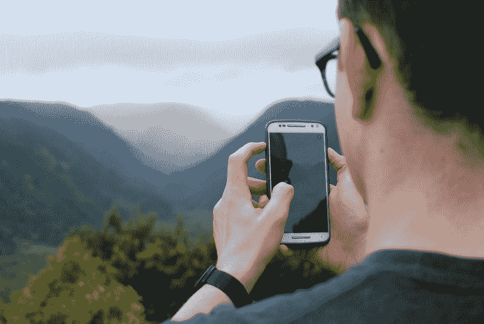
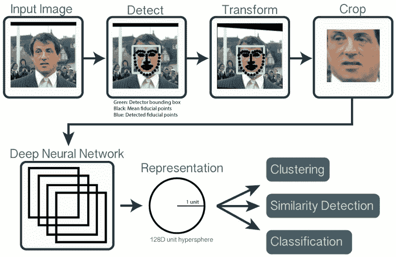
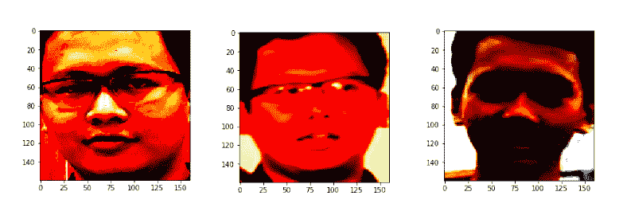
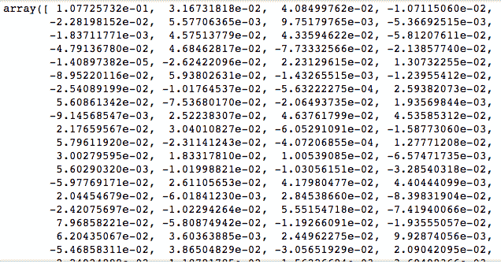

# 当我说人脸识别很容易时，他们笑了。但也有可能。

> 原文：<https://www.freecodecamp.org/news/they-laughed-when-i-said-face-recognition-was-easy-but-it-can-be-6c1d5dd68099/>

作者:Tirmidzi Faizal Aflahi

# 当我说人脸识别很容易时，他们笑了。但也有可能。



Photo by [Paula Lavalle](https://unsplash.com/photos/StI47JBhSNc?utm_source=unsplash&utm_medium=referral&utm_content=creditCopyText) on [Unsplash](https://unsplash.com/?utm_source=unsplash&utm_medium=referral&utm_content=creditCopyText)

也许你以前见过。也许你们中的一些人使用了[的一些手机](https://www.theverge.com/circuitbreaker/2018/1/2/16840174/oneplus-5-face-unlock-oxygenos-open-beta)所具有的**面部解锁**功能。这个叫人脸识别的技术简直太神奇了。但是，你认为基于这种技术开发应用程序很难吗？这其实并不难。你甚至可以用**少于 10 行代码**来完成它！说真的。这是我的人脸识别 Tensorflow 教程，特别为你准备的。

### TL；速度三角形定位法(dead reckoning)

这里是代码，以防 ***你不想读*** 的文章。LOL。

```
from easyfacenet.simple import facenet

images = ['images/image1.jpg', 'images/image2.jpg', 'images/image3.jpg']
aligned = facenet.align_face(images)
comparisons = facenet.compare(aligned)

print("Is image 1 and 2 similar? ", bool(comparisons[0][1]))
print("Is image 1 and 3 similar? ", bool(comparisons[0][2]))
```

它将输出以下内容:

```
Is image 1 and 2 similar?  True
Is image 1 and 3 similar?  False
```

等等等等。没有张量流？当然还有张量流。在本教程中，我使用了一个名为 [Facenet](https://github.com/davidsandberg/facenet) 的算法，它是用 tensorflow 开发的。虽然我在编写 tensorflow 语法时可以很容易地使用 Facenet，但我不认为你们中的大多数人会对此感到舒服。

所以，我决定在 Facenet 之上创建另一个界面，我称之为 [**Easy Facenet**](https://pypi.org/project/easyfacenet/) 。要安装这个库，您只需输入

```
pip install easyfacenet
```

你可以走了！

文章不应该这样结束吧？*当然不是*。

让我一行一行地向你解释这个教程。同时，我们将首先介绍人脸识别是如何工作的。

### 人脸识别


Photo by [Tianyi Ma](https://unsplash.com/photos/WiONHd_zYI4?utm_source=unsplash&utm_medium=referral&utm_content=creditCopyText) on [Unsplash](https://unsplash.com/search/photos/macbook?utm_source=unsplash&utm_medium=referral&utm_content=creditCopyText)

那么，人脸识别是如何工作的呢？



Courtesy of [OpenFace](http://cmusatyalab.github.io/openface/)

从上图可以看出，步骤是这样的:

1.  得到一个**输入的**图像，该图像应该**包含一张脸**
2.  你需要找到人脸的确切位置，并在人脸周围放置一个边界框
3.  为了算法的一致性，你需要**变换图片**，这样嘴、鼻子和眼睛的位置，对于不同的图片是一致的。
4.  然后**裁剪它**
5.  将裁剪后的图片输入到 **Facenet 算法**中，这是一个深度神经网络。
6.  它将输出该面部的矢量表示。当时是 128 维向量，现在是 512 维。
7.  然后你可以用这个表示做你想做的事情。你可以做**分类**、**聚类**，或者只是使用图片间的**相似度**、**计算**。

哇，那真是一大堆东西。为什么这么难？嗯，基本上你可以把这 7 个步骤分成 3 个步骤，

1.  **对齐**，输入图像，输出对齐的裁剪后的人脸
2.  **嵌入**，输入人脸，输出表象
3.  比较，比较这些表现——它们相似还是不相似？

因为只有 3 个简单的步骤，代码应该就这么简单，不是吗？

是的，可以，用 **easyfacenet** 。

### 最简单的人脸识别 Tensorflow 库

让我们一点一点地分解代码。

```
from easyfacenet.simple import facenet
```

从一个*简单*模块导入 *facenet* 文件。在文件中有三种方法可以使用。分别是， **align_face** ，**嵌入**，以及**比较**。

很容易，你可以看出这些方法代表了人脸识别的每一步。

```
images = ['images/image1.jpg', 'images/image2.jpg', 'images/image3.jpg']
```

现在我们可以定义图像了。那些图像是什么？嗯，*这个*。


A picture of me (image1.jpg)

还有*这个*。


Another picture of me (image2.jpg)

还有*这个*。


My Lil’ bro (image3.jpg)

我们拿到图像了。现在是真正的交易。

### 第一步。对齐

```
aligned = facenet.align_face(images)
```

该库将尝试在图像中找到人脸，并裁剪人脸，以及对人脸进行预白化。**预白化**在训练时会让训练更容易，所以在推理时，你也需要预白化图像。

预白化的对齐面将如下所示。



Image 1 to 3 from left to right

现在，你已经为下一步做好了准备。喘口气，慢慢咀嚼！

### 第二步。嵌入

等等等等。我在上面的例子中看不到嵌入？嗯，那是因为**compare 方法已经在**内部调用了嵌入。如果你想以某种方式使用嵌入，使用这个。

```
embeddings = facenet.embedding(aligned)
```

**嵌入**将如下所示:



I don’t recommend you to look at the numbers

### 第三步。比较

```
comparisons = facenet.compare(aligned)
```

如果有 3 幅图像，**比较**变量将有 3×3 个值。它们是每个图像相互比较的**排列**。在一个例子中，如果你想得到 ***是图像 1 类似于图像 2？*** ”然后

```
print("Is image 1 and 2 similar? ", bool(comparisons[0][1]))
```

***图像 1 和图像 3 相似吗？***

```
print("Is image 1 and 3 similar? ", bool(comparisons[0][2]))
```

你没有忘记数组是零索引的吧？哈哈…

**然后，就这样**。你就可以这样得到你的比较结果。我使用的比较技术是**余弦相似度**。您可以使用任何其他您想要的相似性方法。您肯定可以使用另一种方法，如聚类或分类。类似于[的暹罗网络](https://medium.com/@kuzuryu71/improving-siamese-network-performance-f7c2371bdc1e)就是你需要寻找的东西。

### 接下来你能做什么？


Photo by [Corinne Kutz](https://unsplash.com/photos/tMI2_-r5Nfo?utm_source=unsplash&utm_medium=referral&utm_content=creditCopyText) on [Unsplash](https://unsplash.com/search/photos/macbook?utm_source=unsplash&utm_medium=referral&utm_content=creditCopyText)

正如我所说，这是可用的最简单的人脸识别 Tensorflow 库。因此，你可以尽快开始做你的事情。

如果你是 hacky，你可以探索这个库，创建真正的人脸识别 Tensorflow 代码。看一下这里的代码，因为这是库的基石。此外，扩展代码或者您可以创建自己的功能。

### 最后的想法

如果你想了解这项惊人技术背后的**论文**，你可以看看[这里](https://arxiv.org/abs/1503.03832)以及[这里](http://www.robots.ox.ac.uk/~vgg/publications/2015/Parkhi15/parkhi15.pdf)。

总之，利用 easyfacenet 可以极大地帮助你创建你的人脸识别项目。而且这个人脸识别库是由我**单独**维护**的。如果你想要求某种功能，对你来说很容易。**

至于其他相似性方法的实际实现，我将在下一篇教程中介绍。由于这个原因，我将在库中专门添加这个方法。

最后，如果你想阅读原始文章，我最初在我的博客上发表了这篇文章，地址是[the data image](https://thedatamage.com/face-recognition-tensorflow-tutorial/)。当然，你可以在那里看到更多我的帖子。