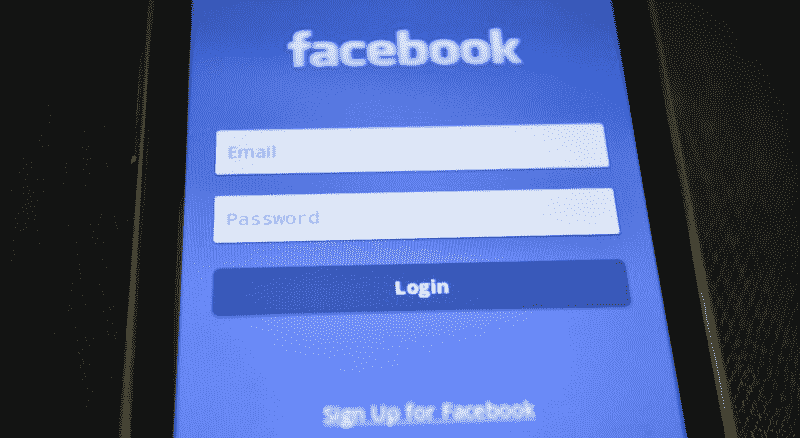

# 启用双因素身份认证(2FA)之前您应该知道的事情

> 原文：<https://www.freecodecamp.org/news/things-you-should-know-before-enabling-2-factor-authentication-2fa-6f11e4b5eab1/>

尼廷·夏尔马

# 启用双因素身份认证之前您应该知道的事情

随着网络安全成为一个大问题，双因素身份认证(2FA)是一个日益热门的话题。

毕竟，谁不想保护自己的私人数据安全呢？双因素身份认证可能不是防弹解决方案，但却是支持虚拟安全的最简单、最好的方法之一。

将双因素身份验证视为强密码的补充，而不是替代。

双因素身份验证为登录过程增加了另一个安全层，减少了您的帐户被黑客攻击的机会。仅仅知道和输入你的密码是不够的，因为还有第二层通常是时间敏感的。这使得整个过程更加安全。

在启用双因素身份认证之前，您需要了解以下一些事实:

#### 使用 2FA 可以避免五分之四的数据泄露

网络威胁正在增加，双因素身份认证实际上有助于应对这些威胁。

大多数与黑客相关的入侵都是由于密码薄弱或被盗造成的。由于许多用户倾向于在任何地方使用相同的密码，风险会增加十倍。显然，需要的不仅仅是密码。

根据[威瑞森的数据泄露报告](http://www.verizonenterprise.com/resources/reports/rp_data-breach-investigations-report-2013_en_xg.pdf)，80%的数据泄露可以通过使用双因素身份认证来消除。

2FA 确保即使你的密码被泄露，黑客也必须破解另一个安全层才能访问你的账户。由于大多数 2FA 方法都依赖于时间，这使得黑客的工作更加困难。

难怪所有的主要网站和银行都提供启用双因素安全的选项。

#### 双因素身份验证不能替代强密码

弱密码和重复密码是网络安全的祸根。无论您使用哪个帐户或服务，最好都设置一个唯一的复杂密码。

在互联网上使用重复的密码会使我们容易受到巨大的影响，即使一个网站的安全被破坏。在这种情况下，我们所有的帐户都可以由攻击者支配。

即使您启用了双因素身份验证，也必须使用强密码。如前所述，将 2FA 作为强密码的补充，而不是替代。

始终使用字母、数字和特殊符号的复杂组合，为您使用的每个服务生成一个强而唯一的密码。你也可以使用类似于 [LastPass](https://www.lastpass.com/) 的服务来轻松管理你的密码。

Facebook is one of the leading companies supporting two-factor authentication.

#### 有两种方法可以得到密码

您可以通过多种方式生成 2FA 的密码。代码可以在服务器上生成，然后通过电子邮件、短信或电话发送给您。这通常需要你的手机有网络连接，因此你很容易在偏远地区无法进入账户。

另一种选择是在手机或硬件设备上离线生成密码。你可以通过谷歌认证器、Authy 或 TOTP 认证器等应用在手机上轻松生成 2FA 密码。市场上也有像 YubiKey 这样的硬件设备可以用来设置双因素认证。

这种方法更加可靠，因为不需要数据连接，使您更不容易受到网络钓鱼的攻击。

在某些情况下，第二步也可以是生物特征验证或输入您之前自己设置的 PIN。

#### 始终备份。你不想被你的帐户锁定

2FA 的工作前提是您始终可以访问二级密码。但如果你使用双因素认证应用程序，你的手机丢失或数据被删除，你可能会被锁定帐户。

为了避免这种情况，一些网站提供了备份代码，您必须安全地保存这些代码，以便在这种情况下使用。或者，您可以使用身份验证应用程序，该应用程序提供备份您的安全密钥和相关数据的选项。

牢记这一点，我们开发了 iOS 和 Android 的 TOTP 认证应用程序。该应用程序允许您轻松地将您的安全密钥和相关信息备份到您的设备或在线存储选项，如 Google Drive。只需轻点几下，就可以在另一台设备上设置加密的备份文件。你可以从 iTunes store 的[这里](https://itunes.apple.com/us/app/totp-authenticator/id1404230533?mt=8)下载应用程序，也可以从谷歌 Play 商店的[这里](https://play.google.com/store/apps/details?id=com.authenticator.authservice2)下载应用程序。

#### 结论

双因素身份认证正在慢慢成为数字世界的一种规范。大多数银行、云存储服务和社交媒体网站已经提供了这个选项。你应该尽可能地打开 2FA。正如他们所说，预防胜于治疗。

关于 2FA 认证有什么问题吗？在评论里毙了他们！

要了解更多关于双因素身份验证的信息，您也可以查看本文。